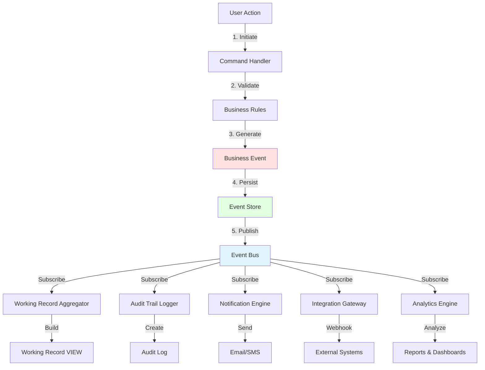

# Business Event Framework - Concept Guide

**Version**: 1.0  
**Last Updated**: 2025-12-22  
**Audience**: Business Analysts, Product Managers, HR Administrators, System Architects  
**Reading Time**: 45-60 minutes

---

## 📋 Overview

This guide explains xTalent's **Business Event Framework** - a universal, platform-wide event architecture that powers audit trails, working records, notifications, analytics, and cross-module integration across all xTalent modules.

### What You'll Learn

- What business events are and why they matter
- How events capture organizational changes
- Event types and event reasons (customer-configurable)
- Event-driven architecture patterns
- Cross-module event integration
- Working record and audit trail integration
- Real-world event examples

### Key Concepts

**Business Event**: An immutable record of a significant occurrence in the business (hire, promotion, salary increase, etc.)

**Event Type**: A category of event (e.g., EMPLOYEE_HIRE, ASSIGNMENT_PROMOTION) with standard structure

**Event Reason**: Customer-defined explanation for why an event occurred (e.g., "Performance-Based Promotion")

**Event Sourcing**: Architectural pattern where events are the source of truth for all state changes

---

## 🎯 Why Business Events?

### The Challenge

Traditional HR systems face several problems:

1. **Lost History** ❌
   - Only current state is stored
   - Past changes are overwritten
   - "What was this employee's salary on Dec 1, 2023?" → Cannot answer

2. **Incomplete Audit Trail** ❌
   - Changes logged in separate audit tables
   - Difficult to reconstruct full story
   - Missing context (why did this change happen?)

3. **Siloed Data** ❌
   - Each module tracks changes independently
   - No unified view of employee journey
   - Cross-module analytics difficult

4. **Integration Complexity** ❌
   - External systems need notifications
   - Polling is inefficient
   - Real-time updates challenging

### The xTalent Solution

**Universal Business Event Framework** ✅

```
Every Change → Generates Event → Immutable Log → Multiple Consumers
```

**Benefits**:
- ✅ **Complete History**: Every change captured permanently
- ✅ **Unified Audit Trail**: One event log for all modules
- ✅ **Point-in-Time Queries**: "What was the state on date X?"
- ✅ **Real-Time Integration**: Events trigger notifications and external systems
- ✅ **Cross-Module Analytics**: Track employee journey across all modules
- ✅ **Compliance-Ready**: Immutable log satisfies regulatory requirements

---

## 🏗️ Core Concepts

### 1. Business Event

A **Business Event** is an immutable record that something significant happened.

**Anatomy of an Event**:

```yaml
Event Example: Employee Promotion

Event ID: evt_2024_07_001
Event Type: ASSIGNMENT_PROMOTION
Event Category: CORE
Event Reason: PERFORMANCE  # Customer-defined

When:
  Effective Date: 2024-07-01  # Business date
  Event Timestamp: 2024-06-28 10:30:00 UTC  # System time

Who:
  Employee: John Doe (EMP-2024-001)
  Actor: Manager Sarah Lee

What Changed:
  Previous State:
    Job: Senior Engineer
    Grade: G3
    Salary: 100,000,000 VND
  
  New State:
    Job: Lead Engineer
    Grade: G4
    Salary: 120,000,000 VND
  
  Changes:
    - Job: Senior Engineer → Lead Engineer
    - Grade: G3 → G4
    - Salary: +20,000,000 VND (+20%)

Why:
  Reason: Performance-Based Promotion
  Approval: Workflow #WF-2024-050
```

**Key Properties**:

1. **Immutable** - Cannot be changed after creation
2. **Complete** - Contains all context needed to understand what happened
3. **Temporal** - Both effective date (business) and timestamp (system)
4. **Actor-Tracked** - Records who made the change
5. **Reason-Explained** - Customer can define why it happened

### 2. Event Type

**Event Type** defines a standard category of event.

**Characteristics**:
- **Predefined by xTalent** - Standard event types (HIRE, PROMOTION, etc.)
- **Structured Payload** - Each type has expected data structure
- **Configurable Tracking** - Can enable/disable per organization
- **Module-Specific** - Categorized by module (CORE, TR, TA, etc.)

**Examples**:

```yaml
Event Type: EMPLOYEE_HIRE
  Category: CORE
  Subcategory: Employment Lifecycle
  Trackable in Working Record: Yes
  Generates Audit Log: Yes
  Typical Payload:
    - jobId
    - grade
    - baseSalary
    - startDate
    - contract details

Event Type: SALARY_INCREASE
  Category: TOTAL_REWARDS
  Subcategory: Compensation
  Trackable in Working Record: Yes
  Generates Audit Log: Yes
  Typical Payload:
    - previousSalary
    - newSalary
    - increaseAmount
    - increasePercentage
    - effectiveDate
```

**Configuration**:

Organizations can configure:
- ✅ Which event types to track
- ✅ Which events appear in working records
- ✅ Which events generate notifications
- ✅ Retention period per event type

### 3. Event Reason

**Event Reason** provides customer-specific context for why an event occurred.

**Purpose**: Same event type (TERMINATION) can happen for different reasons

**Examples**:

```yaml
Event Type: EMPLOYEE_TERMINATION

Standard Reasons (Predefined):
  - VOLUNTARY_RESIGNATION
  - INVOLUNTARY_PERFORMANCE
  - INVOLUNTARY_MISCONDUCT
  - RETIREMENT
  - END_OF_CONTRACT

Customer-Specific Reasons:
  - RELOCATION_ABROAD
  - BETTER_OPPORTUNITY
  - HEALTH_REASONS
  - FAMILY_REASONS
```

**Benefits**:
- Richer analytics (termination by reason)
- Custom categorization per organization
- Better reporting and insights

---

## 📊 Event Taxonomy

xTalent defines **100+ standard event types** across 6 modules:

### Core Module Events (25+ events)

#### Employment Lifecycle
| Event Type | Description | Example |
|------------|-------------|---------|
| `EMPLOYEE_HIRE` | New employee hired | First day of employment |
| `EMPLOYEE_TERMINATION` | Employment ends | Resignation, retirement |
| `EMPLOYEE_REHIRE` | Former employee returns | Boomerang employee |
| `PROBATION_STARTED` | Probation period begins | New hire probation |
| `PROBATION_ENDED` | Probation completed | Successfully passed |

#### Job Assignment
| Event Type | Description | Example |
|------------|-------------|---------|
| `ASSIGNMENT_PROMOTION` | Upward move | Junior → Senior Engineer |
| `ASSIGNMENT_DEMOTION` | Downward move | Senior → Junior (rare) |
| `ASSIGNMENT_TRANSFER` | Move to different unit | Backend → Frontend team |
| `ASSIGNMENT_LATERAL_MOVE` | Same level, different role | Engineer → Product Manager |
| `ASSIGNMENT_REPORTING_CHANGE` | New supervisor | Manager change |

#### Contract
| Event Type | Description | Example |
|------------|-------------|---------|
| `CONTRACT_CREATED` | New contract signed | Initial employment contract |
| `CONTRACT_AMENDED` | Contract modified | Salary amendment |
| `CONTRACT_RENEWED` | Contract extended | Fixed-term renewal |

### Total Rewards Events (20+ events)

#### Compensation
| Event Type | Description | Example |
|------------|-------------|---------|
| `SALARY_INCREASED` | Base salary raised | Annual merit increase |
| `SALARY_DECREASED` | Base salary reduced | Voluntary reduction |
| `BONUS_AWARDED` | One-time bonus | Performance bonus |
| `EQUITY_GRANTED` | Stock/options granted | Annual equity grant |
| `ALLOWANCE_ADDED` | New allowance | Housing allowance |

#### Benefits
| Event Type | Description | Example |
|------------|-------------|---------|
| `BENEFIT_ENROLLED` | Employee enrolls | Health insurance enrollment |
| `BENEFIT_CHANGED` | Benefit modification | Plan change |
| `BENEFIT_CLAIM_SUBMITTED` | Claim filed | Medical reimbursement |

### Time & Absence Events (15+ events)

| Event Type | Description | Example |
|------------|-------------|---------|
| `LEAVE_REQUEST_SUBMITTED` | Leave requested | Annual leave request |
| `LEAVE_REQUEST_APPROVED` | Leave approved | Manager approval |
| `LEAVE_STARTED` | Leave begins | First day of leave |
| `LEAVE_ENDED` | Return from leave | Back to work |
| `TIME_ENTRY_SUBMITTED` | Timesheet submitted | Weekly timesheet |

### Talent Acquisition Events (15+ events)

| Event Type | Description | Example |
|------------|-------------|---------|
| `REQUISITION_CREATED` | Job opening | New position requisition |
| `CANDIDATE_APPLIED` | Application received | Resume submitted |
| `CANDIDATE_OFFERED` | Offer extended | Job offer |
| `CANDIDATE_OFFER_ACCEPTED` | Offer accepted | Candidate accepts |
| `ONBOARDING_STARTED` | Onboarding begins | First day activities |

### Performance Events (12+ events)

| Event Type | Description | Example |
|------------|-------------|---------|
| `GOAL_CREATED` | New goal set | Quarterly objectives |
| `REVIEW_COMPLETED` | Performance review done | Annual review |
| `FEEDBACK_GIVEN` | Feedback provided | Peer feedback |

### Learning Events (10+ events)

| Event Type | Description | Example |
|------------|-------------|---------|
| `COURSE_COMPLETED` | Training finished | Safety certification |
| `CERTIFICATION_EARNED` | Certification achieved | PMP certification |

---

## 🔄 Event-Driven Architecture

### How Events Flow Through the System



### Step-by-Step Flow

#### Step 1: User Action
```
HR Manager promotes employee John from Senior to Lead Engineer
```

#### Step 2: System Validates
```
✓ Employee exists and is ACTIVE
✓ New job (Lead Engineer) exists
✓ Manager has approval authority
✓ Effective date is valid
```

#### Step 3: System Generates Event
```yaml
Event Created:
  eventType: ASSIGNMENT_PROMOTION
  eventReason: PERFORMANCE
  employee: John Doe (EMP-2024-001)
  effectiveDate: 2024-07-01
  payload:
    previousJob: Senior Engineer
    newJob: Lead Engineer
    previousGrade: G3
    newGrade: G4
```

#### Step 4: Event Persisted to Event Store
```
Event Store (Immutable Log):
  - EVT-001: HIRE (2024-01-01)
  - EVT-012: PROBATION_END (2024-03-01)
  - EVT-025: PROMOTION (2024-07-01) ← NEW
```

#### Step 5: Event Published to Event Bus
```
Event Bus notifies all subscribers:
  → Working Record Aggregator
  → Audit Trail Logger
  → Notification Engine
  → Integration Gateway
  → Analytics Engine
```

#### Step 6: Consumers Process Event

**Working Record Aggregator**:
```
Updates John's working record timeline:
  - 2024-01-01: Hired as Senior Engineer
  - 2024-07-01: Promoted to Lead Engineer ← NEW
```

**Audit Trail Logger**:
```
Creates audit entry:
  - User: Sarah Lee (Manager)
  - Action: Promotion
  - When: 2024-06-28 10:30:00
  - What: John Doe promoted G3→G4
```

**Notification Engine**:
```
Sends notifications:
  - Email to John: "Congratulations on your promotion!"
  - Email to Payroll: "John's salary increased to 120M"
```

**Integration Gateway**:
```
Sends webhook to external systems:
  - HRIS: Update employee record
  - Badge System: Update access level
  - Directory: Update title
```

**Analytics Engine**:
```
Updates metrics:
  - Promotion count +1
  - Average time to promotion
  - G3→G4 transition rate
```

---

## 💼 Real-World Event Scenarios

### Scenario 1: Employee Journey - First Year

**Timeline of Events**:

```yaml
Employee: Sarah Chen
Employee Code: EMP-2024-100

Event 1: EMPLOYEE_HIRE (2024-01-15)
  Reason: NEW_HIRE
  Details:
    - Job: Junior Backend Engineer
    - Grade: G1
    - Salary: 50,000,000 VND
    - Contract: Probation (3 months)
  
Event 2: PROBATION_ENDED (2024-04-15)
  Reason: SUCCESSFUL
  Details:
    - Contract changed: Probation → Permanent
    - Status: ACTIVE
  
Event 3: BENEFIT_ENROLLED (2024-04-20)
  Reason: ELIGIBLE_AFTER_PROBATION
  Details:
    - Plan: Health Insurance Premium
    - Coverage: Employee + Family
  
Event 4: COURSE_COMPLETED (2024-07-10)
  Reason: PROFESSIONAL_DEVELOPMENT
  Details:
    - Course: Advanced Node.js
    - Certification: Yes
  
Event 5: SALARY_INCREASED (2024-07-15)
  Reason: MID_YEAR_ADJUSTMENT
  Details:
    - Previous: 50,000,000 VND
    - New: 55,000,000 VND
    - Increase: 10%
  
Event 6: GOAL_CREATED (2024-10-01)
  Reason: ANNUAL_PERFORMANCE_CYCLE
  Details:
    - Goals: 5 objectives
    - Review Date: 2025-03-31
  
Event 7: ASSIGNMENT_TRANSFER (2024-12-01)
  Reason: TEAM_RESTRUCTURE
  Details:
    - From: Backend Team A
    - To: Platform Team
    - Job: Same (Junior Backend Engineer)
```

**Working Record View**:
```
Sarah's First Year Summary:
  - Hired: Jan 15, 2024
  - Probation passed: Apr 15, 2024
  - Salary progression: 50M → 55M (+10%)
  - Training completed: 1 course
  - Team transfers: 1
  - Total events: 7
```

### Scenario 2: Complex Leave Management

**Timeline of Events**:

```yaml
Employee: Nguyen Thi Mai
Employee Code: EMP-2023-050

Event 1: LEAVE_REQUEST_SUBMITTED (2024-03-01)
  Reason: MATERNITY_LEAVE
  Details:
    - Leave Type: Maternity
    - Requested Duration: 6 months
    - Start Date: 2024-03-15
    - Expected Return: 2024-09-15
  
Event 2: LEAVE_REQUEST_APPROVED (2024-03-03)
  Reason: MANAGER_APPROVED
  Details:
    - Approved By: Manager
    - Approval Date: 2024-03-03
  
Event 3: LEAVE_STARTED (2024-03-15)
  Reason: MATERNITY_LEAVE
  Details:
    - Employment Status: ACTIVE (on leave)
    - Assignment Status: SUSPENDED
    - Salary: Continues (company policy)
  
Event 4: LEAVE_EXTENDED (2024-08-20)
  Reason: MEDICAL_RECOMMENDATION
  Details:
    - Original End: 2024-09-15
    - New End: 2024-10-15
    - Additional Duration: 1 month
  
Event 5: LEAVE_ENDED (2024-10-15)
  Reason: RETURN_FROM_MATERNITY
  Details:
    - Employment Status: ACTIVE
    - Assignment Status: ACTIVE
    - Schedule: Full-time
  
Event 6: SALARY_INCREASED (2024-12-01)
  Reason: ANNUAL_MERIT_INCREASE
  Details:
    - No penalty for leave period
    - Previous: 100,000,000 VND
    - New: 110,000,000 VND
```

**Benefits of Event Tracking**:
- ✅ Complete leave history
- ✅ Clear approval trail
- ✅ Extensions tracked
- ✅ Post-leave adjustments visible
- ✅ Compliance documentation

### Scenario 3: Rehire with Promotion

**Timeline of Events**:

```yaml
Worker: Tran Van Binh
Worker ID: WORKER-005

# First Employment
Employment 1 (EMP-2020-025):

Event 1: EMPLOYEE_HIRE (2020-01-01)
  Job: Junior Engineer
  Grade: G1
  Salary: 40,000,000 VND

Event 2: ASSIGNMENT_PROMOTION (2021-01-01)
  Job: Senior Engineer
  Grade: G2
  Salary: 60,000,000 VND

Event 3: EMPLOYEE_TERMINATION (2022-06-30)
  Reason: VOLUNTARY_RESIGNATION
  Final Job: Senior Engineer
  Final Salary: 70,000,000 VND

# Gap Period: 18 months

# Second Employment (Rehire)
Employment 2 (EMP-2024-080):

Event 4: EMPLOYEE_REHIRE (2024-01-01)
  Reason: TALENT_ACQUISITION
  Job: Lead Engineer  # Hired 2 levels higher
  Grade: G4
  Salary: 120,000,000 VND

Event 5: SALARY_INCREASED (2024-07-01)
  Reason: MERIT_INCREASE
  New Salary: 135,000,000 VND

Event 6: ASSIGNMENT_PROMOTION (2024-10-01)
  Reason: PERFORMANCE
  Job: Principal Engineer
  Grade: G5
  Salary: 150,000,000 VND
```

**Worker-Level Analytics**:
```
Total Employments: 2
Total Service: 3.47 years (2.5 + 0.97)
Career Progression: G1 → G2 → [gap] → G4 → G5
Salary Growth: 40M → 150M (+275%)
Rehire Success: Highly successful (2 grades higher, promoted within 1 year)
```

---

## 🔗 Integration with Other Concepts

### 1. Working Records

**Events Power Working Records**:

```
BusinessEvent (isWrTrackable = true) → Working Record Timeline
```

**Example**:
```yaml
Employee Code: EMP-2024-001

Working Record (Built from Events):
  Timeline:
    - 2024-01-01: HIRE (Junior Engineer, G1, 50M)
    - 2024-03-01: PROBATION_END
    - 2024-07-01: PROMOTION (Senior Engineer, G2, 80M)
    - 2024-12-01: SALARY_INCREASE (90M)
  
  Current State (Derived from Events):
    Job: Senior Engineer
    Grade: G2
    Salary: 90,000,000 VND
    Status: ACTIVE
```

**Key Point**: Working Record is a **VIEW** of events, not a separate stored entity.

### 2. Audit Trail

**Events Provide Complete Audit Trail**:

Every event contains:
- ✅ Who did it (actor)
- ✅ What changed (previous → new state)
- ✅ When it happened (timestamp)
- ✅ Why it happened (reason)
- ✅ How it was approved (metadata)

**Compliance Benefits**:
- SOX compliance (financial controls)
- GDPR compliance (data changes tracked)
- Labor law compliance (employment records)
- Internal audit requirements

### 3. Notifications

**Events Trigger Notifications**:

```yaml
Event: LEAVE_REQUEST_SUBMITTED

Notifications Triggered:
  - To Manager: "Review leave request"
  - To HR: "New leave request pending"
  - To Employee: "Leave request submitted successfully"

Event: SALARY_INCREASED

Notifications Triggered:
  - To Employee: "Congratulations! Salary increased"
  - To Payroll: "Process salary change effective [date]"
  - To Finance: "Budget impact notification"
```

### 4. External System Integration

**Events Enable Real-Time Integration**:

```yaml
Event: EMPLOYEE_HIRE

Webhooks Sent To:
  - HRIS System: Create employee record
  - Badge System: Issue access card
  - Email System: Create email account
  - Directory: Add to organization directory
  - Training System: Enroll in onboarding

Event: ASSIGNMENT_TRANSFER

Webhooks Sent To:
  - Badge System: Update access permissions
  - Email: Update distribution lists
  - Directory: Update department
```

### 5. Analytics & Reporting

**Events Enable Rich Analytics**:

```yaml
Promotion Analysis:
  - Query: All ASSIGNMENT_PROMOTION events in 2024
  - Group By: Event Reason
  - Results:
      PERFORMANCE: 65%
      TENURE: 25%
      SUCCESSION: 10%

Turnover Analysis:
  - Query: All EMPLOYEE_TERMINATION events
  - Group By: Event Reason
  - Results:
      VOLUNTARY_RESIGNATION: 60%
      INVOLUNTARY_PERFORMANCE: 15%
      RETIREMENT: 20%
      END_OF_CONTRACT: 5%
```

---

## ⚙️ Configuration & Customization

### Event Type Configuration

Organizations can configure each event type:

```yaml
Event Type: SALARY_INCREASED

Configuration Options:
  isActive: true                    # Track this event type?
  isWrTrackable: true              # Show in working records?
  isAuditable: true                # Create audit log entry?
  requiresApproval: true           # Require workflow approval?
  
  notificationTemplate: "salary_increase_notification"
  
  tracking:
    threshold: ">= 5%"             # Only track increases >= 5%
    minAmount: 1000000             # Minimum 1M VND increase
  
  retention:
    years: 10                      # Keep for 10 years (vs default 7)
```

### Event Reason Customization

Organizations define custom reasons:

```yaml
Event Type: EMPLOYEE_TERMINATION

Default Reasons:
  - VOLUNTARY_RESIGNATION
  - INVOLUNTARY_PERFORMANCE
  - RETIREMENT
  - END_OF_CONTRACT

Customer-Added Reasons:
  - RELOCATED_INTERNATIONALLY
  - PURSUING_EDUCATION
  - HEALTH_REASONS
  - FAMILY_OBLIGATIONS
  - STARTUP_OPPORTUNITY
```

---

## ✅ Best Practices

### 1. Event Design

**DO** ✅:
- Capture complete context in event payload
- Include both previous and new state
- Record who made the change (actor)
- Specify effective date and system timestamp
- Use clear, business-friendly event reasons

**DON'T** ❌:
- Create events for every minor field change
- Store sensitive data directly in payload (use references)
- Create custom event types (use reasons instead)
- Delete or modify events after creation

### 2. Event Reasons

**DO** ✅:
- Define reasons that match business needs
- Keep reason names clear and descriptive
- Review and update reasons periodically
- Train users on when to use each reason

**DON'T** ❌:
- Create too many overlapping reasons
- Use vague reasons like "OTHER" or "VARIOUS"
- Change meaning of existing reasons
- Delete reasons that have historical data

### 3. Event Consumption

**DO** ✅:
- Subscribe only to events you need
- Handle events asynchronously
- Implement retry logic for failures
- Monitor event processing

**DON'T** ❌:
- Process events synchronously (blocking)
- Ignore failed event deliveries
- Duplicate event processing logic
- Poll for events (use subscriptions)

---

## 📈 Analytics Use Cases

### Use Case 1: Time to Promotion

```yaml
Question: "How long does it take to get promoted from G1 to G2?"

Query:
  - Find all EMPLOYEE_HIRE events where grade = G1
  - Find corresponding ASSIGNMENT_PROMOTION events to G2
  - Calculate time difference

Result:
  Average: 18 months
  Median: 16 months
  Range: 12-36 months
```

### Use Case 2: Salary Growth by Reason

```yaml
Question: "Which promotion reasons result in highest salary increases?"

Query:
  - Find all ASSIGNMENT_PROMOTION events
  - Group by eventReason
  - Calculate average salary increase percentage

Result:
  PERFORMANCE: +22% average
  TENURE: +12% average
  SUCCESSION: +18% average
```

### Use Case 3: Turnover Trends

```yaml
Question: "What are the top reasons for turnover by department?"

Query:
  - Find all EMPLOYEE_TERMINATION events
  - Filter by eventReason = VOLUNTARY_RESIGNATION
  - Group by business_unit

Result:
  Engineering: 45% (better opportunities)
  Sales: 30% (compensation)
  Operations: 25% (relocating)
```

---

## 🔐 Compliance & Security

### Data Retention

**Policy**:
- Minimum retention: **7 years** (regulatory requirement)
- Archive after: **3 years** (move to cold storage)
- Purge after: **Retention period + GDPR compliance**

**Exceptions**:
- Legal hold: No deletion allowed
- Active litigation: Extended retention
- Employee request: Right to erasure (GDPR)

### Privacy & Security

**Sensitive Data Handling**:
- Personal data masked in event payload
- Access controlled by role
- Audit log for event access
- Encryption at rest and in transit

**GDPR Compliance**:
- Right to access: Events retrievable per employee
- Right to erasure: Soft delete with anonymization
- Right to portability: Events exportable
- Data minimization: Only necessary data in payload

---

## 🎓 Summary

### Key Takeaways

1. **Universal Event Framework** - One event model for all modules (Core, TA, TR, Time, Performance, Learning)

2. **Event Types + Reasons** - Standard event types with customer-defined reasons for context

3. **Immutable Log** - Events never updated or deleted, ensuring complete audit trail

4. **Event Sourcing** - Events are source of truth for state changes and history

5. **Multiple Consumers** - Events power working records, audit trails, notifications, integrations, and analytics

6. **Compliance-Ready** - 7+ year retention, GDPR compliant, complete audit trail

### Benefits

✅ **Complete History** - Every change captured permanently  
✅ **Unified Audit Trail** - Single event log across all modules  
✅ **Point-in-Time Queries** - Reconstruct state at any date  
✅ **Real-Time Integration** - Events trigger notifications and webhooks  
✅ **Rich Analytics** - Event stream enables deep insights  
✅ **Compliance** - Immutable log satisfies regulatory requirements  

### Integration Points

- **Working Records**: Events build employment timelines
- **Audit Trail**: Events provide complete change history
- **Notifications**: Events trigger alerts and emails
- **External Systems**: Events enable real-time synchronization
- **Analytics**: Events power reporting and insights

---

## 📚 Related Documentation

### Platform-Level
- [Business Event Ontology](../ontology/business-event.yaml) - Technical entity definitions

### Module-Specific
- [Working Record Processing Guide](../../01-modules/CO/01-concept/12-working-record-processing-guide.md) - How events build working records
- [Audit Specification](../../01-modules/TR/02-spec/03.10-DS-audit.md) - Audit trail implementation

---

**Document Status**: Complete  
**Version**: 1.0  
**Last Updated**: 2025-12-22  
**Author**: xTalent Documentation Team
