# Ontology-Concept-Spec Development Methodology

**Version**: 1.0  
**Created**: 2025-12-18  
**Status**: Official Methodology  
**Applies To**: All software development projects using structured documentation approach

---

## Table of Contents

1. [Executive Summary](#1-executive-summary)
2. [Introduction](#2-introduction)
3. [Three-Layer Architecture](#3-three-layer-architecture)
4. [Layer 1: Ontology](#4-layer-1-ontology)
5. [Layer 2: Concept](#5-layer-2-concept)
6. [Layer 3: Specification](#6-layer-3-specification)
7. [Cross-Layer Traceability](#7-cross-layer-traceability)
8. [AI Integration](#8-ai-integration)
9. [Process Workflow](#9-process-workflow)
10. [Best Practices](#10-best-practices)

---

## 1. Executive Summary

### Purpose

This document defines a structured methodology for transforming user requirements into comprehensive, implementation-ready documentation through three progressive layers:

1. **Ontology** - Extract and define domain entities and workflows
2. **Concept** - Contextualize entities and model workflow behaviors
3. **Specification** - Compile complete requirements for implementation

### Target Audience

| Role | How to Use This Document |
|------|--------------------------|
| **Product Owner / BA** | Primary users - follow methodology end-to-end |
| **SME (Subject Matter Expert)** | Validate entity/workflow extraction |
| **Architect** | Guide technical specifications |
| **Developer** | Understand spec requirements |
| **AI Agent** | Follow prompts and validation rules |

### Key Benefits

- **Systematic Knowledge Distillation**: Transform simple user statements into structured documentation
- **Dual-Track Output**: Capture both entities (what exists) and workflows (how things work)
- **Traceable Requirements**: Every spec traces back to concepts and ontology
- **AI-Ready Process**: Designed for human + AI collaboration
- **Quality Validation**: Built-in metrics and review gates

### Quick Start Guide

> **Goal**: Create your first ontology in 30 minutes

#### Prerequisites
- User requirements document (any format)
- Text editor
- AI access (ChatGPT, Claude, or similar)

#### 30-Minute Quick Start

**Step 1** (5 mins): Extract entities
```bash
# Copy user requirements
# Paste into AI with prompt: "Extract all nouns (entities) from this text"
# Review and classify each entity
```

**Step 2** (5 mins): Extract workflows
```bash
# Paste same requirements into AI
# Prompt: "Extract all actions/workflows from this text"
# Identify actors for each workflow
```

**Step 3** (10 mins): Create ontology file
```yaml
# Create [module]-ontology.yaml
# Add 3-5 key entities with attributes
# Add relationships between entities
```

**Step 4** (5 mins): Create workflow catalog
```yaml
# Create [module]-workflows.yaml
# Add 2-3 core workflows
# List actors and high-level steps
```

**Step 5** (5 mins): Create glossary
```markdown
# Create glossary-[submodule].md
# Define each entity in plain language
# Add examples
```

**Next Steps**: See detailed guides:
- [Ontology Quick Start](./ONTOLOGY-QUICK-START.md) - 1-hour deep dive
- [Concept Quick Start](./CONCEPT-QUICK-START.md) - 1-hour deep dive
- [Spec Quick Start](./SPEC-QUICK-START.md) - 1-hour deep dive

---

## 2. Introduction

### 2.1 Problem Statement

Traditional documentation approaches often fail because:

- **Scattered Information**: Requirements spread across multiple unstructured documents
- **Lost Context**: Entity definitions separated from their behaviors
- **Missing Workflows**: Focus on data structures, neglecting business processes
- **Poor Traceability**: Difficult to trace specs back to original requirements
- **Inconsistent Quality**: No validation framework for documentation completeness

### 2.2 Philosophy: Knowledge Distillation

The Ontology-Concept-Spec methodology is based on **progressive knowledge distillation**:

```
┌─────────────────────────────────────────────────────────────────┐
│                     USER REQUIREMENTS                            │
│     Simple statements from users, Product Owners, stakeholders   │
│       "I need to track employee leave requests"                  │
│       "Managers should approve time-off requests"                │
└───────────────────────────┬─────────────────────────────────────┘
                            │
                            ▼
              ┌─────────────────────────────┐
              │    SME + AI DISTILLATION    │
              │  Extract domain knowledge   │
              └─────────────┬───────────────┘
                            │
               ┌────────────┴────────────┐
               ▼                         ▼
        ┌─────────────┐           ┌─────────────┐
        │  ENTITIES   │           │  WORKFLOWS  │
        │   (Nouns)   │           │   (Verbs)   │
        │             │           │             │
        │ • Employee  │           │ • Request   │
        │ • Leave     │           │ • Approve   │
        │ • Manager   │           │ • Calculate │
        └──────┬──────┘           └──────┬──────┘
               │                         │
               └────────────┬────────────┘
                            ▼
              ┌─────────────────────────────┐
              │      STRUCTURED DOCS        │
              │   Ontology → Concept → Spec │
              └─────────────────────────────┘
```

### 2.3 Dual-Track Output Model

The methodology produces **two parallel tracks** of outputs:

| Track | What it Captures | Key Question |
|-------|------------------|--------------|
| **Entity Track** | Domain objects, attributes, relationships | "What exists in the domain?" |
| **Workflow Track** | Processes, actions, events, decisions | "How do things happen?" |

Both tracks are processed through all three layers:

```
             ONTOLOGY          CONCEPT           SPEC
               
ENTITY    → Definition    → Contextualization → Requirements
TRACK       Attributes       State Models        FRs, BRs
            Relationships    Constraints         Data Specs
            Classification   Local Rules         API Specs
               
WORKFLOW  → Catalog       → Modeling         → Use Cases
TRACK       Actors           Step Details       Scenarios
            Triggers         Decisions          API Sequences
            Overview         Exceptions         Integration
```

---

## 3. Three-Layer Architecture

### 3.1 Architecture Overview

```mermaid
graph TB
    subgraph Input["📥 INPUT"]
        UR[User Requirements<br/>Simple Statements]
    end
    
    subgraph L1["🧬 LAYER 1: ONTOLOGY"]
        direction LR
        ED[Entity Definitions]
        WC[Workflow Catalog]
    end
    
    subgraph L2["💡 LAYER 2: CONCEPT"]
        direction LR
        EC[Entity Contexts]
        WM[Workflow Models]
    end
    
    subgraph L3["📋 LAYER 3: SPECIFICATION"]
        direction LR
        ES[Entity Specs<br/>FRs, BRs, Data]
        WS[Workflow Specs<br/>Use Cases, APIs]
    end
    
    subgraph Output["📤 OUTPUT"]
        IMPL[Implementation-Ready<br/>Documentation]
    end
    
    UR --> L1
    L1 --> L2
    L2 --> L3
    L3 --> IMPL
    
    style L1 fill:#e1f5fe
    style L2 fill:#fff3e0
    style L3 fill:#f3e5f5
```



### 3.2 Layer Comparison

| Aspect | Ontology | Concept | Specification |
|--------|----------|---------|---------------|
| **Focus** | WHAT exists | HOW it behaves | WHAT to build |
| **Perspective** | Bottom-up (atomic) | Middle-out (contextual) | Top-down (comprehensive) |
| **Audience** | SMEs, Architects | All stakeholders | Developers, QA |
| **Abstraction** | High (definitions) | Medium (behaviors) | Low (implementation) |
| **Entities** | Independent | Grouped in contexts | Fully specified |
| **Workflows** | Cataloged | Modeled in detail | Use cases + APIs |

### 3.3 Information Flow


---

## 4. Layer 1: Ontology

> **Purpose**: Extract and define independent entities and workflows from user requirements

### 4.1 Objectives

1. **Distill** user/PO statements into atomic domain elements
2. **Define** entities with attributes and relationships
3. **Catalog** workflows with actors and triggers
4. **Classify** elements by type and temporal behavior
5. **Create** single source of truth for domain vocabulary

### 4.2 Entity Methodology

#### 4.2.1 Entity Extraction Process


#### 4.2.2 Entity Classification Framework

Classify each entity based on its characteristics:

| Category | Characteristics | Examples |
|----------|----------------|----------|
| **Core Entity** | Has identity, persists over time, central to domain | Employee, Customer, Order |
| **Value Object** | Defined by attributes, immutable, no identity | Address, Money, DateRange |
| **Reference Data** | Static lookup, rarely changes | Country, Currency, Status |
| **Transaction Data** | Has natural date, represents events | Payment, Request, Log |

**Decision Tree for Entity Classification**:

```
Is it a discrete event with a natural date?
├── YES → TRANSACTION DATA
└── NO → Does it have unique identity that persists?
          ├── YES → CORE ENTITY
          └── NO → Is it a lookup/static value?
                    ├── YES → REFERENCE DATA
                    └── NO → VALUE OBJECT
```

#### 4.2.3 Entity Definition Template

```yaml
EntityName:
  description: |
    Clear, one-paragraph description of what this entity represents
    and why it exists in the domain.
  
  classification: CORE_ENTITY | VALUE_OBJECT | REFERENCE_DATA | TRANSACTION_DATA
  
  attributes:
    attribute_name:
      type: string | integer | date | uuid | boolean | enum
      required: true | false
      unique: true | false
      description: "Clear description"
      validation: "Validation rules"
      example: "Example value"
  
  relationships:
    relationship_name:
      target: TargetEntity
      cardinality: "1:1 | 1:N | N:M"
      description: "Relationship meaning"
  
  lifecycle:
    states: [STATE_A, STATE_B, STATE_C]
    initial_state: STATE_A
    transitions:
      - from: STATE_A
        to: STATE_B
        trigger: "action_name"
```

### 4.3 Workflow Methodology

#### 4.3.1 Workflow Extraction Process


#### 4.3.2 Workflow Classification

| Category | Characteristics | Examples |
|----------|----------------|----------|
| **Core Workflow** | Primary business process, creates value | Leave Request, Order Fulfillment |
| **Support Workflow** | Admin, configuration, maintenance | User Setup, System Config |
| **Integration Workflow** | Cross-system, external touchpoints | Payment Gateway, Email Send |

#### 4.3.3 Workflow Definition Template

```yaml
WorkflowName:
  id: WF-001
  name: "Human-Readable Name"
  description: |
    What this workflow accomplishes and its business value.
  
  classification: CORE | SUPPORT | INTEGRATION
  
  actors:
    - name: "Actor Name"
      type: USER | SYSTEM | EXTERNAL
      role: "What they do in this workflow"
  
  trigger:
    type: USER_ACTION | SCHEDULED | EVENT | API_CALL
    description: "What initiates this workflow"
  
  steps:
    - order: 1
      name: "Step Name"
      actor: "Actor Name"
      action: "What happens"
    - order: 2
      name: "Step Name"
      actor: "Actor Name"  
      action: "What happens"
  
  outcomes:
    success: "What happens when workflow completes"
    failure: "What happens when workflow fails"
  
  related_entities:
    - EntityA
    - EntityB
```

### 4.4 Required Artifacts

| Artifact | Description | Template |
|----------|-------------|----------|
| `[module]-ontology.yaml` | Entity definitions | YAML schema |
| `[module]-workflows.yaml` | Workflow catalog | YAML schema |
| `glossary-[submodule].md` | Entity glossary | Markdown template |
| `glossary-index.md` | Navigation index | Index template |
| `ONTOLOGY-REVIEW.md` | Review notes | Review template |

### 4.5 Validation Framework

#### Quantity Metrics

| Metric | Target | Measurement |
|--------|--------|-------------|
| Entity Coverage | 100% | All domain nouns extracted |
| Attribute Completeness | ≥80% | Attributes with descriptions |
| Relationship Coverage | 100% | All entity links defined |
| Workflow Coverage | 100% | All user stories mapped |
| Actor Coverage | 100% | All actors identified |

#### Quality Criteria

| Criterion | Validation Rule |
|-----------|-----------------|
| Naming Consistency | CamelCase for entities, snake_case for attributes |
| Description Clarity | Each entity has ≥2 sentence description |
| Example Coverage | Each attribute has example value |
| Classification | Every entity/workflow classified |

#### Review Gate Criteria

Before proceeding to Concept Layer:
- [ ] All entities have complete definitions
- [ ] All workflows cataloged with actors
- [ ] Glossary created for each sub-module
- [ ] SME review completed
- [ ] No unresolved ambiguities

### 4.6 Example: Leave Management

**User Statement**: "Employees should be able to request leave, and managers approve it."

**Entity Extraction**:
```yaml
# ontology/leave-ontology.yaml

LeaveRequest:
  description: |
    A formal request from an employee to take time off from work.
    Tracks the request lifecycle from submission to resolution.
  classification: TRANSACTION_DATA
  attributes:
    id:
      type: uuid
      required: true
      unique: true
    employee_id:
      type: uuid
      required: true
      description: "Employee making the request"
    start_date:
      type: date
      required: true
    end_date:
      type: date
      required: true
    status:
      type: enum
      values: [DRAFT, PENDING, APPROVED, REJECTED, CANCELLED]
  relationships:
    requestedBy:
      target: Employee
      cardinality: "N:1"
    approvedBy:
      target: Employee
      cardinality: "N:1"
  lifecycle:
    states: [DRAFT, PENDING, APPROVED, REJECTED, CANCELLED]
    initial_state: DRAFT
```

**Workflow Extraction**:
```yaml
# ontology/leave-workflows.yaml

LeaveRequestApproval:
  id: WF-LV-001
  name: "Leave Request Approval"
  description: |
    End-to-end process for an employee to request leave
    and get manager approval.
  classification: CORE
  actors:
    - name: Employee
      type: USER
      role: "Creates and submits leave request"
    - name: Manager
      type: USER
      role: "Reviews and approves/rejects request"
    - name: System
      type: SYSTEM
      role: "Validates and updates balances"
  trigger:
    type: USER_ACTION
    description: "Employee initiates leave request"
  steps:
    - order: 1
      name: Create Request
      actor: Employee
      action: "Selects dates and leave type"
    - order: 2
      name: Validate
      actor: System
      action: "Checks balance and conflicts"
    - order: 3
      name: Submit
      actor: Employee
      action: "Submits for approval"
    - order: 4
      name: Review
      actor: Manager
      action: "Reviews request details"
    - order: 5
      name: Decide
      actor: Manager
      action: "Approves or rejects"
    - order: 6
      name: Update Balance
      actor: System
      action: "Adjusts leave balance"
  related_entities:
    - LeaveRequest
    - Employee
    - LeaveBalance
```

---

## 5. Layer 2: Concept

> **Purpose**: Group entities into contexts and model workflow behaviors in detail

### 5.1 Objectives

1. **Group** independent entities into related contexts/environments
2. **Define** entity states and transitions within contexts
3. **Establish** local relationships and constraints
4. **Model** workflows with detailed steps and decisions
5. **Explain** domain behaviors to all stakeholders

### 5.2 Entity Contextualization

#### 5.2.1 Grouping Strategies

| Strategy | When to Use | Example |
|----------|-------------|---------|
| **Functional** | Entities serving same business function | Leave entities → Leave Management |
| **Lifecycle** | Entities with shared lifecycle | Request → Approval → Execution |
| **Actor-Based** | Entities used by same actors | Employee-facing entities |
| **Transaction** | Entities involved in transactions | Order + LineItem + Payment |

#### 5.2.2 Entity State Modeling

For each entity in context, define:

- **States**: All possible states
- **Transitions**: Valid state changes
- **Guards**: Conditions for transitions
- **Actions**: Side effects of transitions


#### 5.2.3 Local Relationships and Rules

Within each context, define:

- **Relationships**: How entities interact locally
- **Business Rules**: Constraints and validations
- **Invariants**: Conditions that must always be true

### 5.3 Workflow Modeling

#### 5.3.1 Workflow Decomposition

Break down each workflow from the catalog:

```
WORKFLOW (from Ontology)
    │
    ├── MAIN FLOW
    │   ├── Step 1: [Details]
    │   ├── Step 2: [Details]
    │   └── Step 3: [Details]
    │
    ├── DECISION POINTS
    │   ├── Decision 1: [Conditions + Outcomes]
    │   └── Decision 2: [Conditions + Outcomes]
    │
    ├── ALTERNATIVE FLOWS
    │   ├── Alt 1: [When + What]
    │   └── Alt 2: [When + What]
    │
    └── EXCEPTION FLOWS
        ├── Error 1: [Handling]
        └── Error 2: [Handling]
```

#### 5.3.2 Workflow Documentation Structure

For each workflow, document:

1. **Overview**: Purpose and business value
2. **Actors**: Who participates
3. **Preconditions**: What must be true before
4. **Trigger**: What initiates
5. **Main Flow**: Step-by-step happy path
6. **Decision Points**: Branches and conditions
7. **Alternative Flows**: Variations
8. **Exception Flows**: Error handling
9. **Postconditions**: What's true after
10. **Business Rules**: Rules applied

#### 5.3.3 Workflow Diagram Types

| Diagram Type | Purpose | When to Use |
|--------------|---------|-------------|
| **Sequence Diagram** | Show actor interactions | Multi-actor workflows |
| **Flowchart** | Show decision logic | Complex branching |
| **BPMN** | Show business process | Cross-functional flows |
| **State Diagram** | Show entity lifecycle | State-heavy entities |

**Sequence Diagram Example**:


### 5.4 Required Artifacts

| Artifact | Focus | Description |
|----------|-------|-------------|
| `01-concept-overview.md` | Both | Module introduction, scope, value |
| `02-conceptual-guide.md` | **Workflow** | System behaviors, workflows, interactions |
| `[NN]-[topic]-guide.md` | Mixed | Topic deep-dives (5-7 minimum) |
| `Workflow diagrams` | **Workflow** | Visual process flows |
| `README.md` | Index | Concept guide navigation |

### 5.5 Validation Framework

#### Quantity Metrics

| Metric | Target | Measurement |
|--------|--------|-------------|
| Concept Guides | 5-7 minimum | Count of guides |
| Entity Coverage | 100% | All entities documented |
| Workflow Coverage | 100% | All workflows detailed |
| Diagram Coverage | 1 per core workflow | Count diagrams |

#### Quality Criteria

| Criterion | Validation Rule |
|-----------|-----------------|
| Stakeholder Accessibility | Non-technical language |
| Example Completeness | Concrete examples per workflow |
| Diagram Presence | Visual for complex flows |
| State Coverage | All states documented |

#### Review Gate Criteria

Before proceeding to Spec Layer:
- [ ] All concept guides written
- [ ] All workflows fully modeled
- [ ] All decision points documented
- [ ] Diagrams for core workflows
- [ ] Stakeholder review completed

---

## 6. Layer 3: Specification

> **Purpose**: Provide top-down comprehensive view for implementation

### 6.1 Objectives

1. **Compile** complete Functional Requirements (FRs)
2. **Document** all Business Rules (BRs)
3. **Specify** data validation rules
4. **Define** API contracts
5. **Create** use cases for workflows
6. **Enable** seamless implementation handoff

### 6.2 Entity Specification

#### 6.2.1 Functional Requirements (FRs)

For each entity, document CRUD + custom operations:

```markdown
#### FR-[MODULE]-001: Create [Entity]

**Priority**: HIGH

**User Story**:
As a [role]
I want to create a new [entity]
So that [business value]

**Description**:
[Detailed description]

**Acceptance Criteria**:
- Given [context]
- When [action]
- Then [expected result]

**Business Rules**:
- BR-[MODULE]-001
- BR-[MODULE]-002

**API Endpoint**:
- `POST /api/v1/[entities]`
```

#### 6.2.2 Business Rules (BRs)

Document all rules from concepts:

```markdown
#### BR-[MODULE]-001: [Rule Title]

**Category**: VALIDATION | CALCULATION | AUTHORIZATION | CONSTRAINT

**Description**:
[Clear description]

**Condition**:
IF [condition]
THEN [action]
ELSE [alternative]

**Error Code**: `ERR_[MODULE]_001`
**Error Message**: "[User-friendly message]"

**Examples**:
- Valid: [example]
- Invalid: [example]
```

#### 6.2.3 Data Specification

For each entity attribute:

| Attribute | Type | Required | Validation | Example |
|-----------|------|----------|------------|---------|
| `field` | Type | Yes/No | Rules | Value |

### 6.3 Workflow Specification

#### 6.3.1 Use Case Format

For each workflow, create detailed use case:

```markdown
## Use Case: [Workflow Name]

### Metadata
- **ID**: UC-[MODULE]-001
- **Priority**: HIGH
- **Complexity**: MEDIUM
- **Related Workflow**: WF-[MODULE]-001

### Actors
- **Primary**: [Actor]
- **Secondary**: [Actor]

### Preconditions
- [Condition 1]
- [Condition 2]

### Main Success Scenario
1. Actor does [action]
2. System responds [response]
3. Actor does [action]
4. System updates [state]

### Alternative Flows
**AF1**: [Name]
- At step [N], if [condition]
- Then [alternative flow]

### Exception Flows
**EF1**: [Name]
- If [error condition]
- System [error handling]
- Actor can [recovery]

### Postconditions
- **Success**: [outcomes]
- **Failure**: [rollback]

### API Sequence
1. `POST /api/v1/[resource]` - Create
2. `PUT /api/v1/[resource]/{id}` - Update
3. `GET /api/v1/[notifications]` - Notify
```

### 6.4 Required Artifacts

| Artifact | Focus | Description |
|----------|-------|-------------|
| `01-functional-requirements.md` | Entity | All FRs |
| `02-api-specification.md` | Both | OpenAPI/endpoints |
| `03-data-specification.md` | Entity | Validation rules |
| `04-business-rules.md` | Both | All BRs |
| `03-scenarios/` | **Workflow** | Use case documents |
| `05-integration-spec.md` | Workflow | External integrations |
| `06-security-spec.md` | Both | Security requirements |
| `INTEGRATION-GUIDE.md` | Both | Developer handoff |
| `FEATURE-LIST.yaml` | Both | Feature breakdown |

### 6.5 Validation Framework

#### Quantity Metrics

| Metric | Target | Measurement |
|--------|--------|-------------|
| FR Count | All user stories | Count FRs |
| BR Count | All rules from concepts | Count BRs |
| Use Case Count | 1 per core workflow | Count UCs |
| API Coverage | All operations | Count endpoints |

#### Quality Criteria

| Criterion | Validation Rule |
|-----------|-----------------|
| Testability | Each FR has acceptance criteria |
| Traceability | Each spec traces to concept |
| Completeness | No TODOs or TBDs |
| Examples | Each rule has examples |

#### Review Gate Criteria

Before implementation handoff:
- [ ] All FRs complete with acceptance criteria
- [ ] All BRs documented with examples
- [ ] All use cases written
- [ ] API specification complete
- [ ] Integration guide ready
- [ ] Technical review completed

---

## 7. Cross-Layer Traceability

### 7.1 Traceability Matrix

| User Story | Entity (Ontology) | Workflow (Ontology) | Concept | FR | BR | Use Case | API |
|------------|-------------------|---------------------|---------|----|----|----------|-----|
| US-001 | LeaveRequest | WF-LV-001 | Leave Guide | FR-001 | BR-001 | UC-001 | POST /leaves |

### 7.2 Traceability Rules

1. **Every entity** in Ontology must appear in at least one Concept
2. **Every workflow** in Ontology must have a detailed model in Concept
3. **Every entity** in Concept must have FRs in Spec
4. **Every workflow** in Concept must have a Use Case in Spec
5. **Every FR** must trace to at least one API endpoint

### 7.3 Validation

Run traceability validation to ensure:
- No orphan entities (defined but not used)
- No orphan workflows (cataloged but not modeled)
- No orphan requirements (FR without concepts)
- Complete API coverage

---

## 8. AI Integration

### 8.1 AI Role by Layer

| Layer | AI Contribution | Human Validation |
|-------|-----------------|------------------|
| **Ontology** | Extract entities/workflows from text | SME validates accuracy |
| **Concept** | Generate behavior descriptions | Stakeholder reviews |
| **Spec** | Format requirements, generate tests | BA/Dev reviews |

### 8.2 Recommended Prompts

#### Ontology Extraction Prompt

```
Analyze the following user requirements and extract:

INPUT:
[User statements]

OUTPUT:
1. ENTITIES (Nouns)
   - Name, description, classification
   - Key attributes
   - Relationships

2. WORKFLOWS (Verbs/Actions)
   - Name, description, classification
   - Actors involved
   - High-level steps
   - Triggers

Format as YAML following the provided templates.
```

#### Concept Generation Prompt

```
Given the following ontology definitions:

ENTITIES:
[Paste entities]

WORKFLOWS:
[Paste workflows]

Generate concept documentation:

1. Group entities into logical contexts
2. Define state models for each entity
3. Detail each workflow with:
   - Main flow (step by step)
   - Decision points
   - Exception handling
4. Create Mermaid diagrams for workflows

Write in clear, non-technical language.
```

#### Spec Generation Prompt

```
Given the following concept documentation:

[Paste concepts]

Generate specifications:

1. For each entity:
   - Functional Requirements (CRUD + custom)
   - Business Rules (from concept rules)
   - Data validation rules

2. For each workflow:
   - Use Case document
   - API sequence

3. Format:
   - FR-[MODULE]-NNN: [Title]
   - BR-[MODULE]-NNN: [Title]
   - UC-[MODULE]-NNN: [Title]

Include acceptance criteria and examples.
```

### 8.3 Human-AI Collaboration Model


---

## 9. Process Workflow

### 9.1 End-to-End Process


### 9.2 Timeline Guidance

| Phase | Duration | Key Deliverables |
|-------|----------|------------------|
| Discovery | 1-2 weeks | Requirements gathered |
| Ontology | 3-5 days | Ontology YAML, Glossaries |
| Concept | 1-2 weeks | 5-7 Concept Guides |
| Spec | 2-3 weeks | All spec documents |
| Handoff | 2-3 days | Integration guide, Feature list |

### 9.3 Review Gates

| Gate | Location | Prerequisites | Reviewers |
|------|----------|---------------|-----------|
| **Gate 1** | Ontology → Concept | Complete ontology, glossaries | SME, Architect |
| **Gate 2** | Concept → Spec | Complete concept guides | Stakeholders |
| **Gate 3** | Spec → Handoff | Complete specifications | BA, Tech Lead |

---

## 10. Best Practices

### 10.1 Do's ✅

- **Start with Ontology** - It's the single source of truth
- **Extract Both Tracks** - Entities AND workflows from start
- **Use Templates** - Consistency across documents
- **Validate Early** - Review gates prevent rework
- **Traceability** - Link everything back to source
- **Version Control** - Track all document changes
- **AI Draft, Human Validate** - Leverage AI but verify

### 10.2 Don'ts ❌

- **Don't Skip Layers** - Even for "simple" projects
- **Don't Trust AI Blindly** - Always validate outputs
- **Don't Mix Concerns** - Keep layers separate
- **Don't Leave TODOs** - Complete before moving on
- **Don't Forget Workflows** - Entities alone are insufficient
- **Don't Skip Reviews** - Gates catch issues early

### 10.3 Common Pitfalls

| Pitfall | Symptom | Solution |
|---------|---------|----------|
| Entity Focus Only | Workflows scattered/missing | Use Dual-Track from start |
| Premature Spec | Undefined entities in specs | Complete Ontology first |
| Shallow Concepts | Concepts repeat ontology | Add states, rules, examples |
| Disconnected Layers | Can't trace spec to source | Maintain RTM |
| Skipped Validation | Issues found in implementation | Enforce review gates |

### 10.4 Quality Checklist

#### Per-Layer Checklist

**Ontology**:
- [ ] All entities classified
- [ ] All workflows cataloged
- [ ] Glossaries complete
- [ ] SME validated

**Concept**:
- [ ] 5-7 guides minimum
- [ ] All states documented
- [ ] All workflows modeled
- [ ] Diagrams for complex flows
- [ ] Stakeholder validated

**Spec**:
- [ ] All FRs have acceptance criteria
- [ ] All BRs have examples
- [ ] All use cases complete
- [ ] API spec complete
- [ ] Tech lead validated

---

## Appendix A: Artifact Checklist

### Ontology Layer (`00-ontology/`)

| Artifact | Required | Purpose |
|----------|----------|---------|
| `[module]-ontology.yaml` | ✅ Yes | Entity definitions |
| `[module]-workflows.yaml` | ✅ Yes | Workflow catalog |
| `glossary-[submodule].md` | ✅ Yes | Per sub-module |
| `glossary-index.md` | ✅ Yes | Navigation |
| `ONTOLOGY-REVIEW.md` | Recommended | Review notes |

### Concept Layer (`01-concept/`)

| Artifact | Required | Purpose |
|----------|----------|---------|
| `README.md` | ✅ Yes | Index |
| `01-concept-overview.md` | ✅ Yes | Module intro |
| `02-conceptual-guide.md` | ✅ Yes | System behaviors |
| `[03-0N]-[topic]-guide.md` | ✅ Yes (5-7) | Topic guides |

### Spec Layer (`02-spec/`)

| Artifact | Required | Purpose |
|----------|----------|---------|
| `README.md` | ✅ Yes | Index |
| `01-functional-requirements.md` | ✅ Yes | All FRs |
| `02-api-specification.md` | ✅ Yes | API contracts |
| `03-data-specification.md` | ✅ Yes | Data validation |
| `04-business-rules.md` | ✅ Yes | All BRs |
| `03-scenarios/` | ✅ Yes | Use cases |
| `05-integration-spec.md` | ✅ Yes | External systems |
| `06-security-spec.md` | ✅ Yes | Security |
| `INTEGRATION-GUIDE.md` | ✅ Yes | Dev handoff |
| `FEATURE-LIST.yaml` | ✅ Yes | Feature breakdown |

---

## Appendix B: Glossary

| Term | Definition |
|------|------------|
| **Entity** | A domain object with identity that persists over time |
| **Workflow** | A sequence of steps that accomplish a business goal |
| **Ontology** | The layer defining what exists in the domain |
| **Concept** | The layer explaining how things behave |
| **Specification** | The layer detailing what to build |
| **FR** | Functional Requirement |
| **BR** | Business Rule |
| **UC** | Use Case |
| **RTM** | Requirements Traceability Matrix |
| **SME** | Subject Matter Expert |

---

## Appendix C: Related Documents

- Module Documentation Standards
- UNIFIED-SDLC-PIPELINE Guide
- Ontology Template Reference
- Concept Guide Templates
- Spec Document Templates

---

**Document Owner**: Documentation Team  
**Review Cycle**: Quarterly  
**Version History**:
- 1.0 (2025-12-18): Initial release
