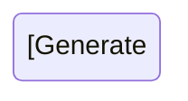

# UNIFIED SDLC PIPELINE - Practical Guide
## From Requirements to Production with AI Agents

**Version**: 2.0  
**Last Updated**: 2025-12-10  
**Purpose**: Hướng dẫn thực hành end-to-end cho team development

---

## 📚 Table of Contents

1. [Quick Start](#quick-start)
2. [Phase-by-Phase Guide](#phase-by-phase-guide)
3. [AI Agent Setup](#ai-agent-setup)
4. [Templates Library](#templates-library)
5. [Best Practices](#best-practices)
6. [Troubleshooting](#troubleshooting)

---

## Quick Start

### Prerequisites

**Tools Required**:
```bash
# Core tools
- Git
- Node.js 18+ / Python 3.10+
- Docker
- VS Code / Cursor IDE

# AI Tools
- GitHub Copilot / Cursor AI
- ChatGPT Plus / Claude Pro
- (Optional) LangGraph Cloud

# Documentation
- Mermaid CLI
- Markdown editor
```

**Project Structure**:
```
project-root/
├── 00-proposal/              # Phase 0 outputs
├── 01-ba-discovery/          # Phase 1 outputs
├── 02-ontology/              # Phase 2 outputs
├── 03-concept/               # Phase 3 outputs
├── 04-specification/         # Phase 4 outputs
├── src/                      # Phase 5 code
├── tests/                    # Phase 6 tests
├── docs/                     # Living documentation
└── .ai/                      # AI agent configs
    ├── prompts/
    ├── agents/
    └── workflows/
```

### 5-Minute Setup

```bash
# 1. Clone template repository
git clone https://github.com/a4b/sdlc-template.git my-project
cd my-project

# 2. Initialize project
npm run init
# or
python scripts/init_project.py

# 3. Configure AI agents
cp .ai/config.example.yaml .ai/config.yaml
# Edit .ai/config.yaml with your API keys

# 4. Start first phase
npm run phase:proposal
```

---

## Phase-by-Phase Guide

### Phase 0: Proposal (2-3 days)

#### Step 1: Discovery Workshop (4 hours)

**Preparation**:
- [ ] Schedule với key stakeholders
- [ ] Prepare workshop agenda
- [ ] Setup recording (với consent)

**Agenda Template**:
```markdown
## Discovery Workshop Agenda (4 hours)

### Part 1: Problem Understanding (90 min)
- Introductions (15 min)
- Current state walkthrough (30 min)
- Pain points discussion (30 min)
- Success criteria definition (15 min)

### Part 2: Solution Exploration (90 min)
- Desired outcomes (20 min)
- Feature brainstorming (40 min)
- Constraints discussion (20 min)
- Q&A (10 min)

### Part 3: Logistics (60 min)
- Timeline expectations (15 min)
- Budget discussion (15 min)
- Stakeholder mapping (15 min)
- Next steps (15 min)
```

**AI Assistant Usage**:
```
# During workshop
Tool: Otter.ai / Fireflies.ai
- Auto-transcribe discussion
- Generate meeting summary
- Extract action items

# After workshop
Prompt: "Analyze the following workshop transcript and:
1. List all mentioned pain points
2. Extract desired features
3. Identify constraints (budget, timeline, tech)
4. Suggest initial entities for ontology
5. Flag ambiguities needing clarification"
```

#### Step 2: Feasibility Analysis (AI-Assisted)

**Copy-Paste Prompt**:
```
You are a Solutions Architect analyzing a new project.

CLIENT REQUIREMENTS:
[PASTE workshop summary]

CONSTRAINTS:
- Budget: [AMOUNT]
- Timeline: [DURATION]
- Team: [SIZE]

Analyze and provide:

1. TECHNICAL FEASIBILITY
   - Recommended tech stack with justification
   - Architecture pattern (Monolith/Microservices/Serverless)
   - Third-party integrations needed
   - Technical risks

2. SIMILAR PROJECTS
   - Find 3 similar projects from our history
   - Compare scope and complexity
   - Lessons learned applicable here

3. EFFORT ESTIMATION
   - Story point estimate (Fibonacci scale)
   - Team composition needed
   - Timeline breakdown by phase

4. RISK ASSESSMENT
   - Technical risks (High/Medium/Low)
   - Business risks
   - Mitigation strategies

5. RECOMMENDATIONS
   - Go/No-Go decision
   - Alternative approaches
   - MVP scope suggestion

Format as structured markdown with tables.
```

#### Step 3: Proposal Generation

**Use existing proposal pipeline** (đã có sẵn từ trước):
```bash
# Navigate to proposal folder
cd 00-proposal

# Run proposal generator
npm run generate:proposal

# Or manually follow QUICK-START-GUIDE.md
```

**Outputs**:
- `00-proposal/PROPOSAL-FINAL.pdf`
- `00-proposal/feasibility-analysis.md`
- `00-proposal/workshop-summary.md`

---

### Phase 1: BA Discovery (1-4 weeks)

#### Step 1: Stakeholder Interviews

**Interview Script Template**:
```markdown
# Stakeholder Interview Script

## Pre-Interview
- [ ] Send calendar invite with agenda
- [ ] Request consent for recording
- [ ] Prepare questions based on role

## Opening (5 min)
"Thank you for your time. This interview will help us understand [topic].
I'll be recording for accuracy - is that okay?"

## Questions (40 min)

### Current State
1. Walk me through your current workflow for [process]
2. What tools do you currently use?
3. What works well? What doesn't?

### Pain Points
4. What are the biggest challenges you face?
5. How much time do you spend on [manual task]?
6. What would make your job easier?

### Future State
7. If you had a magic wand, what would the ideal solution do?
8. What features are must-haves vs nice-to-haves?
9. How would you measure success?

### Constraints
10. Any technical constraints we should know?
11. Integration requirements with existing systems?
12. Compliance/security requirements?

## Closing (5 min)
- Summarize key points
- Clarify ambiguities
- Next steps
```

**Post-Interview AI Processing**:
```
Prompt: "Analyze this interview transcript:

[PASTE TRANSCRIPT]

Extract and categorize:
1. REQUIREMENTS (functional)
   - Format: "As a [role], I need [feature] to [benefit]"
2. PAIN POINTS (current problems)
3. CONSTRAINTS (technical, business, regulatory)
4. SUCCESS CRITERIA (measurable outcomes)
5. ENTITIES (nouns that might be domain objects)
6. ACTIONS (verbs that might be operations)
7. AMBIGUITIES (unclear statements needing clarification)

Output as structured markdown."
```

#### Step 2: Requirements Documentation

**BRD Generation (AI-Assisted)**:
```
Prompt: "Generate a Business Requirements Document following IEEE 29148 standard.

INPUT DATA:
- Interview summaries: [PASTE]
- Workshop notes: [PASTE]
- Existing documentation: [PASTE]

STRUCTURE:
1. Executive Summary
2. Business Objectives (SMART goals)
3. Project Scope (In-scope / Out-of-scope)
4. Functional Requirements (numbered, testable)
5. Non-Functional Requirements (quantified)
6. Assumptions and Dependencies
7. Acceptance Criteria

REQUIREMENTS:
- Each requirement must have unique ID (REQ-XXX)
- Use SHALL for mandatory, SHOULD for optional
- Quantify NFRs (e.g., "response time < 2s")
- Include rationale for each requirement

Output as markdown with tables."
```

**User Stories Generation**:
```
Prompt: "Convert the following requirements into User Stories:

[PASTE REQUIREMENTS]

Format:
---
**Story ID**: US-001
**Title**: [Short title]

**As a** [user role/persona],
**I want to** [goal/action],
**So that** [business value/benefit].

**Acceptance Criteria**:
- [ ] Given [precondition], When [action], Then [expected result]
- [ ] Given [precondition], When [action], Then [expected result]

**Priority**: Must-have / Should-have / Could-have
**Estimate**: [Story points]
---

Follow INVEST criteria (Independent, Negotiable, Valuable, Estimable, Small, Testable).
Generate 10-15 stories covering main workflows."
```

#### Step 3: Process Mapping

**BPMN Generation (AI-Assisted)**:
```
Prompt: "Create BPMN diagram for the following process:

PROCESS: [e.g., Leave Request Approval]

STEPS:
1. Employee submits leave request
2. System validates (dates, balance)
3. Manager receives notification
4. Manager approves/rejects
5. System updates balance
6. Employee receives notification

Generate Mermaid BPMN syntax with:
- Swimlanes for each actor
- Decision points (diamonds)
- Error handling paths
- System vs human tasks clearly marked
```

**Outputs**:
- `01-ba-discovery/BRD.md`
- `01-ba-discovery/SRS.md`
- `01-ba-discovery/user-stories/` (folder với US-001.md, US-002.md, ...)
- `01-ba-discovery/process-maps/leave-approval.bpmn`
- `01-ba-discovery/RTM.xlsx` (Requirements Traceability Matrix)

---

### Phase 2: Ontology Layer (3-5 days)

#### Step 1: Entity Extraction (AI-Automated)

**Automated Extraction Script**:
```python
# scripts/extract_entities.py
import spacy
from collections import Counter

nlp = spacy.load("en_core_web_sm")

def extract_entities(brd_text):
    doc = nlp(brd_text)
    
    # Extract nouns (potential entities)
    nouns = [token.lemma_ for token in doc if token.pos_ == "NOUN"]
    
    # Filter by frequency (domain-specific terms appear often)
    noun_freq = Counter(nouns)
    domain_entities = [noun for noun, freq in noun_freq.most_common(20) if freq > 3]
    
    return domain_entities

# Usage
with open("01-ba-discovery/BRD.md") as f:
    brd = f.read()
    
entities = extract_entities(brd)
print("Suggested entities:", entities)
```

**AI Refinement Prompt**:
```
Prompt: "Review the following extracted entities and classify them:

EXTRACTED ENTITIES:
[PASTE from script output]

CONTEXT (from BRD):
[PASTE relevant sections]

Classify each as:
1. **Entity** (has identity, persists over time)
   - Example: Customer, Order, Product
2. **Value Object** (defined by attributes, immutable)
   - Example: Address, Money, DateRange
3. **Not a domain concept** (implementation detail or noise)

For each Entity/Value Object, suggest:
- Attributes (with data types)
- Potential relationships
- Lifecycle states (if applicable)

Output as YAML structure."
```

#### Step 2: Ontology Formalization

**Template**:
```yaml
# 02-ontology/domain-ontology.yaml

project: [PROJECT_NAME]
version: 1.0
created: [DATE]

# Core domain entities
entities:
  Employee:
    type: Core
    description: "A person employed by the organization"
    attributes:
      - name: id
        type: uuid
        required: true
        unique: true
        description: "Unique identifier"
      
      - name: email
        type: string
        required: true
        unique: true
        validation: email_format
        description: "Work email address"
      
      - name: full_name
        type: string
        required: true
        min_length: 2
        max_length: 100
      
      - name: department
        type: string
        required: true
        enum: [Engineering, Sales, HR, Finance]
      
      - name: join_date
        type: date
        required: true
        validation: "must be <= today"
      
      - name: status
        type: enum
        values: [ACTIVE, INACTIVE, TERMINATED]
        default: ACTIVE
    
    relationships:
      - name: reportsTo
        target: Employee
        type: many-to-one
        description: "Direct manager"
        cascade_delete: false
      
      - name: manages
        target: Employee
        type: one-to-many
        inverse_of: reportsTo
    
    lifecycle:
      states: [DRAFT, ACTIVE, INACTIVE, TERMINATED]
      transitions:
        - from: DRAFT
          to: ACTIVE
          trigger: activate_employee
          guard: "email must be verified"
        
        - from: ACTIVE
          to: INACTIVE
          trigger: suspend_employee
          guard: "must have manager approval"
        
        - from: [ACTIVE, INACTIVE]
          to: TERMINATED
          trigger: terminate_employee
          guard: "must complete exit process"
    
    business_rules:
      - id: BR-EMP-001
        description: "Email must be unique across organization"
        type: validation
        severity: error
        message: "This email is already registered"
      
      - id: BR-EMP-002
        description: "Employee cannot report to themselves"
        type: validation
        condition: "reportsTo.id != id"
        severity: error
      
      - id: BR-EMP-003
        description: "Join date cannot be in the future"
        type: validation
        condition: "join_date <= today()"
        severity: error

# Relationships between entities
relationships:
  - from: LeaveRequest
    to: Employee
    type: many-to-one
    name: requestedBy
    required: true
    cascade_delete: false
  
  - from: LeaveRequest
    to: LeaveType
    type: many-to-one
    name: hasType
    required: true

# Global business rules
global_rules:
  - id: GR-001
    description: "All dates must be in ISO 8601 format"
    applies_to: [all_entities]
  
  - id: GR-002
    description: "Soft delete pattern for all core entities"
    applies_to: [Employee, LeaveRequest]
    implementation: "Add deleted_at timestamp field"
```

**Validation**:
```bash
# Validate ontology consistency
npm run validate:ontology

# Generate ER diagram
npm run generate:er-diagram
```

**Outputs**:
- `02-ontology/[module]-ontology.yaml` (REQUIRED)
- `02-ontology/glossary-[submodule].md` (REQUIRED - one per sub-module)
- `02-ontology/glossary-[submodule]-vi.md` (OPTIONAL - Vietnamese version)
- `02-ontology/glossary-index.md` (REQUIRED - navigation/index)
- `02-ontology/er-diagram.mmd` (Entity-Relationship diagram)
- `02-ontology/business-rules-catalog.md`
- `02-ontology/ONTOLOGY-REVIEW.md` (RECOMMENDED - review notes)

---

### Phase 3: Concept Layer (2-3 days)

#### AI-Generated Concept Documents

**Concept Overview Prompt**:
```
Prompt: "Generate a Concept Overview document.

INPUT:
- Ontology: [PASTE domain-ontology.yaml]
- BRD Summary: [PASTE key sections]

OUTPUT STRUCTURE:
# [Module Name] - Concept Overview

## What is this module?
[2-3 paragraphs explaining purpose]

## Problem Statement
- [List current problems this solves]

## High-Level Solution
[Explain approach without technical details]

## Key Capabilities
1. [Capability 1]
2. [Capability 2]
...

## Value Proposition
[Business value delivered]

## Stakeholders
- [Role 1]: [How they benefit]
- [Role 2]: [How they benefit]

Use clear, non-technical language suitable for business stakeholders."
```

**Conceptual Guide Prompt**:
```
Prompt: "Generate a Conceptual Guide explaining system behavior.

INPUT:
- Ontology: [PASTE]
- User Stories: [PASTE top 5 stories]

OUTPUT:
# [Module Name] - Conceptual Guide

## How the System Works

### Workflow 1: [Name]
[Step-by-step explanation with Mermaid sequence diagram]

**Example Scenario**:
[Concrete example with real data]

**Business Rules Applied**:
- [Rule 1]
- [Rule 2]

### Workflow 2: [Name]
[Repeat structure]

## Domain Behaviors

### [Entity] Lifecycle
[Explain state transitions with diagram]

### [Entity] Interactions
[Explain how entities collaborate]

Use storytelling approach with concrete examples."
```

**Per-Entity Concept Prompt**:
```
Prompt: "Generate entity concept document.

ENTITY: [EntityName from ontology]
ONTOLOGY DEFINITION: [PASTE entity section]

OUTPUT:
# [EntityName] - Entity Concept

## Purpose
[Why this entity exists in the domain]

## Attributes Explained
| Attribute | Purpose | Business Meaning |
|-----------|---------|------------------|
| [attr] | [purpose] | [meaning] |

## Lifecycle
[Explain state transitions with real-world analogy]



## Business Rules
[Explain each rule with examples]

**Example**: [Rule ID]
- **Rule**: [Description]
- **Why**: [Business rationale]
- **Example**: [Concrete scenario]

## Relationships
[Explain how this entity relates to others]

## Common Scenarios
1. [Scenario 1 with example]
2. [Scenario 2 with example]

Use analogies and examples to make it accessible."
```

**Outputs**:
- `03-concept/concept-overview.md`
- `03-concept/conceptual-guide.md`
- `03-concept/entity-concepts/employee.md`
- `03-concept/entity-concepts/leave-request.md`
- ... (one per entity)
- `03-concept/README.md` (REQUIRED - concept guides index)
- `03-concept/01-[topic]-guide.md` (REQUIRED - core concept guide #1)
- `03-concept/02-[topic]-guide.md` (REQUIRED - core concept guide #2)
- `03-concept/03-[topic]-guide.md` (REQUIRED - additional guides)
- `03-concept/0N-[topic]-guide.md` (REQUIRED - minimum 5-7 guides total)
- `03-concept/entity-guides/` (OPTIONAL - detailed entity-specific guides)

**Note**: Minimum 5-7 concept guides required covering all core concepts of the module.

---

### Phase 4: Specification Layer (1-2 weeks)

#### Behavioural Specification

**Template Structure**:
```markdown
# [Module] - Behavioural Specification

## Use Case 1: [Name]

### Metadata
- **ID**: UC-001
- **Priority**: High
- **Complexity**: Medium
- **Related Stories**: US-001, US-002

### Actors
- **Primary**: Employee
- **Secondary**: Manager, System

### Preconditions
- Employee is logged in
- Employee has active status
- Leave balance data is available

### Triggers
- Employee clicks "Request Leave" button

### Main Success Scenario

**Step 1**: Employee selects leave type
- **System**: Displays available leave types from database
- **Employee**: Selects "Annual Leave"
- **System**: Fetches employee's balance for Annual Leave

**Step 2**: Employee enters dates
- **Employee**: Selects start date (2025-12-01)
- **Employee**: Selects end date (2025-12-05)
- **System**: Calculates total days (5 working days)
- **System**: Validates:
  - ✅ Start date >= today
  - ✅ End date >= start date
  - ✅ No overlap with approved leaves
  - ✅ Sufficient balance (10 available >= 5 requested)

**Step 3**: Employee submits request
- **Employee**: Enters reason (optional)
- **Employee**: Clicks "Submit"
- **System**: Creates LeaveRequest with status=PENDING
- **System**: Updates balance (available: 10 → 5, pending: 0 → 5)
- **System**: Sends notification to manager
- **System**: Displays confirmation message

### Alternative Flows

#### AF1: Insufficient Balance
**At Step 2**, if balance < requested days:
- **System**: Shows error "Insufficient leave balance. You have 3 days available but requested 5 days."
- **System**: Disables submit button
- **Employee**: Adjusts dates or cancels

#### AF2: Overlapping Dates
**At Step 2**, if dates overlap with approved leave:
- **System**: Shows error "Date range overlaps with existing leave request #12345 (2025-12-01 to 2025-12-03)"
- **System**: Highlights conflicting dates in calendar
- **Employee**: Adjusts dates or cancels

### Exception Flows

#### EF1: System Error
**At any step**, if system error occurs:
- **System**: Logs error details
- **System**: Shows user-friendly message "Something went wrong. Please try again."
- **System**: Rolls back any partial changes
- **Employee**: Can retry or contact support

### Postconditions
**Success**:
- LeaveRequest created with status=PENDING
- Employee balance updated (pending increased)
- Manager notified
- Audit log created

**Failure**:
- No data changed
- Error logged
- User informed

### Business Rules Applied
- BR-LR-001: Start date must be >= today
- BR-LR-002: End date must be >= start date
- BR-LR-003: Cannot overlap with approved leaves
- BR-LR-004: Requested days must be <= available balance

### Non-Functional Requirements
- **Performance**: Form validation < 100ms
- **Usability**: Max 3 clicks to submit
- **Accessibility**: WCAG 2.1 AA compliant

### Test Scenarios
- TS-001: Happy path with valid data
- TS-002: Insufficient balance error
- TS-003: Overlapping dates error
- TS-004: Past date validation
- TS-005: Boundary testing (exactly 0 days available)
```

#### API Specification (AI-Generated)

**OpenAPI Generation Prompt**:
```
Prompt: "Generate OpenAPI 3.1 specification.

INPUT:
- Ontology: [PASTE domain-ontology.yaml]
- Behavioural Spec: [PASTE use cases]

REQUIREMENTS:
- RESTful design
- CRUD operations for each entity
- Custom operations from use cases
- Proper HTTP status codes
- Error response schemas
- Request/response examples
- Authentication (Bearer token)
- Pagination for list endpoints
- Filtering and sorting

OUTPUT: Complete OpenAPI YAML
```

**Example Output**:
```yaml
openapi: 3.1.0
info:
  title: Leave Management API
  version: 1.0.0
  description: API for managing employee leave requests

servers:
  - url: https://api.example.com/v1
    description: Production
  - url: https://staging-api.example.com/v1
    description: Staging

security:
  - bearerAuth: []

paths:
  /leave-requests:
    post:
      summary: Create a new leave request
      operationId: createLeaveRequest
      tags: [Leave Requests]
      requestBody:
        required: true
        content:
          application/json:
            schema:
              $ref: '#/components/schemas/CreateLeaveRequestInput'
            examples:
              valid:
                summary: Valid leave request
                value:
                  employeeId: "550e8400-e29b-41d4-a716-446655440000"
                  leaveTypeId: "660e8400-e29b-41d4-a716-446655440001"
                  startDate: "2025-12-01"
                  endDate: "2025-12-05"
                  reason: "Family vacation"
      responses:
        '201':
          description: Leave request created successfully
          content:
            application/json:
              schema:
                $ref: '#/components/schemas/LeaveRequest'
        '400':
          description: Validation error
          content:
            application/json:
              schema:
                $ref: '#/components/schemas/Error'
              examples:
                insufficient_balance:
                  summary: Insufficient leave balance
                  value:
                    error: "INSUFFICIENT_BALANCE"
                    message: "You have 3 days available but requested 5 days"
                    details:
                      available: 3
                      requested: 5
        '401':
          $ref: '#/components/responses/Unauthorized'

components:
  schemas:
    LeaveRequest:
      type: object
      required: [id, employeeId, leaveTypeId, startDate, endDate, status]
      properties:
        id:
          type: string
          format: uuid
        employeeId:
          type: string
          format: uuid
        leaveTypeId:
          type: string
          format: uuid
        startDate:
          type: string
          format: date
        endDate:
          type: string
          format: date
        totalDays:
          type: integer
          minimum: 1
        status:
          type: string
          enum: [DRAFT, PENDING, APPROVED, REJECTED]
        reason:
          type: string
          maxLength: 500
        createdAt:
          type: string
          format: date-time
        updatedAt:
          type: string
          format: date-time
    
    Error:
      type: object
      required: [error, message]
      properties:
        error:
          type: string
          description: Error code
        message:
          type: string
          description: Human-readable error message
        details:
          type: object
          description: Additional error details
  
  securitySchemes:
    bearerAuth:
      type: http
      scheme: bearer
      bearerFormat: JWT
```

#### Database Design (AI-Generated)

**DBML Generation Prompt**:
```
Prompt: "Generate database schema in DBML format.

INPUT:
- Ontology: [PASTE domain-ontology.yaml]

REQUIREMENTS:
- PostgreSQL syntax
- Proper data types
- Primary keys (UUID)
- Foreign keys with constraints
- Indexes for performance
- Timestamps (created_at, updated_at)
- Soft delete support (deleted_at)
- Constraints from business rules

OUTPUT: Complete DBML schema
```

**Outputs**:
- `04-specification/README.md` (REQUIRED - spec index)
- `04-specification/01-functional-requirements.md` (REQUIRED)
- `04-specification/02-api-specification.md` (REQUIRED)
- `04-specification/03-data-specification.md` (REQUIRED - validation rules)
- `04-specification/04-business-rules.md` (REQUIRED)
- `04-specification/05-integration-spec.md` (REQUIRED - external integrations)
- `04-specification/06-security-spec.md` (REQUIRED - security requirements)
- `04-specification/03-scenarios/` (REQUIRED - scenario documents)
  - `[scenario-name].md` (multiple scenario files)
- `04-specification/INTEGRATION-GUIDE.md` (REQUIRED - PO/BA → Dev handoff)
- `04-specification/FEATURE-LIST.yaml` (REQUIRED - feature breakdown)

**For Phase 3 (Design)**:
- `03-design/README.md` (REQUIRED)
- `03-design/[module].dbml` (REQUIRED - database schema)
- `03-design/diagrams/` (OPTIONAL)

**For Phase 5 (Implementation/API)**:
- `04-implementation/README.md` (REQUIRED)
- `05-api/README.md` (REQUIRED)
- `05-api/openapi.yaml` (REQUIRED - OpenAPI 3.1 spec)

---

### Phase 5-7: Implementation, QA, Deployment

*(Detailed guides available in separate documents)*

**Quick Reference**:
```bash
# Phase 5: Generate code
npm run generate:backend
npm run generate:frontend
npm run generate:tests

# Phase 6: Run tests
npm run test:all

# Phase 7: Deploy
npm run deploy:staging
npm run deploy:production
```

---

## AI Agent Setup

### LangGraph Workflow Example

```python
# .ai/workflows/sdlc_pipeline.py
from langgraph.graph import StateGraph, END
from typing import TypedDict, Annotated
import operator

class SDLCState(TypedDict):
    phase: str
    inputs: dict
    outputs: dict
    errors: list
    human_feedback: str

def ba_discovery_agent(state: SDLCState):
    """Phase 1: BA Discovery"""
    # AI processes interviews, generates BRD
    brd = generate_brd(state["inputs"]["interviews"])
    return {"outputs": {"brd": brd}, "phase": "ontology"}

def ontology_agent(state: SDLCState):
    """Phase 2: Ontology Generation"""
    ontology = extract_ontology(state["outputs"]["brd"])
    return {"outputs": {"ontology": ontology}, "phase": "concept"}

def concept_agent(state: SDLCState):
    """Phase 3: Concept Documents"""
    concepts = generate_concepts(state["outputs"]["ontology"])
    return {"outputs": {"concepts": concepts}, "phase": "specification"}

def spec_agent(state: SDLCState):
    """Phase 4: Specifications"""
    specs = generate_specs(
        state["outputs"]["ontology"],
        state["outputs"]["concepts"]
    )
    return {"outputs": {"specs": specs}, "phase": "implementation"}

def code_agent(state: SDLCState):
    """Phase 5: Code Generation"""
    code = generate_code(state["outputs"]["specs"])
    return {"outputs": {"code": code}, "phase": "qa"}

def qa_agent(state: SDLCState):
    """Phase 6: Test Generation"""
    tests = generate_tests(state["outputs"]["specs"])
    return {"outputs": {"tests": tests}, "phase": "deployment"}

# Build workflow graph
workflow = StateGraph(SDLCState)

# Add nodes
workflow.add_node("ba_discovery", ba_discovery_agent)
workflow.add_node("ontology", ontology_agent)
workflow.add_node("concept", concept_agent)
workflow.add_node("specification", spec_agent)
workflow.add_node("implementation", code_agent)
workflow.add_node("qa", qa_agent)

# Add edges
workflow.add_edge("ba_discovery", "ontology")
workflow.add_edge("ontology", "concept")
workflow.add_edge("concept", "specification")
workflow.add_edge("specification", "implementation")
workflow.add_edge("implementation", "qa")
workflow.add_edge("qa", END)

# Set entry point
workflow.set_entry_point("ba_discovery")

# Compile
app = workflow.compile()

# Run pipeline
result = app.invoke({
    "phase": "ba_discovery",
    "inputs": {"interviews": interview_transcripts},
    "outputs": {},
    "errors": []
})
```

---

## Templates Library

All templates available in `/templates/` folder:
- `brd-template.md`
- `user-story-template.md`
- `ontology-template.yaml`
- `api-spec-template.yaml`
- `behaviour-spec-template.md`
- ... (full list in repository)

---

## Best Practices

### DO's ✅
- Always start with Ontology (single source of truth)
- Use AI for first draft, human for validation
- Maintain traceability (REQ-ID → SPEC-ID → CODE)
- Version control everything (including prompts)
- Checkpoint after each phase
- Document decisions (ADRs)

### DON'Ts ❌
- Skip phases (even if "simple" project)
- Trust AI outputs blindly
- Mix Custom App and Product workflows
- Hardcode business rules (use ontology)
- Ignore quality gates
- Forget to update RTM

---

## Troubleshooting

**Q: AI generates incorrect entities**  
A: Provide more context in prompts. Include domain glossary. Use few-shot examples.

**Q: Specs don't match requirements**  
A: Check RTM for gaps. Run traceability validation script.

**Q: Code generation fails**  
A: Validate specs first (OpenAPI validator, DBML parser). Check AI context window limits.

**Q: Quality gate blocked**  
A: Review gate criteria. Check if blocking issue is valid. Request exception if needed (with justification).

---

**Next**: See [Implementation Plan](./implementation_plan.md) for detailed roadmap.
