# xTalent HCM - Employee 360 View
## Product Concept Document

**Version**: 1.1  
**Date**: December 2025  
**Audience**: Product Team, UX Designers, Stakeholders

---

## 1. Executive Summary

### 1.1 Vision Statement

> **"Một cái nhìn toàn diện về con người - không chỉ là nhân viên"**

Employee 360 View là màn hình trung tâm hiển thị toàn bộ thông tin liên quan đến một cá nhân trong hệ thống HCM. Đây là điểm đến từ Global Search khi user tìm kiếm nhân sự, cung cấp cái nhìn tổng quan và khả năng drill-down vào mọi khía cạnh của employee data graph.

### 1.2 Design Philosophy

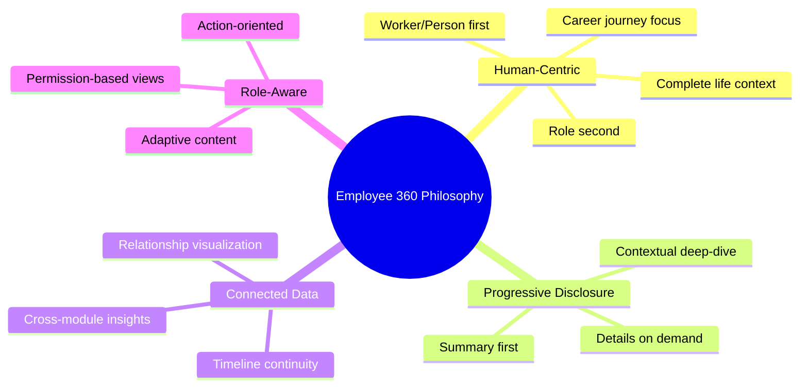

### 1.3 Key Objectives

| Objective | Description | Success Metric |
|-----------|-------------|----------------|
| **Comprehensive** | Hiển thị mọi thông tin liên quan trong một view | 100% data coverage |
| **Intuitive** | User tìm được thông tin trong < 3 clicks | Task completion < 10s |
| **Contextual** | Thông tin phù hợp với role của viewer | Role satisfaction > 85% |
| **Connected** | Thể hiện relationships và dependencies | Graph navigation success |
| **Actionable** | Quick actions từ context hiện tại | Action completion rate > 70% |

---

## 2. Data Model Foundation

### 2.1 Core Concept: Worker → Working Relationship → Assignment

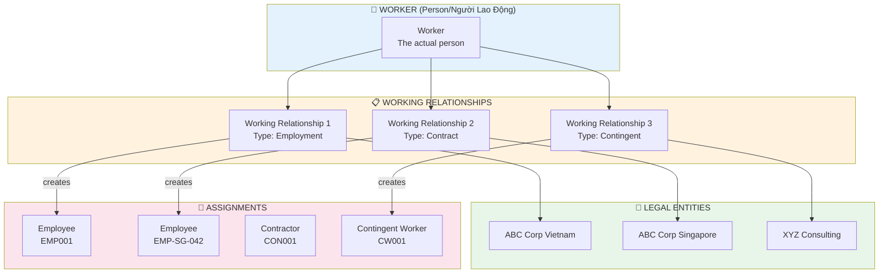

### 2.2 Entity Relationship Model

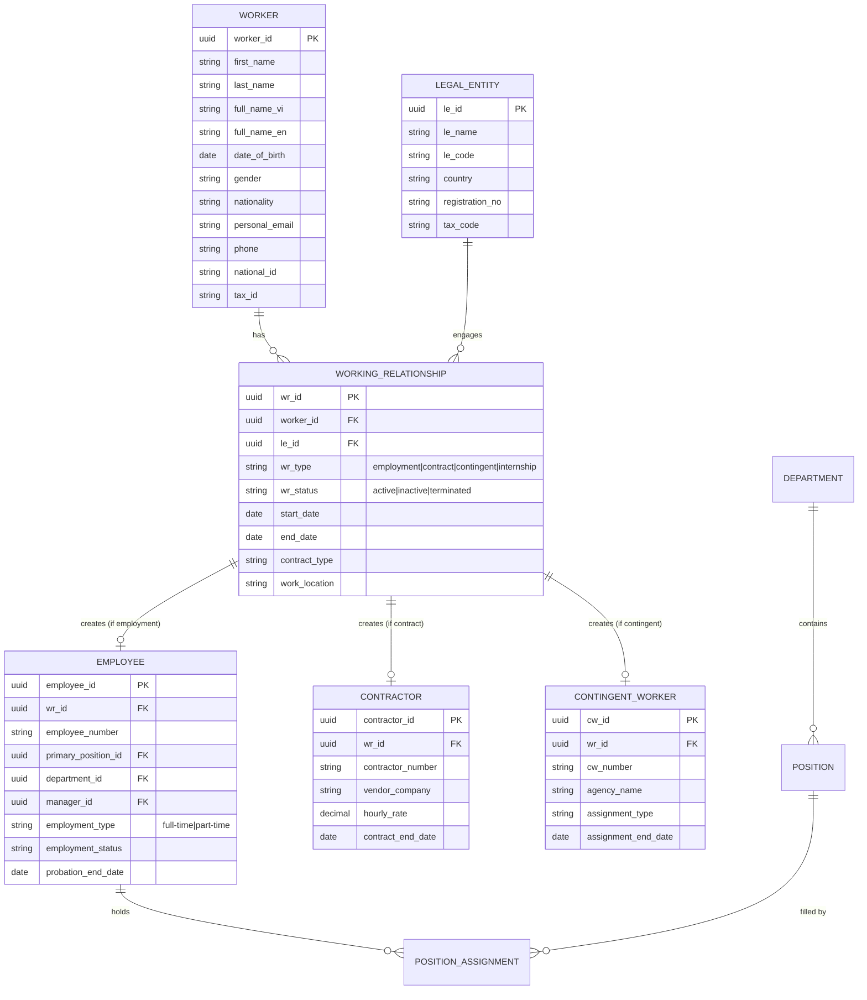

### 2.3 Working Relationship Types

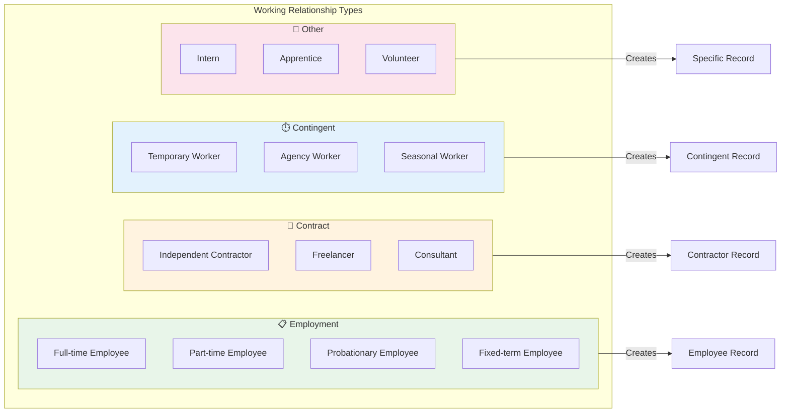

### 2.4 Data Layer Architecture

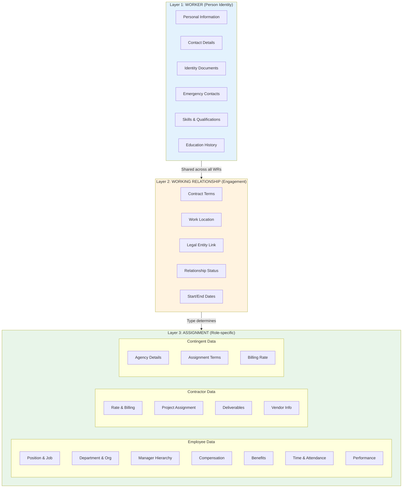

### 2.5 Multi-Relationship Scenario

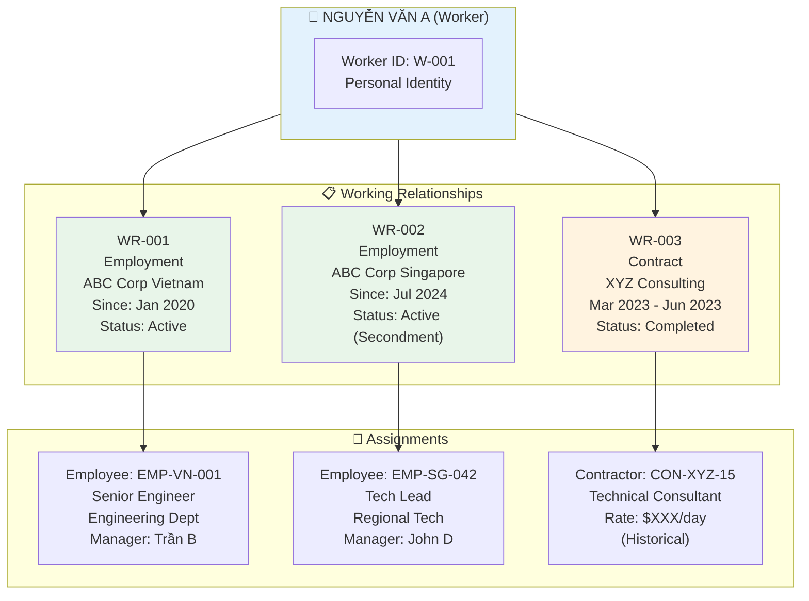

---

## 3. Competitive Analysis

### 3.1 Oracle HCM Cloud - Person Spotlight

**Key Features:**
- **Spotlight Card**: Quick summary với photo, name, position, contact
- **Connections**: Visual org relationships
- **Journey Timeline**: Employment history as timeline
- **Quick Actions**: Context-sensitive actions
- **Feedback Integration**: Recognition và feedback inline

```
┌─────────────────────────────────────────────────────────────┐
│  ORACLE HCM - PERSON SPOTLIGHT                              │
├─────────────────────────────────────────────────────────────┤
│  ┌──────┐  John Smith                                       │
│  │ 📷   │  Senior Software Engineer                         │
│  │      │  Engineering Department                           │
│  └──────┘  📧 john.smith@company.com  📱 +1-xxx-xxx         │
│                                                             │
│  [Actions ▼] [Org Chart] [Directory] [Send Kudos]          │
├─────────────────────────────────────────────────────────────┤
│  Tabs: Overview | Career | Performance | Compensation | ... │
└─────────────────────────────────────────────────────────────┘
```

**Strengths**: Deep integration, comprehensive data, enterprise-grade  
**Weaknesses**: Complex navigation, steep learning curve

### 3.2 SAP SuccessFactors - People Profile

**Key Features:**
- **Profile Header**: Rich header với badges, status
- **Talent Card**: Skills, competencies, potential
- **Live Profile**: Social-media style updates
- **Continuous Performance**: Ongoing feedback
- **Development Plan**: Career aspirations visible

```
┌─────────────────────────────────────────────────────────────┐
│  SAP SUCCESSFACTORS - PEOPLE PROFILE                        │
├─────────────────────────────────────────────────────────────┤
│  ┌──────────────────────────────────────────────────────┐   │
│  │  👤 Maria Garcia         🏆 Top Performer             │   │
│  │  Product Manager         📍 Barcelona, Spain          │   │
│  │  ━━━━━━━━━━━━━━━━━━━━━━━━━━━━━━━━━━━━━━━━━━━━━━━━━━  │   │
│  │  Skills: Agile ● Product Strategy ● Analytics        │   │
│  │  Badges: 🎯 Goal Champion  💡 Innovator               │   │
│  └──────────────────────────────────────────────────────┘   │
│                                                             │
│  📊 Talent Snapshot    📈 Performance    🎯 Goals           │
└─────────────────────────────────────────────────────────────┘
```

**Strengths**: Talent-centric, social features, modern UX  
**Weaknesses**: Module silos, inconsistent experience

### 3.3 Workday - Worker Profile

**Key Features:**
- **Related Actions**: Extensive action menu
- **Worklets**: Configurable information blocks
- **Org Viewer**: Interactive org chart
- **Timeline**: Activity stream
- **Worker History**: Complete employment timeline

```
┌─────────────────────────────────────────────────────────────┐
│  WORKDAY - WORKER PROFILE                                   │
├─────────────────────────────────────────────────────────────┤
│  ┌────────────────────────────────────┐ ┌────────────────┐  │
│  │ David Chen                         │ │ Related Actions│  │
│  │ Staff Software Engineer            │ │ ─────────────  │  │
│  │ 📍 San Francisco • Eng-Platform    │ │ ▶ Job Change   │  │
│  │                                    │ │ ▶ Compensation │  │
│  │ Manager: Sarah Johnson             │ │ ▶ Time Off     │  │
│  │ 3 Direct Reports                   │ │ ▶ Benefits     │  │
│  └────────────────────────────────────┘ │ ▶ More...      │  │
│                                         └────────────────┘  │
│  ┌─────────────┐ ┌─────────────┐ ┌─────────────┐           │
│  │ Summary     │ │ Job Details │ │ Compensation│           │
│  │ Worklet     │ │ Worklet     │ │ Worklet     │           │
│  └─────────────┘ └─────────────┘ └─────────────┘           │
└─────────────────────────────────────────────────────────────┘
```

**Strengths**: Configurable, action-oriented, unified data model  
**Weaknesses**: Dense UI, requires training

### 3.4 Competitive Comparison Matrix

| Feature | Oracle | SAP SF | Workday | xTalent (Target) |
|---------|--------|--------|---------|------------------|
| **Profile Completeness** | ★★★★★ | ★★★★☆ | ★★★★★ | ★★★★★ |
| **Visual Design** | ★★★☆☆ | ★★★★☆ | ★★★☆☆ | ★★★★★ |
| **Navigation Ease** | ★★★☆☆ | ★★★★☆ | ★★★☆☆ | ★★★★★ |
| **Multi-WR Support** | ★★★★☆ | ★★★☆☆ | ★★★★★ | ★★★★★ |
| **Graph Visualization** | ★★★☆☆ | ★★☆☆☆ | ★★★★☆ | ★★★★★ |
| **Quick Actions** | ★★★★☆ | ★★★☆☆ | ★★★★★ | ★★★★★ |
| **Mobile Experience** | ★★★★☆ | ★★★★☆ | ★★★★☆ | ★★★★★ |
| **AI Integration** | ★★★☆☆ | ★★★☆☆ | ★★★☆☆ | ★★★★★ |

---

## 4. Worker 360 Data Graph

### 4.1 Complete Data Universe

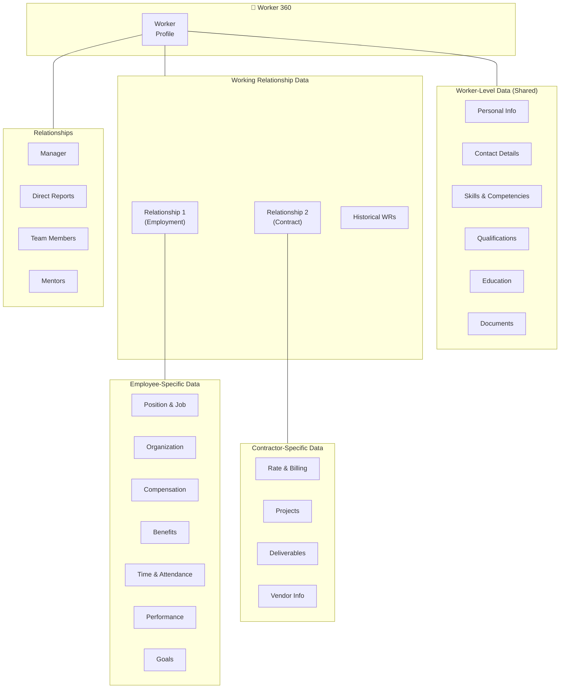

### 4.2 Data Categories by Layer

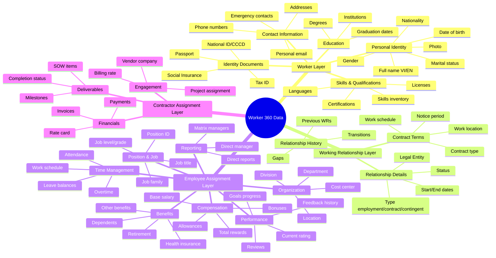

### 4.3 Relationship Graph

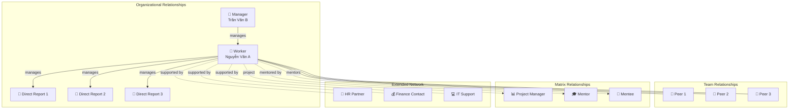

---

## 5. UX Design Principles

### 5.1 Core UX Philosophy

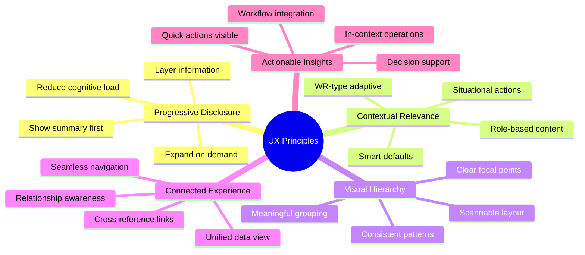

### 5.2 Information Architecture

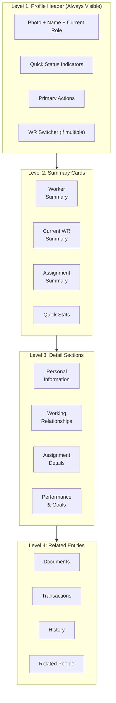

### 5.3 Responsive Layout Strategy

```
┌─────────────────────────────────────────────────────────────────────┐
│  DESKTOP LAYOUT (1440px+)                                           │
├─────────────────────────────────────────────────────────────────────┤
│  ┌─────────────────────────────────────────────────────────────┐    │
│  │                    PROFILE HEADER                            │    │
│  │  [WR Switcher: Employment @ ABC VN ▼]                       │    │
│  └─────────────────────────────────────────────────────────────┘    │
│  ┌─────────────────────────────┐ ┌───────────────────────────────┐  │
│  │                             │ │                               │  │
│  │      MAIN CONTENT           │ │     SIDE PANEL                │  │
│  │      (Scrollable)           │ │     - Quick Info              │  │
│  │      - Worker Summary       │ │     - Actions                 │  │
│  │      - WR Details           │ │     - Related People          │  │
│  │      - Assignment Details   │ │     - Activity Feed           │  │
│  │                             │ │                               │  │
│  └─────────────────────────────┘ └───────────────────────────────┘  │
│         ~70% width                      ~30% width                   │
└─────────────────────────────────────────────────────────────────────┘

┌─────────────────────────────────┐
│  TABLET LAYOUT (768-1439px)     │
├─────────────────────────────────┤
│  ┌───────────────────────────┐  │
│  │  PROFILE HEADER + WR ▼    │  │
│  └───────────────────────────┘  │
│  ┌───────────────────────────┐  │
│  │     TAB NAVIGATION        │  │
│  │  [Worker][WR][Assignment] │  │
│  └───────────────────────────┘  │
│  ┌───────────────────────────┐  │
│  │                           │  │
│  │     TAB CONTENT           │  │
│  │     (Full width)          │  │
│  │                           │  │
│  └───────────────────────────┘  │
└─────────────────────────────────┘

┌─────────────────────┐
│  MOBILE (< 768px)   │
├─────────────────────┤
│  ┌───────────────┐  │
│  │ Compact Header│  │
│  │ [WR: ABC VN ▼]│  │
│  └───────────────┘  │
│  ┌───────────────┐  │
│  │ Swipeable     │  │
│  │ Summary Cards │  │
│  └───────────────┘  │
│  ┌───────────────┐  │
│  │ Accordion     │  │
│  │ Sections      │  │
│  └───────────────┘  │
│  ┌───────────────┐  │
│  │ [FAB Actions] │  │
│  └───────────────┘  │
└─────────────────────┘
```

---

## 6. Feature Design

### 6.1 Profile Header

**Purpose**: Instant recognition và primary information at a glance

```
┌──────────────────────────────────────────────────────────────────────────┐
│  ← Back to Search                                          [⋯] Actions   │
├──────────────────────────────────────────────────────────────────────────┤
│                                                                          │
│   ┌────────┐   NGUYỄN VĂN A                          ┌────────────────┐  │
│   │        │   Worker ID: W-001                       │  ✅ Active     │  │
│   │  📷    │                                          │  📍 Ho Chi Minh│  │
│   │        │   📧 nguyen.a@gmail.com (Personal)       │  🎂 34 years   │  │
│   │        │   📱 0912-345-678                        │                │  │
│   └────────┘                                          └────────────────┘  │
│                                                                          │
│   ┌──────────────────────────────────────────────────────────────────┐   │
│   │ 📋 CURRENT WORKING RELATIONSHIP                              [▼] │   │
│   │ ━━━━━━━━━━━━━━━━━━━━━━━━━━━━━━━━━━━━━━━━━━━━━━━━━━━━━━━━━━━━━━━ │   │
│   │ 🏢 ABC Corporation Vietnam          Type: Employment (Full-time) │   │
│   │ 👔 Senior Software Engineer         Since: Jan 2020 (5yr 0mo)    │   │
│   │ 🏛️ Engineering Department           Manager: Trần Văn B          │   │
│   └──────────────────────────────────────────────────────────────────┘   │
│                                                                          │
│   Skills: Python ● AWS ● React ● System Design ● +5 more                │
│                                                                          │
│   ┌──────────────┐ ┌──────────────┐ ┌──────────────┐ ┌──────────────┐   │
│   │ 📧 Message   │ │ 📅 Schedule  │ │ 📊 Org Chart │ │ ⚡ Actions ▼ │   │
│   └──────────────┘ └──────────────┘ └──────────────┘ └──────────────┘   │
│                                                                          │
└──────────────────────────────────────────────────────────────────────────┘
```

**Header Components:**

| Component | Content | Purpose |
|-----------|---------|---------|
| **Photo** | Profile picture với fallback initials | Visual recognition |
| **Worker Name** | Full name (primary identity) | Primary identification |
| **Worker ID** | System identifier | Reference |
| **Personal Contact** | Personal email, phone | Direct contact |
| **Status Badge** | Active/Inactive across all WRs | Overall state |
| **WR Summary** | Current/Primary working relationship | Context |
| **Current Role** | Job title from current WR | Professional identity |
| **Tenure** | Duration với current LE | Context |
| **Skills Tags** | Top skills (worker-level) | Quick expertise view |
| **Quick Actions** | Context-sensitive action buttons | Primary operations |

### 6.2 Working Relationship Switcher

**Purpose**: Navigate between multiple working relationships

```
┌──────────────────────────────────────────────────────────────────────────┐
│  📋 WORKING RELATIONSHIPS                                         [▼]   │
├──────────────────────────────────────────────────────────────────────────┤
│                                                                          │
│  ┌────────────────────────────────────────────────────────────────────┐  │
│  │ ✓ SELECTED (Primary)                                               │  │
│  │ ━━━━━━━━━━━━━━━━━━━━━━━━━━━━━━━━━━━━━━━━━━━━━━━━━━━━━━━━━━━━━━━━━ │  │
│  │ 🏢 ABC Corporation Vietnam                                         │  │
│  │ Type: Employment (Full-time)                                       │  │
│  │ Role: Senior Software Engineer                                     │  │
│  │ Since: Jan 15, 2020                Status: ✅ Active               │  │
│  └────────────────────────────────────────────────────────────────────┘  │
│                                                                          │
│  ┌────────────────────────────────────────────────────────────────────┐  │
│  │ 🏢 ABC Corporation Singapore                                       │  │
│  │ Type: Employment (Secondment)                                      │  │
│  │ Role: Tech Lead - Regional                                         │  │
│  │ Period: Jul 2024 - Jun 2025        Status: ✅ Active               │  │
│  │                                                          [View →]  │  │
│  └────────────────────────────────────────────────────────────────────┘  │
│                                                                          │
│  ┌────────────────────────────────────────────────────────────────────┐  │
│  │ 🏢 XYZ Consulting                                        HISTORY   │  │
│  │ Type: Contract (Consultant)                                        │  │
│  │ Role: Technical Consultant                                         │  │
│  │ Period: Mar 2023 - Jun 2023        Status: ⏹️ Completed            │  │
│  │                                                          [View →]  │  │
│  └────────────────────────────────────────────────────────────────────┘  │
│                                                                          │
└──────────────────────────────────────────────────────────────────────────┘
```

### 6.3 Summary Dashboard

**Purpose**: Holistic view of key information across all layers

```
┌──────────────────────────────────────────────────────────────────────────┐
│  SUMMARY DASHBOARD                                                        │
├──────────────────────────────────────────────────────────────────────────┤
│                                                                          │
│  ┌─────────────────────────────┐  ┌─────────────────────────────┐       │
│  │ 👤 WORKER PROFILE           │  │ 📋 CURRENT WR               │       │
│  │ ─────────────────────────── │  │ ─────────────────────────── │       │
│  │ Name: Nguyễn Văn A          │  │ Legal Entity: ABC Corp VN   │       │
│  │ DOB: Mar 15, 1990 (34y)     │  │ Type: Employment            │       │
│  │ Nationality: Vietnamese     │  │ Contract: Indefinite        │       │
│  │ Skills: 12 verified         │  │ Location: HCM Office        │       │
│  │ Certifications: 5           │  │ Since: Jan 2020 (5yr)       │       │
│  │                             │  │ Status: Active ✅            │       │
│  │ [View Personal Info →]      │  │ [View WR Details →]         │       │
│  └─────────────────────────────┘  └─────────────────────────────┘       │
│                                                                          │
│  ━━━━━━━━━━━━━━━━━━━━━━━━━━━━━━━━━━━━━━━━━━━━━━━━━━━━━━━━━━━━━━━━━━━━━ │
│  📊 ASSIGNMENT DETAILS (Employee @ ABC Corp VN)                          │
│  ━━━━━━━━━━━━━━━━━━━━━━━━━━━━━━━━━━━━━━━━━━━━━━━━━━━━━━━━━━━━━━━━━━━━━ │
│                                                                          │
│  ┌─────────────────────────────┐  ┌─────────────────────────────┐       │
│  │ 🏢 ORGANIZATION             │  │ 🕐 TIME & ATTENDANCE        │       │
│  │ ─────────────────────────── │  │ ─────────────────────────── │       │
│  │ Position: Senior Eng        │  │ This Month                  │       │
│  │ Department: Engineering     │  │ ━━━━━━━━━━━━━━━ 85%         │       │
│  │ Grade: L5                   │  │ 17/20 working days          │       │
│  │ Manager: Trần Văn B         │  │                             │       │
│  │ Reports: 8 people           │  │ Leave Balance               │       │
│  │                             │  │ Annual: 12 days             │       │
│  │ [View Org Chart →]          │  │ [View Timesheet →]          │       │
│  └─────────────────────────────┘  └─────────────────────────────┘       │
│                                                                          │
│  ┌─────────────────────────────┐  ┌─────────────────────────────┐       │
│  │ 💰 COMPENSATION             │  │ 🎯 PERFORMANCE              │       │
│  │ ─────────────────────────── │  │ ─────────────────────────── │       │
│  │ Annual Package              │  │ Current Rating              │       │
│  │ Base: ██████████░ 70%       │  │ ★★★★★ Exceeds               │       │
│  │ Variable: ████░░░ 20%       │  │                             │       │
│  │ Benefits: ██░░░░░ 10%       │  │ Goals Progress              │       │
│  │                             │  │ ━━━━━━━━━━━━━━━ 75%         │       │
│  │ Next Review: Mar 2026       │  │ 3/4 goals on track          │       │
│  │ [View Details →]            │  │ [View Performance →]        │       │
│  └─────────────────────────────┘  └─────────────────────────────┘       │
│                                                                          │
└──────────────────────────────────────────────────────────────────────────┘
```

### 6.4 Detail Sections

#### Section: Worker Information (Shared across all WRs)

```
┌──────────────────────────────────────────────────────────────────────────┐
│  👤 WORKER INFORMATION                                            [Edit] │
│  ℹ️ This information is shared across all working relationships          │
├──────────────────────────────────────────────────────────────────────────┤
│                                                                          │
│  ┌─ PERSONAL IDENTITY ──────────────────────────────────────────────┐   │
│  │                                                                   │   │
│  │  Full Name (VI):    Nguyễn Văn A                                 │   │
│  │  Full Name (EN):    Nguyen Van A                                 │   │
│  │  Preferred Name:    A                                            │   │
│  │  Date of Birth:     15 March 1990 (34 years old)                 │   │
│  │  Gender:            Male                                         │   │
│  │  Nationality:       Vietnamese                                   │   │
│  │  Marital Status:    Married                                      │   │
│  │                                                                   │   │
│  └───────────────────────────────────────────────────────────────────┘   │
│                                                                          │
│  ┌─ IDENTITY DOCUMENTS ─────────────────────────────────────────────┐   │
│  │                                                                   │   │
│  │  CCCD/National ID:  079190xxxxxx    Issued: 2021  [View Doc]     │   │
│  │  Tax ID:            8xxxxxxxxx                                   │   │
│  │  Social Insurance:  79xxxxxxxx                                   │   │
│  │  Passport:          Cxxxxxx          Expires: 2030  [View Doc]   │   │
│  │                                                                   │   │
│  └───────────────────────────────────────────────────────────────────┘   │
│                                                                          │
│  ┌─ CONTACT INFORMATION ────────────────────────────────────────────┐   │
│  │                                                                   │   │
│  │  Personal Email:    nguyenvana90@gmail.com                       │   │
│  │  Mobile Phone:      +84 912 345 678               [📱 Call]      │   │
│  │                                                                   │   │
│  │  Permanent Address: 456 Le Loi, District 3, HCMC                 │   │
│  │  Current Address:   123 Nguyen Hue, District 1, HCMC             │   │
│  │                                                                   │   │
│  └───────────────────────────────────────────────────────────────────┘   │
│                                                                          │
│  ┌─ EMERGENCY CONTACTS ─────────────────────────────────────────────┐   │
│  │                                                                   │   │
│  │  Primary:   Nguyễn Thị B (Spouse)    +84 909 xxx xxx             │   │
│  │  Secondary: Nguyễn Văn C (Brother)   +84 908 xxx xxx             │   │
│  │                                                                   │   │
│  └───────────────────────────────────────────────────────────────────┘   │
│                                                                          │
│  ┌─ SKILLS & QUALIFICATIONS ────────────────────────────────────────┐   │
│  │                                                                   │   │
│  │  Technical Skills:                                               │   │
│  │  Python ████████░░ Expert    AWS ███████░░░ Advanced             │   │
│  │  React  ██████░░░░ Advanced  K8s █████░░░░░ Intermediate         │   │
│  │                                                                   │   │
│  │  Certifications:                                                 │   │
│  │  🎓 AWS Solutions Architect Professional (2023)                  │   │
│  │  🎓 Kubernetes Administrator (CKA) (2022)                        │   │
│  │  🎓 PMP - Project Management Professional (2021)                 │   │
│  │                                                                   │   │
│  │  Languages:                                                      │   │
│  │  Vietnamese (Native) • English (Fluent) • Japanese (Basic)       │   │
│  │                                                                   │   │
│  └───────────────────────────────────────────────────────────────────┘   │
│                                                                          │
└──────────────────────────────────────────────────────────────────────────┘
```

#### Section: Working Relationship Details

```
┌──────────────────────────────────────────────────────────────────────────┐
│  📋 WORKING RELATIONSHIP DETAILS                                  [Edit] │
│  🏢 ABC Corporation Vietnam                                              │
├──────────────────────────────────────────────────────────────────────────┤
│                                                                          │
│  ┌─ RELATIONSHIP INFORMATION ───────────────────────────────────────┐   │
│  │                                                                   │   │
│  │  Legal Entity:      ABC Corporation Vietnam                      │   │
│  │  LE Code:           ABC-VN                                       │   │
│  │  Country:           Vietnam                                      │   │
│  │                                                                   │   │
│  │  Relationship Type: Employment                                   │   │
│  │  Employment Type:   Full-time, Indefinite                        │   │
│  │  Status:            Active ✅                                     │   │
│  │                                                                   │   │
│  │  Start Date:        January 15, 2020                             │   │
│  │  Tenure:            4 years 11 months                            │   │
│  │                                                                   │   │
│  └───────────────────────────────────────────────────────────────────┘   │
│                                                                          │
│  ┌─ CONTRACT TERMS ─────────────────────────────────────────────────┐   │
│  │                                                                   │   │
│  │  Contract Type:     Indefinite Term                              │   │
│  │  Probation:         Completed (Apr 15, 2020) ✓                   │   │
│  │  Notice Period:     30 days                                      │   │
│  │  Work Location:     HCM Office - 123 Nguyen Hue, D1              │   │
│  │  Work Schedule:     Standard (Mon-Fri, 8:30-17:30)               │   │
│  │                                                                   │   │
│  │  Contract Document: [📄 View Current Contract]                   │   │
│  │                                                                   │   │
│  └───────────────────────────────────────────────────────────────────┘   │
│                                                                          │
│  ┌─ WORK EMAIL & SYSTEMS ───────────────────────────────────────────┐   │
│  │                                                                   │   │
│  │  Work Email:        nguyen.a@abccorp.com.vn      [📧 Send]       │   │
│  │  Work Phone:        +84 28 xxxx xxxx ext 1234                    │   │
│  │  Employee Portal:   Active                                       │   │
│  │  SSO Accounts:      Google Workspace, Slack, Jira                │   │
│  │                                                                   │   │
│  └───────────────────────────────────────────────────────────────────┘   │
│                                                                          │
└──────────────────────────────────────────────────────────────────────────┘
```

#### Section: Employee Assignment Details

```
┌──────────────────────────────────────────────────────────────────────────┐
│  👔 EMPLOYEE ASSIGNMENT                                           [Edit] │
│  Employee ID: EMP-VN-001 @ ABC Corporation Vietnam                       │
├──────────────────────────────────────────────────────────────────────────┤
│                                                                          │
│  ┌─ POSITION & JOB ─────────────────────────────────────────────────┐   │
│  │                                                                   │   │
│  │  Employee Number:   EMP-VN-001                                   │   │
│  │  Job Title:         Senior Software Engineer                     │   │
│  │  Job Family:        Engineering > Software Development           │   │
│  │  Job Level:         L5 (Senior Individual Contributor)           │   │
│  │  Position ID:       POS-ENG-042                                  │   │
│  │                                                                   │   │
│  │  Effective Date:    June 1, 2022 (Promoted)                      │   │
│  │                                                                   │   │
│  └───────────────────────────────────────────────────────────────────┘   │
│                                                                          │
│  ┌─ ORGANIZATION ───────────────────────────────────────────────────┐   │
│  │                                                                   │   │
│  │  Department:        Engineering                                  │   │
│  │  Division:          Technology                                   │   │
│  │  Team:              Platform Team                                │   │
│  │  Cost Center:       CC-ENG-001                                   │   │
│  │  Work Location:     HCM Office                                   │   │
│  │                                                                   │   │
│  │  [View Organization Chart →]                                     │   │
│  │                                                                   │   │
│  └───────────────────────────────────────────────────────────────────┘   │
│                                                                          │
│  ┌─ REPORTING RELATIONSHIPS ────────────────────────────────────────┐   │
│  │                                                                   │   │
│  │  Direct Manager:    👔 Trần Văn B (Engineering Manager)          │   │
│  │  Skip-Level:        👔 Lê Văn C (Director of Engineering)        │   │
│  │                                                                   │   │
│  │  Direct Reports (8):                                             │   │
│  │  👤 Ngô Văn D (Software Engineer)                                │   │
│  │  👤 Đinh Thị E (Software Engineer)                               │   │
│  │  👤 Vũ Văn F (Junior Engineer)                                   │   │
│  │  ... +5 more                           [View All Reports →]      │   │
│  │                                                                   │   │
│  └───────────────────────────────────────────────────────────────────┘   │
│                                                                          │
└──────────────────────────────────────────────────────────────────────────┘
```

### 6.5 Working Relationship Timeline

**Purpose**: Visual representation of all working relationships over time

```
┌──────────────────────────────────────────────────────────────────────────┐
│  📅 WORKING RELATIONSHIP TIMELINE                                        │
├──────────────────────────────────────────────────────────────────────────┤
│                                                                          │
│  2020 ────── 2021 ────── 2022 ────── 2023 ────── 2024 ────── 2025 ──▶   │
│                                                                          │
│  ABC Corp Vietnam (Employment)                                           │
│  ██████████████████████████████████████████████████████████████████▶    │
│  │ Junior Eng │    Senior Engineer    │   Tech Lead (current)   │       │
│  └─────┬──────┴──────────┬────────────┴────────────┬────────────┘       │
│        │                 │                          │                    │
│        ●                 ●                          ●                    │
│     Hired            Promoted                  Promoted                  │
│     Jan 2020         Jun 2022                  Jul 2024                  │
│                                                                          │
│  ABC Corp Singapore (Employment - Secondment)                            │
│                                            ████████████░░░░░             │
│                                            │ Tech Lead Regional │        │
│                                            └────────┬───────────┘        │
│                                                     │                    │
│                                                     ●                    │
│                                                  Secondment              │
│                                                  Jul 2024                │
│                                                                          │
│  XYZ Consulting (Contract)                                               │
│                          ████░                                           │
│                          │ Tech Consultant │                             │
│                          └────────┬────────┘                             │
│                                   │                                      │
│                                 ● ●                                      │
│                          Contract Start/End                              │
│                          Mar - Jun 2023                                  │
│                                                                          │
│  Legend: ██ Active  ░░ Future  ● Event                                  │
│                                                                          │
└──────────────────────────────────────────────────────────────────────────┘
```

### 6.6 Organization View

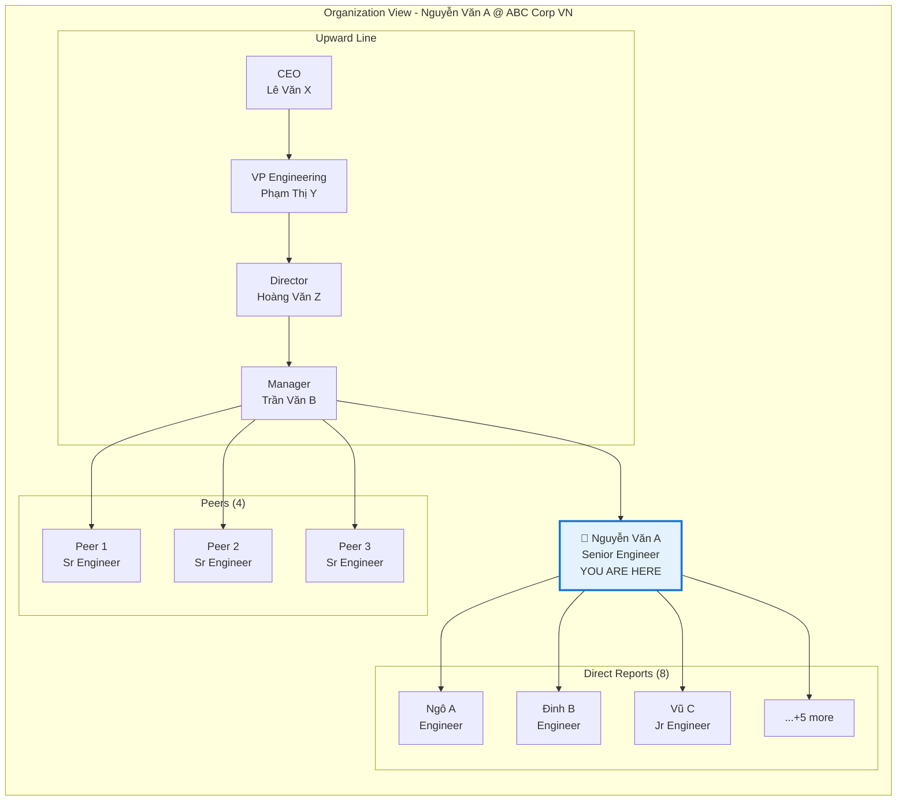

---

## 7. View Modes by WR Type

### 7.1 View Adaptation by Working Relationship Type

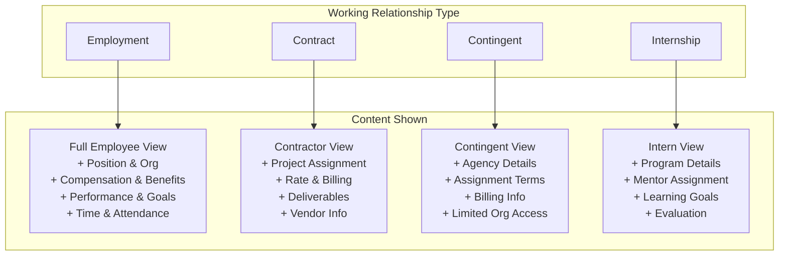

### 7.2 Contractor View Example

```
┌──────────────────────────────────────────────────────────────────────────┐
│  👤 JOHN DOE                                                             │
│  Contractor @ ABC Corporation                                            │
├──────────────────────────────────────────────────────────────────────────┤
│                                                                          │
│  ┌─ WORKER INFO ────────────┐  ┌─ CONTRACT DETAILS ─────────────────┐   │
│  │ Personal details...      │  │ Vendor: XYZ Consulting              │   │
│  │ Skills...                │  │ Type: Independent Contractor        │   │
│  │ Contact...               │  │ Period: Jan 2025 - Jun 2025         │   │
│  └──────────────────────────┘  │ Status: Active ✅                    │   │
│                                └─────────────────────────────────────┘   │
│                                                                          │
│  ┌─ PROJECT ASSIGNMENT ────────────────────────────────────────────┐    │
│  │ Project: Platform Modernization                                  │    │
│  │ Role: Technical Architect                                       │    │
│  │ Project Manager: 👤 Trần B                                       │    │
│  │ Start: Jan 15, 2025                                             │    │
│  └──────────────────────────────────────────────────────────────────┘    │
│                                                                          │
│  ┌─ RATE & BILLING ────────────────────────────────────────────────┐    │
│  │ Daily Rate: $XXX/day                                            │    │
│  │ This Month: 15 days worked = $X,XXX                             │    │
│  │ YTD Billing: $XX,XXX                                            │    │
│  └──────────────────────────────────────────────────────────────────┘    │
│                                                                          │
│  ┌─ DELIVERABLES ──────────────────────────────────────────────────┐    │
│  │ ✅ Architecture Document (Completed)                             │    │
│  │ 🔄 API Design (In Progress - 60%)                                │    │
│  │ ⏳ Implementation Guide (Pending)                                │    │
│  └──────────────────────────────────────────────────────────────────┘    │
│                                                                          │
└──────────────────────────────────────────────────────────────────────────┘
```

### 7.3 Role-Based View Permissions

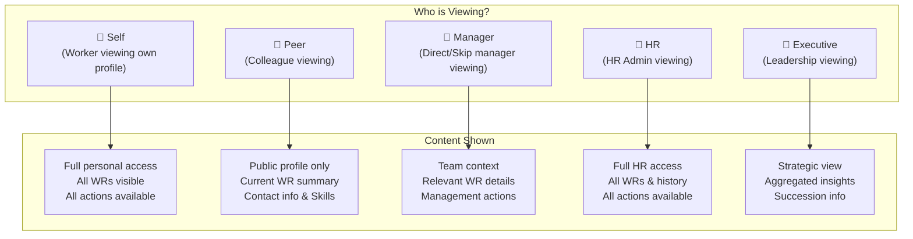

### 7.4 Content Visibility Matrix

| Data Category | Self | Peer | Manager | HR Admin | Executive |
|--------------|------|------|---------|----------|-----------|
| **Worker: Basic Info** | ✅ | ✅ | ✅ | ✅ | ✅ |
| **Worker: Personal Details** | ✅ | ❌ | ⚠️ | ✅ | ❌ |
| **Worker: Documents** | ✅ | ❌ | ❌ | ✅ | ❌ |
| **Worker: Skills** | ✅ | ✅ | ✅ | ✅ | ✅ |
| **WR: Summary** | ✅ | ✅ | ✅ | ✅ | ✅ |
| **WR: Contract Terms** | ✅ | ❌ | ⚠️ | ✅ | ⚠️ |
| **WR: All Relationships** | ✅ | ❌ | ❌ | ✅ | ⚠️ |
| **Employee: Position** | ✅ | ✅ | ✅ | ✅ | ✅ |
| **Employee: Compensation** | ✅ | ❌ | ❌ | ✅ | ⚠️ |
| **Employee: Benefits** | ✅ | ❌ | ❌ | ✅ | ❌ |
| **Employee: Performance** | ✅ | ❌ | ✅ Team | ✅ | ✅ |
| **Contractor: Rate** | ✅ | ❌ | ⚠️ | ✅ | ⚠️ |

Legend: ✅ Full access | ⚠️ Partial/Contextual | ❌ No access

---

## 8. Quick Actions Framework

### 8.1 Actions by Context

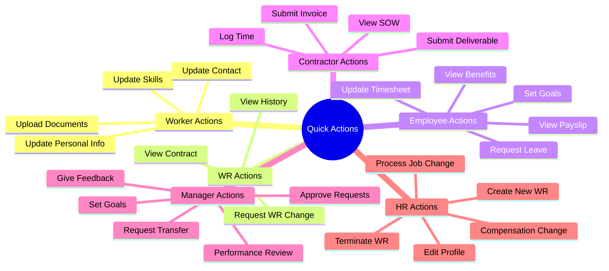

### 8.2 Contextual Action Display

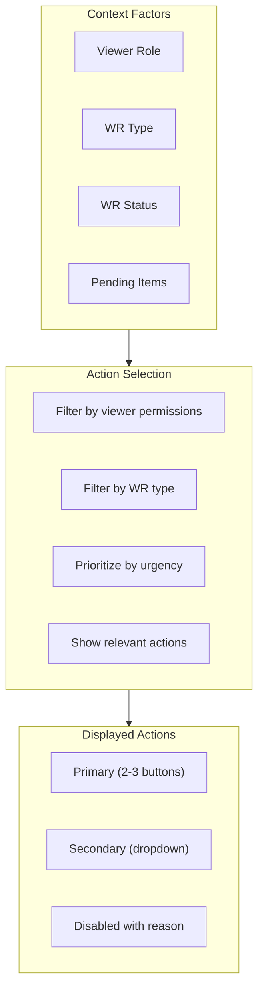

---

## 9. Data Scope Clarity

### 9.1 Visual Indicators for Data Scope

```
┌──────────────────────────────────────────────────────────────────────────┐
│  DATA SCOPE INDICATORS                                                   │
├──────────────────────────────────────────────────────────────────────────┤
│                                                                          │
│  ┌─────────────────────────────────────────────────────────────────┐    │
│  │ 👤 WORKER-LEVEL DATA                                            │    │
│  │ ━━━━━━━━━━━━━━━━━━━━━━━━━━━━━━━━━━━━━━━━━━━━━━━━━━━━━━━━━━━━━━ │    │
│  │ ℹ️ Shared across ALL working relationships                       │    │
│  │                                                                  │    │
│  │ • Personal Information                                          │    │
│  │ • Contact Details                                               │    │
│  │ • Skills & Certifications                                       │    │
│  │ • Education History                                             │    │
│  └─────────────────────────────────────────────────────────────────┘    │
│                                                                          │
│  ┌─────────────────────────────────────────────────────────────────┐    │
│  │ 📋 WR-SPECIFIC DATA                    [ABC Corp Vietnam]       │    │
│  │ ━━━━━━━━━━━━━━━━━━━━━━━━━━━━━━━━━━━━━━━━━━━━━━━━━━━━━━━━━━━━━━ │    │
│  │ ℹ️ Specific to this working relationship only                    │    │
│  │                                                                  │    │
│  │ • Contract Terms                                                │    │
│  │ • Work Email & Systems                                          │    │
│  │ • Position & Organization                                       │    │
│  │ • Compensation & Benefits                                       │    │
│  │ • Time & Attendance                                             │    │
│  │ • Performance & Goals                                           │    │
│  └─────────────────────────────────────────────────────────────────┘    │
│                                                                          │
└──────────────────────────────────────────────────────────────────────────┘
```

### 9.2 Cross-WR Data Aggregation

```
┌──────────────────────────────────────────────────────────────────────────┐
│  📊 AGGREGATED VIEW (All Working Relationships)                          │
├──────────────────────────────────────────────────────────────────────────┤
│                                                                          │
│  Total Tenure with Organization: 5 years                                 │
│  ─────────────────────────────────────────────────────────────────────  │
│                                                                          │
│  ┌─────────────────────────────────────────────────────────────────┐    │
│  │ RELATIONSHIP         │ LE              │ TYPE       │ TENURE    │    │
│  │─────────────────────────────────────────────────────────────────│    │
│  │ Employment (Active)  │ ABC Corp VN     │ Full-time  │ 5yr 0mo   │    │
│  │ Employment (Active)  │ ABC Corp SG     │ Secondment │ 0yr 6mo   │    │
│  │ Contract (Completed) │ XYZ Consulting  │ Consultant │ 0yr 4mo   │    │
│  └─────────────────────────────────────────────────────────────────┘    │
│                                                                          │
│  Combined Statistics:                                                    │
│  • Total Active WRs: 2                                                  │
│  • Historical WRs: 1                                                    │
│  • Total Compensation (visible to HR): Combined view available          │
│                                                                          │
└──────────────────────────────────────────────────────────────────────────┘
```

---

## 10. Mobile Experience

### 10.1 Mobile Layout with WR Switcher

```
┌─────────────────────────┐
│ ← Worker 360       ⋮    │
├─────────────────────────┤
│  ┌─────────────────┐    │
│  │    📷          │    │
│  │ Nguyễn Văn A   │    │
│  │ Worker: W-001  │    │
│  │ ✅ Active       │    │
│  └─────────────────┘    │
│                         │
│  📧 Email  📱 Call      │
│  📅 Meet   💬 Message   │
│                         │
├─────────────────────────┤
│ ┌─────────────────────┐ │
│ │ 📋 ABC Corp VN   ▼  │ │
│ │ Employee • 5yr      │ │
│ └─────────────────────┘ │
├─────────────────────────┤
│ ┌─────────────────────┐ │
│ │Worker│ WR │Assignment│ │
│ └─────────────────────┘ │
├─────────────────────────┤
│                         │
│  ┌───────────────────┐  │
│  │ 📋 Current WR     │  │
│  │ Sr Engineer       │  │
│  │ Engineering Dept  │  │
│  └───────────────────┘  │
│           ↕            │
│  ┌───────────────────┐  │
│  │ 🏢 Organization   │  │
│  │ Manager: Trần B   │  │
│  │ Reports: 8        │  │
│  └───────────────────┘  │
│                         │
├─────────────────────────┤
│  ┌───────────────────┐  │
│  │    [⚡ Actions]    │  │
│  └───────────────────┘  │
└─────────────────────────┘
```

### 10.2 Mobile-Specific Features

| Feature | Mobile Adaptation |
|---------|-------------------|
| **Header** | Compact với WR switcher dropdown |
| **WR Navigation** | Swipe hoặc dropdown to switch |
| **Cards** | Swipeable carousel cho summaries |
| **Actions** | Floating action button (FAB) |
| **Navigation** | Bottom tabs: Worker / WR / Assignment |
| **Details** | Full-screen modal khi expand |

---

## 11. Feature Rollout Plan

### 11.1 Phase Overview

```mermaid
gantt
    title Worker 360 Feature Rollout
    dateFormat YYYY-Q
    
    section Phase 1 - Foundation
    Worker Profile Header        :p1a, 2025-Q1, 1q
    Basic Worker Info Sections   :p1b, 2025-Q1, 1q
    Single WR Support            :p1c, 2025-Q1, 1q
    Employee Assignment View     :p1d, 2025-Q1, 1q
    
    section Phase 2 - Multi-WR
    WR Switcher                  :p2a, 2025-Q2, 1q
    Multi-WR Support             :p2b, 2025-Q2, 1q
    WR Timeline                  :p2c, 2025-Q2, 1q
    Contractor View              :p2d, 2025-Q2, 1q
    
    section Phase 3 - Advanced
    Organization View            :p3a, 2025-Q3, 1q
    Data Visualizations          :p3b, 2025-Q3, 1q
    Quick Actions Framework      :p3c, 2025-Q3, 1q
    Role-based Views             :p3d, 2025-Q3, 1q
    
    section Phase 4 - Enhancement
    Mobile Optimization          :p4a, 2025-Q4, 1q
    AI Insights                  :p4b, 2025-Q4, 1q
    Cross-WR Analytics           :p4c, 2025-Q4, 1q
```

### 11.2 Phase Details

#### Phase 1: Foundation (Q1 2025)

| Feature | Description | Priority |
|---------|-------------|----------|
| Worker Profile Header | Photo, name, status, contact | P0 |
| Worker Info Section | Personal, contact, emergency | P0 |
| Single WR Display | Basic WR information | P0 |
| Employee View | Position, org, manager | P0 |
| Basic Navigation | Sections, back nav | P0 |

#### Phase 2: Multi-WR Support (Q2 2025)

| Feature | Description | Priority |
|---------|-------------|----------|
| WR Switcher | Navigate between WRs | P1 |
| Multi-WR Timeline | Visual WR history | P1 |
| Contractor View | Contractor-specific content | P1 |
| Contingent View | Contingent worker content | P1 |
| Data Scope Indicators | Clear scope labeling | P1 |

#### Phase 3: Advanced Features (Q3 2025)

| Feature | Description | Priority |
|---------|-------------|----------|
| Organization Chart | Interactive org view | P2 |
| Skills Visualization | Radar/graph for skills | P2 |
| Quick Actions | Context-sensitive actions | P2 |
| Role Permissions | View adaptation by role | P2 |
| Performance Charts | Trend visualizations | P2 |

#### Phase 4: Enhancement (Q4 2025)

| Feature | Description | Priority |
|---------|-------------|----------|
| Mobile Optimization | Responsive, native-feel | P2 |
| AI Insights | Smart suggestions | P3 |
| Cross-WR Analytics | Aggregated views | P3 |
| Customizable Layout | User preferences | P3 |

---

## 12. Success Metrics

### 12.1 Key Performance Indicators

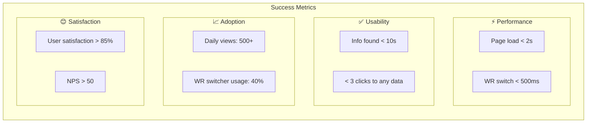

---

## 13. Open Questions

### 13.1 Key Decisions Needed

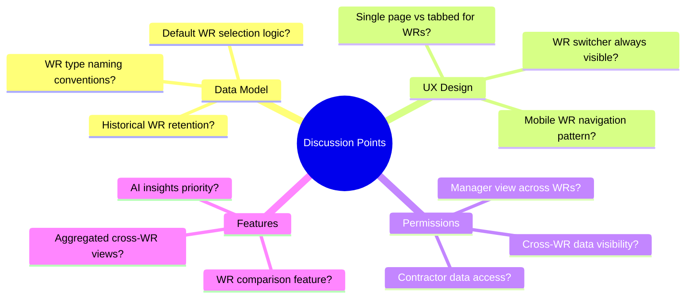

### 13.2 Questions for Discussion

1. **WR Selection**: Khi Worker có multiple active WRs, default hiển thị WR nào?

2. **Cross-WR View**: Có cần view aggregated data across all WRs không?

3. **Contractor Visibility**: Manager có thể view contractor details ở mức nào?

4. **Historical WRs**: Completed WRs hiển thị bao lâu? Có archive không?

5. **WR Transitions**: Khi Worker chuyển từ Contractor → Employee, flow như thế nào?

6. **Mobile Priority**: WR switcher trên mobile nên là dropdown hay tab?

---

## 14. Appendix

### A. Glossary

| Term | Definition |
|------|------------|
| **Worker** | Người lao động thực sự (Person), identity duy nhất trong hệ thống |
| **Working Relationship (WR)** | Entity kết nối Worker với Legal Entity, định nghĩa engagement type |
| **Employee** | Assignment record được tạo từ WR type Employment |
| **Contractor** | Assignment record được tạo từ WR type Contract |
| **Contingent Worker** | Assignment record được tạo từ WR type Contingent |
| **Legal Entity (LE)** | Pháp nhân tuyển dụng/engage worker |
| **Assignment** | Role-specific record (Employee, Contractor, etc.) |
| **Worker 360** | Comprehensive view of all worker-related data |

### B. Data Model Summary

```
Worker (1) ──────┬──────> Working Relationship (N) ──────> Legal Entity (1)
                 │                    │
                 │                    ├──> Employee (0..1)
                 │                    ├──> Contractor (0..1)
                 │                    └──> Contingent Worker (0..1)
                 │
                 └──> Skills, Documents, Education (shared)
```

---

*Document Status: Draft for Review*  
*Version: 1.1 - Updated Data Model (Worker → Working Relationship → Assignment)*  
*Next Review: [TBD with Product & UX Team]*