# xTalent HCM - Global Search Solution Document

## Executive Summary

Tài liệu này trình bày nghiên cứu toàn diện về tính năng Global Search cho giải pháp xTalent HCM. Dựa trên phân tích các giải pháp HCM hàng đầu (Oracle HCM Cloud, SAP SuccessFactors, Workday) kết hợp với các công nghệ search hiện đại và thư viện open-source, tài liệu đề xuất kiến trúc và lộ trình triển khai phù hợp.

**Phạm vi tìm kiếm:**
- **Employee Search**: Tìm kiếm nhân viên với các attribute trong data graph
- **Command/Menu Search**: Quick action để navigate nhanh đến các tính năng

---

## 1. Phân Tích Các Giải Pháp HCM Hàng Đầu

### 1.1 Oracle HCM Cloud

Oracle triển khai **Oracle Search-based Global Search** với các tính năng:

| Tính năng | Mô tả |
|-----------|-------|
| Fuzzy Person Name Search | Cho phép sai lệch đến 2 ký tự |
| Name Synonyms | Bill → William, Rob → Robert |
| Fields Boosting | Ưu tiên person name matches |
| Direct Reports Priority | Nhân viên trực tiếp hiển thị trước |
| Attachment Search | Tìm kiếm trong file đính kèm |
| Configurable Suggestions | Custom suggestion groups, synonyms |

### 1.2 SAP SuccessFactors

SAP cung cấp ba loại search tích hợp trong Global Header:

| Loại Search | Chức năng | Ví dụ |
|-------------|-----------|-------|
| People Search | Fuzzy matching, accented characters | "nguyen" → "Nguyễn Văn A" |
| Action Search | Natural language navigation | "add employee", "view performance" |
| Directory Search | Search by tags/fields với RBP | Filter by department, location |

**Điểm mạnh**: Action Search cho phép admin thêm custom paraphrases, hỗ trợ nhiều cách diễn đạt cho cùng một action.

### 1.3 Workday

Workday sử dụng mô hình **Search Prefix** rất hiệu quả:

```
bp:           → Business Process definitions
supplier:     → Suppliers
worker:       → Workers/Employees
?             → Hiển thị tất cả prefix khả dụng
```

**Workday Assistant** tích hợp AI/NLP cho natural language queries:
- "my team's hire date"
- "my location"
- "employees in my department"

### 1.4 So Sánh Tổng Quan

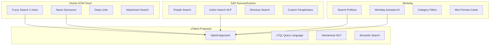

---

## 2. Design Patterns & Technical Approaches

### 2.1 Command Palette Pattern

Pattern được sử dụng rộng rãi trong VS Code, Figma, Slack, Linear:

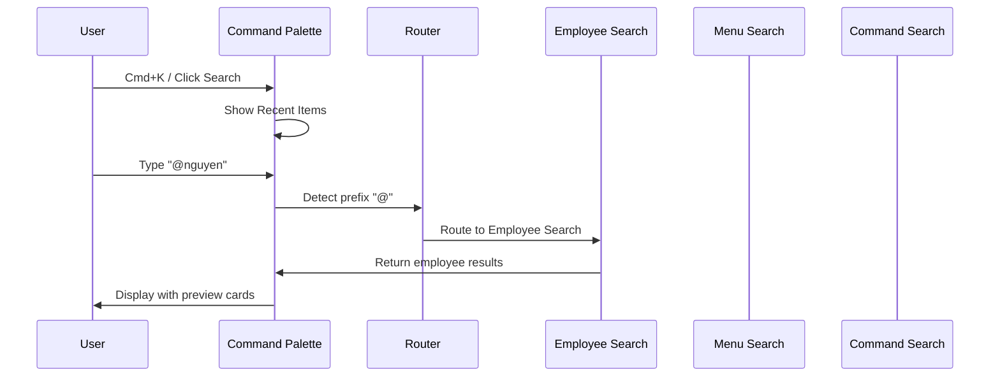

**Các prefix phổ biến:**

| Prefix | Scope | Ví dụ |
|--------|-------|-------|
| `@` | People/Employee | `@nguyen van` |
| `/` | Menu/Navigation | `/payroll` |
| `>` | Commands/Actions | `>create employee` |
| `#` | Tags/Departments | `#engineering` |
| `?` | Help/Prefix List | `?` |
| (none) | Universal Smart Search | `leave request` |

### 2.2 JQL-inspired Query Language (xTQL)

Lấy cảm hứng từ Jira Query Language:

```sql
-- Basic syntax: field operator value
department = "Engineering" AND status = "Active"

-- Operators
=, !=, >, <, >=, <=
IN, NOT IN
~  (contains)
!~ (not contains)
IS EMPTY, IS NOT EMPTY

-- Keywords
AND, OR, NOT
ORDER BY field ASC|DESC

-- Functions (HCM-specific)
reportsTo("EMP001")
inTeam("Product")
hasSkill("Python")
hiredAfter("2024-01-01")
tenureGreaterThan("2y")
currentUser()
```

### 2.3 Search Architecture Overview

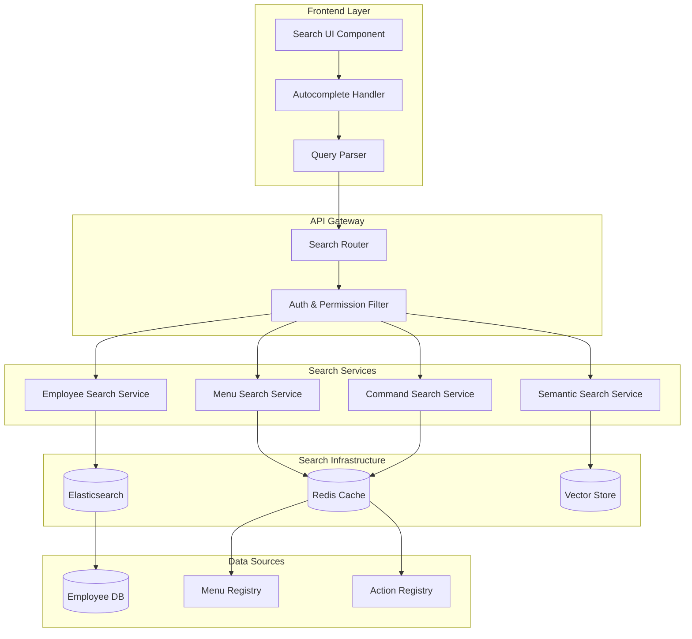

---

## 3. Open-Source Libraries & Solutions

### 3.1 Search Engines

#### **Elasticsearch / OpenSearch**
```yaml
Pros:
  - Industry standard, mature ecosystem
  - Completion Suggester cho autocomplete
  - Fuzzy search với Levenshtein distance
  - Vietnamese analyzer plugin available
  - Excellent scaling capabilities
  
Cons:
  - Resource intensive (memory, CPU)
  - Operational complexity
  - Learning curve for optimization

Use case: Primary search engine cho employee search
```

**Vietnamese Analyzer Setup:**
```json
{
  "settings": {
    "analysis": {
      "analyzer": {
        "vietnamese_analyzer": {
          "tokenizer": "icu_tokenizer",
          "filter": ["icu_folding", "lowercase"]
        }
      }
    }
  }
}
```

#### **MeiliSearch**
```yaml
Pros:
  - Typo-tolerant by default
  - Instant search (<50ms)
  - Simple setup và API
  - Built-in frontend SDK
  - Smaller resource footprint
  
Cons:
  - Less mature than Elasticsearch
  - Limited advanced features
  - Single-node only (no clustering)

Use case: Alternative cho small-medium deployments
```

#### **Typesense**
```yaml
Pros:
  - Blazing fast (<10ms typical)
  - Typo tolerance built-in
  - Simple API
  - Good Vietnamese support via ICU
  
Cons:
  - Newer, smaller community
  - Limited ecosystem
  
Use case: High-performance autocomplete
```

### 3.2 Query Parsing Libraries

#### **ANTLR4**
```yaml
Language: Java, JavaScript, Python, C#, Go
Pros:
  - Industry standard parser generator
  - Strong grammar definition
  - Excellent error handling
  
Use case: Build xTQL parser với full grammar support
```

**Example xTQL Grammar (ANTLR):**
```antlr
grammar xTQL;

query: expression (orderBy)? (limit)?;

expression
    : expression AND expression
    | expression OR expression
    | NOT expression
    | '(' expression ')'
    | comparison
    | function
    ;

comparison
    : field operator value
    | field IN '(' valueList ')'
    | field IS EMPTY
    ;

function
    : FUNC_NAME '(' (value (',' value)*)? ')'
    ;

field: IDENTIFIER;
operator: '=' | '!=' | '>' | '<' | '>=' | '<=' | '~' | '!~';
value: STRING | NUMBER | DATE;

FUNC_NAME: 'reportsTo' | 'inTeam' | 'hasSkill' | 'currentUser';
```

#### **PEG.js / Peggy**
```yaml
Language: JavaScript
Pros:
  - Simple grammar syntax
  - Direct JavaScript integration
  - Good for DSL creation
  
Use case: Lightweight xTQL parser cho frontend
```

#### **Chevrotain**
```yaml
Language: JavaScript/TypeScript
Pros:
  - No code generation needed
  - TypeScript native
  - Fast parsing
  - Good error recovery
  
Use case: xTQL parser với excellent developer experience
```

### 3.3 NLP & Semantic Search

#### **Sentence-Transformers**
```yaml
Language: Python
Models:
  - all-MiniLM-L6-v2 (fast, good quality)
  - paraphrase-multilingual-MiniLM-L12-v2 (multilingual)
  
Use case: Generate embeddings cho semantic search
```

#### **PhoBERT (Vietnamese)**
```yaml
Language: Python
Pros:
  - State-of-the-art Vietnamese NLP
  - Pre-trained on large Vietnamese corpus
  - Good for intent classification
  
Use case: Vietnamese query understanding
```

```python
from transformers import AutoTokenizer, AutoModel

tokenizer = AutoTokenizer.from_pretrained("vinai/phobert-base")
model = AutoModel.from_pretrained("vinai/phobert-base")
```

#### **VnCoreNLP**
```yaml
Language: Java (with Python wrapper)
Features:
  - Word segmentation
  - POS tagging
  - Named entity recognition
  
Use case: Vietnamese text preprocessing
```

### 3.4 Vector Databases

#### **Milvus**
```yaml
Pros:
  - Purpose-built for vector similarity
  - Excellent performance at scale
  - Cloud-native architecture
  
Cons:
  - Additional infrastructure
  - Learning curve
```

#### **Qdrant**
```yaml
Pros:
  - Rust-based, very fast
  - Simple API
  - Good filtering capabilities
  
Use case: Semantic search với metadata filtering
```

#### **pgvector**
```yaml
Pros:
  - PostgreSQL extension
  - No additional infrastructure
  - SQL-based queries
  
Use case: Start with vectors trong existing PostgreSQL
```

### 3.5 Frontend Libraries

#### **Algolia InstantSearch**
```yaml
Pros:
  - Excellent UI components
  - Framework agnostic
  - Great UX patterns
  
Use case: Reference cho UI patterns (có thể adapt)
```

#### **cmdk (Command Menu)**
```yaml
Language: React
Pros:
  - VS Code-like command palette
  - Keyboard-first design
  - Highly customizable
  
Repository: github.com/pacocoursey/cmdk
Use case: Command palette UI component
```

#### **kbar**
```yaml
Language: React
Pros:
  - Command palette with nested actions
  - Keyboard shortcuts
  - Search across actions
  
Repository: github.com/timc1/kbar
Use case: Alternative command palette
```

### 3.6 Autocomplete Libraries

#### **Downshift**
```yaml
Language: React
Pros:
  - Accessible
  - Highly customizable
  - No styling imposed
  
Use case: Custom autocomplete dropdown
```

#### **React-Select**
```yaml
Language: React
Pros:
  - Async loading support
  - Multi-select
  - Good keyboard navigation
```

---

## 4. Proposed Architecture for xTalent

### 4.1 High-Level Architecture

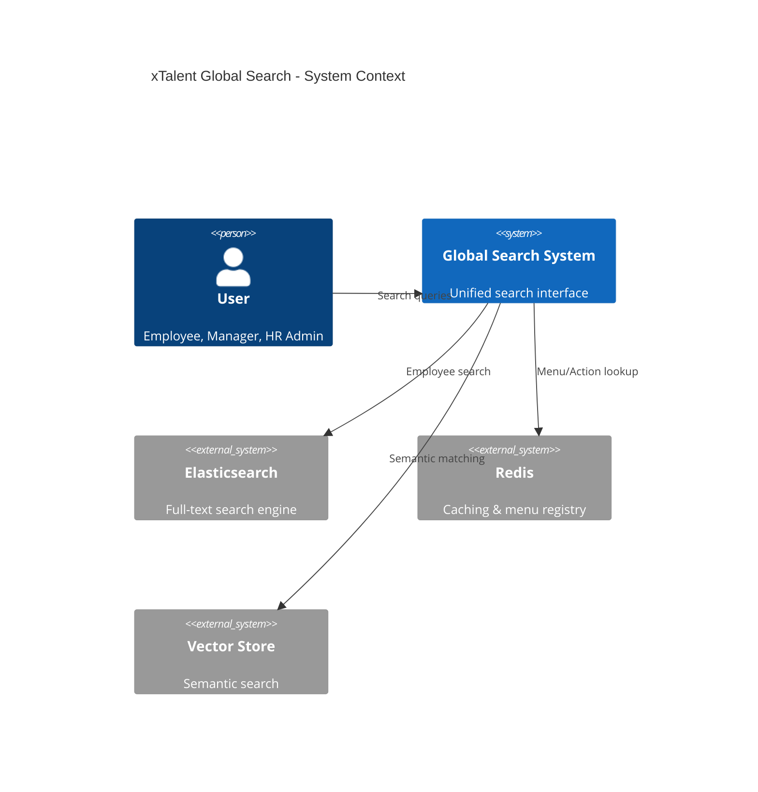

### 4.2 Component Architecture

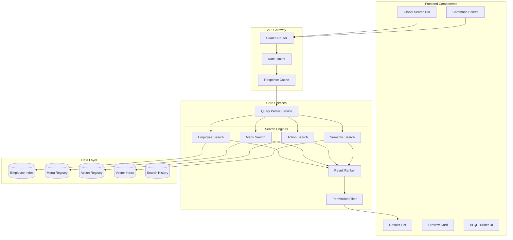

### 4.3 Search Flow

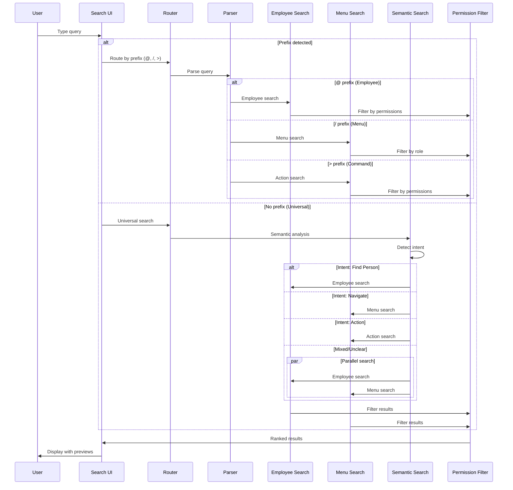

### 4.4 Data Model

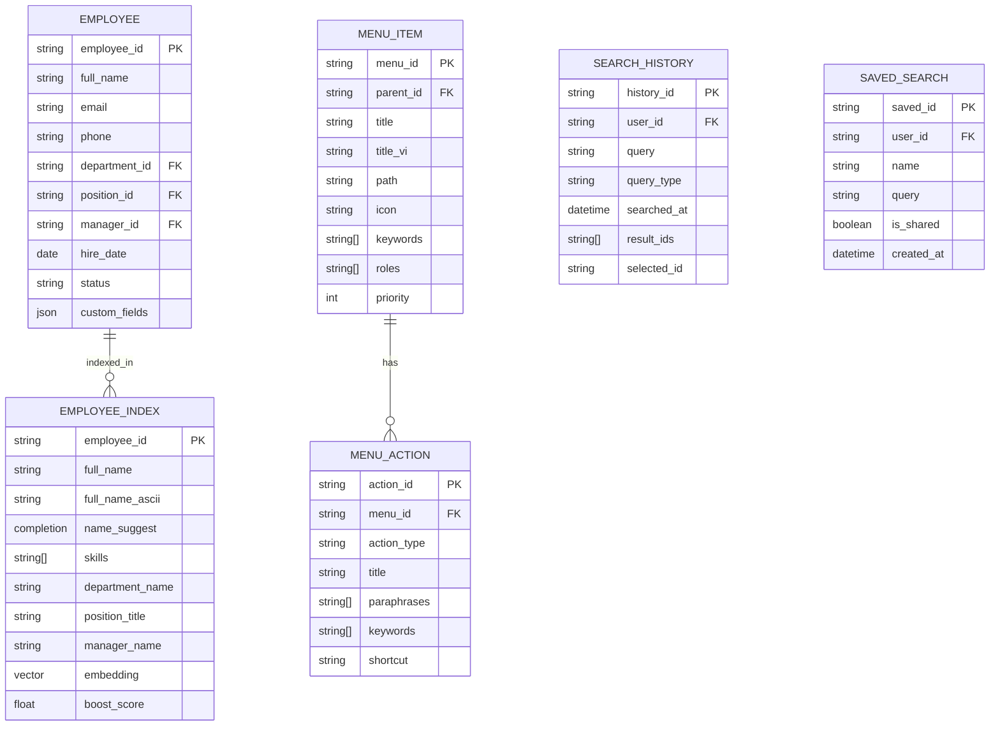

---

## 5. Unified Search Interface Design

### 5.1 Prefix Routing System

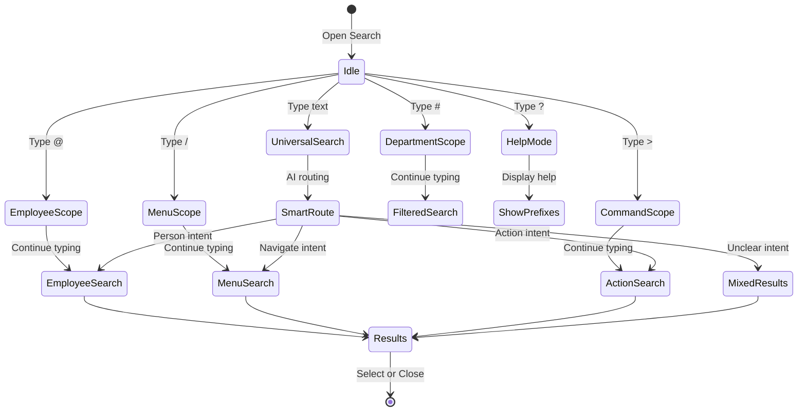

### 5.2 Search Input States

| State | Trigger | Behavior |
|-------|---------|----------|
| **Idle** | Focus on search | Show recent items, suggested actions |
| **Typing** | Any character | Real-time suggestions (<100ms) |
| **Employee Scope** | `@` prefix | Filter to employee search only |
| **Menu Scope** | `/` prefix | Filter to menu/navigation only |
| **Command Scope** | `>` prefix | Filter to actions/commands only |
| **Advanced Mode** | Complex query detected | Switch to xTQL mode với syntax highlighting |
| **Help Mode** | `?` character | Show available prefixes và shortcuts |

### 5.3 Keyboard Shortcuts

| Shortcut | Action |
|----------|--------|
| `Cmd/Ctrl + K` | Open Global Search |
| `Cmd/Ctrl + Shift + K` | Open in Advanced Mode (xTQL) |
| `↑ / ↓` | Navigate results |
| `Enter` | Select result |
| `Tab` | Autocomplete suggestion |
| `Esc` | Close search |
| `Cmd/Ctrl + Enter` | Open in new tab |

---

## 6. xTQL - xTalent Query Language

### 6.1 Grammar Specification

```
query           ::= expression (order_clause)? (limit_clause)?

expression      ::= and_expression

and_expression  ::= or_expression (AND or_expression)*

or_expression   ::= unary_expression (OR unary_expression)*

unary_expression ::= NOT? primary_expression

primary_expression ::= comparison
                     | function_call
                     | '(' expression ')'

comparison      ::= field operator value
                  | field IN '(' value_list ')'
                  | field NOT IN '(' value_list ')'
                  | field IS EMPTY
                  | field IS NOT EMPTY
                  | field BETWEEN value AND value

function_call   ::= function_name '(' argument_list? ')'

field           ::= IDENTIFIER ('.' IDENTIFIER)*

operator        ::= '=' | '!=' | '>' | '<' | '>=' | '<=' | '~' | '!~'

value           ::= STRING | NUMBER | DATE | BOOLEAN | function_call

value_list      ::= value (',' value)*

order_clause    ::= ORDER BY field (ASC | DESC)?

limit_clause    ::= LIMIT NUMBER (OFFSET NUMBER)?

-- HCM-specific functions
function_name   ::= 'reportsTo' | 'inTeam' | 'hasSkill' | 'hiredAfter'
                  | 'hiredBefore' | 'tenureGreaterThan' | 'tenureLessThan'
                  | 'currentUser' | 'myTeam' | 'myDepartment'
                  | 'now' | 'today' | 'startOfMonth' | 'endOfMonth'
                  | 'startOfYear' | 'endOfYear'
```

### 6.2 Query Examples

```sql
-- Basic queries
status = "Active"
department = "Engineering" AND status = "Active"
position ~ "Developer"

-- Date queries
hire_date > "2024-01-01"
hire_date BETWEEN "2024-01-01" AND "2024-12-31"
hire_date > startOfYear()

-- Function queries
reportsTo("EMP001")
inTeam("Product")
hasSkill("Python") AND hasSkill("React")
reportsTo(currentUser())

-- Complex queries
(department = "Engineering" OR department = "Product") 
  AND status = "Active" 
  AND tenureGreaterThan("1y")
  ORDER BY hire_date DESC
  LIMIT 20

-- My team queries
myTeam() AND hasSkill("Leadership")
myDepartment() AND status = "On Leave"
```

### 6.3 Parser Implementation (Chevrotain)

```typescript
import { createToken, Lexer, CstParser } from 'chevrotain';

// Tokens
const Identifier = createToken({ name: "Identifier", pattern: /[a-zA-Z_][a-zA-Z0-9_]*/ });
const StringLiteral = createToken({ name: "StringLiteral", pattern: /"[^"]*"/ });
const NumberLiteral = createToken({ name: "NumberLiteral", pattern: /\d+(\.\d+)?/ });
const DateLiteral = createToken({ name: "DateLiteral", pattern: /\d{4}-\d{2}-\d{2}/ });

const And = createToken({ name: "And", pattern: /AND/i });
const Or = createToken({ name: "Or", pattern: /OR/i });
const Not = createToken({ name: "Not", pattern: /NOT/i });
const In = createToken({ name: "In", pattern: /IN/i });
const Is = createToken({ name: "Is", pattern: /IS/i });
const Empty = createToken({ name: "Empty", pattern: /EMPTY/i });
const Between = createToken({ name: "Between", pattern: /BETWEEN/i });
const OrderBy = createToken({ name: "OrderBy", pattern: /ORDER\s+BY/i });
const Limit = createToken({ name: "Limit", pattern: /LIMIT/i });
const Offset = createToken({ name: "Offset", pattern: /OFFSET/i });
const Asc = createToken({ name: "Asc", pattern: /ASC/i });
const Desc = createToken({ name: "Desc", pattern: /DESC/i });

// Operators
const Equals = createToken({ name: "Equals", pattern: /=/ });
const NotEquals = createToken({ name: "NotEquals", pattern: /!=/ });
const GreaterThan = createToken({ name: "GreaterThan", pattern: />/ });
const LessThan = createToken({ name: "LessThan", pattern: /</ });
const Contains = createToken({ name: "Contains", pattern: /~/ });

// Functions
const FunctionName = createToken({ 
  name: "FunctionName", 
  pattern: /reportsTo|inTeam|hasSkill|currentUser|myTeam|now|today/i 
});

const allTokens = [
  // Keywords first
  And, Or, Not, In, Is, Empty, Between, OrderBy, Limit, Offset, Asc, Desc,
  FunctionName,
  // Then operators
  NotEquals, Equals, GreaterThan, LessThan, Contains,
  // Literals
  DateLiteral, StringLiteral, NumberLiteral,
  // Identifier last
  Identifier,
  // Whitespace
  createToken({ name: "WhiteSpace", pattern: /\s+/, group: Lexer.SKIPPED })
];

const xTQLLexer = new Lexer(allTokens);

class xTQLParser extends CstParser {
  constructor() {
    super(allTokens);
    this.performSelfAnalysis();
  }
  
  query = this.RULE("query", () => {
    this.SUBRULE(this.expression);
    this.OPTION(() => this.SUBRULE(this.orderClause));
    this.OPTION2(() => this.SUBRULE(this.limitClause));
  });
  
  expression = this.RULE("expression", () => {
    this.SUBRULE(this.andExpression);
  });
  
  andExpression = this.RULE("andExpression", () => {
    this.SUBRULE(this.orExpression);
    this.MANY(() => {
      this.CONSUME(And);
      this.SUBRULE2(this.orExpression);
    });
  });
  
  // ... more rules
}
```

---

## 7. Implementation Recommendations

### 7.1 Recommended Technology Stack

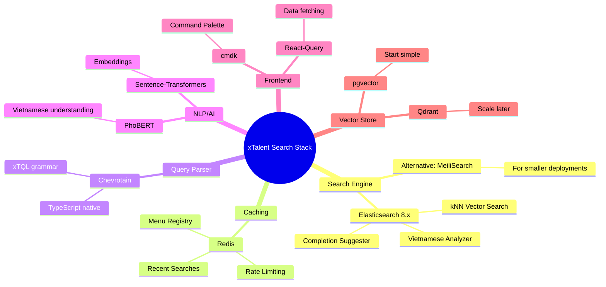

### 7.2 Phase-by-Phase Implementation

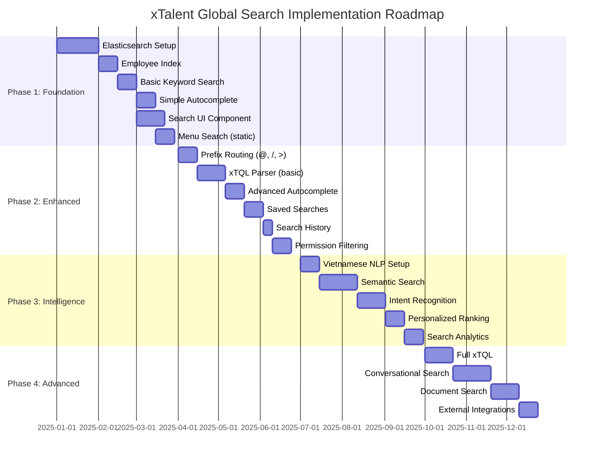

### 7.3 Phase 1: Foundation (2-3 months)

**Goals**: Basic search infrastructure và MVP

**Deliverables**:

1. **Elasticsearch Cluster Setup**
```yaml
# docker-compose.yml
services:
  elasticsearch:
    image: elasticsearch:8.11.0
    environment:
      - discovery.type=single-node
      - xpack.security.enabled=false
    volumes:
      - ./elasticsearch-data:/usr/share/elasticsearch/data
    ports:
      - "9200:9200"
```

2. **Employee Index với Vietnamese Support**
```json
{
  "settings": {
    "analysis": {
      "analyzer": {
        "vietnamese": {
          "tokenizer": "icu_tokenizer",
          "filter": ["icu_folding", "lowercase"]
        },
        "autocomplete": {
          "tokenizer": "autocomplete_tokenizer",
          "filter": ["lowercase"]
        }
      },
      "tokenizer": {
        "autocomplete_tokenizer": {
          "type": "edge_ngram",
          "min_gram": 2,
          "max_gram": 20,
          "token_chars": ["letter", "digit"]
        }
      }
    }
  },
  "mappings": {
    "properties": {
      "employee_id": { "type": "keyword" },
      "full_name": {
        "type": "text",
        "analyzer": "vietnamese",
        "fields": {
          "autocomplete": {
            "type": "text",
            "analyzer": "autocomplete"
          }
        }
      },
      "full_name_suggest": {
        "type": "completion",
        "analyzer": "simple"
      },
      "email": { "type": "keyword" },
      "department": { "type": "keyword" },
      "position": { "type": "text" },
      "status": { "type": "keyword" },
      "hire_date": { "type": "date" }
    }
  }
}
```

3. **Basic Search API**
```typescript
// search.service.ts
interface SearchRequest {
  query: string;
  type?: 'employee' | 'menu' | 'all';
  limit?: number;
  offset?: number;
}

interface SearchResponse {
  results: SearchResult[];
  total: number;
  took: number;
}

async function search(request: SearchRequest): Promise<SearchResponse> {
  const { query, type = 'all', limit = 10 } = request;
  
  // Detect prefix
  if (query.startsWith('@')) {
    return searchEmployees(query.slice(1), limit);
  }
  if (query.startsWith('/')) {
    return searchMenus(query.slice(1), limit);
  }
  
  // Universal search
  return searchAll(query, limit);
}

async function searchEmployees(query: string, limit: number) {
  const response = await elasticsearch.search({
    index: 'employees',
    body: {
      query: {
        bool: {
          should: [
            { match: { 'full_name': { query, fuzziness: 'AUTO' } } },
            { match: { 'full_name.autocomplete': query } },
            { match: { email: query } },
            { match: { employee_id: query } }
          ]
        }
      },
      size: limit
    }
  });
  
  return transformResults(response);
}
```

4. **Search UI Component (React + cmdk)**
```tsx
import { Command } from 'cmdk';
import { useSearch } from '@/hooks/useSearch';

export function GlobalSearch() {
  const [query, setQuery] = useState('');
  const { results, isLoading } = useSearch(query);
  
  return (
    <Command.Dialog open={open} onOpenChange={setOpen}>
      <Command.Input 
        value={query}
        onValueChange={setQuery}
        placeholder="Search employees, menus... (@ for people, / for menus)"
      />
      
      <Command.List>
        {isLoading && <Command.Loading>Searching...</Command.Loading>}
        
        {results.employees?.length > 0 && (
          <Command.Group heading="People">
            {results.employees.map(emp => (
              <Command.Item key={emp.id} onSelect={() => navigate(`/employee/${emp.id}`)}>
                <Avatar src={emp.avatar} />
                <div>
                  <div>{emp.full_name}</div>
                  <div className="text-muted">{emp.position} • {emp.department}</div>
                </div>
              </Command.Item>
            ))}
          </Command.Group>
        )}
        
        {results.menus?.length > 0 && (
          <Command.Group heading="Navigation">
            {results.menus.map(menu => (
              <Command.Item key={menu.id} onSelect={() => navigate(menu.path)}>
                <Icon name={menu.icon} />
                <span>{menu.title}</span>
                {menu.shortcut && <kbd>{menu.shortcut}</kbd>}
              </Command.Item>
            ))}
          </Command.Group>
        )}
      </Command.List>
    </Command.Dialog>
  );
}
```

### 7.4 Phase 2: Enhanced Search (2-3 months)

**Goals**: xTQL parser, advanced features

**Key Implementations**:

1. **xTQL Parser Service**
2. **Context-aware Autocomplete**
3. **Saved & Recent Searches**
4. **Role-based Permission Filtering**

### 7.5 Phase 3: Intelligence Layer (3-4 months)

**Goals**: AI/NLP capabilities

**Key Implementations**:

1. **Vietnamese NLP Pipeline**
```python
# vietnamese_nlp.py
from transformers import AutoTokenizer, AutoModel
import torch

class VietnameseNLP:
    def __init__(self):
        self.tokenizer = AutoTokenizer.from_pretrained("vinai/phobert-base")
        self.model = AutoModel.from_pretrained("vinai/phobert-base")
    
    def get_embedding(self, text: str) -> torch.Tensor:
        inputs = self.tokenizer(text, return_tensors="pt", padding=True, truncation=True)
        with torch.no_grad():
            outputs = self.model(**inputs)
        return outputs.last_hidden_state.mean(dim=1)
    
    def detect_intent(self, query: str) -> str:
        # Intent classification
        intents = ["find_person", "navigate", "action", "report", "unknown"]
        # Use fine-tuned classifier
        return self.classifier.predict(query)
```

2. **Semantic Search với Vector Store**
```python
# semantic_search.py
from qdrant_client import QdrantClient
from qdrant_client.models import Distance, VectorParams

class SemanticSearch:
    def __init__(self):
        self.client = QdrantClient(host="localhost", port=6333)
        self.nlp = VietnameseNLP()
    
    def search(self, query: str, limit: int = 10):
        query_vector = self.nlp.get_embedding(query).numpy()[0]
        
        results = self.client.search(
            collection_name="employees",
            query_vector=query_vector,
            limit=limit
        )
        
        return results
```

### 7.6 Phase 4: Advanced Features (Ongoing)

**Goals**: Enterprise-grade features

- Full xTQL với all operators
- Conversational AI assistant
- Document/attachment search
- Cross-system search integration

---

## 8. Vietnamese Language Considerations

### 8.1 Challenges

| Challenge | Solution |
|-----------|----------|
| Diacritics variations | ICU folding: "nguyen" matches "Nguyễn" |
| Word segmentation | VnCoreNLP hoặc PhoBERT tokenizer |
| Name formats | Index multiple formats: "Nguyễn Văn A", "A Nguyen", "Van A Nguyen" |
| Mixed language | Dual analyzer: Vietnamese + English |
| Tone marks | Normalize để match cả có và không dấu |

### 8.2 Vietnamese Analyzer Configuration

```json
{
  "settings": {
    "analysis": {
      "char_filter": {
        "vietnamese_char_filter": {
          "type": "mapping",
          "mappings": [
            "đ => d", "Đ => D"
          ]
        }
      },
      "filter": {
        "vietnamese_stop": {
          "type": "stop",
          "stopwords": ["và", "của", "là", "có", "được", "trong", "cho", "với"]
        },
        "ascii_folding": {
          "type": "asciifolding",
          "preserve_original": true
        }
      },
      "analyzer": {
        "vietnamese_analyzer": {
          "type": "custom",
          "char_filter": ["vietnamese_char_filter"],
          "tokenizer": "icu_tokenizer",
          "filter": ["icu_folding", "lowercase", "vietnamese_stop"]
        },
        "vietnamese_search": {
          "type": "custom",
          "tokenizer": "icu_tokenizer",
          "filter": ["icu_folding", "lowercase"]
        }
      }
    }
  }
}
```

### 8.3 Name Normalization

```typescript
function normalizeVietnameseName(name: string): string[] {
  const original = name.trim();
  const ascii = removeVietnameseDiacritics(original);
  const parts = original.split(' ');
  
  // Generate variations
  const variations = [
    original,                                    // Nguyễn Văn A
    ascii,                                       // Nguyen Van A
    parts.reverse().join(' '),                   // A Văn Nguyễn
    `${parts[parts.length-1]} ${parts[0]}`,      // A Nguyễn
  ];
  
  return [...new Set(variations)];
}

function removeVietnameseDiacritics(str: string): string {
  return str
    .normalize('NFD')
    .replace(/[\u0300-\u036f]/g, '')
    .replace(/đ/g, 'd')
    .replace(/Đ/g, 'D');
}
```

---

## 9. Performance & Security

### 9.1 Performance Targets

| Metric | Target | Measurement |
|--------|--------|-------------|
| Autocomplete latency | < 100ms | P95 |
| Full search latency | < 500ms | P95 |
| Complex xTQL query | < 2s | P95 |
| Index update | < 5s | Near real-time |
| Concurrent users | 1000+ | Simultaneous |
| Index capacity | 100K+ employees | Scalable |

### 9.2 Caching Strategy

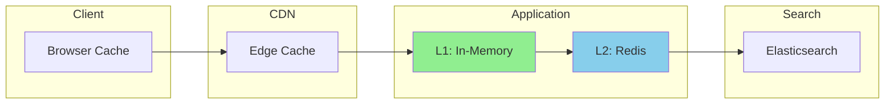

| Cache Layer | TTL | Content |
|-------------|-----|---------|
| Browser | 5 min | Recent searches, suggestions |
| Redis L2 | 15 min | Menu registry, common queries |
| In-Memory L1 | 5 min | Hot queries, user context |

### 9.3 Security Measures

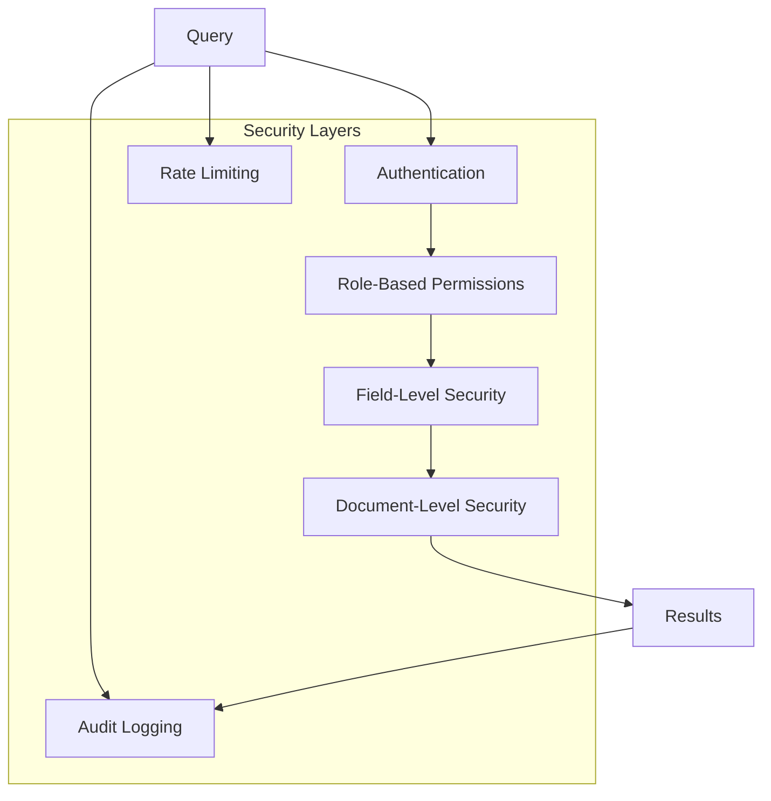

**Implementation**:

```typescript
// permission-filter.ts
interface SearchContext {
  userId: string;
  roles: string[];
  departmentId: string;
  managedEmployees: string[];
}

function applyPermissionFilter(query: any, context: SearchContext): any {
  const filters = [];
  
  // Role-based document access
  if (!context.roles.includes('HR_ADMIN')) {
    if (context.roles.includes('MANAGER')) {
      // Managers see their team
      filters.push({
        bool: {
          should: [
            { terms: { employee_id: context.managedEmployees } },
            { term: { department_id: context.departmentId } }
          ]
        }
      });
    } else {
      // Employees see public info only
      filters.push({ term: { 'visibility': 'public' } });
    }
  }
  
  // Field-level security
  const excludedFields = getExcludedFields(context.roles);
  
  return {
    ...query,
    body: {
      ...query.body,
      query: {
        bool: {
          must: query.body.query,
          filter: filters
        }
      },
      _source: { excludes: excludedFields }
    }
  };
}
```

---

## 10. Summary & Recommendations

### 10.1 Recommended Approach

Áp dụng **Hybrid Approach** kết hợp ưu điểm của cả ba giải pháp lớn:

| Feature | Inspiration | Priority |
|---------|-------------|----------|
| Prefix routing (@, /, >) | Workday | P1 |
| Fuzzy search + Synonyms | Oracle | P1 |
| Action Search với NLP | SAP | P2 |
| xTQL Query Language | Jira JQL | P2 |
| Semantic Search | Modern AI | P3 |

### 10.2 Key Success Factors

1. **Performance First**: Autocomplete < 100ms là critical
2. **Vietnamese Support**: Phải hoạt động tốt với tiếng Việt
3. **Discoverability**: User dễ discover features qua search
4. **Incremental**: Start simple, add complexity gradually
5. **Security**: Role-based filtering từ đầu

### 10.3 Quick Start Recommendation

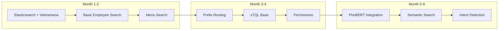

### 10.4 Technology Choices Summary

| Component | Recommended | Alternative |
|-----------|-------------|-------------|
| Search Engine | Elasticsearch 8.x | MeiliSearch |
| Vietnamese NLP | PhoBERT | VnCoreNLP |
| Query Parser | Chevrotain | ANTLR4 |
| Vector Store | pgvector → Qdrant | Milvus |
| Cache | Redis | Memcached |
| UI Component | cmdk | kbar |
| State Management | React Query | SWR |

---

*Document Version: 2.0 | Last Updated: December 2025*