# xTalent HCM - Global Search
## Proposed Solution Document

**Version**: 1.1  
**Date**: December 2025  
**Audience**: Product Team, Stakeholders, Business Analysts

---

## 1. Vision & Objectives

### 1.1 Vision Statement

> **"Tìm bất kỳ thứ gì trong xTalent chỉ với một thanh search duy nhất - bằng ngôn ngữ tự nhiên"**

Global Search sẽ là điểm truy cập trung tâm giúp người dùng nhanh chóng tìm kiếm nhân viên, navigate đến các tính năng, và thực hiện các quick actions - tất cả từ một giao diện thống nhất. Hệ thống hiểu được ý định của người dùng, không chỉ match keywords.

### 1.2 Core Objectives

| Objective | Success Metric |
|-----------|----------------|
| **Speed** | Autocomplete < 100ms |
| **Accuracy** | >95% relevant results trong top 5 |
| **Understanding** | >85% intent detection accuracy |
| **Adoption** | 70% users sử dụng search thay vì menu navigation sau 3 tháng |
| **Discoverability** | Users khám phá được 30% features mới qua search |

### 1.3 Target Users

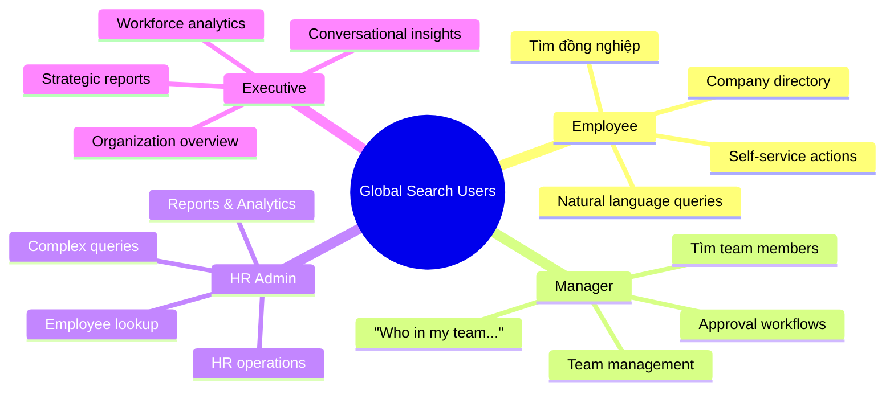

---

## 2. Product Concept

### 2.1 Unified Search Bar

Một thanh search duy nhất xuất hiện ở header của ứng dụng, có thể truy cập từ mọi màn hình.

```
┌─────────────────────────────────────────────────────────────────┐
│  🔍  Search or ask anything...                       ⌘K    🤖   │
└─────────────────────────────────────────────────────────────────┘
```

**Đặc điểm chính:**
- Luôn visible ở top navigation
- Keyboard shortcut: `Cmd/Ctrl + K`
- AI indicator khi hệ thống đang "hiểu" query
- Hỗ trợ cả keyword search và natural language

### 2.2 Search Paradigms

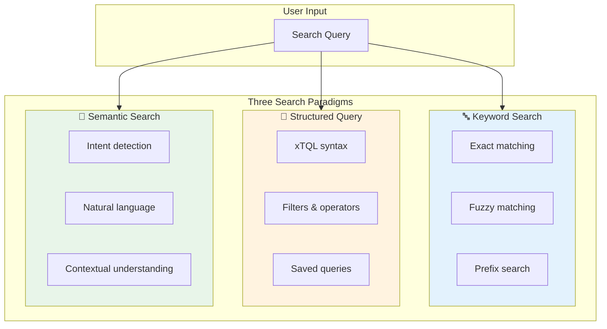

### 2.3 Hai Đối Tượng Search Chính

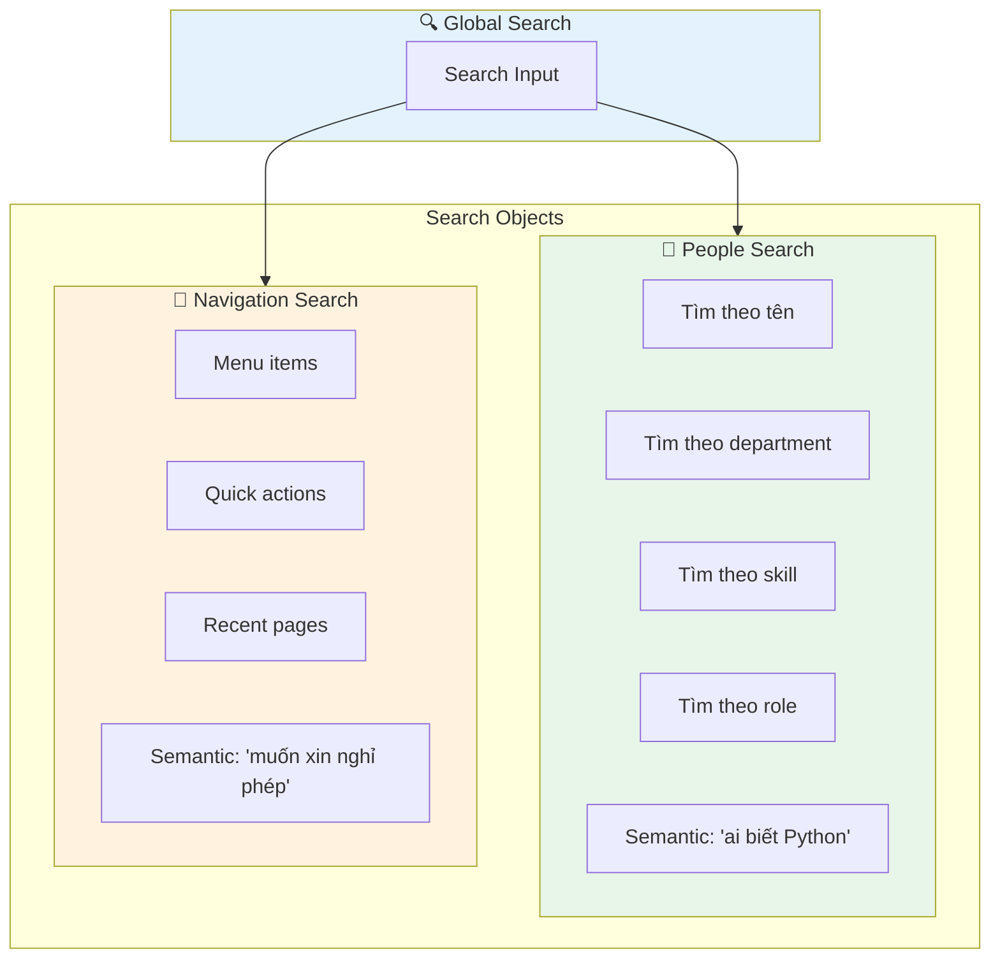

---

## 3. Search Modes & Interaction

### 3.1 Smart Prefix System

Hệ thống prefix cho phép user narrow search scope một cách nhanh chóng:

| Prefix | Scope | Ví dụ | Kết quả |
|--------|-------|-------|---------|
| `@` | People | `@nguyen` | Tìm nhân viên tên Nguyễn |
| `/` | Navigation | `/payroll` | Navigate đến Payroll menu |
| `>` | Actions | `>create` | Hiện các quick actions |
| `#` | Department/Team | `#engineering` | Filter theo department |
| `?` | Help | `?` | Hiện hướng dẫn sử dụng |
| *(none)* | **Smart/Semantic** | `ai biết Python trong team tôi` | AI phân tích và trả lời |

### 3.2 Search Flow với AI Processing

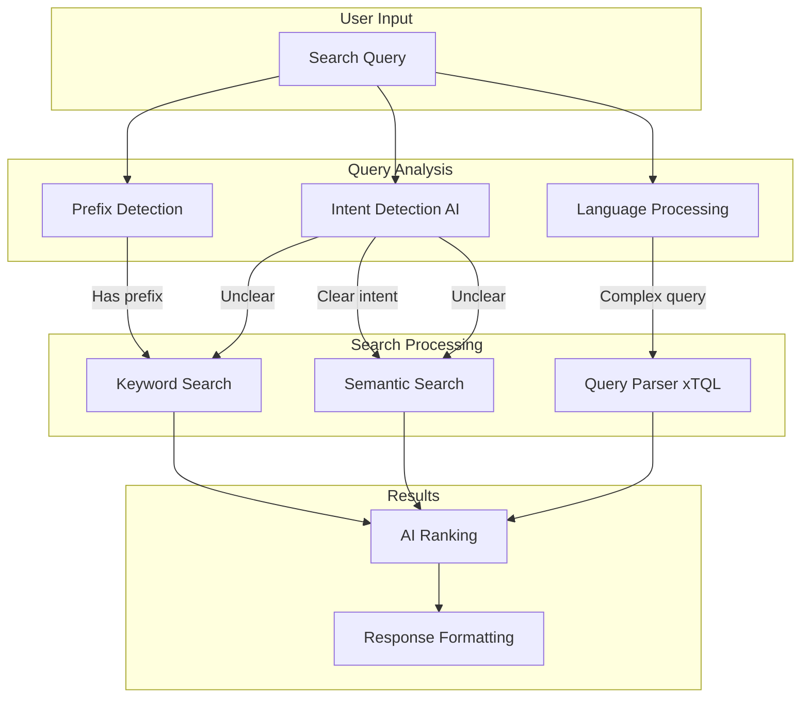

### 3.3 Search States với AI Feedback

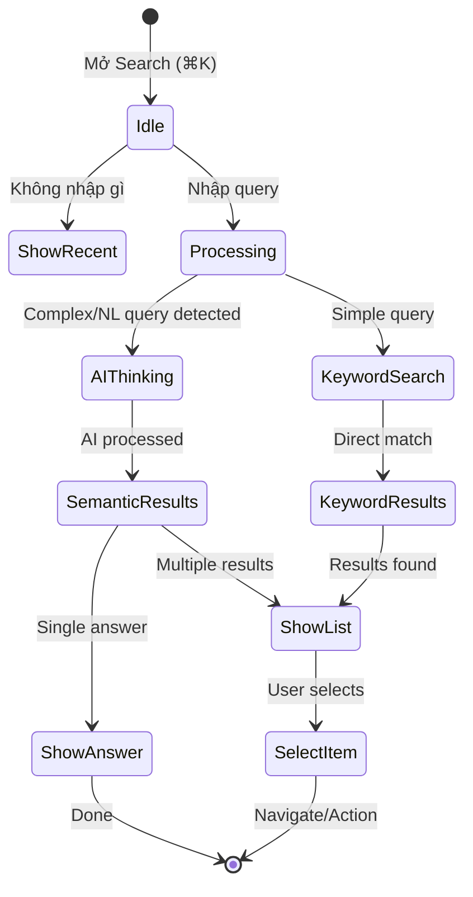

---

## 4. AI & Semantic Search Features

### 4.1 Natural Language Processing Pipeline

```mermaid
flowchart LR
    subgraph Input["Input Processing"]
        Raw["Raw Query"]
        Norm["Normalization"]
        Token["Tokenization"]
    end
    
    subgraph NLP["NLP Analysis"]
        Lang["Language Detection<br/>VI/EN"]
        NER["Named Entity<br/>Recognition"]
        Intent["Intent<br/>Classification"]
        Slot["Slot Filling"]
    end
    
    subgraph Understanding["Query Understanding"]
        Parse["Semantic Parsing"]
        Resolve["Entity Resolution"]
        Context["Context Injection"]
    end
    
    subgraph Output["Search Execution"]
        Plan["Query Plan"]
        Execute["Execute Search"]
        Rank["AI Ranking"]
    end
    
    Raw --> Norm --> Token
    Token --> Lang --> NER --> Intent --> Slot
    Slot --> Parse --> Resolve --> Context
    Context --> Plan --> Execute --> Rank
```

### 4.2 Intent Detection Categories

Hệ thống nhận diện các loại intent chính:

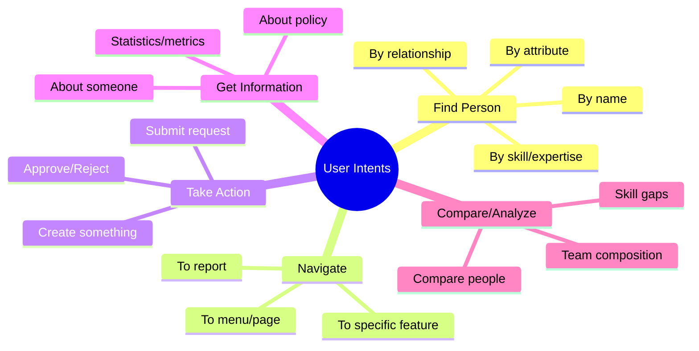

### 4.3 Intent Examples & Mapping

| User Query (Vietnamese) | Detected Intent | Extracted Entities | Action |
|------------------------|-----------------|-------------------|--------|
| "tìm Nguyễn Văn A" | `find_person` | name: "Nguyễn Văn A" | People search |
| "ai trong team tôi biết Python" | `find_person_by_skill` | skill: "Python", scope: "my_team" | Filtered search |
| "muốn xin nghỉ phép" | `take_action` | action: "leave_request" | Navigate to form |
| "sếp của Minh là ai" | `get_info_relationship` | person: "Minh", relation: "manager" | Show manager |
| "bao nhiêu người trong Engineering" | `get_statistics` | department: "Engineering", metric: "headcount" | Show count |
| "so sánh skill của team A và B" | `compare_analyze` | teams: ["A", "B"], aspect: "skills" | Show comparison |

### 4.4 Semantic Search vs Keyword Search

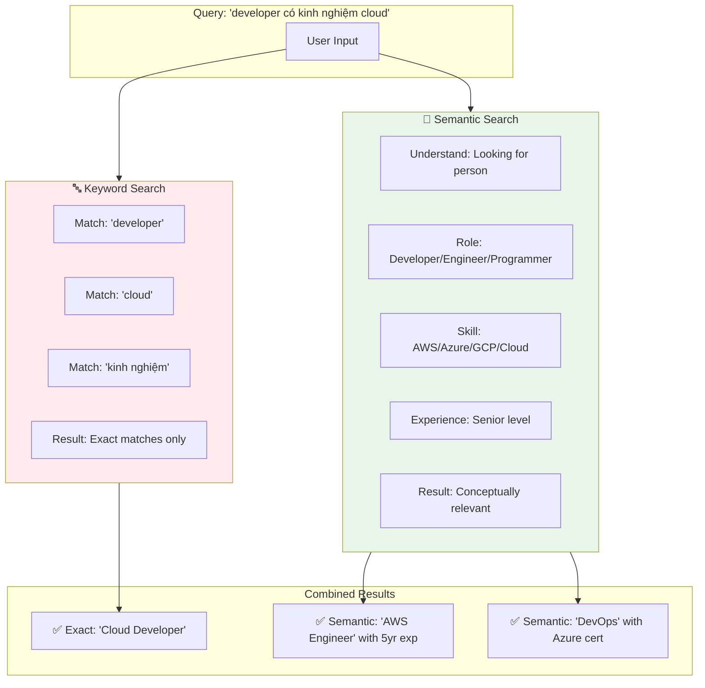

### 4.5 Vietnamese Language Understanding

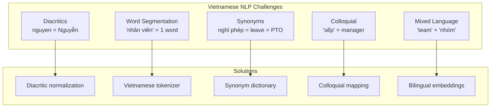

**Vietnamese Query Understanding Examples:**

| Query | Understanding |
|-------|--------------|
| "nguyen van a" | → Matches "Nguyễn Văn A" (diacritic handling) |
| "xin nghi phep" | → Intent: Leave request (without diacritics) |
| "sep cua toi" | → "manager of currentUser()" |
| "team dev" | → "Engineering/Development department" |
| "ai ranh Python" | → "who has skill Python" (colloquial "rành") |

---

## 5. AI-Powered Features

### 5.1 Conversational Search

Cho phép user hỏi bằng ngôn ngữ tự nhiên và nhận câu trả lời trực tiếp:

```
┌─────────────────────────────────────────────────────────────────┐
│  🔍  bao nhiêu người trong team Engineering đang on leave?      │
├─────────────────────────────────────────────────────────────────┤
│                                                                  │
│  🤖 AI Answer                                                    │
│  ┌────────────────────────────────────────────────────────────┐ │
│  │  Hiện có 3 người trong Engineering đang nghỉ phép:         │ │
│  │                                                             │ │
│  │  👤 Nguyễn Văn A - Annual Leave (Dec 25-30)                │ │
│  │  👤 Trần Thị B - Sick Leave (Dec 28)                       │ │
│  │  👤 Lê Văn C - Personal Leave (Dec 27-29)                  │ │
│  │                                                             │ │
│  │  [View All Engineering Members] [View Leave Calendar]       │ │
│  └────────────────────────────────────────────────────────────┘ │
│                                                                  │
│  💬 Follow-up: "ai sẽ quay lại sớm nhất?"                       │
└─────────────────────────────────────────────────────────────────┘
```

### 5.2 Question Types & AI Responses

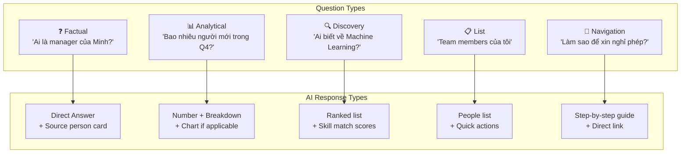

### 5.3 Smart Suggestions & Auto-complete

AI gợi ý dựa trên context và intent:

```
┌─────────────────────────────────────────────────────────────────┐
│  🔍  ai trong team                                              │
├─────────────────────────────────────────────────────────────────┤
│  🤖 Suggested completions:                                      │
│  ┌────────────────────────────────────────────────────────────┐ │
│  │  ai trong team tôi biết [skill]...                         │ │
│  │  ai trong team Engineering...                               │ │
│  │  ai trong team đang nghỉ phép...                           │ │
│  │  ai trong team mới join gần đây...                         │ │
│  └────────────────────────────────────────────────────────────┘ │
│                                                                  │
│  💡 Based on: your role (Manager), recent searches              │
└─────────────────────────────────────────────────────────────────┘
```

### 5.4 Context-Aware Search

Hệ thống hiểu context của user để personalize kết quả:

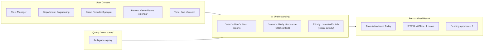

### 5.5 Follow-up Questions

Hỗ trợ conversation flow với follow-up:

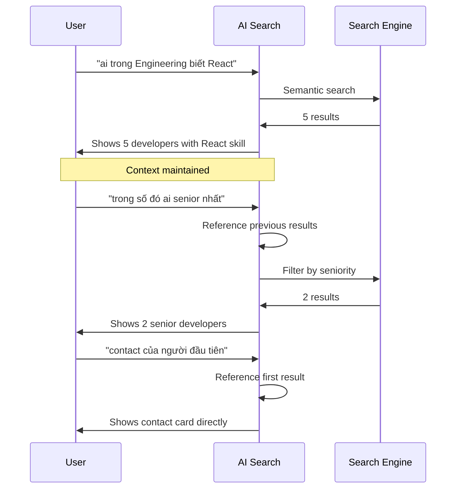

---

## 6. People Search Features

### 6.1 Search Capabilities

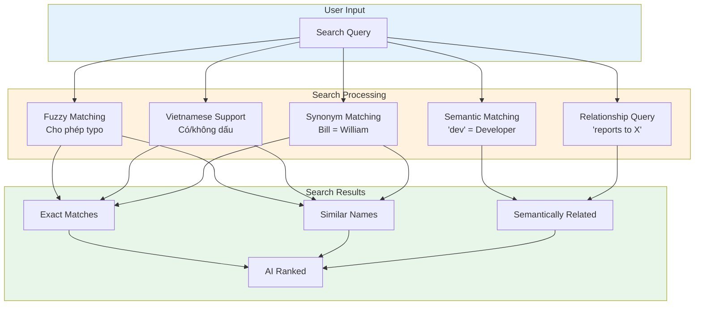

### 6.2 Natural Language People Queries

| Natural Language Query | Interpreted As |
|----------------------|----------------|
| "ai biết Python" | skill = "Python" |
| "developer senior trong Product" | position ~ "Developer" AND level = "Senior" AND dept = "Product" |
| "người mới join tháng này" | hire_date >= startOfMonth() |
| "team của Minh" | reportsTo("Minh") |
| "ai đang nghỉ phép" | status = "On Leave" |
| "manager của Engineering" | position ~ "Manager" AND dept = "Engineering" |
| "người có thể thay thế A khi nghỉ" | Semantic: backup/similar skills to A |

### 6.3 Skill & Expertise Search

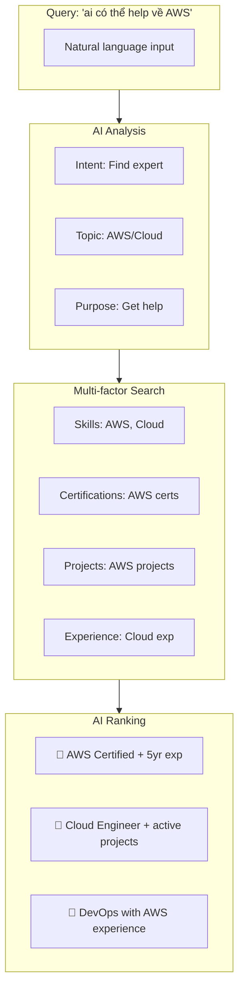

### 6.4 Relationship-based Queries

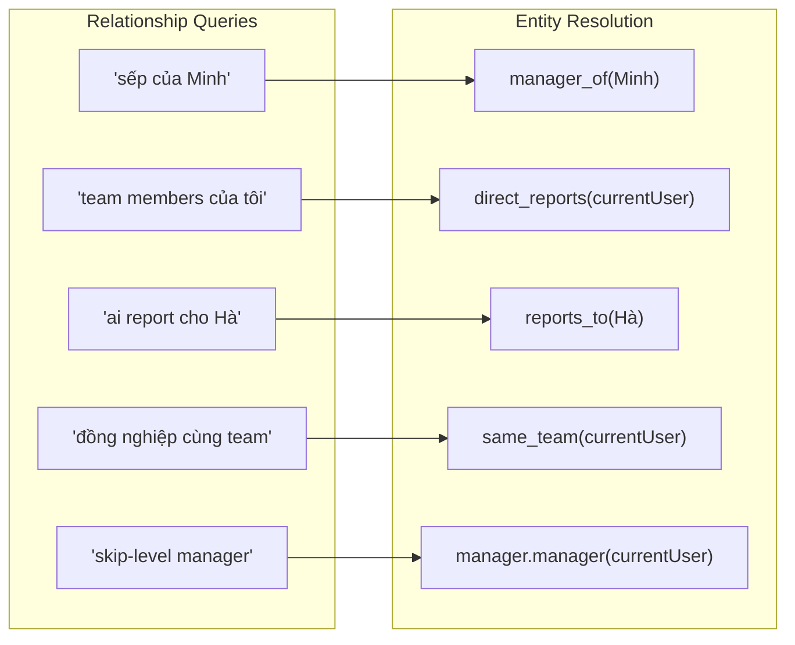

---

## 7. Navigation Search Features

### 7.1 Intent-based Navigation

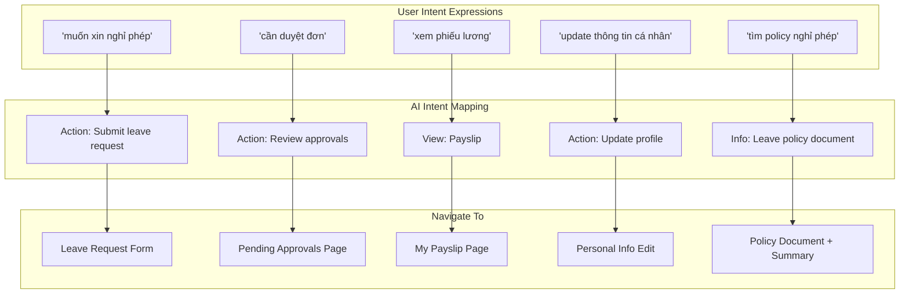

### 7.2 Multi-language Action Mapping

| Vietnamese | English | Colloquial | → Action |
|------------|---------|------------|----------|
| "xin nghỉ phép" | "leave request" | "xin off" | Leave Request Form |
| "xem lương" | "view salary" | "check lương" | Payslip |
| "chấm công" | "attendance" | "điểm danh" | Timesheet |
| "duyệt đơn" | "approve request" | "approve" | Pending Approvals |
| "thêm nhân viên" | "add employee" | "tạo NV mới" | Create Employee |

### 7.3 Smart Action Suggestions

```
┌─────────────────────────────────────────────────────────────────┐
│  🔍  nghỉ phép                                                  │
├─────────────────────────────────────────────────────────────────┤
│                                                                  │
│  🎯 ACTIONS                                                      │
│  ┌────────────────────────────────────────────────────────────┐ │
│  │ ▶ Đăng ký nghỉ phép              Tạo đơn xin nghỉ mới     │ │
│  │   Xem số ngày phép còn lại        12 ngày remaining       │ │
│  │   Lịch sử nghỉ phép              Xem các đơn đã submit    │ │
│  └────────────────────────────────────────────────────────────┘ │
│                                                                  │
│  📄 RELATED INFO                                                 │
│  ┌────────────────────────────────────────────────────────────┐ │
│  │   Leave Policy 2025              Company leave guidelines  │ │
│  │   Holiday Calendar               Lịch nghỉ lễ năm 2025    │ │
│  └────────────────────────────────────────────────────────────┘ │
│                                                                  │
│  👥 PEOPLE ON LEAVE                                              │
│  ┌────────────────────────────────────────────────────────────┐ │
│  │   3 people in your team are on leave this week            │ │
│  └────────────────────────────────────────────────────────────┘ │
└─────────────────────────────────────────────────────────────────┘
```

---

## 8. Advanced Search (xTQL)

### 8.1 Concept

Cho power users cần tìm kiếm phức tạp, hệ thống hỗ trợ query language với **AI-assisted building**:

```
┌─────────────────────────────────────────────────────────────────┐
│  🔍  department = "Engineering" AND status = "Active"    [Run]  │
│  ─────────────────────────────────────────────────────────────  │
│  🤖 AI Suggestion: Add "AND hire_date > '2024-01-01'" for       │
│     new hires, or "AND hasSkill('Python')" to filter by skill   │
└─────────────────────────────────────────────────────────────────┘
```

### 8.2 Natural Language to xTQL

AI có thể convert natural language thành xTQL:

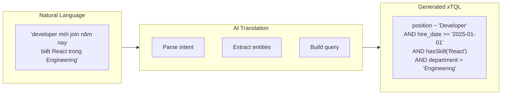

### 8.3 Query Templates with AI Fill

| User Says | AI Generates |
|-----------|-------------|
| "new hires this year" | `hire_date >= "2025-01-01"` |
| "engineers who know cloud" | `department = "Engineering" AND hasSkill("AWS") OR hasSkill("Azure") OR hasSkill("GCP")` |
| "managers in my department" | `department = currentUserDepartment() AND position ~ "Manager"` |
| "people whose probation ends soon" | `probation_end_date BETWEEN today() AND dateAdd(today(), 30, "day")` |

---

## 9. User Experience Design

### 9.1 Search Panel Layout với AI

```
┌──────────────────────────────────────────────────────────────────────┐
│  🔍  ai trong team Engineering đang nghỉ phép                   ✕    │
├──────────────────────────────────────────────────────────────────────┤
│                                                                      │
│  🤖 AI ANSWER                                                        │
│  ┌────────────────────────────────────────────────────────────────┐ │
│  │  Có 2 người trong Engineering đang nghỉ phép hôm nay:         │ │
│  │                                                                │ │
│  │  👤 Nguyễn Văn A    Annual Leave    Dec 25 - Dec 30           │ │
│  │  👤 Trần Thị B      Sick Leave      Dec 28                    │ │
│  │                                                                │ │
│  │  [View Leave Calendar]  [View All Engineering]                 │ │
│  └────────────────────────────────────────────────────────────────┘ │
│                                                                      │
│  💬 FOLLOW-UP SUGGESTIONS                                            │
│  ┌────────────────────────────────────────────────────────────────┐ │
│  │  "ai sẽ back sớm nhất?"  "coverage cho team?"  "approve đơn"  │ │
│  └────────────────────────────────────────────────────────────────┘ │
│                                                                      │
│  ───────────────────────────────────────────────────────────────── │
│  🕐 RECENT: @minh  |  /payroll  |  ai biết Python                   │
└──────────────────────────────────────────────────────────────────────┘
```

### 9.2 Response Types

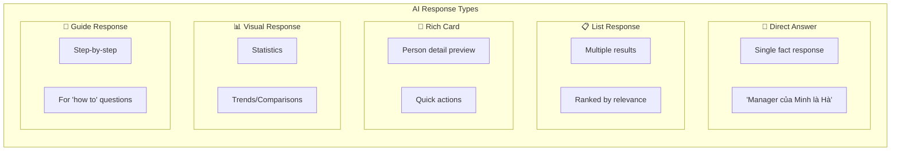

### 9.3 AI Confidence Indicators

```
┌─────────────────────────────────────────────────────────────────┐
│  Query: "senior dev trong team mobile"                          │
├─────────────────────────────────────────────────────────────────┤
│                                                                  │
│  🟢 High Confidence (95%)                                        │
│  Tìm thấy 3 Senior Developers trong Mobile Team:                │
│  [Results...]                                                    │
│                                                                  │
├─────────────────────────────────────────────────────────────────┤
│  Query: "ai giỏi nhất về cloud"                                 │
├─────────────────────────────────────────────────────────────────┤
│                                                                  │
│  🟡 Medium Confidence (70%)                                      │
│  Dựa trên skills và certifications, đây là những người có      │
│  expertise về Cloud:                                             │
│  [Results ranked by skill match...]                              │
│                                                                  │
│  💡 Bạn có thể clarify: certifications, years of experience?    │
│                                                                  │
├─────────────────────────────────────────────────────────────────┤
│  Query: "người phù hợp cho project X"                           │
├─────────────────────────────────────────────────────────────────┤
│                                                                  │
│  🟠 Low Confidence - Need More Info                              │
│  Tôi cần thêm thông tin về Project X:                           │
│  - Required skills?                                              │
│  - Team size needed?                                             │
│  - Timeline?                                                     │
│                                                                  │
└─────────────────────────────────────────────────────────────────┘
```

---

## 10. Personalization & Learning

### 10.1 Smart Suggestions Engine

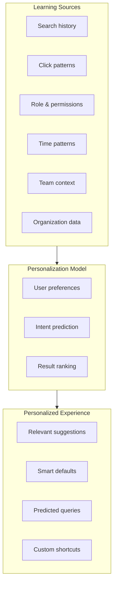

### 10.2 Time-based Contextual Suggestions

| Time/Context | Suggested Queries |
|--------------|------------------|
| **Monday morning** | "team attendance today", "week schedule" |
| **End of month** | "timesheet", "pending approvals", "overtime report" |
| **Performance review season** | "my team reviews", "goal progress" |
| **After viewing someone's profile** | "similar skills", "same team", "org chart" |
| **New hire's first week** | "onboarding checklist", "team members", "policies" |

### 10.3 Role-based Default Behavior

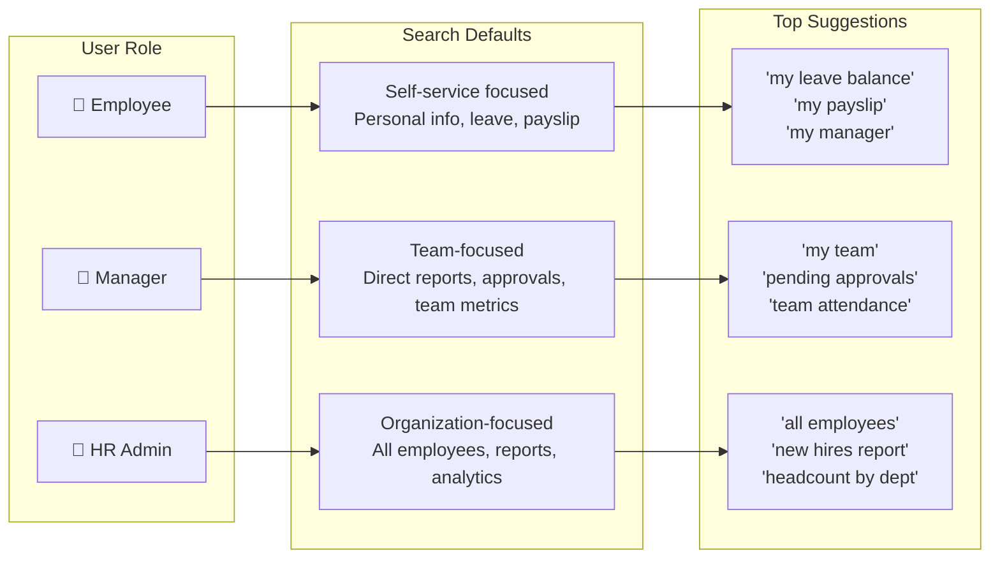

---

## 11. Access Control & Security

### 11.1 AI-aware Permission System

```mermaid
flowchart TB
    subgraph Query["User Query"]
        Q1["'salary của team Engineering'"]
    end
    
    subgraph Check["Permission Check"]
        C1["User role?"]
        C2["Data sensitivity?"]
        C3["Scope allowed?"]
    end
    
    subgraph Response["AI Response"]
        R1["✅ Full data<br/>(HR Admin)"]
        R2["⚠️ Partial data<br/>(Manager - own team only)"]
        R3["❌ Access denied<br/>(Employee)"]
    end
    
    Query --> Check
    Check -->|"HR Admin"| R1
    Check -->|"Manager"| R2
    Check -->|"Employee"| R3
```

### 11.2 Sensitive Query Handling

| Query Type | Employee | Manager | HR Admin |
|------------|----------|---------|----------|
| "salary của X" | ❌ Không thể trả lời | ⚠️ Chỉ team mình | ✅ Full access |
| "performance rating của X" | ❌ | ⚠️ Direct reports | ✅ |
| "ai sắp bị terminate" | ❌ | ❌ | ✅ |
| "disciplinary records" | ❌ | ❌ | ✅ |

**AI Response for Restricted Queries:**
```
┌─────────────────────────────────────────────────────────────────┐
│  🔍  salary của team Engineering                                │
├─────────────────────────────────────────────────────────────────┤
│                                                                  │
│  🔒 Restricted Information                                       │
│                                                                  │
│  Thông tin lương là dữ liệu nhạy cảm. Bạn có thể:               │
│                                                                  │
│  • Xem thông tin lương của bản thân → /my-payslip               │
│  • Liên hệ HR để được hỗ trợ → @hr-support                      │
│                                                                  │
└─────────────────────────────────────────────────────────────────┘
```

---

## 12. Feature Rollout Plan

### 12.1 Phase Overview với AI Features

```mermaid
gantt
    title Global Search Feature Rollout
    dateFormat YYYY-Q
    
    section Phase 1 - Foundation
    Basic Keyword Search        :p1a, 2025-Q1, 1q
    Prefix System               :p1b, 2025-Q1, 1q
    Vietnamese Fuzzy            :p1c, 2025-Q1, 1q
    
    section Phase 2 - Enhanced
    xTQL Basic                  :p2a, 2025-Q2, 1q
    Saved Searches              :p2b, 2025-Q2, 1q
    Search Analytics            :p2c, 2025-Q2, 1q
    
    section Phase 3 - NLP
    Intent Detection            :p3a, 2025-Q3, 1q
    Vietnamese NLP              :p3b, 2025-Q3, 1q
    Natural Language Queries    :p3c, 2025-Q3, 1q
    
    section Phase 4 - AI
    Semantic Search             :p4a, 2025-Q4, 1q
    Conversational Search       :p4b, 2025-Q4, 1q
    AI Suggestions              :p4c, 2025-Q4, 1q
    Follow-up Questions         :p4d, 2025-Q4, 1q
```

### 12.2 Phase Details

#### Phase 1: Foundation (Q1 2025)
| Feature | Description |
|---------|-------------|
| Basic Keyword Search | Exact & fuzzy matching |
| Prefix System | @, /, > routing |
| Vietnamese Support | Diacritic handling |
| Autocomplete | Real-time suggestions |

#### Phase 2: Enhanced (Q2 2025)
| Feature | Description |
|---------|-------------|
| xTQL Parser | Structured query support |
| Saved Searches | Save & share queries |
| Extended Attributes | Skills, relationships |
| Search Analytics | Usage tracking |

#### Phase 3: NLP (Q3 2025)
| Feature | Description |
|---------|-------------|
| Intent Detection | Classify user intent |
| Vietnamese NLP | Native language processing |
| Entity Extraction | Names, dates, departments |
| Natural Language | "ai biết Python" style queries |

#### Phase 4: AI-Powered (Q4 2025)
| Feature | Description |
|---------|-------------|
| Semantic Search | Meaning-based matching |
| Conversational | Multi-turn conversations |
| AI Answers | Direct question answering |
| Smart Suggestions | Context-aware recommendations |
| Follow-up | Conversation continuation |

---

## 13. Success Metrics

### 13.1 KPIs by Phase

```mermaid
flowchart TB
    subgraph Phase1["Phase 1 KPIs"]
        P1A["Search latency < 100ms"]
        P1B["Zero-result rate < 15%"]
        P1C["Basic adoption 50%"]
    end
    
    subgraph Phase2["Phase 2 KPIs"]
        P2A["xTQL adoption 20%<br/>of power users"]
        P2B["Saved search usage"]
        P2C["Query complexity ↑"]
    end
    
    subgraph Phase3["Phase 3 KPIs"]
        P3A["Intent accuracy > 85%"]
        P3B["NL query rate > 30%"]
        P3C["Vietnamese query success"]
    end
    
    subgraph Phase4["Phase 4 KPIs"]
        P4A["AI answer satisfaction > 80%"]
        P4B["Conversation depth > 2 turns"]
        P4C["Feature discovery +30%"]
    end
```

### 13.2 AI-specific Metrics

| Metric | Target | Measurement |
|--------|--------|-------------|
| Intent Detection Accuracy | >85% | Sampled evaluation |
| Query Understanding Rate | >90% | Successful parse rate |
| AI Answer Relevance | >80% satisfaction | User feedback |
| Conversation Completion | >60% | Follow-up engagement |
| Zero-result with AI Fallback | <5% | AI provides alternatives |

---

## 14. Open Questions for Discussion

### 14.1 AI Feature Decisions

```mermaid
mindmap
  root((AI Decisions))
    Scope
      Which queries get AI treatment?
      Fallback behavior?
      AI confidence threshold?
    UX
      How to show AI is thinking?
      Confidence indicators?
      Error handling?
    Vietnamese
      Priority vs English?
      Mixed language handling?
      Colloquial support level?
    Privacy
      Query logging for training?
      Opt-out options?
      Data retention?
    Cost
      AI processing cost per query?
      Caching strategy?
      Rate limiting?
```

### 14.2 Key Questions

1. **AI Trigger**: Khi nào query nên được xử lý bởi AI vs simple keyword search?

2. **Confidence Threshold**: Mức confidence nào AI nên trả lời trực tiếp vs yêu cầu clarification?

3. **Vietnamese Priority**: NLP tiếng Việt nên ở Phase 3 hay có thể delay đến Phase 4?

4. **Conversation Depth**: Hỗ trợ bao nhiêu follow-up turns trong một session?

5. **AI Training Data**: Có thể sử dụng search queries để improve AI model không? Privacy concerns?

6. **Cost Management**: AI processing cost per query? Có cần limit AI queries per user?

7. **Fallback UX**: Khi AI không confident, UX nên như thế nào?

8. **Hybrid Results**: Hiển thị kết quả keyword + semantic như thế nào cho user hiểu?

---

## 15. Appendix

### A. Sample Conversations

**Conversation 1: Finding Expert**
```
User: ai trong công ty giỏi về AWS
AI: Tìm thấy 8 người có expertise về AWS. Top 3:
    1. Nguyễn A - AWS Solutions Architect certified, 5 năm exp
    2. Trần B - DevOps Engineer, 3 AWS certifications
    3. Lê C - Cloud Engineer, lead AWS migration projects

User: người đầu tiên có thể contact qua đâu
AI: Nguyễn A - AWS Expert
    📧 nguyen.a@company.com
    📱 0912-xxx-xxx
    💬 Slack: @nguyena
    [Schedule Meeting] [Send Message]
```

**Conversation 2: HR Analytics**
```
User: bao nhiêu người mới join Q4 năm nay
AI: Q4 2025 có 23 new hires:
    • Engineering: 12 người
    • Product: 5 người  
    • Sales: 4 người
    • Others: 2 người
    [View Full List] [Compare with Q3]

User: so với Q3 thì sao
AI: So sánh hiring Q3 vs Q4 2025:
    Q3: 18 new hires | Q4: 23 new hires (+28%)
    Tăng nhiều nhất: Engineering (+5)
    [View Trend Chart] [Download Report]
```

### B. Glossary

| Term | Definition |
|------|------------|
| **Semantic Search** | Search dựa trên meaning, không chỉ keyword matching |
| **Intent Detection** | AI xác định user muốn làm gì |
| **NER** | Named Entity Recognition - nhận diện tên, ngày, org |
| **Slot Filling** | Điền các parameters từ natural language |
| **Embeddings** | Vector representation của text cho semantic matching |
| **Confidence Score** | Độ tin cậy của AI với câu trả lời |
| **Follow-up** | Câu hỏi tiếp theo trong conversation |

---

*Document Status: Draft for Review*  
*Version: 1.1 - Added AI & Semantic Search features*  
*Next Review: [TBD with Product Team]*