# xTalent HCM - Global Search
## Proposed Solution Document

**Version**: 1.0  
**Date**: December 2025  
**Audience**: Product Team, Stakeholders, Business Analysts

---

## 1. Vision & Objectives

### 1.1 Vision Statement

> **"Tìm bất kỳ thứ gì trong xTalent chỉ với một thanh search duy nhất"**

Global Search sẽ là điểm truy cập trung tâm giúp người dùng nhanh chóng tìm kiếm nhân viên, navigate đến các tính năng, và thực hiện các quick actions - tất cả từ một giao diện thống nhất.

### 1.2 Core Objectives

| Objective | Success Metric |
|-----------|----------------|
| **Speed** | Autocomplete < 100ms |
| **Accuracy** | >95% relevant results trong top 5 |
| **Adoption** | 70% users sử dụng search thay vì menu navigation sau 3 tháng |
| **Discoverability** | Users khám phá được 30% features mới qua search |

### 1.3 Target Users

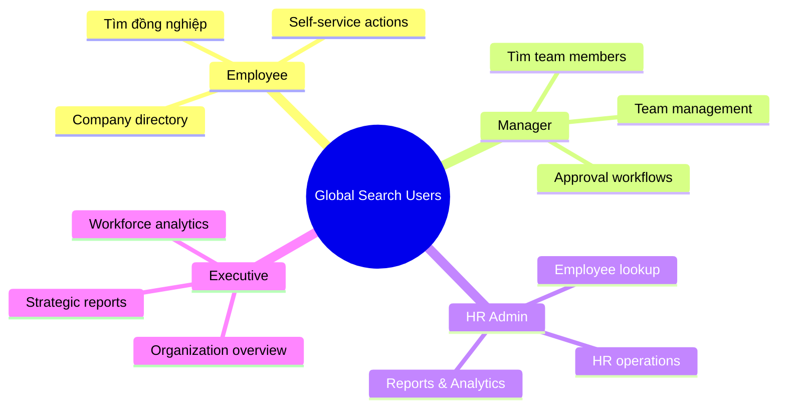

---

## 2. Product Concept

### 2.1 Unified Search Bar

Một thanh search duy nhất xuất hiện ở header của ứng dụng, có thể truy cập từ mọi màn hình.

```
┌─────────────────────────────────────────────────────────────────┐
│  🔍  Search people, menus, actions...              ⌘K           │
└─────────────────────────────────────────────────────────────────┘
```

**Đặc điểm chính:**
- Luôn visible ở top navigation
- Keyboard shortcut: `Cmd/Ctrl + K`
- Placeholder text gợi ý các loại search có thể thực hiện

### 2.2 Hai Đối Tượng Search Chính

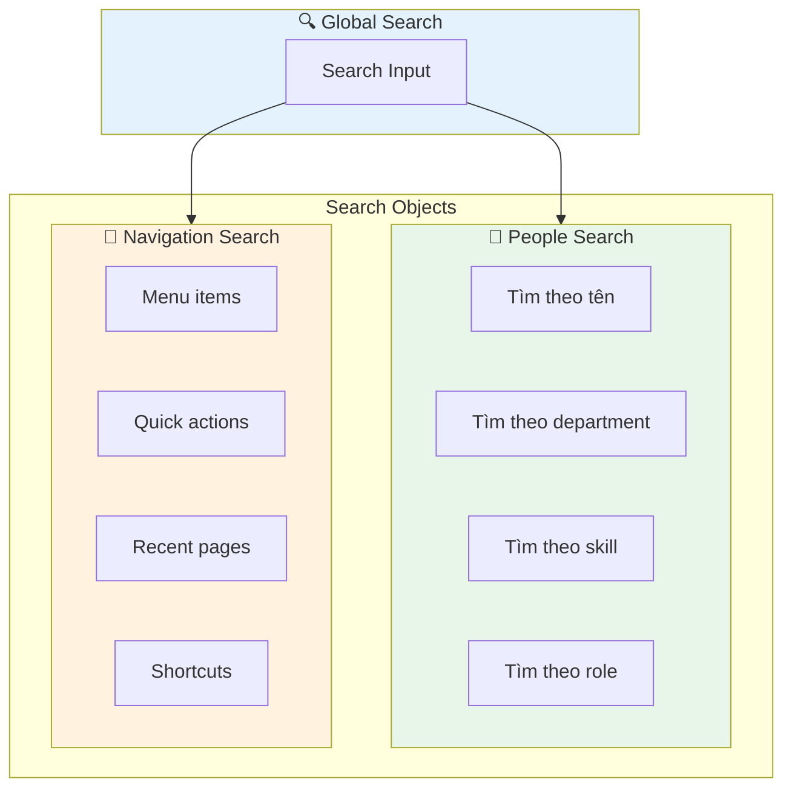

---

## 3. Search Modes & Interaction

### 3.1 Smart Prefix System

Hệ thống prefix cho phép user narrow search scope một cách nhanh chóng:

| Prefix | Scope | Ví dụ | Kết quả |
|--------|-------|-------|---------|
| `@` | People | `@nguyen` | Tìm nhân viên tên Nguyễn |
| `/` | Navigation | `/payroll` | Navigate đến Payroll menu |
| `>` | Actions | `>create` | Hiện các quick actions |
| `#` | Department/Team | `#engineering` | Filter theo department |
| `?` | Help | `?` | Hiện hướng dẫn sử dụng |
| *(none)* | Universal | `leave request` | AI tự detect intent |

### 3.2 Search Flow

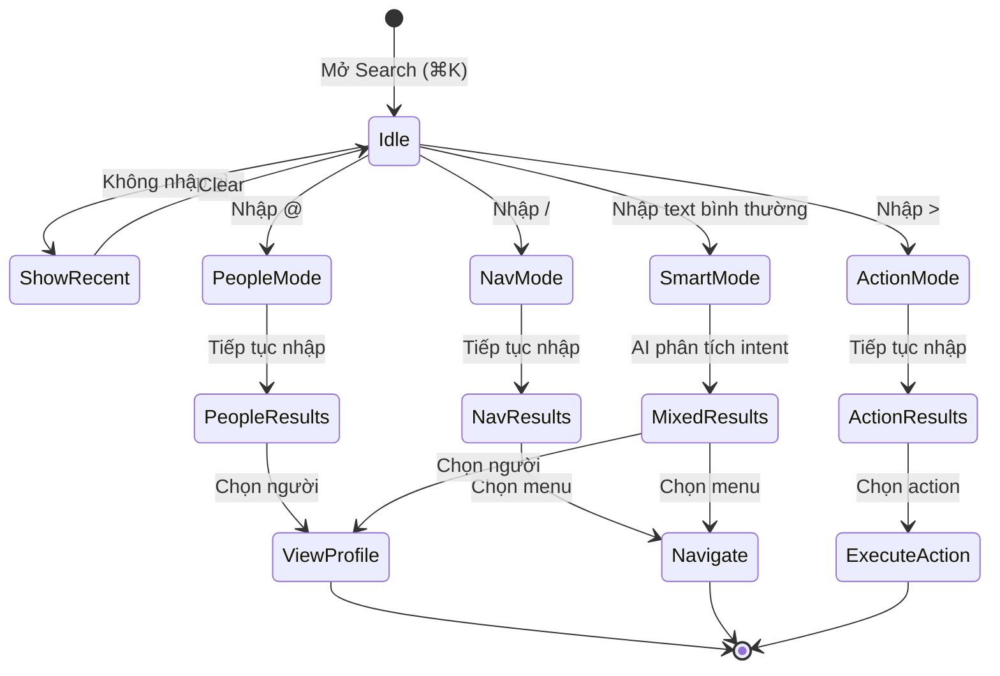

### 3.3 Search States

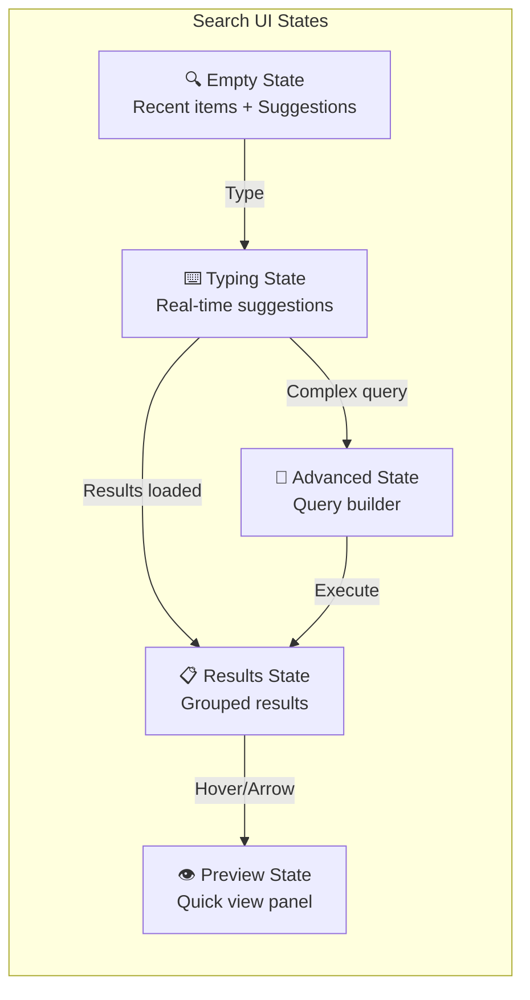

---

## 4. People Search Features

### 4.1 Search Capabilities

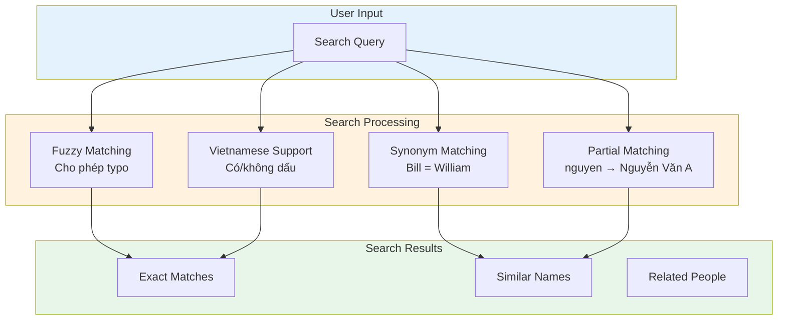

### 4.2 Searchable Employee Attributes

| Category | Attributes | Ví dụ tìm kiếm |
|----------|------------|----------------|
| **Identity** | Tên, Email, Employee ID, Phone | `@nguyen`, `@EMP001` |
| **Organization** | Department, Team, Position | `@engineering manager` |
| **Relationships** | Manager, Direct reports | `@reports to Minh` |
| **Skills** | Skills, Certifications | `@skill python` |
| **Status** | Active, On leave, Terminated | `@on leave` |

### 4.3 Result Ranking Logic

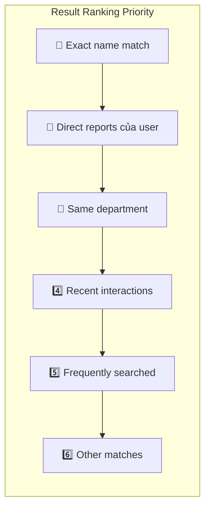

### 4.4 People Search Result Card

```
┌─────────────────────────────────────────────────────────────┐
│  👤  Nguyễn Văn A                                    ⭐     │
│      Senior Software Engineer • Engineering                  │
│      📧 nguyen.a@company.com  📱 0912-xxx-xxx               │
│      👔 Reports to: Trần Văn B                              │
├─────────────────────────────────────────────────────────────┤
│  [View Profile]  [Send Message]  [View Org Chart]           │
└─────────────────────────────────────────────────────────────┘
```

---

## 5. Navigation Search Features

### 5.1 Menu & Action Categories

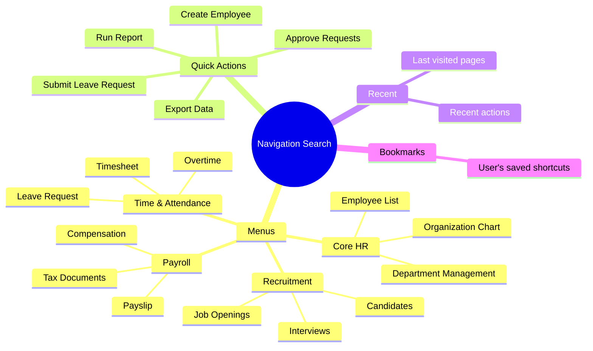

### 5.2 Action Search với Natural Language

Hệ thống hiểu các cách diễn đạt khác nhau cho cùng một action:

| User Input | Mapped Action |
|------------|---------------|
| "nghỉ phép", "xin nghỉ", "leave request", "đăng ký nghỉ" | → Leave Request Form |
| "phiếu lương", "payslip", "xem lương" | → View Payslip |
| "thêm nhân viên", "create employee", "tuyển mới" | → Create Employee Form |
| "duyệt đơn", "approve", "phê duyệt" | → Pending Approvals |

### 5.3 Navigation Result Types

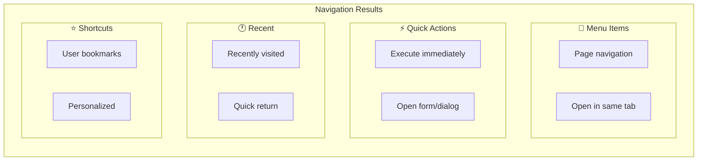

---

## 6. Advanced Search (xTQL)

### 6.1 Concept

Cho power users cần tìm kiếm phức tạp, hệ thống hỗ trợ query language đơn giản hóa:

```
┌─────────────────────────────────────────────────────────────────┐
│  🔍  department = "Engineering" AND status = "Active"    [Run] │
│  ─────────────────────────────────────────────────────────────  │
│  💡 Suggestions: hire_date > "2024-01-01"  |  hasSkill("...")   │
└─────────────────────────────────────────────────────────────────┘
```

### 6.2 Query Building Blocks

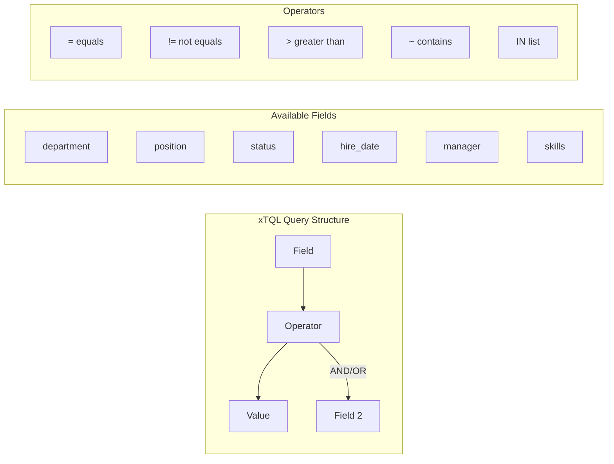

### 6.3 Common Query Templates

| Use Case | Query Template |
|----------|----------------|
| New hires this year | `hire_date >= "2025-01-01"` |
| Engineering active | `department = "Engineering" AND status = "Active"` |
| Managers | `position ~ "Manager"` |
| Specific skills | `hasSkill("Python") AND hasSkill("React")` |
| My team | `reportsTo(currentUser())` |
| Long tenure | `tenureGreaterThan("5y")` |

### 6.4 Saved Searches

Users có thể save các query thường dùng:

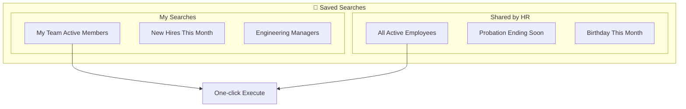

---

## 7. User Experience Design

### 7.1 Search Panel Layout

```
┌──────────────────────────────────────────────────────────────────────┐
│  🔍  @nguyen                                                    ✕    │
├──────────────────────────────────────────────────────────────────────┤
│                                                                      │
│  PEOPLE                                                    See all → │
│  ┌────────────────────────────────────────────────────────────────┐ │
│  │ 👤 Nguyễn Văn A        Senior Engineer • Engineering          │ │
│  │ 👤 Nguyễn Thị B        Product Manager • Product              │ │
│  │ 👤 Nguyễn Minh C       HR Specialist • Human Resources        │ │
│  └────────────────────────────────────────────────────────────────┘ │
│                                                                      │
│  RECENT SEARCHES                                                     │
│  ┌────────────────────────────────────────────────────────────────┐ │
│  │ 🕐 @engineering team    🕐 /payroll    🕐 @skill python       │ │
│  └────────────────────────────────────────────────────────────────┘ │
│                                                                      │
│  ───────────────────────────────────────────────────────────────── │
│  💡 Tips: Use @ for people, / for menus, > for actions             │
└──────────────────────────────────────────────────────────────────────┘
```

### 7.2 Preview Panel

Khi user hover hoặc arrow đến một kết quả, hiện preview panel bên phải:

```
┌─────────────────────────────────┬────────────────────────────────────┐
│  Search Results                 │  👤 Nguyễn Văn A                   │
│  ─────────────────────────────  │  ────────────────────────────────  │
│                                 │                                    │
│  ▶ Nguyễn Văn A                 │  📧 nguyen.a@company.com           │
│    Nguyễn Thị B                 │  📱 0912-345-678                   │
│    Nguyễn Minh C                │  🏢 Engineering Department         │
│                                 │  👔 Reports to: Trần Văn B         │
│                                 │                                    │
│                                 │  Skills: Python, React, AWS        │
│                                 │                                    │
│                                 │  [View Full Profile]               │
│                                 │  [Send Message]                    │
│                                 │  [Add to Team]                     │
└─────────────────────────────────┴────────────────────────────────────┘
```

### 7.3 Keyboard Navigation

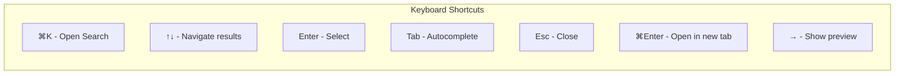

---

## 8. Personalization Features

### 8.1 Smart Suggestions

Hệ thống học từ hành vi user để cải thiện suggestions:

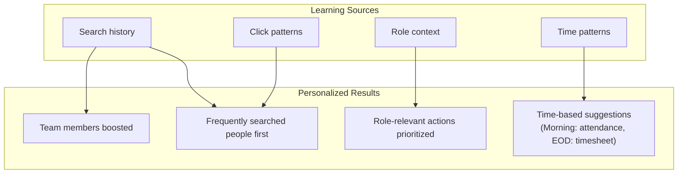

### 8.2 User Preferences

| Setting | Options | Default |
|---------|---------|---------|
| Default search scope | All / People / Navigation | All |
| Results per category | 3 / 5 / 10 | 5 |
| Show preview panel | On / Off | On |
| Search history | Keep / Clear | Keep |
| Keyboard shortcut | Customizable | ⌘K |

---

## 9. Access Control & Security

### 9.1 Role-Based Search Results

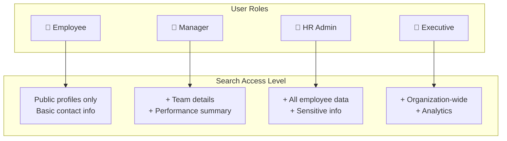

### 9.2 Data Visibility Rules

| Data Type | Employee | Manager | HR Admin | Executive |
|-----------|----------|---------|----------|-----------|
| Name, Photo, Position | ✅ | ✅ | ✅ | ✅ |
| Email, Phone | ✅ | ✅ | ✅ | ✅ |
| Department, Team | ✅ | ✅ | ✅ | ✅ |
| Manager info | ✅ | ✅ | ✅ | ✅ |
| Skills, Certifications | ✅ | ✅ | ✅ | ✅ |
| Salary, Compensation | ❌ | ❌ | ✅ | ✅ |
| Performance ratings | ❌ | Team only | ✅ | ✅ |
| Personal documents | ❌ | ❌ | ✅ | ✅ |
| Disciplinary records | ❌ | ❌ | ✅ | ❌ |

---

## 10. Feature Rollout Plan

### 10.1 Phase Overview

```mermaid
gantt
    title Global Search Feature Rollout
    dateFormat YYYY-Q
    
    section Phase 1 - MVP
    Basic People Search          :p1a, 2025-Q1, 1q
    Basic Menu Search            :p1b, 2025-Q1, 1q
    Search UI Component          :p1c, 2025-Q1, 1q
    
    section Phase 2 - Enhanced
    Prefix System (@, /, >)      :p2a, 2025-Q2, 1q
    Fuzzy & Vietnamese           :p2b, 2025-Q2, 1q
    Recent & History             :p2c, 2025-Q2, 1q
    
    section Phase 3 - Advanced
    xTQL Query Language          :p3a, 2025-Q3, 1q
    Saved Searches               :p3b, 2025-Q3, 1q
    Personalization              :p3c, 2025-Q3, 1q
    
    section Phase 4 - AI
    Natural Language Search      :p4a, 2025-Q4, 1q
    Intent Detection             :p4b, 2025-Q4, 1q
    Smart Suggestions            :p4c, 2025-Q4, 1q
```

### 10.2 Phase 1: MVP Features

**Timeline**: Q1 2025

| Feature | Description | Priority |
|---------|-------------|----------|
| Basic People Search | Tìm theo tên, email, ID | P0 |
| Basic Menu Search | Navigate đến các menu chính | P0 |
| Search Bar UI | Component ở header | P0 |
| Autocomplete | Real-time suggestions | P0 |
| Keyboard shortcut | ⌘K để mở search | P0 |

### 10.3 Phase 2: Enhanced Search

**Timeline**: Q2 2025

| Feature | Description | Priority |
|---------|-------------|----------|
| Prefix System | @, /, > để filter scope | P1 |
| Fuzzy Matching | Tolerance cho typos | P1 |
| Vietnamese Support | Tìm có/không dấu | P1 |
| Search History | Recent searches | P1 |
| Result Preview | Quick view panel | P2 |

### 10.4 Phase 3: Advanced Features

**Timeline**: Q3 2025

| Feature | Description | Priority |
|---------|-------------|----------|
| xTQL Language | Query language cho power users | P2 |
| Saved Searches | Lưu và share queries | P2 |
| Extended Attributes | Tìm theo skills, tenure, etc. | P2 |
| Personalization | Learn từ user behavior | P2 |

### 10.5 Phase 4: AI-Powered

**Timeline**: Q4 2025

| Feature | Description | Priority |
|---------|-------------|----------|
| Natural Language | "tìm dev biết Python" | P3 |
| Intent Detection | Auto-detect search type | P3 |
| Smart Ranking | Context-aware results | P3 |
| Conversational | Follow-up queries | P3 |

---

## 11. Success Metrics

### 11.1 Key Performance Indicators

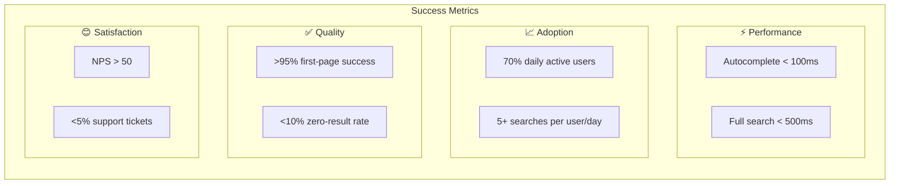

### 11.2 Measurement Plan

| Metric | Target | Measurement Method |
|--------|--------|-------------------|
| Search latency | P95 < 100ms | Application monitoring |
| Adoption rate | 70% in 3 months | Analytics tracking |
| Search success rate | >95% | Click-through tracking |
| Zero-result rate | <10% | Query analytics |
| User satisfaction | NPS > 50 | In-app survey |
| Feature discovery | +30% | A/B testing |

---

## 12. Open Questions for Discussion

### 12.1 Product Decisions Needed

```mermaid
mindmap
  root((Discussion Points))
    Scope
      MVP feature set?
      Which modules include first?
      Mobile support timeline?
    UX
      Prefix symbols (@, /, >)?
      Preview panel default on/off?
      Max results per category?
    xTQL
      Syntax complexity level?
      Target user segment?
      Query builder UI needed?
    AI Features
      Phase 3 or Phase 4?
      Vietnamese NLP priority?
      Training data strategy?
    Security
      Sensitive data in search?
      Audit logging level?
      Data retention policy?
```

### 12.2 Key Questions

1. **Scope**: Có nên include document/attachment search trong MVP không?

2. **Prefix Design**: Prefix symbols (@, /, >) có phù hợp với user base của xTalent không? Có alternative nào khác?

3. **xTQL Complexity**: Query language nên đơn giản hóa đến mức nào? Có cần visual query builder không?

4. **Mobile Experience**: Search experience trên mobile app sẽ khác gì so với web?

5. **Vietnamese Priority**: Mức độ ưu tiên cho Vietnamese NLP features (synonym, intent detection)?

6. **Data Sensitivity**: Những data nào KHÔNG nên searchable (salary, disciplinary)?

7. **Integration**: Có cần integrate với external systems (Slack, Email) trong tương lai không?

---

## 13. Appendix

### A. Competitive Analysis Summary

| Feature | Oracle HCM | SAP SF | Workday | xTalent (Proposed) |
|---------|------------|--------|---------|-------------------|
| Unified Search | ✅ | ✅ | ✅ | ✅ |
| Prefix System | ❌ | ❌ | ✅ | ✅ |
| Fuzzy Search | ✅ (2 char) | ✅ (1 char) | Limited | ✅ (2 char) |
| Natural Language | Basic | Action Search | Assistant | Phase 4 |
| Query Language | ❌ | ❌ | ❌ | xTQL ✅ |
| Vietnamese | Limited | Limited | Limited | Native ✅ |

### B. Glossary

| Term | Definition |
|------|------------|
| **Global Search** | Unified search interface accessible from anywhere |
| **Prefix** | Special character to narrow search scope (@, /, >) |
| **xTQL** | xTalent Query Language - structured query syntax |
| **Fuzzy Search** | Search that tolerates spelling mistakes |
| **Intent Detection** | AI determining what user wants to do |
| **Autocomplete** | Real-time suggestions while typing |

---

*Document Status: Draft for Review*  
*Next Review: [TBD with Product Team]*