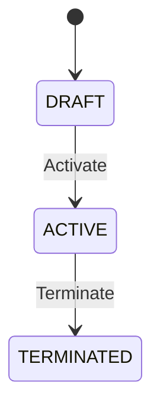

# Quick Start Guide

**Time to Complete**: 5 minutes  
**Audience**: Everyone

---

## 🎯 What You'll Learn

1. The 4-layer architecture
2. Two paths: Domain-First vs ERD-First
3. How to read an entity file
4. How to navigate the documentation
5. Your first contribution

---

## 📐 The 4-Layer Architecture

Think of it like building a house:

```
┌─────────────────────────────────────────┐
│  IMPLEMENTATION   │  The actual house   │  ← Code, tests, deployments
├───────────────────┼─────────────────────┤
│  DESIGN           │  Blueprints         │  ← Database, API specs
├───────────────────┼─────────────────────┤
│  SPECIFICATION    │  Requirements list  │  ← What exactly to build
├───────────────────┼─────────────────────┤
│  CONCEPT          │  How rooms connect  │  ← Business understanding
├───────────────────┼─────────────────────┤
│  ONTOLOGY         │  Room definitions   │  ← What things ARE
└─────────────────────────────────────────┘
```

**Key Principle**: Each layer builds on the one below.

---

## 🛤️ Two Starting Paths

### Path A: Domain-First (Traditional)

Start from business concepts, work down to implementation:

```
Glossary → Entity YAML → Concept Guide → Business Rules → BDD → Code
```

**Best for**: New projects, greenfield development

### Path B: ERD-First (Reverse Engineering)

Start from database design, AI enriches to full ontology:

```
DBML/ERD → AI Enrichment → Entity YAML → Extract Glossary → Generate Docs
```

**Best for**: Existing systems, POs who think in data structures

👉 **Full Guide**: [ERD-FIRST-WORKFLOW.md](./ERD-FIRST-WORKFLOW.md)

---

## 📖 Reading an Entity File

Entity files use **Markdown + YAML Frontmatter** format (`*.onto.md`).

### The 5 Core Sections

Every entity MUST have these sections in YAML frontmatter:

```
Entity
├─ attributes       # Properties
├─ relationships    # Links (wiki-style [[Entity]])
├─ lifecycle        # Valid states
├─ actions          # What CAN be done
└─ policies         # Constraints, access control
```

### Example Entity File

```markdown
---
# File: 00-ontology/domain/workforce/employee.onto.md

$schema: "ontology/entity/v4"
$id: "xtalent:core-hr:workforce:employee"

entity: Employee
classification: AGGREGATE_ROOT
definition: "A person employed by the organization"

attributes:
  employee_code: { type: string, required: true, unique: true }
  full_name: { type: string, required: true }
  hire_date: { type: date, required: true }
  status: { type: enum, values: [DRAFT, ACTIVE, TERMINATED] }

relationships:
  department: { target: "[[Department]]", cardinality: "N:1" }
  assignments: { target: "[[Assignment]]", cardinality: "1:N" }

lifecycle:
  valid_states: [DRAFT, ACTIVE, INACTIVE, TERMINATED]

actions:
  - name: Activate
    ref: "[[actions/activate-employee]]"
    applicable_when: "status = 'DRAFT'"
  - name: Terminate
    ref: "[[actions/terminate-employee]]"
    applicable_when: "status = 'ACTIVE'"

policies:
  constraints:
    - rule: "hire_date <= today()"
  access_control:
    sensitive: [salary, ssn]
---

# Employee

## Mô tả
Nhân viên là entity trung tâm của hệ thống HR...

## Lifecycle

```

### What Each Section Means

| Section | Purpose | In YAML or Markdown? |
|---------|---------|---------------------|
| `attributes` | Data fields | YAML (machine-readable) |
| `relationships` | Links to other entities | YAML (graph linking) |
| `lifecycle` | Valid states | YAML (validation) |
| `actions` | Available operations | YAML (capability discovery) |
| `policies` | Business constraints | YAML (rules engine) |
| Mô tả, diagrams | Human context | Markdown body |

---

## 🗺️ Navigation Guide

### Finding What You Need

**"I need to understand what an Employee is"**
→ `00-ontology/domain/01-workforce/employee.entity.yaml`

**"I need to understand how hiring works"**
→ `01-concept/01-workforce/hire-employee.guide.md`

**"I need the exact business rules for termination"**
→ `02-spec/02-BR/BR-workforce.md`

**"I need to write tests for termination"**
→ `02-spec/03-BDD/termination.feature`

### Directory Structure

```
MODULE/
├── README.md                    # Module overview
├── 00-ontology/                 # WHAT exists (*.onto.md)
│   ├── domain/{sub}/            # Entity definitions
│   └── glossary/                # Terms & definitions
├── 01-concept/                  # HOW it works
│   └── {sub}/                   # Guides
├── 02-spec/                     # EXACT requirements
│   ├── 01-FR/                   # Functional requirements
│   ├── 02-BR/                   # Business rules
│   └── 03-BDD/                  # Gherkin scenarios
└── 03-design/                   # TECHNICAL specs
    └── *.dbml                   # Database design
```

---

## ✏️ Your First Contribution

### Scenario: Add a new attribute to Employee

**Step 1**: Find the entity file
```bash
vim 00-ontology/domain/01-workforce/employee.entity.yaml
```

**Step 2**: Add the attribute in the `attributes` section
```yaml
attributes:
  # ... existing attributes ...
  
  emergency_contact:
    type: string
    required: false
    description: "Emergency contact phone number"
    pattern: "^\\+?[0-9]{10,15}$"
```

**Step 3**: If it affects business rules, update the BR file
```bash
vim 02-spec/02-BR/BR-workforce.md
```

**Step 4**: If it needs testing, add a BDD scenario
```bash
vim 02-spec/03-BDD/employee-validation.feature
```

**Step 5**: Commit with proper message
```bash
git commit -m "feat(core-hr): add emergency_contact to Employee entity"
```

---

## 🤖 AI Agent Quick Reference

If you're an AI agent, here's your cheat sheet:

### To Generate Code from Entity
1. Read `entity.yaml` file
2. Check `ai_instructions` section for specific guidance
3. Use `relationships` to understand foreign keys
4. Use `lifecycle` to implement state machine

### To Answer Questions About Domain
1. Start with `*.glossary.yaml` for definitions
2. Check `*.entity.yaml` for structure
3. Check `*.workflow.yaml` for processes
4. Check `01-concept/*.guide.md` for business context

### To Generate Tests
1. Read `02-spec/05-BDD/*.feature` files
2. Cross-reference with `02-spec/04-BR/*.md` for rules
3. Use `$id` URIs for traceability

---

## 🔗 Next Steps

| Your Role | Read Next |
|-----------|-----------|
| **PO/BA (ERD-first)** | [ERD-FIRST-WORKFLOW.md](./ERD-FIRST-WORKFLOW.md) |
| Developer | [ENTITY-SCHEMA.md](../03-schemas/ENTITY-SCHEMA.md) |
| BA/PO (Domain-first) | [ARCHITECTURE.md](../02-architecture/ARCHITECTURE.md) |
| QA | [BDD-INTEGRATION.md](../05-guides/BDD-INTEGRATION.md) |
| AI Agent | [AI-AGENT-GUIDE.md](../05-guides/AI-AGENT-GUIDE.md) |
| Architect | [ARCHITECTURE.md](../02-architecture/ARCHITECTURE.md) |
| Format questions | [FORMAT-GUIDELINES.md](./FORMAT-GUIDELINES.md) |

---

## 💡 Tips

1. **Choose your path** — Domain-first or ERD-first based on your context
2. **One file = One entity** — Keeps context manageable
3. **Cross-reference using `$id`** — Enables full traceability
4. **YAML for data, Markdown for explanation** — See [FORMAT-GUIDELINES.md](./FORMAT-GUIDELINES.md)
5. **When in doubt, check the Concept layer** — It explains the "why"

