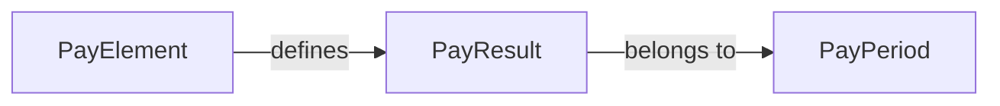

# Four Model Comparison

**Version**: 1.0  
**Last Updated**: 2025-12-25  
**Audience**: All roles (BA, Developer, Architect)  
**Purpose**: The backbone of ontology-driven architecture — Understanding the 4 fundamental model types

---

## 🎯 Why This Matters

**99% of architecture debates** stem from mixing these 4 concepts:

1. **Ontology** — What things exist
2. **Concept Model** — How we understand them
3. **Workflow/Process** — How things happen over time
4. **Transaction/Fact** — What already happened

Understanding their differences prevents:
- Scope creep in domain modeling
- Incorrect database design
- Confusion in API responsibilities
- Testing gaps

---

## 📊 The Comparison Matrix

### Primary Comparison

| Dimension | Ontology | Concept Model | Workflow | Transaction |
|-----------|----------|---------------|----------|-------------|
| **Purpose** | Define business truth | Explain understanding | Execute over time | Record facts |
| **Question Answered** | *What exists?* | *How do we think about it?* | *How does it happen?* | *What happened?* |
| **Time Dependency** | Time-independent | Time-independent | Time-sequential | Point-in-time |
| **Mutability** | Mutable (has lifecycle) | Static (documentation) | Transient (runtime) | Immutable (audit) |
| **Has Instances?** | Template, not instance | No | Creates instances | IS an instance |
| **Generates Data?** | ❌ No | ❌ No | ✅ Yes | ✅ Yes (itself) |
| **Stored Where?** | YAML/Git | Markdown/Git | Engine/Runtime | Database Tables |

### Technical Characteristics

| Aspect | Ontology | Concept Model | Workflow | Transaction |
|--------|----------|---------------|----------|-------------|
| **File Format** | `*.entity.yaml` | `*.concept.md` | `*.workflow.yaml` | DB record |
| **Primary Key** | Business ID | N/A | Execution ID | Event ID + Timestamp |
| **Versioning** | Schema version | Document version | Process version | Immutable |
| **Cardinality** | Single definition | Multiple views | Multiple executions | Unbounded records |
| **Relationships** | Defines links | Explains links | Uses links | References entities |

---

## 🔍 Deep Dive: Each Model Type

### 1. Ontology (The Foundation)

> **"What things EXIST in the business domain?"**

**Characteristics**:
- Defines the vocabulary of your domain
- Describes structure and meaning, not behavior
- Independent of time or execution
- Single source of truth for business semantics

**File Format**: Markdown + YAML Frontmatter (`*.onto.md`)

**The 5 Core Sections**:
```
Entity
├─ attributes       # Properties
├─ relationships    # Links to other entities
├─ lifecycle        # Valid states (type-level)
├─ actions          # What CAN be done
└─ policies         # Constraints, access control
```

**Examples from Core HR + Total Rewards**:

| Entity | Why It's Ontology |
|--------|-------------------|
| Employee | Has identity, exists as a business concept |
| Position | Business concept representing a role |
| PayElement | Defines compensation types that CAN exist |
| BenefitPlan | Describes available benefits, not instances |

**Example Entity File**:
```markdown
---
entity: PayElement
classification: AGGREGATE_ROOT
definition: "A configurable component of compensation"

attributes:
  code: { type: string, required: true }
  element_type: { type: enum, values: [EARNING, DEDUCTION] }

relationships:
  category: { target: "[[PayCategory]]", cardinality: "N:1" }

lifecycle:
  valid_states: [DRAFT, ACTIVE, INACTIVE]

actions:
  - ref: "[[actions/activate-pay-element]]"
    applicable_when: "status = 'DRAFT'"

policies:
  constraints:
    - rule: "code IS UNIQUE"
---

# PayElement

## Mô tả
PayElement định nghĩa các loại trả lương có thể áp dụng...
```

---

### 2. Concept Model (The Understanding)

> **"How do we UNDERSTAND and COMMUNICATE about the domain?"**

**Characteristics**:
- Explains relationships between entities
- Provides business context
- Contains diagrams, examples, edge cases
- Human-readable documentation

**Examples from Core HR + Total Rewards**:

| Concept Document | What It Explains |
|------------------|------------------|
| Employment Lifecycle Guide | How Employee, Position, Contract relate |
| Total Rewards Philosophy | How Pay, Benefits, Recognition combine |
| Eligibility Framework | How EligibilityProfile, Rules, Evaluation work |

**Markdown Example**:
```markdown
# Pay Element Concept Guide

## Overview
Pay Elements are the building blocks of compensation...

## Relationship to PayResult


## Business Rules
- Each PayElement must belong to a category
- Elements can be recursive (base + supplements)
```

---

### 3. Workflow / Process (The Execution)

> **"How does something HAPPEN over time?"**

**Characteristics**:
- Has steps, transitions, triggers
- Creates or modifies instances
- Has runtime state
- Time-dependent execution

**Examples from Core HR + Total Rewards**:

| Workflow | What It Does |
|----------|--------------|
| Hire Employee | Creates Employee, Contract, Assignment instances |
| Run Payroll | Calculates and creates PayResult records |
| Enroll in Benefits | Creates Enrollment instances |
| Promote Employee | Modifies Assignment, may create new Contract |

**Workflow YAML Example**:
```yaml
workflow: RunPayroll
definition: "Process payroll for a pay period"

triggers:
  - type: SCHEDULED
    cron: "0 0 1 * *"  # 1st of each month
  - type: MANUAL
    role: PAYROLL_ADMIN

steps:
  - id: collect_time
    action: CollectTimeData
    
  - id: calculate
    action: CalculatePayElements
    depends_on: collect_time
    
  - id: generate_results
    action: GeneratePayResults
    depends_on: calculate
    
  - id: approve
    action: AwaitApproval
    depends_on: generate_results

outputs:
  - PayResult[]  # Creates transaction records
```

---

### 4. Transaction / Fact (The Record)

> **"What ALREADY HAPPENED?"**

**Characteristics**:
- Immutable after creation
- Point-in-time occurrence
- Generated by workflows
- Used for audit, history, analytics

**Examples from Core HR + Total Rewards**:

| Transaction | What It Records |
|-------------|-----------------|
| EmployeeStatusChange | When and how employee status changed |
| PayResult | The actual pay for a period |
| EnrollmentEvent | When someone enrolled/unenrolled |
| PositionAssignment | When assignment started/ended |

**Database Table Example**:
```sql
-- This is a TRANSACTION, not ontology
CREATE TABLE pay_result (
    id UUID PRIMARY KEY,
    pay_period_id UUID NOT NULL,
    employee_id UUID NOT NULL,
    pay_element_id UUID NOT NULL,
    amount DECIMAL(18,4) NOT NULL,
    calculated_at TIMESTAMP NOT NULL,
    calculated_by UUID NOT NULL,
    -- Immutable: no updated_at column
    CONSTRAINT fk_pay_period FOREIGN KEY (pay_period_id) 
        REFERENCES pay_period(id),
    CONSTRAINT fk_employee FOREIGN KEY (employee_id) 
        REFERENCES employee(id),
    CONSTRAINT fk_pay_element FOREIGN KEY (pay_element_id) 
        REFERENCES pay_element(id)
);
```

---

## 📋 Side-by-Side Example: Total Rewards

Using a single domain to show all 4 types:

| Type | Artifact | Content |
|------|----------|---------|
| **Ontology** | `pay-element.entity.yaml` | Defines PayElement structure: code, name, type, calculation_rule |
| **Concept** | `pay-element-guide.md` | Explains how PayElements work, categories, examples |
| **Workflow** | `run-payroll.workflow.yaml` | Steps to calculate pay, uses PayElements as input |
| **Transaction** | `pay_result` table | Actual pay amounts calculated, immutable records |

```
┌─────────────────────────────────────────────────────────────────┐
│                        TOTAL REWARDS FLOW                        │
│                                                                  │
│  ┌──────────────┐   ┌──────────────┐   ┌──────────────┐         │
│  │   ONTOLOGY   │   │   CONCEPT    │   │  WORKFLOW    │         │
│  │              │   │              │   │              │         │
│  │  PayElement  │──▶│  Guide.md    │   │  RunPayroll  │         │
│  │  BenefitPlan │   │  explains    │   │  uses        │         │
│  │  Deduction   │   │  relationships  │ entities    │         │
│  └──────────────┘   └──────────────┘   └──────┬───────┘         │
│         │                                      │                 │
│         │                                      ▼                 │
│         │                              ┌──────────────┐         │
│         │                              │ TRANSACTION  │         │
│         └─────────────────────────────▶│              │         │
│                  referenced by         │  PayResult   │         │
│                                        │  (immutable) │         │
│                                        └──────────────┘         │
└─────────────────────────────────────────────────────────────────┘
```

---

## 🎯 Decision Guide: Which Type Am I Creating?

### Flowchart

```
┌─────────────────────────────────────┐
│   Am I defining WHAT something IS?  │
└─────────────────────┬───────────────┘
                      │
          ┌───────────┴───────────┐
          │                       │
         YES                      NO
          │                       │
          ▼                       ▼
    ┌───────────┐     ┌─────────────────────────────┐
    │ ONTOLOGY  │     │ Am I explaining HOW to      │
    └───────────┘     │ UNDERSTAND it?              │
                      └─────────────┬───────────────┘
                                    │
                        ┌───────────┴───────────┐
                        │                       │
                       YES                      NO
                        │                       │
                        ▼                       ▼
                  ┌───────────┐     ┌─────────────────────────────┐
                  │  CONCEPT  │     │ Am I describing STEPS that  │
                  │   MODEL   │     │ happen over TIME?           │
                  └───────────┘     └─────────────┬───────────────┘
                                                  │
                                      ┌───────────┴───────────┐
                                      │                       │
                                     YES                      NO
                                      │                       │
                                      ▼                       ▼
                                ┌───────────┐           ┌───────────┐
                                │ WORKFLOW  │           │TRANSACTION│
                                └───────────┘           │  / FACT   │
                                                        └───────────┘
```

---

## 📊 Summary Table for Quick Reference

| Criterion | Ontology | Concept | Workflow | Transaction |
|-----------|:--------:|:-------:|:--------:|:-----------:|
| Answers "What exists?" | ✅ | ❌ | ❌ | ❌ |
| Answers "How to understand?" | ❌ | ✅ | ❌ | ❌ |
| Answers "How it happens?" | ❌ | ❌ | ✅ | ❌ |
| Answers "What happened?" | ❌ | ❌ | ❌ | ✅ |
| Has lifecycle states | ✅ | ❌ | ⚠️ Runtime | ❌ |
| Stored in Git | ✅ | ✅ | ✅ | ❌ |
| Stored in Database | Template only | ❌ | State only | ✅ |
| Mutable after creation | ✅ | ✅ | ⚠️ | ❌ |
| Used by AI for generation | ✅✅ | ✅ | ✅ | ❌ |

---

## 🔗 Related Documents

- [WHAT-IS-NOT-ONTOLOGY.md](../00-getting-started/WHAT-IS-NOT-ONTOLOGY.md) — Detailed examples of what's NOT ontology
- [ENTITY-SCHEMA.md](../03-schemas/ENTITY-SCHEMA.md) — How to write ontology entities
- [WORKFLOW-SCHEMA.md](../03-schemas/WORKFLOW-SCHEMA.md) — How to define workflows
- [ARCHITECTURE.md](../02-architecture/ARCHITECTURE.md) — Full framework architecture

---

## 💡 Key Takeaways

1. **Ontology is the foundation** — Everything else references it
2. **Concept explains ontology** — Makes it understandable to humans
3. **Workflows use ontology** — To create and modify instances
4. **Transactions record changes** — Immutable history of what happened

> **Golden Rule**: If you're unsure, it's probably NOT ontology. Ontology should be obvious business concepts that any domain expert would recognize.
