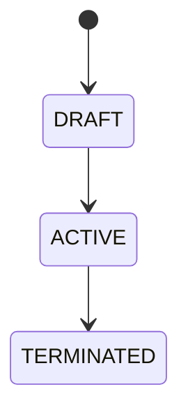

# Ontology Guardrails

**Version**: 2.0  
**Last Updated**: 2025-12-26  
**Purpose**: One-page guide on what ontology MUST and MUST NOT contain

---

## 📐 The 5 Core Sections

Every ontology entity file MUST have these 5 sections:

```
Entity (*.onto.md)
├─ attributes       # Properties of the entity
├─ relationships    # Links to other entities [[wiki-links]]
├─ lifecycle        # Valid states (type-level)
├─ actions          # What CAN be done (references)
└─ policies         # Constraints, access control, eligibility
```

---

## ✅ What Goes in YAML Frontmatter (Data Layer)

| Section | Content | Purpose |
|---------|---------|---------|
| **attributes** | `name`, `type`, `required`, `description` | Schema validation, code generation |
| **relationships** | `target: [[Entity]]`, `cardinality` | Graph linking, navigation |
| **lifecycle** | `valid_states: [DRAFT, ACTIVE, ...]` | State validation (type-level only) |
| **actions** | `ref: [[action-name]]`, `applicable_when` | Capability discovery |
| **policies** | `constraints`, `access_control`, `eligibility` | Business rules, security |

---

## ✅ What Goes in Markdown Body (Context Layer)

| Content | Purpose |
|---------|---------|
| **Mô tả entity** | Human-readable explanation |
| **Lifecycle Visualization** | Mermaid stateDiagram |
| **Relationship Diagram** | Mermaid graph |
| **Policies Explained** | Why these rules exist |
| **For AI Agents** | Generation instructions |

---

## ❌ Ontology MUST NOT Contain

| Element | Why Not | Where It Belongs |
|---------|---------|------------------|
| **State Transitions** | Runtime behavior | Action definitions |
| **Execution Steps** | "How", not "what" | Workflow files |
| **Approval Flows** | Process orchestration | Workflow files |
| **UI Behavior** | Presentation layer | UI Spec |
| **API Endpoints** | Implementation | OpenAPI Spec |
| **Database Columns** | Physical storage | DBML Schema |

---

## 🎯 Quick Decision

| Question | If YES | If NO |
|----------|--------|-------|
| Does it describe what something IS? | ✅ Ontology | ❌ Not ontology |
| Is it independent of execution? | ✅ Ontology | ❌ Workflow |
| Would a domain expert recognize it? | ✅ Ontology | ❌ Technical artifact |

---

## 📝 Minimal Template

```markdown
---
$schema: "ontology/entity/v4"
$id: "xtalent:module:domain:entity"

entity: EntityName
classification: AGGREGATE_ROOT
definition: "What this entity IS"
purpose: "Why it exists"

attributes:
  id: { type: uuid, required: true }
  code: { type: string, required: true, unique: true }
  status: { type: enum, values: [DRAFT, ACTIVE] }

relationships:
  parent: { target: "[[ParentEntity]]", cardinality: "N:1" }

lifecycle:
  valid_states: [DRAFT, ACTIVE, TERMINATED]

actions:
  - name: Activate
    ref: "[[actions/activate]]"
    applicable_when: "status = 'DRAFT'"

policies:
  constraints:
    - rule: "code IS NOT NULL"
  access_control:
    classification: INTERNAL
---

# EntityName

## Mô tả
...

## Lifecycle

```

---

## 🚨 Red Flags

If you see these in ontology YAML, it's wrong:

| Red Flag | What It Really Is |
|----------|-------------------|
| `transitions:` with execution logic | Workflow |
| `steps:`, `sequence:` | Process definition |
| `when user clicks...` | UI behavior |
| `API returns...` | Implementation |
| `after 24 hours...` | Process timing |

---

## 💡 Golden Rule

> **YAML Frontmatter = Data for machines**
> **Markdown Body = Context for humans**
>
> AI reads YAML to generate code. Humans read Markdown to understand.

---

## 🔗 Related

- [ENTITY-SCHEMA.md](../03-schemas/ENTITY-SCHEMA.md) — Full schema specification
- [FOUR-MODEL-COMPARISON.md](./FOUR-MODEL-COMPARISON.md) — Ontology vs Concept vs Workflow
