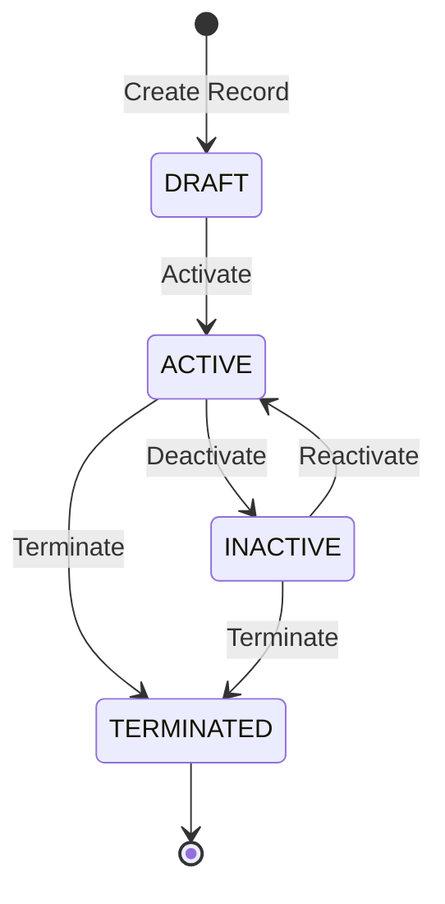
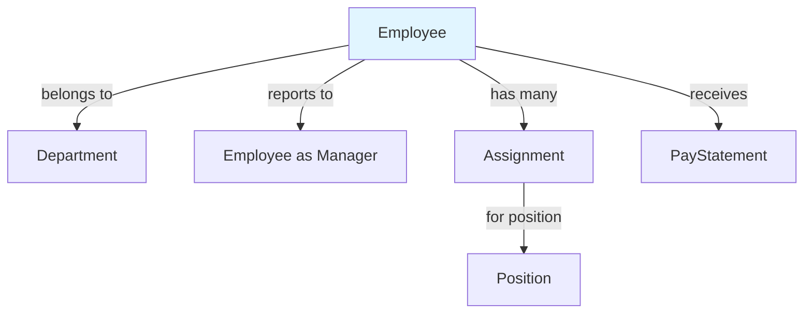

# Entity Schema Specification

**Version**: 4.0  
**Format**: Markdown + YAML Frontmatter  
**Audience**: AI Agents, Developers, Architects

---

## 🎯 Purpose

This specification defines the standard format for **Ontology Entity files**. Each entity file:

1. Uses **Markdown with YAML Frontmatter** format
2. Contains **5 core ontology sections** in YAML (machine-readable)
3. Contains **contextual documentation** in Markdown body (human-readable)

> **File Extension**: `*.onto.md`

---

## 📐 Philosophy: Data vs Context

| Layer | Location | Purpose | Consumed By |
|-------|----------|---------|-------------|
| **Data** | YAML Frontmatter | Validation, indexing, graph linking, automation | Python, AI, Tools |
| **Context** | Markdown Body | Explanation, visualization, examples | Humans |

---

## 📋 The 5 Core Ontology Sections

Every entity MUST have these 5 sections in YAML frontmatter:

```
Entity
├─ attributes       # Properties of the entity
├─ relationships    # Links to other entities (wiki-links)
├─ lifecycle        # Valid states (type-level, not runtime)
├─ actions          # What CAN be done (references)
└─ policies         # Constraints, access control, eligibility
```

---

## 📄 Complete File Template

```markdown
---
# ============================================================================
# ENTITY ONTOLOGY v4.0
# ============================================================================
# Format: Markdown + YAML Frontmatter
# File: *.onto.md

$schema: "ontology/entity/v4"
$id: "xtalent:core-hr:workforce:employee"

# ----------------------------------------------------------------------------
# ENTITY IDENTITY
# ----------------------------------------------------------------------------
entity: Employee
classification: AGGREGATE_ROOT   # AGGREGATE_ROOT | ENTITY | VALUE_OBJECT | REFERENCE_DATA
module: CORE-HR
submodule: workforce

definition: "A person formally employed by the organization"
purpose: "Central entity for workforce management, payroll, and HR processes"

# ----------------------------------------------------------------------------
# 1. ATTRIBUTES
# ----------------------------------------------------------------------------
attributes:
  # Primary key
  id:
    type: uuid
    required: true
    description: "Unique identifier"
    
  # Business key
  employee_code:
    type: string
    required: true
    unique: true
    pattern: "^EMP[0-9]{6}$"
    description: "Human-readable business code"
    example: "EMP000123"
    
  # Core attributes
  first_name:
    type: string
    required: true
    max_length: 100
    
  last_name:
    type: string
    required: true
    max_length: 100
    
  full_name:
    type: string
    derived: "concat(first_name, ' ', last_name)"
    description: "Computed full name"
    
  email:
    type: string
    format: email
    required: true
    unique: true
    
  hire_date:
    type: date
    required: true
    
  status:
    type: enum
    values: [DRAFT, ACTIVE, INACTIVE, TERMINATED]
    default: DRAFT
    
  years_of_service:
    type: decimal
    derived: "datediff('year', hire_date, today())"
    description: "Calculated years since hire"

# ----------------------------------------------------------------------------
# 2. RELATIONSHIPS
# ----------------------------------------------------------------------------
# Use wiki-links [[Entity]] for graph navigation (Obsidian/Foam compatible)
relationships:
  department:
    target: "[[Department]]"
    target_ref: "xtalent:core-hr:org-structure:department"
    cardinality: "N:1"
    required: true
    description: "The department this employee belongs to"
    
  manager:
    target: "[[Employee]]"
    target_ref: "xtalent:core-hr:workforce:employee"
    cardinality: "N:1"
    required: false
    description: "Direct manager (self-reference)"
    
  direct_reports:
    target: "[[Employee]]"
    cardinality: "1:N"
    inverse_of: manager
    description: "Employees reporting to this manager"
    
  assignments:
    target: "[[Assignment]]"
    target_ref: "xtalent:core-hr:workforce:assignment"
    cardinality: "1:N"
    description: "Job assignments for this employee"

# ----------------------------------------------------------------------------
# 3. LIFECYCLE
# ----------------------------------------------------------------------------
# Type-level states only. NO transitions (that's workflow concern)
lifecycle:
  state_attribute: status
  valid_states:
    - state: DRAFT
      description: "Initial state, record created but not active"
      initial: true
    - state: ACTIVE
      description: "Currently employed and working"
    - state: INACTIVE
      description: "Temporarily not working (leave, suspension)"
    - state: TERMINATED
      description: "Employment ended"
      terminal: true

# ----------------------------------------------------------------------------
# 4. ACTIONS
# ----------------------------------------------------------------------------
# What CAN be done with this entity. References only, no execution details.
actions:
  - name: Activate
    ref: "[[actions/activate-employee]]"
    description: "Change status from DRAFT to ACTIVE"
    applicable_when: "status = 'DRAFT'"
    
  - name: Deactivate
    ref: "[[actions/deactivate-employee]]"
    description: "Temporarily suspend employee"
    applicable_when: "status = 'ACTIVE'"
    
  - name: Reactivate
    ref: "[[actions/reactivate-employee]]"
    description: "Return from suspension"
    applicable_when: "status = 'INACTIVE'"
    
  - name: Terminate
    ref: "[[actions/terminate-employee]]"
    description: "End employment"
    applicable_when: "status IN ('ACTIVE', 'INACTIVE')"
    requires:
      - termination_date
      - termination_reason

# ----------------------------------------------------------------------------
# 5. POLICIES
# ----------------------------------------------------------------------------
policies:
  # Data constraints
  constraints:
    - id: POL-001
      rule: "hire_date <= today()"
      message: "Hire date cannot be in the future"
      severity: ERROR
      
    - id: POL-002
      rule: "termination_date IS NULL OR termination_date >= hire_date"
      message: "Termination date must be on or after hire date"
      severity: ERROR
      
    - id: POL-003
      rule: "manager_id != id"
      message: "Employee cannot be their own manager"
      severity: ERROR
      
  # Access control
  access_control:
    classification: CONFIDENTIAL
    sensitive_attributes:
      - salary
      - ssn
      - birth_date
    visibility_rules:
      - attribute: salary
        view: [HR_ADMIN, MANAGER]
        edit: [HR_ADMIN]
      - attribute: "*"
        view: [HR_SPECIALIST, HR_ADMIN]
        edit: [HR_SPECIALIST, HR_ADMIN]
        
  # Business eligibility
  eligibility:
    - id: ELIG-001
      name: "Promotion Eligible"
      expression: "status = 'ACTIVE' AND years_of_service >= 2"
      description: "Basic criteria for promotion consideration"
      
    - id: ELIG-002
      name: "Bonus Eligible"
      expression: "status = 'ACTIVE' AND hire_date <= date_sub(today(), 6, 'month')"
      description: "Must be active and employed > 6 months"

# ----------------------------------------------------------------------------
# IMPLEMENTATION HINTS (Optional - not core ontology)
# ----------------------------------------------------------------------------
_hints:
  indexes:
    - columns: [employee_code]
      unique: true
    - columns: [department_id, status]
    - columns: [manager_id]
  history:
    type: SCD2
    tracked: [department_id, status, salary]
  examples:
    - name: "Active Employee"
      data: { employee_code: "EMP000123", status: "ACTIVE" }
---

# Employee

## Mô tả

**Employee** (Nhân viên) là entity trung tâm trong hệ thống HR, đại diện cho một người được tuyển dụng chính thức bởi tổ chức.

### Vai trò trong hệ thống

- **Workforce Management**: Quản lý thông tin nhân sự
- **Payroll**: Cơ sở tính lương, thuế, phúc lợi
- **Time & Attendance**: Chấm công, nghỉ phép
- **Benefits**: Đăng ký và quản lý phúc lợi

## Lifecycle Visualization



### State Meanings

| State | Meaning | Can Do | Cannot Do |
|-------|---------|--------|-----------|
| DRAFT | Record created, not started | Edit all fields | Access systems |
| ACTIVE | Currently working | Full access | - |
| INACTIVE | On leave/suspended | Limited access | Work tasks |
| TERMINATED | No longer employed | - | Anything |

## Relationship Diagram



## Policies Explained

### Constraints

1. **hire_date <= today()**: Ngày tuyển dụng không thể ở tương lai vì đây là sự kiện đã xảy ra
2. **termination_date >= hire_date**: Logic cơ bản - không thể kết thúc trước khi bắt đầu
3. **manager_id != id**: Tránh circular reference trong org hierarchy

### Eligibility Rules

- **Promotion Eligible**: Chỉ xét thăng chức cho nhân viên ACTIVE đã làm việc >= 2 năm
- **Bonus Eligible**: Thưởng yêu cầu >= 6 tháng làm việc để đảm bảo contribution đủ

## For AI Agents

Khi generate code hoặc documents từ entity này:

1. **Parse YAML frontmatter** để lấy structured data
2. **Validate** theo policies.constraints
3. **Generate APIs** dựa trên actions
4. **Apply access_control** khi tạo API permissions
5. **Use examples** trong _hints để tạo test data

## Related Documents

- Concept Guide: `../01-concept/workforce/employee-guide.md`
- Action Details: `../00-ontology/actions/activate-employee.action.md`
- Business Rules: `../02-spec/04-BR/BR-workforce.md`
```

---

## 📊 Section Reference

### Attributes

| Field | Required | Description |
|-------|----------|-------------|
| `type` | ✅ | Data type: uuid, string, integer, decimal, date, datetime, boolean, enum, array, jsonb |
| `required` | ✅ | Is this attribute mandatory? |
| `description` | ✅ | Human-readable description |
| `unique` | ❌ | Must be unique across all instances |
| `default` | ❌ | Default value |
| `pattern` | ❌ | Regex pattern for validation |
| `min_length` / `max_length` | ❌ | String length constraints |
| `min_value` / `max_value` | ❌ | Numeric range constraints |
| `format` | ❌ | Special format: email, url, phone, etc. |
| `derived` | ❌ | Formula for computed attributes |
| `example` | ❌ | Example value |

### Relationships

| Field | Required | Description |
|-------|----------|-------------|
| `target` | ✅ | Wiki-link to target entity `[[Entity]]` |
| `target_ref` | ❌ | Full URI reference |
| `cardinality` | ✅ | `1:1`, `1:N`, `N:1`, `N:N` |
| `required` | ❌ | Is relationship mandatory? |
| `inverse_of` | ❌ | Name of inverse relationship |
| `description` | ✅ | What this relationship means |

### Lifecycle

| Field | Required | Description |
|-------|----------|-------------|
| `state_attribute` | ✅ | Which attribute holds the state |
| `valid_states` | ✅ | List of valid state definitions |
| `valid_states[].state` | ✅ | State name |
| `valid_states[].description` | ✅ | What this state means |
| `valid_states[].initial` | ❌ | Is this the starting state? |
| `valid_states[].terminal` | ❌ | Is this a final state? |

### Actions

| Field | Required | Description |
|-------|----------|-------------|
| `name` | ✅ | Action name |
| `ref` | ✅ | Wiki-link to action definition |
| `description` | ✅ | What this action does |
| `applicable_when` | ❌ | Precondition expression |
| `requires` | ❌ | Required attributes for this action |

### Policies

| Section | Purpose |
|---------|---------|
| `constraints` | Data validation rules |
| `access_control` | Security and visibility rules |
| `eligibility` | Business applicability rules |

---

## 🏷️ Classifications

| Classification | Description | Characteristics |
|---------------|-------------|-----------------|
| `AGGREGATE_ROOT` | Root of an aggregate | Has ID, lifecycle, owns related entities |
| `ENTITY` | Regular entity | Has ID, can exist independently |
| `VALUE_OBJECT` | Immutable value | No ID, equality by attributes |
| `REFERENCE_DATA` | Lookup/config data | Rarely changes, used for dropdowns |

---

## 📂 File Organization

```
module/
├── 00-ontology/
│   ├── domain/
│   │   ├── workforce/
│   │   │   ├── employee.onto.md           # Entity definition
│   │   │   ├── assignment.onto.md
│   │   │   └── terminate-employee.action.md  # Optional, for complex actions
│   │   └── org-structure/
│   │       └── department.onto.md
│   └── glossary/
│       └── workforce.glossary.md
├── 01-concept/
│   └── workforce/
│       └── employee-guide.md
├── 02-spec/
│   ├── 01-FR/                    # Functional requirements
│   ├── 02-BR/                    # Business rules
│   └── 03-BDD/                   # Gherkin scenarios
└── 03-design/
    └── database.dbml
```

> **Note**: Actions are defined inline in entity files. 
> Only create separate `*.action.md` for complex actions with many parameters.

---

## 🔗 Related Documents

- [ONTOLOGY-GUARDRAILS.md](../01-core-principles/ONTOLOGY-GUARDRAILS.md) — What MUST/MUST NOT be in ontology
- [FOUR-MODEL-COMPARISON.md](../01-core-principles/FOUR-MODEL-COMPARISON.md) — Ontology vs Concept vs Workflow vs Transaction
- [DIRECTORY-STRUCTURE.md](../02-architecture/DIRECTORY-STRUCTURE.md) — File organization
