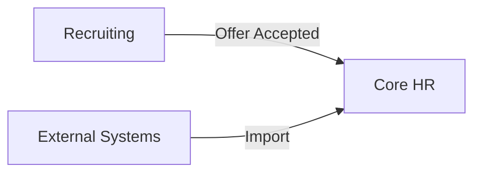
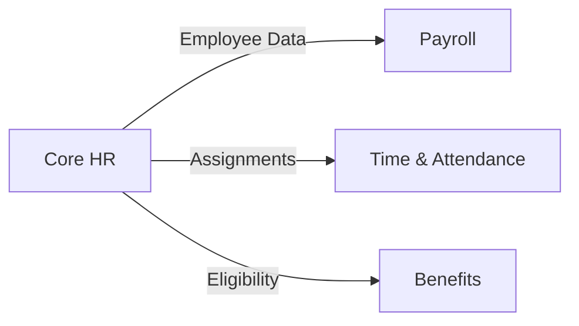
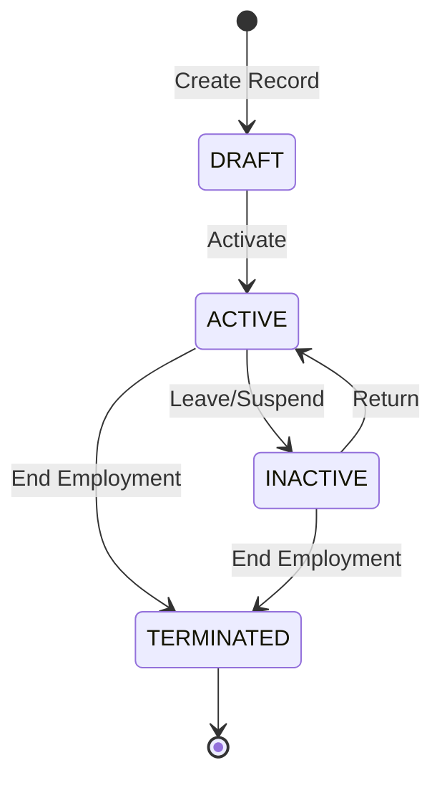
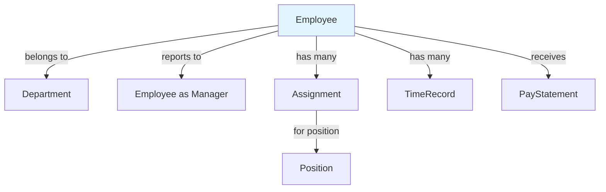
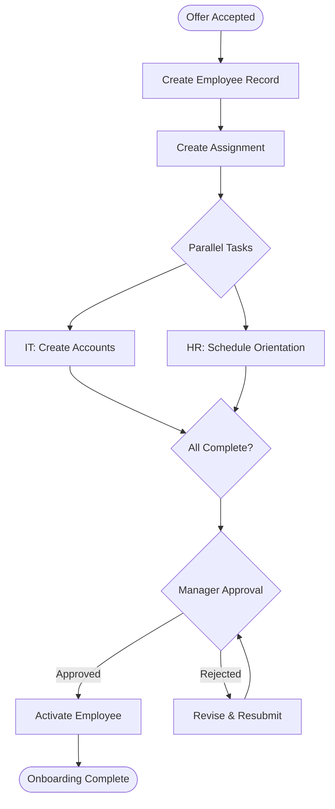

# Concept Layer Templates

**Version**: 3.0  
**Layer**: 01-concept  
**Audience**: BAs, Developers, Domain Experts

---

## 🎯 Purpose

The Concept Layer is the **bridge between Ontology and Development**:

- **Ontology** tells WHAT exists (structure)
- **Concept** tells HOW it works together (behavior, context)
- **Specification** tells EXACTLY what to build (requirements)

This layer translates domain knowledge into actionable understanding for developers.

---

## 📐 Layer Structure

```
01-concept/
├── README.md                    # Concept index & navigation
├── 01-overview.md              # Module business overview
│
├── 02-[submodule]/             # Per-submodule concepts
│   ├── overview.md             # Submodule overview
│   ├── [entity]-guide.md       # Entity deep-dive
│   ├── [workflow]-guide.md     # Workflow walkthrough
│   └── [topic]-guide.md        # Cross-cutting concerns
│
└── 99-shared/                  # Cross-submodule concepts
    ├── integration-patterns.md
    └── common-scenarios.md
```

---

## 📋 Template C1: Module Overview

**File**: `01-concept/01-overview.md`

```markdown
# [Module Name] - Business Overview

**Module**: [MODULE-CODE]  
**Version**: 1.0  
**Last Updated**: YYYY-MM-DD  
**Owner**: [Team/Person]

---

## What is [Module Name]?

[2-3 paragraphs explaining the module's purpose in business terms.
Avoid technical jargon. Write for a business stakeholder.]

### Business Value

- **Problem Solved**: [What pain point does this address?]
- **Users**: [Who uses this module?]
- **Outcome**: [What does success look like?]

---

## Key Business Concepts

### [Concept 1: e.g., "Employee Lifecycle"]

[Explain the concept in plain language with examples]

**Example**: When a new hire joins, they go through these stages:
1. Offer accepted → Employee record created (DRAFT)
2. Documentation complete → Ready for activation
3. First day → Employee activated (ACTIVE)
4. ...

### [Concept 2]

[Continue for each major concept]

---

## Submodules

| Submodule | Purpose | Key Entities | Key Workflows |
|-----------|---------|--------------|---------------|
| [Workforce] | [Manage employee records] | Employee, Assignment | Hire, Terminate |
| [Org Structure] | [Define organization hierarchy] | Department, Position | Reorg |

---

## How It Connects

### Upstream (Receives data from)



- **Recruiting**: Sends new hire data when offer is accepted
- **External HRIS**: May send employee data for migration

### Downstream (Sends data to)



- **Payroll**: Needs employee, assignment, salary data
- **Time & Attendance**: Needs employee, schedule data
- **Benefits**: Needs employee, eligibility data

---

## Common Business Scenarios

### Scenario 1: New Hire Onboarding

**Actors**: HR Specialist, Hiring Manager, IT, New Employee

**Flow**:
1. HR creates employee record from recruiting data
2. HR assigns to department and position
3. IT provisions accounts and equipment
4. Employee completes orientation
5. Manager confirms ready to start
6. HR activates employee

**Related Guides**:
- [Onboarding Workflow Guide](./02-workforce/onboarding-guide.md)

### Scenario 2: Employee Transfer

[Describe another common scenario]

---

## Glossary Quick Reference

| Term | Definition |
|------|------------|
| Employee | A person employed by the organization |
| Assignment | A placement of employee in a position |
| [Term] | [Definition] |

**Full Glossary**: [../00-ontology/glossary/](../00-ontology/glossary/)

---

## Getting Started

### For Business Analysts
1. Read this overview
2. Review the [Glossary](../00-ontology/glossary/)
3. Explore submodule guides

### For Developers
1. Read this overview
2. Review [Entity Definitions](../00-ontology/domain/)
3. Check [API Specifications](../02-spec/02-API/)

### For QA
1. Read this overview
2. Review [Business Rules](../02-spec/04-BR/)
3. Check [BDD Scenarios](../02-spec/05-BDD/)
```

---

## 📋 Template C2: Entity Guide

**File**: `01-concept/02-[submodule]/[entity]-guide.md`

```markdown
# [Entity Name] - Business Guide

**Entity**: [EntityName]  
**Entity Ref**: `xtalent:[module]:[submodule]:[entity]`  
**Classification**: [AGGREGATE_ROOT | ENTITY | VALUE_OBJECT]

---

## What is a [Entity]?

[Plain language explanation. Include real-world analogies.]

**Example**: An Employee is like a personnel file - it contains all the 
information about a person who works for us, their role, who they report to,
and their employment history.

---

## Why Does This Entity Exist?

**Business Need**: [What problem does this solve?]

**Without this entity**: [What would be difficult or impossible?]

---

## Key Attributes Explained

### Core Identity

| Attribute | Business Meaning | Example |
|-----------|------------------|---------|
| `employee_code` | Unique ID for the person | EMP000123 |
| `full_name` | Display name | "Nguyễn Văn A" |

### Employment Details

| Attribute | Business Meaning | Example |
|-----------|------------------|---------|
| `hire_date` | When employment started | 2024-01-15 |
| `status` | Current employment state | ACTIVE |

### Relationships

| Relationship | Meaning | Example |
|--------------|---------|---------|
| `department` | Where they work | Engineering |
| `manager` | Who they report to | Jane Smith |
| `assignments` | Their job roles | Senior Developer |

---

## Lifecycle Explained



### State Meanings

| State | Meaning | Can Do | Cannot Do |
|-------|---------|--------|-----------|
| DRAFT | Record created, not started | Edit all fields | Access systems |
| ACTIVE | Currently working | Full access | - |
| INACTIVE | On leave/suspended | Limited access | Work tasks |
| TERMINATED | No longer employed | - | Anything |

### Transition Rules

| From | To | Requires | Who Can Do |
|------|-----|----------|------------|
| DRAFT | ACTIVE | Department, Assignment | HR |
| ACTIVE | INACTIVE | Reason documented | HR, Manager |
| ACTIVE | TERMINATED | Exit process complete | HR only |

---

## How It Connects to Other Entities



### Relationship Details

**Department** (Many Employees → One Department)
- Every employee must belong to exactly one department
- Department determines cost center for payroll
- When department is reorganized, employees may be reassigned

**Manager** (Many Employees → One Manager)
- Optional (CEO has no manager)
- Used for approval workflows
- Determines visibility in some reports

**Assignments** (One Employee → Many Assignments)
- An employee can have multiple concurrent assignments
- Primary assignment determines title and salary
- Secondary assignments for project roles

---

## Common Business Questions

### "How do I find an employee?"

**By code**: Use employee_code (e.g., EMP000123)
**By name**: Search by full_name (partial match)
**By department**: Filter by department

### "How do I know if someone is still employed?"

Check `status`:
- ACTIVE or INACTIVE = Still employed
- TERMINATED = No longer employed

### "How do I see someone's history?"

Employee uses SCD Type 2 for historical tracking:
- `effective_start_date` / `effective_end_date` show when each version was valid
- Query the `employee_history` table for past versions

### "What happens when an employee is terminated?"

1. Status changes to TERMINATED
2. All active assignments are ended
3. System access is revoked (via integration)
4. Final paycheck is triggered (via integration)
5. Record is retained for legal compliance

---

## Business Rules Summary

| Rule | Description | Error if Violated |
|------|-------------|-------------------|
| BR-WF-001 | Hire date cannot be future | ERR_FUTURE_HIRE_DATE |
| BR-WF-002 | Termination date ≥ hire date | ERR_INVALID_TERMINATION_DATE |
| BR-WF-003 | Cannot be own manager | ERR_SELF_MANAGER |
| BR-WF-005 | Must be ≥16 years old | ERR_UNDERAGE_EMPLOYEE |

**Full Rules**: [../../02-spec/04-BR/BR-01-workforce.br.yaml](../../02-spec/04-BR/BR-01-workforce.br.yaml)

---

## For Developers

### Entity Definition
📄 [employee.aggregate.yaml](../../00-ontology/domain/01-workforce/employee.aggregate.yaml)

### Key Implementation Notes

1. **Auto-generate employee_code** using sequence: `EMP` + 6-digit padded number
2. **SCD Type 2** for department_id, manager_id, status changes
3. **Soft delete** - never hard delete employee records
4. **Audit trail** - all changes logged with user and timestamp

### API Endpoints

| Method | Endpoint | Description |
|--------|----------|-------------|
| GET | `/employees` | List/search employees |
| GET | `/employees/{id}` | Get employee details |
| POST | `/employees` | Create new employee |
| PUT | `/employees/{id}` | Update employee |
| POST | `/employees/{id}/activate` | Activate (DRAFT→ACTIVE) |
| POST | `/employees/{id}/terminate` | Terminate |

### Database Table

📄 [core-hr.dbml#employee](../../03-design/core-hr.dbml#employee)

---

## For QA

### Test Scenarios

📄 [employee.feature](../../02-spec/05-BDD/01-workforce/employee.feature)

### Key Test Areas

1. **CRUD operations** - Create, read, update
2. **Lifecycle transitions** - All state changes
3. **Validation rules** - All BR-WF-* rules
4. **Authorization** - Who can do what
5. **Integrations** - Downstream system triggers

---

## References

- **Entity Definition**: [employee.aggregate.yaml](../../00-ontology/domain/01-workforce/employee.aggregate.yaml)
- **Glossary**: [workforce.glossary.yaml](../../00-ontology/glossary/workforce.glossary.yaml#employee)
- **Business Rules**: [BR-01-workforce.br.yaml](../../02-spec/04-BR/BR-01-workforce.br.yaml)
- **BDD Scenarios**: [employee.feature](../../02-spec/05-BDD/01-workforce/employee.feature)
- **API Spec**: [openapi.yaml](../../02-spec/02-API/openapi.yaml)
- **Database**: [core-hr.dbml](../../03-design/core-hr.dbml)
```

---

## 📋 Template C3: Workflow Guide

**File**: `01-concept/02-[submodule]/[workflow]-guide.md`

```markdown
# [Workflow Name] - Process Guide

**Workflow**: [WorkflowName]  
**Workflow Ref**: `xtalent:[module]:[submodule]:WF-[NNN]`  
**Type**: [TRANSACTIONAL | BATCH | SCHEDULED]

---

## What is This Process?

[Plain language explanation of what this workflow accomplishes]

**Business Trigger**: [What initiates this workflow?]

**End Result**: [What is the outcome when complete?]

---

## Who is Involved?

| Role | Responsibility | Actions |
|------|----------------|---------|
| HR Specialist | Initiates and monitors | Create, Submit, Approve |
| Hiring Manager | Reviews and approves | Review, Approve/Reject |
| IT Support | Provisions access | Create accounts |
| New Employee | Completes paperwork | Fill forms |

---

## Process Overview



---

## Step-by-Step Walkthrough

### Step 1: Create Employee Record

**Actor**: HR Specialist  
**System**: Core HR

**What happens**:
1. HR receives notification of accepted offer
2. HR opens "New Employee" form
3. HR enters employee details from offer
4. System validates data against business rules
5. System generates employee code (EMP######)
6. Employee record created with status DRAFT

**Data entered**:
- First name, Last name
- Email, Phone
- Hire date
- Department
- Position

**What can go wrong**:
| Issue | Cause | Resolution |
|-------|-------|------------|
| Duplicate email | Email already exists | Use different email |
| Invalid hire date | Future date entered | Enter today or past |

**Screenshot**: [If applicable]

---

### Step 2: Create Assignment

**Actor**: HR Specialist  
**System**: Core HR

**What happens**:
1. HR selects position for the employee
2. HR sets compensation details
3. System creates assignment record
4. Assignment linked to employee

[Continue for each step...]

---

## Decision Points

### Manager Approval

**Question**: Is the new hire ready to start?

**Approve if**:
- All systems provisioned
- Equipment ready
- Orientation scheduled
- Documentation complete

**Reject if**:
- Missing documentation
- Background check pending
- Equipment not ready

**Timeout**: 2 business days → Escalate to HR Manager

---

## Exceptions and Error Handling

### What if IT provisioning fails?

1. Workflow pauses at IT step
2. IT receives retry notification
3. If 3 retries fail → Escalate to IT Manager
4. HR is notified of delay
5. Once resolved, workflow continues

### What if new hire doesn't show up?

1. Manager reports no-show
2. HR initiates cancellation
3. Employee record set to TERMINATED with reason "NO_SHOW"
4. Accounts deprovisioned
5. Equipment returned to inventory

---

## Timing Expectations

| Phase | Expected Duration | Max Duration |
|-------|-------------------|--------------|
| Create Records | 1 hour | 4 hours |
| IT Provisioning | 1 day | 3 days |
| Manager Approval | 1 day | 2 days |
| **Total** | **3 days** | **5 days** |

---

## Integration Points

### Incoming

| System | Event | Data Received |
|--------|-------|---------------|
| Recruiting | Offer Accepted | Candidate info, position, salary |

### Outgoing

| System | Triggered When | Data Sent |
|--------|----------------|-----------|
| IT Service | Step 3 starts | User info for account creation |
| Payroll | Activation complete | Employee, salary info |
| Badge System | Activation complete | Employee, photo, access level |

---

## Metrics & Monitoring

### Key Metrics

- **Average completion time**: Target < 3 days
- **Approval rate**: Target > 95%
- **IT provisioning SLA**: Target 100% within 24 hours

### Monitoring Dashboard

[Link to dashboard if available]

---

## For Developers

### Workflow Definition
📄 [onboarding.workflow.yaml](../../00-ontology/workflows/01-workforce/onboarding.workflow.yaml)

### Related Actions
- [create-employee.action.yaml](../../00-ontology/actions/01-workforce/create-employee.action.yaml)
- [create-assignment.action.yaml](../../00-ontology/actions/01-workforce/create-assignment.action.yaml)
- [activate-employee.action.yaml](../../00-ontology/actions/01-workforce/activate-employee.action.yaml)

### API Endpoints

| Method | Endpoint | Description |
|--------|----------|-------------|
| POST | `/workflows/onboarding/start` | Start workflow |
| GET | `/workflows/onboarding/{id}` | Get status |
| POST | `/workflows/onboarding/{id}/approve` | Manager approve |

---

## For QA

### Test Scenarios
📄 [onboarding.feature](../../02-spec/05-BDD/01-workforce/onboarding.feature)

### Key Test Areas
1. Happy path - complete workflow
2. Rejection and resubmission
3. Timeout and escalation
4. Integration failures and retry
5. Cancellation mid-workflow

---

## References

- **Workflow Definition**: [onboarding.workflow.yaml](../../00-ontology/workflows/01-workforce/onboarding.workflow.yaml)
- **Entity Guide**: [employee-guide.md](./employee-guide.md)
- **Business Rules**: [BR-01-workforce.br.yaml](../../02-spec/04-BR/BR-01-workforce.br.yaml)
```

---

## 🔗 How Concept Layer Connects to Development

```
┌─────────────────────────────────────────────────────────────────────────┐
│                        CONCEPT LAYER                                     │
│                                                                          │
│  ┌──────────────────┐  ┌──────────────────┐  ┌──────────────────┐      │
│  │  Module Overview │  │  Entity Guides   │  │ Workflow Guides  │      │
│  │                  │  │                  │  │                  │      │
│  │ • Business value │  │ • What & why     │  │ • Step by step   │      │
│  │ • Scenarios      │  │ • Relationships  │  │ • Decision points│      │
│  │ • Connections    │  │ • Lifecycle      │  │ • Exceptions     │      │
│  └────────┬─────────┘  └────────┬─────────┘  └────────┬─────────┘      │
│           │                     │                     │                 │
└───────────┼─────────────────────┼─────────────────────┼─────────────────┘
            │                     │                     │
            ▼                     ▼                     ▼
┌───────────────────────────────────────────────────────────────────────────┐
│                        FOR DEVELOPERS                                      │
│                                                                            │
│  From Entity Guide:              From Workflow Guide:                      │
│  • Database schema hints         • API endpoint design                     │
│  • Validation requirements       • State machine implementation            │
│  • Relationship mapping          • Integration sequence                    │
│  • SCD Type 2 needs             • Error handling patterns                  │
│                                                                            │
│  Links to:                       Links to:                                 │
│  → 03-design/*.dbml             → 02-spec/02-API/openapi.yaml             │
│  → 04-implementation/           → 04-implementation/                       │
└───────────────────────────────────────────────────────────────────────────┘
```

---

## 📚 Related Documents

- [01-ARCHITECTURE.md](./01-ARCHITECTURE.md) — Layer overview
- [02-ENTITY-SCHEMA.md](./02-ENTITY-SCHEMA.md) — Entity definitions
- [03-WORKFLOW-SCHEMA.md](./03-WORKFLOW-SCHEMA.md) — Workflow definitions
- [11-SPEC-LAYER-TEMPLATES.md](./11-SPEC-LAYER-TEMPLATES.md) — Specification templates
