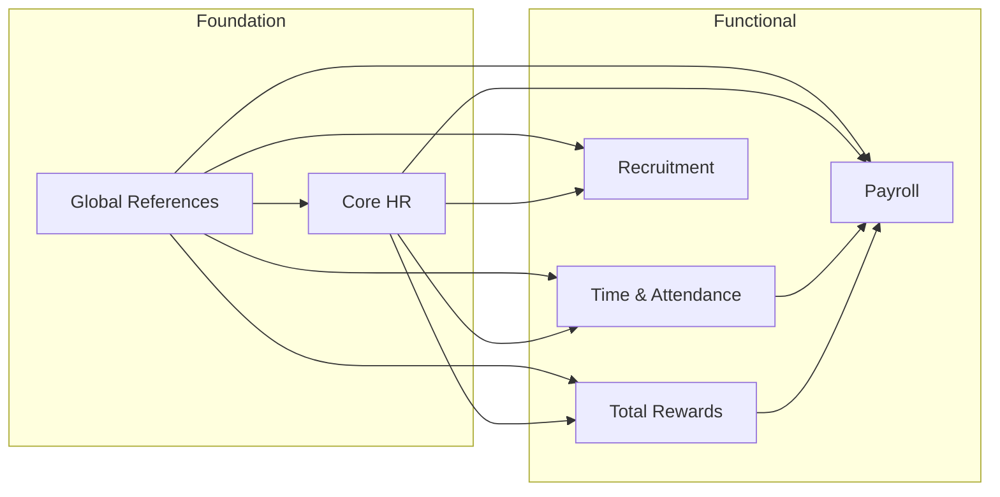

# Architect Guide: Cross-Module Consistency

**Version**: 1.0  
**Last Updated**: 2025-12-25  
**Audience**: Solution Architects, Domain Architects  
**Purpose**: Ensure consistency across modules in an ontology-driven system

---

## 🎯 Why Cross-Module Consistency Matters

In a modular system, inconsistency leads to:
- **Data duplication** — Same concept defined differently
- **Integration pain** — Mismatched schemas
- **Maintenance burden** — Updates in multiple places
- **Semantic confusion** — Same term, different meanings

---

## 🏛️ The Golden Rules

### Rule 1: Single Source of Truth

Every business concept has **ONE authoritative definition**.

```
┌─────────────────────────────────────────────────────────────────┐
│                    OWNERSHIP MAP                                 │
│                                                                  │
│  Core HR owns:           Payroll owns:         TR owns:         │
│  • Person                • PayElement          • BenefitPlan    │
│  • Employee              • PayPeriod           • Reward         │
│  • Position              • PayrollBatch        • Recognition    │
│  • Organization          • Deduction           • Offer          │
│  • Contract                                                      │
│                                                                  │
│  Other modules REFERENCE these, never DUPLICATE                 │
└─────────────────────────────────────────────────────────────────┘
```

### Rule 2: Reference, Don't Duplicate

```yaml
# ✅ CORRECT: Reference the source
# In Payroll module
entity: PayrollAssignment
relationships:
  employee:
    $ref: "xtalent:core-hr:workforce:employee"
    cardinality: N:1

# ❌ WRONG: Duplicate definition
# In Payroll module
entity: PayrollEmployee
attributes:
  employee_code: string  # Duplicated from Core HR!
  employee_name: string  # Duplicated from Core HR!
```

### Rule 3: Explicit Dependencies

Every module must declare what it depends on:

```yaml
# Module manifest: payroll/module.yaml
module:
  name: PAYROLL
  version: "2.1.0"
  
dependencies:
  - module: CORE-HR
    min_version: "2.0.0"
    entities:
      - Employee
      - Assignment
      - Position
    usage: "Reference employee data for payroll processing"
    
  - module: TIME-ATTENDANCE
    min_version: "1.5.0"
    entities:
      - TimeRecord
    usage: "Import time data for pay calculations"
```

---

## 🔄 Consistency Patterns

### Pattern 1: Shared Reference Data

Reference data used across modules should be centralized:

```
global/ontology/reference/
├── country-code.ref.yaml
├── currency-code.ref.yaml
├── language-code.ref.yaml
└── timezone.ref.yaml
```

All modules reference these, none own them:
```yaml
relationships:
  country:
    $ref: "xtalent:global:reference:country-code"
```

### Pattern 2: Shared Vocabulary (Glossary)

When modules use the same terms, align on definitions:

```yaml
# global/glossary/cross-module-terms.glossary.yaml
terms:
  - term: effective_date
    definition: "The date from which a record becomes valid"
    usage: "All modules use the same interpretation"
    
  - term: status
    definition: "The current state in a lifecycle"
    note: "Each entity defines its own status values, but the concept is shared"
```

### Pattern 3: Interface Entities

When modules need to exchange data, define clear interfaces:

```yaml
# Integration interface definition
interface:
  name: EmployeePayrollData
  source: CORE-HR
  consumer: PAYROLL
  
  exposed_attributes:
    - employee_id
    - employee_code
    - full_name
    - assignment.position.pay_grade
    - assignment.organization.cost_center
    
  update_frequency: "Real-time via events"
```

---

## 🔍 Consistency Checks

### Check 1: No Duplicate Entities

Run periodically:
```bash
# Find entities with similar names across modules
find . -name "*.entity.yaml" -exec grep -l "entity:" {} \; | \
  xargs grep "entity:" | sort | uniq -d
```

Red flags:
- `Employee` in Core HR AND `PayEmployee` in Payroll
- `Position` in Core HR AND `JobPosition` in Recruitment

### Check 2: No Conflicting Definitions

Compare glossary terms:
```yaml
# Core HR defines
employee:
  definition: "A person employed by the organization"
  
# Payroll should NOT define
employee:
  definition: "A person receiving pay"  # Conflict!
```

### Check 3: Consistent Naming

| Pattern | Example | Applies To |
|---------|---------|------------|
| PascalCase | `PayElement` | Entity names |
| snake_case | `effective_date` | Attribute names |
| kebab-case | `pay-element.entity.yaml` | File names |
| SCREAMING_CASE | `ACTIVE`, `DRAFT` | Enum values |

### Check 4: Relationship Symmetry

If A references B, document in both:

```yaml
# In employee.entity.yaml
relationships:
  assignments:
    target: Assignment
    cardinality: 1:N
    inverse: employee

# In assignment.entity.yaml
relationships:
  employee:
    target: Employee
    cardinality: N:1
    inverse: assignments
```

---

## 🗺️ Dependency Graph

Maintain a visual dependency graph:



**Rules**:
- No cycles (A → B → A)
- Minimize cross-functional dependencies
- Foundation modules have no upward dependencies

---

## 🔧 Resolution Strategies

### When Duplicate is Found

1. **Identify the owner** — Which module should be authoritative?
2. **Choose the richer definition** — Keep the more complete one
3. **Migrate references** — Update all consumers
4. **Delete the duplicate** — Remove from non-owning module

### When Conflict Arises

1. **Document both perspectives** — Why did each team define it this way?
2. **Find common ground** — What's the essential meaning?
3. **Escalate if needed** — ARB decides if teams can't agree
4. **Update and communicate** — Ensure all teams know the resolution

### When Breaking Change is Needed

1. **Impact analysis** — List all affected modules
2. **Coordination plan** — Agree on timeline with all teams
3. **Phased rollout** — Deprecate, migrate, remove
4. **Verify consistency** — Run checks after completion

---

## 📊 Consistency Dashboard

Track these metrics:

| Metric | Green | Yellow | Red |
|--------|-------|--------|-----|
| Duplicate entities | 0 | 1-2 | 3+ |
| Orphan references | 0 | 1-5 | 5+ |
| Naming violations | 0 | 1-5 | 5+ |
| Missing dependencies | 0 | 1-2 | 3+ |
| Cross-module conflicts | 0 | 1 | 2+ |

---

## 🔗 Related Documents

- [ONTOLOGY-GOVERNANCE.md](./ONTOLOGY-GOVERNANCE.md) — Overall governance guide
- [VERSIONING-STRATEGY.md](./VERSIONING-STRATEGY.md) — Version management
- [ARCHITECT-APPROVAL.md](../../99-governance/ARCHITECT-APPROVAL.md) — Approval process
- [DIRECTORY-STRUCTURE.md](../../02-architecture/DIRECTORY-STRUCTURE.md) — File organization
