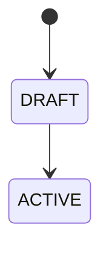

# AI Context: Ontology Standards Quick Reference

> **Purpose**: Minimal context for AI agents to generate ontology files correctly.
> **Rule**: Read this FIRST before generating any ontology.

---

## File Format: `*.onto.md`

**Structure**: Markdown with YAML Frontmatter

```markdown
---
# YAML FRONTMATTER (Data Layer)
$schema: "ontology/entity/v4"
$id: "xtalent:{module}:{submodule}:{entity}"

entity: EntityName
classification: AGGREGATE_ROOT | ENTITY | VALUE_OBJECT | REFERENCE_DATA
definition: "One sentence definition"

attributes:
  field_name: { type: string, required: true }

relationships:
  parent: { target: "[[ParentEntity]]", cardinality: "N:1" }

lifecycle:
  valid_states: [DRAFT, ACTIVE, TERMINATED]

actions:
  - name: ActionName
    applicable_when: "status = 'DRAFT'"

policies:
  constraints:
    - rule: "expression"
  access_control:
    classification: CONFIDENTIAL
---

# EntityName

## Mô tả
Brief description...

## Lifecycle

```

---

## The 5 Required YAML Sections

| Section | Purpose | Required |
|---------|---------|----------|
| `attributes` | Entity properties | ✅ |
| `relationships` | Links using `[[Entity]]` | ✅ |
| `lifecycle` | `valid_states` array | ✅ |
| `actions` | Available operations | ✅ |
| `policies` | Constraints, access | ✅ |

---

## Attribute Types

| Type | Example |
|------|---------|
| `uuid` | `id: { type: uuid, required: true }` |
| `string` | `name: { type: string, max_length: 100 }` |
| `integer` | `count: { type: integer, min_value: 0 }` |
| `decimal` | `amount: { type: decimal, precision: 18, scale: 2 }` |
| `boolean` | `is_active: { type: boolean, default: false }` |
| `date` | `hire_date: { type: date }` |
| `datetime` | `created_at: { type: datetime }` |
| `enum` | `status: { type: enum, values: [A, B, C] }` |
| `array` | `tags: { type: array, items: { type: string } }` |

**Derived**: `full_name: { type: string, derived: "concat(first,last)" }`

---

## Relationship Format

```yaml
relationships:
  department:
    target: "[[Department]]"           # Wiki-link
    target_ref: "xtalent:module:dept"  # Optional full ref
    cardinality: "N:1"                 # 1:1, 1:N, N:1, N:N
    required: true                     # Optional
```

---

## Classifications

| Value | Use When |
|-------|----------|
| `AGGREGATE_ROOT` | Main entity with lifecycle, owns children |
| `ENTITY` | Has ID, exists independently |
| `VALUE_OBJECT` | No ID, immutable, equality by values |
| `REFERENCE_DATA` | Lookup tables, rarely changes |

---

## Action Format

```yaml
actions:
  - name: Activate
    applicable_when: "status = 'DRAFT'"
    requires: [required_field]
```

> **Note**: For complex actions needing detailed specs, create `action-name.action.md` in same folder.

---

## Policy Format

```yaml
policies:
  constraints:
    - id: POL-001
      rule: "field <= today()"
      message: "Error message"
      severity: ERROR
  access_control:
    classification: CONFIDENTIAL
    sensitive_attributes: [salary, ssn]
  eligibility:
    - name: "Eligible for X"
      expression: "status = 'ACTIVE' AND tenure >= 2"
```

---

## DO NOT Include in Ontology

- ❌ Workflow steps/transitions
- ❌ UI behavior
- ❌ API endpoints
- ❌ Database columns
- ❌ Execution logic

These belong in separate files (workflow, spec, design layers).

---

## Directory Structure

```
module/
├── 00-ontology/
│   ├── domain/{submodule}/
│   │   ├── entity-name.onto.md
│   │   └── complex-action.action.md  # Optional
│   └── glossary/
├── 01-concept/{submodule}/
├── 02-spec/
│   ├── 01-FR/
│   ├── 02-BR/
│   └── 03-BDD/
└── 03-design/
```
