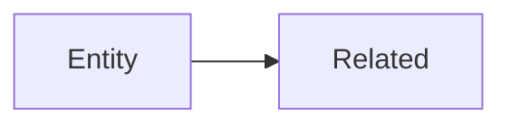

# AI Context: Layer Document Templates

> **Purpose**: Templates for generating documents at each layer.
> **Rule**: Use exact format, no modifications.

---

## Module Structure

```
{module}/
├── README.md            # Module overview
├── 00-ontology/         # WHAT exists (semantic truth)
│   ├── domain/{sub}/    # Entity files (*.onto.md)
│   └── glossary/        # Terms (*.glossary.md)
├── 01-concept/          # HOW it works (human understanding)
│   └── {sub}/           # Guides (*.guide.md)
├── 02-spec/             # EXACT requirements
│   ├── 01-FR/           # Functional requirements
│   ├── 02-BR/           # Business rules
│   └── 03-BDD/          # Gherkin scenarios (*.feature)
└── 03-design/           # TECHNICAL specs
    └── *.dbml           # Database design
```

> **Note**: Actions are defined within entity files (`actions:` section).
> Complex workflows go in separate workflow files, not in ontology layer.

---

## 1. Entity File (`*.onto.md`)

**See**: `ENTITY-FORMAT.md` for full specification.

**Minimal Template**:
```markdown
---
$schema: "ontology/entity/v4"
$id: "xtalent:{module}:{sub}:{entity}"
entity: EntityName
classification: AGGREGATE_ROOT
definition: "One line"

attributes:
  id: { type: uuid, required: true }
  code: { type: string, required: true, unique: true }
  status: { type: enum, values: [DRAFT, ACTIVE] }

relationships:
  parent: { target: "[[Parent]]", cardinality: "N:1" }

lifecycle:
  valid_states: [DRAFT, ACTIVE, TERMINATED]

actions:
  - name: Activate
    ref: "[[actions/activate]]"
    applicable_when: "status = 'DRAFT'"

policies:
  constraints:
    - rule: "code IS NOT NULL"
---

# EntityName
Brief description.
```

---

## 2. Action File (`*.action.md`) — Optional

> **When to use**: Only for complex actions with many parameters, preconditions, or side effects.
> **For simple actions**: Just reference in entity's `actions:` section, no separate file needed.

**Location**: `00-ontology/domain/{sub}/` (same folder as entity)

```markdown
---
$schema: "ontology/action/v4"
$id: "xtalent:{module}:{sub}:{action-name}"

action: ActionName
type: MUTATING  # MUTATING | QUERY | SIDE_EFFECT_ONLY
category: LIFECYCLE  # LIFECYCLE | CRUD | CALCULATION

target:
  entity: "[[EntityName]]"
  
parameters:
  param1: { type: string, required: true }
  
preconditions:
  - expression: "entity.status = 'DRAFT'"
    error: "Must be in DRAFT status"
    
mutations:
  - attribute: status
    operation: SET
    value: "ACTIVE"

side_effects:
  - type: EVENT
    name: "EntityActivated"
---

# ActionName
Brief description of what this action does.
```

---

## 3. Concept Guide (`*.guide.md`)

```markdown
# {Entity/Topic} Guide

## Overview
2-3 sentences explaining the concept.

## Key Points
- Point 1
- Point 2

## Relationships


## Business Rules Summary
| Rule | Description |
|------|-------------|
| BR-001 | ... |

## Common Scenarios
1. Scenario 1
2. Scenario 2
```

---

## 4. Business Rules (`BR-*.md`)

```markdown
# Business Rules: {Submodule}

## Rules

### BR-{MOD}-001: Rule Name
- **Applies to**: EntityName
- **Condition**: `expression`
- **Error**: ERR_CODE
- **Message**: "User message"

### BR-{MOD}-002: Rule Name
...
```

---

## 5. BDD Scenario (`*.feature`)

```gherkin
@entity(EntityName)
Feature: Entity Feature

  @trace(BR-MOD-001)
  Scenario: Scenario name
    Given precondition
    When action
    Then expected result
```

---

## 6. Glossary (`*.glossary.md`)

```markdown
---
$schema: "ontology/glossary/v4"
module: MODULE
submodule: submodule

terms:
  TermName:
    definition: "One line definition"
    synonyms: [Other, Names]
    related: ["[[OtherTerm]]"]
---

# Glossary: {Submodule}

## Terms
Brief descriptions if needed.
```

---

## Naming Conventions

| Type | Pattern | Example |
|------|---------|---------|
| Entity | `{entity}.onto.md` | `employee.onto.md` |
| Action | `{action}.action.md` | `terminate-employee.action.md` |
| Guide | `{topic}-guide.md` | `employment-lifecycle-guide.md` |
| BR | `BR-{sub}.md` | `BR-workforce.md` |
| BDD | `{entity}.feature` | `employee.feature` |
