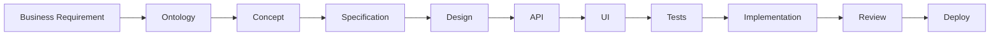

# SpecKit Structure Guide

## Overview

SpecKit là framework tổ chức tài liệu theo phương pháp **Spec-Driven Development**. Mỗi module/feature sẽ đi qua 4 tầng chính:

```
Ontology → Concept → Specification → Implementation
```

## Tầng 1: Ontology (00-ontology/)

### Mục đích
Định nghĩa **cấu trúc domain** - entities, relationships, rules, constraints.

### Output
- `{module}-ontology.yaml`: Định nghĩa entities chính
- `{module}-glossary.md`: Từ điển thuật ngữ
- `{module}-state-machines.md`: Lifecycle của các entities

### Checklist
- [ ] Tất cả entities đã được định nghĩa
- [ ] Attributes có đầy đủ data types
- [ ] Relationships được mô tả rõ ràng
- [ ] Business rules được liệt kê
- [ ] Constraints và lifecycle được định nghĩa
- [ ] PO và BA đã review

---

## Tầng 2: Concept (01-concept/)

### Mục đích
Giải thích **"cái gì"** và **"tại sao"** ở mức domain, chưa đi vào chi tiết kỹ thuật.

### Output

#### 01-concept-overview.md
- Module là gì?
- Giải quyết vấn đề gì?
- Giá trị business
- Scope và boundaries

#### 02-conceptual-guide.md
- Hệ thống hoạt động như thế nào (high-level)
- Key workflows
- Domain behaviors
- Integration points

#### 03-concept-entity-guides/
Một file cho mỗi entity chính:
- Purpose của entity
- Lifecycle explanation
- Business rules rationale
- Relationships với entities khác

### Checklist
- [ ] Concept Overview giải thích rõ module
- [ ] Conceptual Guide mô tả workflows chính
- [ ] Mỗi entity có document riêng
- [ ] BA và Tech Lead đã review
- [ ] Team dev đã đọc và hiểu

---

## Tầng 3: Specification (02-spec/)

### Mục đích
Mô tả **chi tiết** để Dev và AI Agent có thể implement chính xác.

### Output

#### 01-behaviour-spec.md
- Use cases
- Scenarios (happy path + edge cases)
- Business logic flows
- Validation rules
- Error handling

#### 02-use-cases.md
Format: "As a [role], I want [goal], so that [benefit]"

#### 03-scenarios/
Các scenario cụ thể, mỗi scenario một file:
- Preconditions
- Steps
- Expected results
- Variations

#### 04-non-functional.md
- Permission model
- Audit requirements
- Performance requirements
- Multi-tenancy considerations
- Security requirements

### Checklist
- [ ] Behavioural spec cover tất cả use cases
- [ ] Edge cases đã được xác định
- [ ] Validation rules rõ ràng
- [ ] Error messages được định nghĩa
- [ ] Non-functional requirements đầy đủ

---

## Tầng 4: Design (03-design/)

### Mục đích
Thiết kế hệ thống và dữ liệu.

### Output

#### 01-data-model.dbml
Database schema sử dụng DBML format

#### 02-data-model-notes.md
- Mapping từ ontology → database
- Denormalization decisions
- Index strategy
- Partitioning strategy

#### 03-event-model.md
- Event definitions
- Event schemas
- Event flows
- Ledger design (nếu có)

#### 04-integration.md
- Integration với modules khác
- External system integration
- Data synchronization
- API dependencies

### Checklist
- [ ] Data model match với ontology
- [ ] Indexes được định nghĩa
- [ ] Event model đầy đủ
- [ ] Integration points rõ ràng
- [ ] Tech Lead đã review

---

## Tầng 5: API (04-api/)

### Mục đích
Định nghĩa headless API cho module.

### Output

#### {module}-openapi.yaml
OpenAPI 3.x specification:
- Endpoints
- Request/Response schemas
- Authentication
- Error codes

#### api-guidelines.md
- Naming conventions
- Versioning strategy
- Pagination
- Filtering & sorting
- Rate limiting

#### example-requests.md
Sample requests và responses cho common scenarios

### Checklist
- [ ] Tất cả endpoints đã được định nghĩa
- [ ] Schemas match với data model
- [ ] Error codes đầy đủ
- [ ] Examples rõ ràng
- [ ] Security được xem xét

---

## Tầng 6: UI (05-ui/)

### Mục đích
Định nghĩa UI behavior và mockups.

### Output

#### 01-ui-principles.md
- UI patterns cho module
- State management approach
- Validation strategy
- Error display strategy

#### 02-screens/
Một file cho mỗi screen:
- Screen purpose
- Fields và controls
- Validation rules
- State transitions
- User interactions
- API calls

#### 03-mockups/
HTML mockups sử dụng HTMX + Shoelace:
- Working prototypes
- Interactive demos
- State demonstrations

### Checklist
- [ ] Tất cả screens đã được định nghĩa
- [ ] UI states rõ ràng
- [ ] Validation rules match với API
- [ ] Mockups đã được PO approve
- [ ] Accessibility được xem xét

---

## Tầng 7: Tests (06-tests/)

### Mục đích
Định nghĩa test scenarios và acceptance criteria.

### Output

#### 01-acceptance-criteria.md
Criteria để consider feature "done"

#### 02-test-scenarios.md
- Unit test scenarios
- Integration test scenarios
- E2E test scenarios

#### 03-playwright-specs/
E2E test specifications cho Playwright

#### 04-test-data.yaml
Sample data cho testing

### Checklist
- [ ] Acceptance criteria rõ ràng
- [ ] Test scenarios cover use cases
- [ ] E2E specs đầy đủ
- [ ] Test data đại diện

---

## Tầng 8: Implementation Notes (07-impl-notes/)

### Mục đích
Ghi chú các quyết định kỹ thuật và limitations.

### Output

#### tech-decisions.md
Architectural Decision Records (ADR):
- Decision
- Context
- Alternatives considered
- Consequences

#### limitations.md
Known limitations và workarounds

#### future-todos.md
Planned improvements và technical debt

---

## Workflow



## AI Agent Integration

AI Agent có thể hỗ trợ generate:

1. **Concept docs** từ Ontology
2. **API specs** từ Ontology + Behaviour specs
3. **Data models** từ Ontology
4. **UI code** từ UI specs + API specs
5. **Test code** từ Test scenarios
6. **Implementation code** từ tất cả specs

### Sample Prompts

```
"Based on {module}-ontology.yaml, generate concept-overview.md"

"Based on ontology and behaviour-spec.md, generate OpenAPI specification"

"Based on data-model.dbml, generate Prisma schema"

"Based on ui-spec for {screen} and api-spec, generate HTMX + Shoelace HTML"

"Based on test-scenarios.md, generate Playwright test specs"
```

---

## Best Practices

### DO ✅
- Start with Ontology - it's the foundation
- Keep Concept layer non-technical
- Be specific in Specifications
- Review each layer before moving to next
- Use AI to accelerate, not replace thinking
- Version control all specs

### DON'T ❌
- Skip Ontology - it causes confusion later
- Mix technical details into Concept docs
- Write vague specifications
- Generate code without reviewing specs
- Forget to update specs when code changes
- Leave specs incomplete

---

## Templates Location

All templates are available in `/_templates` directory:
- `ontology-template.yaml`
- `concept-overview-template.md`
- `behaviour-spec-template.md`
- `api-spec-template.yaml`
- `ui-spec-template.md`
- etc.

## AI Prompts Location

Common AI prompts are in `/_ai-prompts` directory:
- `generate-concept-from-ontology.md`
- `generate-api-from-ontology.md`
- `generate-ui-from-spec.md`
- `generate-tests-from-scenarios.md`
