```mermaid
sequenceDiagram
    participant Budget as Budget Planning
    participant HR as HR Admin
    participant Core as Core Module
    participant TR as TR Module
    
    Budget->>Core: 1. Create Position (budget approved)
    Core-->>Budget: Position created (VACANT)
    
    HR->>Core: 2. Get Position details
    Core-->>HR: Position → Job → grade_code
    
    HR->>TR: 3. Get Grade & Pay Range
    TR-->>HR: GradeVersion + PayRange (Position-scoped)
    
    HR->>HR: 4. Determine offer amount
    
    HR->>Core: 5. Hire employee to Position
    Core-->>HR: Assignment created
    
    HR->>TR: 6. Create compensation record
    TR-->>HR: Compensation set up
```

```mermaid
sequenceDiagram
    participant HR as HR Admin
    participant Core as Core Module
    participant TR as TR Module
    
    HR->>Core: 1. Select Job
    Core-->>HR: Job → grade_code
    
    HR->>TR: 2. Get Grade & Pay Range
    TR-->>HR: GradeVersion + PayRange (BU-scoped)
    
    HR->>HR: 3. Determine offer amount
    
    HR->>Core: 4. Hire employee to Job (no Position)
    Core-->>HR: Assignment created
    
    HR->>TR: 5. Create compensation record
    TR-->>HR: Compensation set up
```

# Core ↔ Total Rewards Integration Guide (Conceptual)

**Version**: 1.0  
**Last Updated**: 2025-12-17  
**Audience**: HR Administrators, Compensation Managers, Business Users  
**Reading Time**: 30-40 minutes

---

## 📋 Table of Contents

1. [Introduction](#introduction)
2. [Core Concepts Overview](#core-concepts-overview)
3. [Grade System Integration](#grade-system-integration)
4. [Career Ladder Integration](#career-ladder-integration)
5. [Position-Based Staffing Model](#position-based-staffing-model)
6. [Job-Based Staffing Model](#job-based-staffing-model)
7. [Hybrid Approach](#hybrid-approach)
8. [Common Workflows](#common-workflows)
9. [FAQs](#faqs)

---

## 🎯 Introduction

### What This Guide Covers

This guide explains how the **Core Module** (which manages jobs, positions, and employee assignments) integrates with the **Total Rewards Module** (which manages compensation, grades, and career ladders).

Understanding this integration is essential for:
- ✅ Setting up compensation for new hires
- ✅ Processing promotions with grade changes
- ✅ Running annual merit reviews
- ✅ Managing career progression
- ✅ Ensuring pay equity

### Who Should Read This

- **HR Administrators**: Configure and manage the system
- **Compensation Managers**: Design and execute compensation plans
- **Talent Managers**: Manage career progression
- **Business Managers**: Understand how staffing decisions affect compensation

### Prerequisites

Basic understanding of:
- What a "job" is (role definition)
- What a "position" is (headcount slot)
- What a "grade" is (compensation level)
- Your organization's staffing model (position-based or job-based)

---

## 📊 Core Concepts Overview

### Core Module Concepts

#### Job
**Definition**: A generic role definition describing what work needs to be done.

**Key Characteristics**:
- Reusable across the organization
- Defines responsibilities, requirements, skills
- Has a **grade** (compensation level)
- Has a **level** (seniority)

**Example**: "Senior Backend Engineer"

#### Position
**Definition**: A specific, budgeted headcount slot for a job in a particular department.

**Key Characteristics**:
- Instance of a Job
- In a specific Business Unit
- Reports to a specific manager
- Can be VACANT or FILLED
- Requires budget approval

**Example**: "POS-ENG-BACKEND-001" (Senior Backend Engineer in Engineering Dept)

#### Job Level
**Definition**: Seniority classification (e.g., Junior, Mid, Senior, Principal).

**Purpose**: Career progression and experience expectations

**Examples**: L1 (Junior), L2 (Mid), L3 (Senior), L4 (Principal)

### Total Rewards Module Concepts

#### Grade (GradeVersion)
**Definition**: Compensation level that determines salary ranges.

**Key Characteristics**:
- Versioned (SCD Type 2) - maintains history
- Has pay ranges (min/mid/max)
- Can be scoped (Global, Legal Entity, Business Unit, Position)
- Part of career ladders

**Example**: Grade G7 (100M - 130M - 160M VND)

#### Career Ladder
**Definition**: Progression path through grades for a specific career track.

**Types**:
- **Management Ladder**: People management track
- **Technical Ladder**: Individual contributor track
- **Specialist Ladder**: Expert/specialist track
- **Executive Ladder**: C-level progression

**Example**: Technical Ladder: G1 → G2 → G3 → G4 → G5

#### Pay Range
**Definition**: Minimum, midpoint, and maximum salary for a grade.

**Scopes** (most specific wins):
- **Position**: Specific to one position
- **Business Unit**: For a department/division
- **Legal Entity**: For a company
- **Global**: Default for all

**Example**: 
```
G7 Pay Range (Vietnam):
  Min: 100,000,000 VND
  Mid: 130,000,000 VND
  Max: 160,000,000 VND
```

### How They Connect

```mermaid
graph LR
    subgraph "Core Module"
        Job[Job<br/>Senior Backend Engineer]
        Position[Position<br/>POS-ENG-001]
        Assignment[Assignment<br/>Employee → Job/Position]
    end
    
    subgraph "TR Module"
        Grade[Grade G7<br/>100M-130M-160M VND]
        Ladder[Technical Ladder<br/>G1→G2→G3→G4→G5]
        PayRange[Pay Range<br/>Scoped by BU/LE/Global]
    end
    
    Job -->|has grade_code| Grade
    Position -->|references| Job
    Assignment -->|Position or Job| Job
    Grade -->|part of| Ladder
    Grade -->|has| PayRange
    
    style Job fill:#e1f5ff
    style Position fill:#e1f5ff
    style Assignment fill:#e1f5ff
    style Grade fill:#fff4e1
    style Ladder fill:#fff4e1
    style PayRange fill:#fff4e1
```



---

## 🔧 Grade System Integration

### The Single Source of Truth: TR.GradeVersion

> [!IMPORTANT]
> **Core.JobGrade is Deprecated**
> 
> Previously, the Core module had its own `JobGrade` entity with basic salary ranges.
> This has been **deprecated** in favor of `TR.GradeVersion` for clearer logic and better functionality.
> 
> **All grade references now use `grade_code`** which maps to TR.GradeVersion.

### How Jobs Reference Grades

**Modern Approach** (Recommended):
```yaml
Job: Senior Backend Engineer
  code: "SENIOR_BACKEND_ENG"
  grade_code: "G7"  # References TR.GradeVersion
  level_id: "L3_UUID"  # References Core.JobLevel
```

**What This Means**:
- The job "Senior Backend Engineer" is at **Grade G7**
- Grade G7 is defined in the Total Rewards module
- Grade G7 has pay ranges, ladder associations, and version history

### Grade Versioning (SCD Type 2)

Grades use **Slowly Changing Dimension Type 2** to maintain complete history.

**Why Versioning?**
- Market rates change over time
- Pay ranges need updates
- Historical accuracy for reporting

**Example**:
```yaml
# Version 1 (2024)
GradeVersion:
  grade_code: "G7"
  effective_start_date: 2024-01-01
  effective_end_date: 2024-12-31
  is_current_version: false
  pay_range: 90M - 120M - 150M VND

# Version 2 (2025) - Market adjustment
GradeVersion:
  grade_code: "G7"
  effective_start_date: 2025-01-01
  effective_end_date: NULL
  is_current_version: true
  pay_range: 100M - 130M - 160M VND  # Updated for market
```

**Benefits**:
- ✅ Historical compensation data is accurate
- ✅ Can see what pay ranges were at any point in time
- ✅ Supports audit and compliance requirements

### Pay Range Scoping

Pay ranges can be defined at multiple levels of specificity:


**Resolution Logic**: Most specific scope wins

**Example**:
```yaml
# Global default
PayRange (G7, GLOBAL):
  min: 100M VND
  mid: 130M VND
  max: 160M VND

# Vietnam override (higher cost of living)
PayRange (G7, LEGAL_ENTITY=VNG_VN):
  min: 110M VND
  mid: 140M VND
  max: 170M VND

# Engineering BU override (competitive market)
PayRange (G7, BUSINESS_UNIT=BU_ENGINEERING):
  min: 120M VND
  mid: 150M VND
  max: 180M VND

# Specific position override (critical role)
PayRange (G7, POSITION=POS_ARCHITECT_001):
  min: 140M VND
  mid: 170M VND
  max: 200M VND
```

**When hiring for POS_ARCHITECT_001**:
- System checks: Position-scoped range → **Found! Use 140M-170M-200M**
- (Would skip BU, LE, Global checks)

**When hiring for a regular Engineering position**:
- System checks: Position-scoped range → Not found
- System checks: BU-scoped range → **Found! Use 120M-150M-180M**
- (Would skip LE, Global checks)

---

## 🪜 Career Ladder Integration

### What Are Career Ladders?

Career ladders define **progression paths** through grades for different career tracks.

**Purpose**:
- ✅ Provide clear career progression
- ✅ Support dual-track careers (IC vs Management)
- ✅ Enable lateral movement between tracks
- ✅ Guide promotion decisions

### Ladder Types


#### Technical Ladder (Individual Contributor)
**For**: Engineers, analysts, specialists who don't manage people

**Progression**:
```
G1 (Junior) → G2 (Mid) → G3 (Senior) → G4 (Principal) → G5 (Distinguished)
```

**Characteristics**:
- Deep technical expertise
- Increasing scope and impact
- Mentorship responsibilities
- No direct reports

#### Management Ladder
**For**: People managers, team leads, directors

**Progression**:
```
M1 (Team Lead) → M2 (Manager) → M3 (Senior Manager) → M4 (Director) → M5 (VP)
```

**Characteristics**:
- People management
- Team building
- Strategic planning
- Budget responsibility

#### Specialist Ladder
**For**: Subject matter experts, consultants

**Progression**:
```
S1 (Specialist) → S2 (Senior Specialist) → S3 (Principal Specialist) → S4 (Expert)
```

**Characteristics**:
- Domain expertise
- Advisory role
- Cross-functional impact
- Thought leadership

#### Executive Ladder
**For**: C-level executives

**Progression**:
```
E1 (VP) → E2 (SVP) → E3 (EVP) → E4 (C-Level)
```

### Ladder vs Job Hierarchy

**They serve different purposes**:

| Aspect | Job Hierarchy (Core) | Career Ladder (TR) |
|--------|---------------------|-------------------|
| **Purpose** | Organize job catalog | Define career progression |
| **Structure** | Parent-child tree | Ordered grade sequence |
| **Inheritance** | Jobs inherit attributes | Grades define pay ranges |
| **Example** | Software Engineer → Backend Engineer → Senior Backend Engineer | G1 → G2 → G3 → G4 → G5 |
| **Use Case** | Job definition management | Compensation planning, promotions |

**They are complementary**:
- **Job hierarchy** helps organize and manage job definitions
- **Career ladder** guides compensation and career progression

### Lateral Movement

Employees can move between ladders at similar compensation levels:

**Example**:
```yaml
# Technical IC → Management
Employee: Alice
  Current: G3 (Senior Engineer) on Technical Ladder
  Move to: M1 (Team Lead) on Management Ladder
  
  # Both at similar compensation level
  G3 range: 100M - 130M - 160M VND
  M1 range: 100M - 130M - 160M VND
  
  # Lateral move, no significant salary change
```

---

## 📍 Position-Based Staffing Model

### Overview

**Definition**: Employees are assigned to specific, pre-approved budgeted positions.

**Key Principle**: **Position = Headcount Slot**

### How It Works



### Data Flow

**Grade Assignment**:
```
Employee → Assignment → Position → Job → grade_code → TR.GradeVersion
```

**Pay Range Resolution** (Priority Order):
1. **Position-scoped** range (if exists)
2. **Business Unit-scoped** range
3. **Legal Entity-scoped** range
4. **Global** range

### Example: Hiring to a Position

**Step 1: Position Exists (Pre-approved)**
```yaml
Position: POS-ENG-BACKEND-001
  code: "POS-ENG-BACKEND-001"
  name: "Senior Backend Engineer - Payments Team"
  job_id: JOB-BACKEND-SENIOR
  business_unit_id: BU-ENG-PAYMENTS
  location_id: LOC-HCM-OFFICE
  status: ACTIVE
  current_incumbents: 0  # VACANT
  max_incumbents: 1
  is_budgeted: true
  budget_year: 2025
```

**Step 2: Get Job and Grade**
```yaml
Job: JOB-BACKEND-SENIOR
  code: "SENIOR_BACKEND_ENG"
  name: "Senior Backend Engineer"
  grade_code: "G7"  # This is the grade!
  level_id: "L3_UUID"
```

**Step 3: Get Pay Range**
```yaml
# System checks in order:
# 1. Position-scoped (POS-ENG-BACKEND-001 + G7) → Not found
# 2. BU-scoped (BU-ENG-PAYMENTS + G7) → Found!

PayRange:
  grade_code: "G7"
  scope_type: BUSINESS_UNIT
  scope_uuid: BU-ENG-PAYMENTS
  min_amount: 120,000,000 VND
  mid_amount: 150,000,000 VND
  max_amount: 180,000,000 VND
```

**Step 4: Make Offer**
```yaml
Offer:
  candidate: "Nguyen Van A"
  position_id: POS-ENG-BACKEND-001
  base_salary: 140,000,000 VND  # Between min and mid
  rationale: "Strong candidate, 7 years experience"
```

**Step 5: Create Assignment**
```yaml
Assignment:
  employee_id: EMP-001
  staffing_model: POSITION_BASED
  position_id: POS-ENG-BACKEND-001  # Assigned to position
  job_id: JOB-BACKEND-SENIOR  # Derived from position
  business_unit_id: BU-ENG-PAYMENTS  # Derived from position
  effective_start_date: 2025-01-15
```

**Step 6: Create Compensation**
```yaml
EmployeeCompensation:
  employee_id: EMP-001
  assignment_id: ASG-001
  grade_code: "G7"  # From job
  base_salary: 140,000,000 VND
  currency: VND
  effective_date: 2025-01-15
```

### When to Use Position-Based

✅ **Best for**:
- Government agencies (strict headcount control)
- Large corporations with formal position management
- Organizations requiring budget approval per position
- Highly regulated industries
- Succession planning needs

✅ **Benefits**:
- Tight budget control
- Clear vacancy tracking
- Formal approval process
- Reporting hierarchy through positions

⚠️ **Drawbacks**:
- Less flexible
- Administrative overhead
- Slower to adapt to changes

---

## 🎯 Job-Based Staffing Model

### Overview

**Definition**: Employees are assigned directly to jobs without pre-defined positions.

**Key Principle**: **Job = Role, No Position Needed**

### How It Works



### Data Flow

**Grade Assignment**:
```
Employee → Assignment → Job → grade_code → TR.GradeVersion
```

**Pay Range Resolution** (Priority Order):
1. **Business Unit-scoped** range (from Assignment)
2. **Legal Entity-scoped** range
3. **Global** range

*(No Position scope available)*

### Example: Hiring to a Job

**Step 1: Select Job**
```yaml
Job: JOB-BACKEND-SENIOR
  code: "SENIOR_BACKEND_ENG"
  name: "Senior Backend Engineer"
  grade_code: "G7"
  level_id: "L3_UUID"
```

**Step 2: Get Pay Range**
```yaml
# System checks in order:
# 1. BU-scoped (BU-ENGINEERING + G7) → Found!

PayRange:
  grade_code: "G7"
  scope_type: BUSINESS_UNIT
  scope_uuid: BU-ENGINEERING
  min_amount: 120,000,000 VND
  mid_amount: 150,000,000 VND
  max_amount: 180,000,000 VND
```

**Step 3: Make Offer**
```yaml
Offer:
  candidate: "Tran Thi B"
  job_id: JOB-BACKEND-SENIOR
  base_salary: 135,000,000 VND
```

**Step 4: Create Assignment (No Position)**
```yaml
Assignment:
  employee_id: EMP-002
  staffing_model: JOB_BASED
  position_id: NULL  # No position!
  job_id: JOB-BACKEND-SENIOR
  business_unit_id: BU-ENGINEERING  # Direct assignment
  supervisor_assignment_id: ASG-MGR-001
  effective_start_date: 2025-02-01
```

**Step 5: Create Compensation**
```yaml
EmployeeCompensation:
  employee_id: EMP-002
  assignment_id: ASG-002
  grade_code: "G7"  # From job
  base_salary: 135,000,000 VND
  currency: VND
  effective_date: 2025-02-01
```

### When to Use Job-Based

✅ **Best for**:
- Startups and fast-growing companies
- Consulting firms (project-based staffing)
- Organizations with flexible workforce planning
- Agile organizations
- Contractor-heavy workforce

✅ **Benefits**:
- Highly flexible
- Faster hiring
- Less administrative overhead
- Easy to scale up/down

⚠️ **Drawbacks**:
- Less budget control
- Harder to track vacancies
- May lead to uncontrolled headcount growth

---

## 🔀 Hybrid Approach

### Best of Both Worlds

**Strategy**: Use position-based for some roles, job-based for others.


### Hybrid Strategy

| Role Type | Staffing Model | Reason |
|-----------|----------------|--------|
| **Executives** | Position-Based | Board approval required, succession planning |
| **Senior Management** | Position-Based | Budget control, reporting hierarchy |
| **Key Strategic Roles** | Position-Based | Headcount control, formal approval |
| **Individual Contributors** | Job-Based | Flexibility in team size, faster hiring |
| **Contractors** | Job-Based | Temporary, no position needed |
| **Interns** | Job-Based | Short-term, flexible |

### Example: Tech Company

```yaml
# Position-Based (20% of workforce)
Positions:
  - POS-CEO (Executive)
  - POS-CTO (Executive)
  - POS-VP-ENG (Senior Management)
  - POS-DIR-BACKEND (Management)
  - POS-DIR-FRONTEND (Management)

Characteristics:
  - Strict headcount control
  - Board/executive approval required
  - Succession planning
  - Formal reporting hierarchy

# Job-Based (80% of workforce)
Jobs:
  - JOB-SENIOR-BACKEND-ENG (IC)
  - JOB-MID-BACKEND-ENG (IC)
  - JOB-JUNIOR-BACKEND-ENG (IC)
  - JOB-CONTRACTOR-BACKEND (Contractor)
  - JOB-INTERN-ENG (Intern)

Characteristics:
  - Flexible headcount
  - Manager approval
  - Easy to scale teams
  - Fast hiring
```

### Benefits of Hybrid

✅ **Control Where Needed**: Executive and management positions controlled  
✅ **Flexibility Where Needed**: IC roles flexible for scaling  
✅ **Clear Hierarchy**: Management positions form hierarchy  
✅ **Optimized Processes**: Position approval for key roles, streamlined for IC

---

## 🔄 Common Workflows

### Workflow 1: New Hire Compensation Setup

See detailed guide: [New Hire Setup Guide](./03-new-hire-setup.md)

**Position-Based Summary**:
1. Position exists (pre-approved)
2. Get Job and Grade from Position
3. Retrieve Pay Range (Position > BU > LE > Global)
4. Determine offer amount
5. Create Assignment to Position
6. Create Compensation record

**Job-Based Summary**:
1. Select Job
2. Get Grade from Job
3. Retrieve Pay Range (BU > LE > Global)
4. Determine offer amount
5. Create Assignment to Job (no Position)
6. Create Compensation record

### Workflow 2: Promotion with Grade Change

See detailed guide: [Promotion Process Guide](./04-promotion-process.md)

**Position-Based**:
```yaml
# Scenario: Promote from Mid to Senior
Current:
  Position: POS-ENG-MID-001
  Job: JOB-BACKEND-MID (Grade G6)
  Salary: 90,000,000 VND

Promotion:
  New Position: POS-ENG-SENIOR-002
  New Job: JOB-BACKEND-SENIOR (Grade G7)
  New Salary: 125,000,000 VND (12% increase)
  
Steps:
  1. Create/identify new position (G7)
  2. End current assignment
  3. Create new assignment to new position
  4. Create compensation adjustment
```

**Job-Based**:
```yaml
# Scenario: Promote from Mid to Senior
Current:
  Job: JOB-BACKEND-MID (Grade G6)
  Salary: 90,000,000 VND

Promotion:
  New Job: JOB-BACKEND-SENIOR (Grade G7)
  New Salary: 125,000,000 VND (12% increase)
  
Steps:
  1. End current assignment
  2. Create new assignment to new job
  3. Create compensation adjustment
```

### Workflow 3: Annual Merit Review

See detailed guide: [Merit Review Process Guide](./05-merit-review-process.md)

**Process** (same for both models):
1. Create Compensation Cycle
2. Determine eligible employees
3. For each employee:
   - Get current grade (from Position or Job)
   - Get applicable pay range
   - Calculate compa-ratio
   - Apply merit matrix
   - Propose adjustment
4. Review and approve
5. Execute adjustments

**Compa-Ratio Calculation**:
```
Compa-Ratio = (Current Salary / Grade Midpoint) × 100

Example:
  Current Salary: 120,000,000 VND
  Grade G7 Midpoint: 150,000,000 VND
  Compa-Ratio = (120M / 150M) × 100 = 80%
  
  Interpretation: Employee is paid 80% of market midpoint
  → Below midpoint, eligible for higher merit increase
```

---

## ❓ FAQs

### General Questions

**Q: What's the difference between Job and Position?**

A: 
- **Job** = Template/definition (e.g., "Senior Backend Engineer")
- **Position** = Specific headcount slot (e.g., "POS-ENG-001 in Payments team")
- Think of Job as a class, Position as an instance

**Q: What's the difference between Grade and Level?**

A:
- **Grade** (TR Module) = Compensation level with pay ranges (e.g., G7: 100M-130M-160M VND)
- **Level** (Core Module) = Seniority classification (e.g., L3: Senior, 5-8 years experience)
- They often align but serve different purposes

**Q: Can one job have multiple grades?**

A: No. A job has one grade at a time. If you need different grades, create different jobs (e.g., "Mid Backend Engineer" with G6, "Senior Backend Engineer" with G7).

### Staffing Model Questions

**Q: Can we change from position-based to job-based?**

A: Yes, but it requires careful planning. See [Migration Guide](./06-migration-guide.md). Consider a hybrid approach first.

**Q: Can one employee have multiple assignments?**

A: Yes! An employee can have:
- Primary assignment (main job/position)
- Secondary assignments (additional roles, matrix reporting)
- Each assignment can be position-based or job-based

**Q: In job-based model, how do we track vacancies?**

A: You track headcount budget vs actual headcount:
```
Budget: 10 Senior Engineers
Actual: 7 Senior Engineers
Open slots: 3
```

### Grade and Compensation Questions

**Q: Why is Core.JobGrade deprecated?**

A: To have a single source of truth for grades. TR.GradeVersion provides:
- Versioning (historical accuracy)
- Career ladder integration
- Scoped pay ranges
- Better compensation management

**Q: What happens when a grade's pay range changes?**

A: A new version is created (SCD Type 2):
- Old version: `effective_end_date` set, `is_current_version = false`
- New version: `effective_start_date` set, `is_current_version = true`
- Historical data remains accurate

**Q: Can an employee's salary be outside their grade range?**

A: Technically yes (red-circled or green-circled), but it's flagged:
- **Red-circled**: Salary > grade max (grandfathered, frozen until grade catches up)
- **Green-circled**: Salary < grade min (should be adjusted up)

**Q: How do I know which pay range applies to an employee?**

A: The system resolves automatically based on staffing model:
- **Position-based**: Position > BU > LE > Global
- **Job-based**: BU > LE > Global

### Career Ladder Questions

**Q: Can an employee be on multiple ladders?**

A: No. An employee is on one ladder at a time (based on their current job's grade). But they can move between ladders (lateral movement).

**Q: What's the difference between Job Hierarchy and Career Ladder?**

A:
- **Job Hierarchy** (Core): Organizes job definitions (parent-child)
- **Career Ladder** (TR): Defines compensation progression (grade sequence)
- They're complementary, not the same thing

**Q: Can I skip grades when promoting?**

A: It depends on your organization's policy. Technically possible, but typically:
- Single-grade promotion: Common (G6 → G7)
- Double-grade promotion: Rare, requires special approval (G6 → G8)

### Process Questions

**Q: How long does it take to set up compensation for a new hire?**

A: 
- **Position-based**: ~5-10 minutes (position already exists)
- **Job-based**: ~3-5 minutes (no position needed)
- Plus approval time

**Q: What happens to compensation when someone is promoted?**

A: 
1. New assignment created (new job/position with new grade)
2. Compensation adjustment created
3. New salary determined (typically 10-15% increase)
4. Brought to at least minimum of new grade

**Q: Can I run merit reviews for only some employees?**

A: Yes! Compensation cycles can have eligibility rules:
- Minimum tenure (e.g., 6 months)
- Performance rating (e.g., "Meets Expectations" or higher)
- Employment status (e.g., Active only)
- Specific business units or departments

---

## 📚 Next Steps

### For HR Administrators

1. ✅ Understand your organization's staffing model (position-based, job-based, or hybrid)
2. ✅ Review how grades are assigned in your system
3. ✅ Explore scenario guides:
   - [New Hire Setup](./03-new-hire-setup.md)
   - [Promotion Process](./04-promotion-process.md)
   - [Merit Review Process](./05-merit-review-process.md)

### For Developers

1. ✅ Read the [Technical Integration Guide](./02-technical-guide.md)
2. ✅ Understand database schema and relationships
3. ✅ Review API integration points
4. ✅ Study code examples for grade and pay range resolution

### For System Implementers

1. ✅ Review [Migration Guide](./06-migration-guide.md) if migrating from JobGrade
2. ✅ Plan your staffing model strategy
3. ✅ Configure pay ranges for your organization
4. ✅ Set up career ladders

---

## 📞 Support

For questions about this integration:
- **Business questions**: Contact HR Operations team
- **Technical questions**: Contact Development team
- **Documentation feedback**: Submit via documentation review process

---

**Document Version**: 1.0  
**Last Updated**: 2025-12-17  
**Next Review**: 2026-03-17
