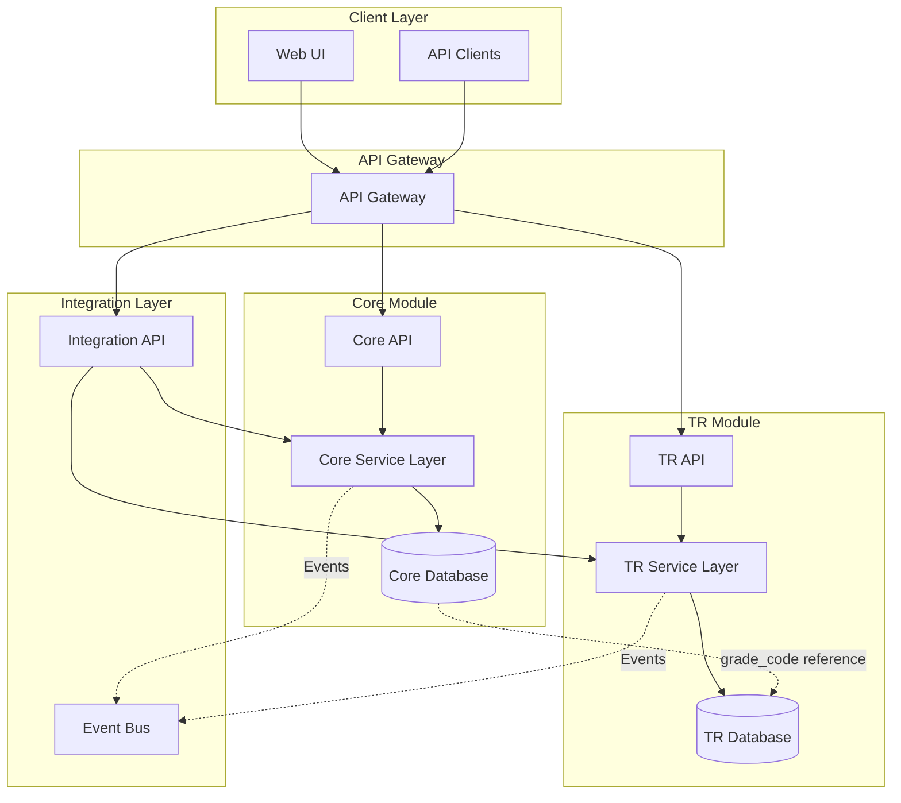

# Core ↔ Total Rewards Integration Guide (Technical)

**Version**: 1.0  
**Last Updated**: 2025-12-17  
**Audience**: Developers, System Implementers, Technical Architects  
**Reading Time**: 45-60 minutes

---

## 📋 Table of Contents

1. [Architecture Overview](#architecture-overview)
2. [Database Schema Integration](#database-schema-integration)
3. [Grade Resolution Logic](#grade-resolution-logic)
4. [Pay Range Resolution Logic](#pay-range-resolution-logic)
5. [API Integration Points](#api-integration-points)
6. [Event-Driven Integration](#event-driven-integration)
7. [Migration Strategy](#migration-strategy)
8. [Testing Scenarios](#testing-scenarios)
9. [Performance Considerations](#performance-considerations)

---

## 🏗️ Architecture Overview

### System Architecture



### Module Boundaries

**Core Module Responsibilities**:
- Job and Position management
- Employee assignments
- Organizational structure
- **Grade reference** (via `grade_code`)

**TR Module Responsibilities**:
- Grade definitions (GradeVersion)
- Career ladders
- Pay ranges
- Compensation management
- **Grade ownership** (source of truth)

**Integration Points**:
- `Core.Job.grade_code` → `TR.GradeVersion.grade_code`
- Pay range resolution based on staffing model
- Compensation setup for new hires/promotions
- Merit review eligibility and calculations

---

## 🗄️ Database Schema Integration

### Core Module Schema

```sql
-- Core.Job table
CREATE TABLE core.job (
    id UUID PRIMARY KEY,
    code VARCHAR(50) NOT NULL,
    name VARCHAR(200) NOT NULL,
    tree_id UUID NOT NULL,
    
    -- DEPRECATED: Old approach
    grade_id UUID,  -- FK to core.job_grade (DEPRECATED)
    
    -- RECOMMENDED: New approach
    grade_code VARCHAR(20),  -- References tr.grade_version.grade_code
    
    level_id UUID,  -- FK to core.job_level
    job_type_code VARCHAR(50),
    
    effective_start_date DATE NOT NULL,
    effective_end_date DATE,
    is_current_flag BOOLEAN DEFAULT true,
    
    CONSTRAINT fk_job_tree FOREIGN KEY (tree_id) 
        REFERENCES core.job_tree(id),
    CONSTRAINT fk_job_level FOREIGN KEY (level_id) 
        REFERENCES core.job_level(id)
);

CREATE INDEX idx_job_grade_code ON core.job(grade_code);

-- Core.Position table
CREATE TABLE core.position (
    id UUID PRIMARY KEY,
    code VARCHAR(50) NOT NULL UNIQUE,
    name VARCHAR(200) NOT NULL,
    job_id UUID NOT NULL,
    business_unit_id UUID NOT NULL,
    reports_to_position_id UUID,
    location_id UUID,
    
    fte DECIMAL(4,2) DEFAULT 1.0,
    max_incumbents INTEGER DEFAULT 1,
    current_incumbents INTEGER DEFAULT 0,
    status_code VARCHAR(50),  -- ACTIVE, FROZEN, ELIMINATED
    
    is_budgeted BOOLEAN DEFAULT true,
    budget_year INTEGER,
    
    effective_start_date DATE NOT NULL,
    effective_end_date DATE,
    is_current_flag BOOLEAN DEFAULT true,
    
    CONSTRAINT fk_position_job FOREIGN KEY (job_id) 
        REFERENCES core.job(id),
    CONSTRAINT fk_position_bu FOREIGN KEY (business_unit_id) 
        REFERENCES core.unit(id)
);

-- Core.Assignment table
CREATE TABLE core.assignment (
    id UUID PRIMARY KEY,
    employee_id UUID NOT NULL,
    
    -- Staffing model determines which is used
    staffing_model VARCHAR(20) NOT NULL,  -- POSITION_BASED, JOB_BASED
    position_id UUID,  -- NULL for job-based
    job_id UUID NOT NULL,
    
    business_unit_id UUID NOT NULL,
    supervisor_assignment_id UUID,
    
    assignment_type VARCHAR(50) DEFAULT 'PRIMARY',
    
    effective_start_date DATE NOT NULL,
    effective_end_date DATE,
    is_current_flag BOOLEAN DEFAULT true,
    
    CONSTRAINT fk_assignment_employee FOREIGN KEY (employee_id) 
        REFERENCES core.employee(id),
    CONSTRAINT fk_assignment_position FOREIGN KEY (position_id) 
        REFERENCES core.position(id),
    CONSTRAINT fk_assignment_job FOREIGN KEY (job_id) 
        REFERENCES core.job(id),
    CONSTRAINT chk_staffing_model CHECK (
        (staffing_model = 'POSITION_BASED' AND position_id IS NOT NULL) OR
        (staffing_model = 'JOB_BASED' AND position_id IS NULL)
    )
);

CREATE INDEX idx_assignment_employee ON core.assignment(employee_id);
CREATE INDEX idx_assignment_position ON core.assignment(position_id);
CREATE INDEX idx_assignment_job ON core.assignment(job_id);
```

### TR Module Schema

```sql
-- TR.GradeVersion table (SCD Type 2)
CREATE TABLE tr.grade_version (
    id UUID PRIMARY KEY,
    grade_code VARCHAR(20) NOT NULL,
    name VARCHAR(100) NOT NULL,
    description TEXT,
    job_level INTEGER,
    sort_order INTEGER DEFAULT 0,
    
    -- SCD Type 2 fields
    effective_start_date DATE NOT NULL,
    effective_end_date DATE,
    version_number INTEGER DEFAULT 1,
    previous_version_id UUID,
    is_current_version BOOLEAN DEFAULT true,
    
    metadata JSONB,
    created_date TIMESTAMP DEFAULT NOW(),
    created_by UUID NOT NULL,
    
    CONSTRAINT fk_grade_previous_version FOREIGN KEY (previous_version_id) 
        REFERENCES tr.grade_version(id)
);

CREATE UNIQUE INDEX idx_grade_current_version 
    ON tr.grade_version(grade_code) 
    WHERE is_current_version = true;

CREATE INDEX idx_grade_code_effective 
    ON tr.grade_version(grade_code, effective_start_date);

-- TR.PayRange table
CREATE TABLE tr.pay_range (
    id UUID PRIMARY KEY,
    grade_v_id UUID NOT NULL,
    
    -- Scope determines applicability
    scope_type VARCHAR(20) NOT NULL,  -- GLOBAL, LEGAL_ENTITY, BUSINESS_UNIT, POSITION
    scope_uuid UUID NOT NULL,  -- ID of scope entity (or NULL for GLOBAL)
    
    currency VARCHAR(3) NOT NULL,
    min_amount DECIMAL(18,4) NOT NULL,
    mid_amount DECIMAL(18,4) NOT NULL,
    max_amount DECIMAL(18,4) NOT NULL,
    range_spread_pct DECIMAL(5,2),  -- Calculated: (max-min)/mid*100
    
    effective_start_date DATE NOT NULL,
    effective_end_date DATE,
    is_active BOOLEAN DEFAULT true,
    
    metadata JSONB,
    created_date TIMESTAMP DEFAULT NOW(),
    created_by UUID NOT NULL,
    
    CONSTRAINT fk_payrange_grade FOREIGN KEY (grade_v_id) 
        REFERENCES tr.grade_version(id),
    CONSTRAINT chk_payrange_amounts CHECK (
        min_amount < mid_amount AND mid_amount < max_amount
    )
);

CREATE INDEX idx_payrange_grade_scope 
    ON tr.pay_range(grade_v_id, scope_type, scope_uuid, effective_start_date);

-- TR.GradeLadder table
CREATE TABLE tr.grade_ladder (
    id UUID PRIMARY KEY,
    code VARCHAR(50) NOT NULL UNIQUE,
    name VARCHAR(200) NOT NULL,
    description TEXT,
    ladder_type VARCHAR(20),  -- MANAGEMENT, TECHNICAL, SPECIALIST, EXECUTIVE
    
    effective_start_date DATE NOT NULL,
    effective_end_date DATE,
    is_active BOOLEAN DEFAULT true,
    
    metadata JSONB,
    created_date TIMESTAMP DEFAULT NOW(),
    created_by UUID NOT NULL
);

-- TR.GradeLadderGrade table (associates grades with ladders)
CREATE TABLE tr.grade_ladder_grade (
    id UUID PRIMARY KEY,
    ladder_id UUID NOT NULL,
    grade_v_id UUID NOT NULL,
    sort_order INTEGER DEFAULT 0,  -- Position in ladder progression
    
    created_date TIMESTAMP DEFAULT NOW(),
    created_by UUID NOT NULL,
    
    CONSTRAINT fk_laddergrade_ladder FOREIGN KEY (ladder_id) 
        REFERENCES tr.grade_ladder(id),
    CONSTRAINT fk_laddergrade_grade FOREIGN KEY (grade_v_id) 
        REFERENCES tr.grade_version(id),
    CONSTRAINT uk_ladder_grade UNIQUE (ladder_id, grade_v_id)
);

CREATE INDEX idx_laddergrade_ladder_order 
    ON tr.grade_ladder_grade(ladder_id, sort_order);
```

### Cross-Module Relationships

**Logical Foreign Key** (not enforced at database level):
```sql
-- Core.Job.grade_code logically references TR.GradeVersion.grade_code
-- This is NOT a database FK to allow module independence
-- Application layer enforces referential integrity
```

**Why not a database FK?**
- Modules can be deployed independently
- Allows for different database instances
- Supports microservices architecture
- Application-level validation provides flexibility

---

## 🔍 Grade Resolution Logic

### Get Employee's Current Grade

```python
from datetime import date
from typing import Optional
from uuid import UUID

def get_employee_grade(
    employee_id: UUID,
    as_of_date: Optional[date] = None
) -> dict:
    """
    Resolves employee's current grade based on their assignment.
    
    Args:
        employee_id: Employee UUID
        as_of_date: Date to resolve grade (defaults to today)
    
    Returns:
        dict with grade_code, grade_version_id, and grade details
    
    Raises:
        NoActiveAssignmentError: If employee has no active assignment
        GradeNotFoundError: If grade_code not found in TR module
    """
    if as_of_date is None:
        as_of_date = date.today()
    
    # Step 1: Get current assignment
    assignment = db.query("""
        SELECT 
            a.id as assignment_id,
            a.staffing_model,
            a.position_id,
            a.job_id,
            a.business_unit_id
        FROM core.assignment a
        WHERE a.employee_id = %s
          AND a.effective_start_date <= %s
          AND (a.effective_end_date IS NULL OR a.effective_end_date >= %s)
          AND a.is_current_flag = true
        ORDER BY a.assignment_type  -- PRIMARY first
        LIMIT 1
    """, (employee_id, as_of_date, as_of_date))
    
    if not assignment:
        raise NoActiveAssignmentError(f"No active assignment for employee {employee_id}")
    
    # Step 2: Get job (either from position or direct)
    if assignment['staffing_model'] == 'POSITION_BASED':
        # Get job from position
        job = db.query("""
            SELECT j.id, j.code, j.grade_code, j.level_id
            FROM core.position p
            JOIN core.job j ON p.job_id = j.id
            WHERE p.id = %s
              AND p.effective_start_date <= %s
              AND (p.effective_end_date IS NULL OR p.effective_end_date >= %s)
              AND p.is_current_flag = true
        """, (assignment['position_id'], as_of_date, as_of_date))
    else:  # JOB_BASED
        # Get job directly
        job = db.query("""
            SELECT id, code, grade_code, level_id
            FROM core.job
            WHERE id = %s
              AND effective_start_date <= %s
              AND (effective_end_date IS NULL OR effective_end_date >= %s)
              AND is_current_flag = true
        """, (assignment['job_id'], as_of_date, as_of_date))
    
    if not job or not job['grade_code']:
        raise GradeNotFoundError(f"No grade found for job {job['code']}")
    
    # Step 3: Get current grade version from TR module
    grade_version = db.query("""
        SELECT 
            id as grade_version_id,
            grade_code,
            name,
            job_level,
            effective_start_date,
            effective_end_date
        FROM tr.grade_version
        WHERE grade_code = %s
          AND effective_start_date <= %s
          AND (effective_end_date IS NULL OR effective_end_date >= %s)
          AND is_current_version = true
    """, (job['grade_code'], as_of_date, as_of_date))
    
    if not grade_version:
        raise GradeNotFoundError(
            f"Grade {job['grade_code']} not found in TR module for date {as_of_date}"
        )
    
    return {
        'assignment_id': assignment['assignment_id'],
        'staffing_model': assignment['staffing_model'],
        'job_id': job['id'],
        'job_code': job['code'],
        'grade_code': grade_version['grade_code'],
        'grade_version_id': grade_version['grade_version_id'],
        'grade_name': grade_version['name'],
        'job_level': grade_version['job_level']
    }
```

### Usage Example

```python
# Get employee's current grade
employee_id = UUID('123e4567-e89b-12d3-a456-426614174000')
grade_info = get_employee_grade(employee_id)

print(f"Employee grade: {grade_info['grade_code']}")
print(f"Grade name: {grade_info['grade_name']}")
print(f"Staffing model: {grade_info['staffing_model']}")

# Get historical grade
historical_date = date(2024, 1, 1)
historical_grade = get_employee_grade(employee_id, as_of_date=historical_date)
```

---

## 💰 Pay Range Resolution Logic

### Get Applicable Pay Range

```python
from enum import Enum
from typing import Optional, List, Tuple

class ScopeType(Enum):
    POSITION = "POSITION"
    BUSINESS_UNIT = "BUSINESS_UNIT"
    LEGAL_ENTITY = "LEGAL_ENTITY"
    GLOBAL = "GLOBAL"

def get_applicable_pay_range(
    grade_code: str,
    assignment_id: UUID,
    as_of_date: Optional[date] = None
) -> dict:
    """
    Determines applicable pay range with scope priority.
    
    Priority (most specific wins):
    - Position-based: POSITION > BUSINESS_UNIT > LEGAL_ENTITY > GLOBAL
    - Job-based: BUSINESS_UNIT > LEGAL_ENTITY > GLOBAL
    
    Args:
        grade_code: Grade code (e.g., "G7")
        assignment_id: Assignment UUID
        as_of_date: Date to resolve range (defaults to today)
    
    Returns:
        dict with pay range details
    
    Raises:
        NoPayRangeFoundError: If no pay range found for grade
    """
    if as_of_date is None:
        as_of_date = date.today()
    
    # Step 1: Get assignment context
    assignment = db.query("""
        SELECT 
            a.staffing_model,
            a.position_id,
            a.business_unit_id,
            bu.legal_entity_id
        FROM core.assignment a
        JOIN core.unit bu ON a.business_unit_id = bu.id
        WHERE a.id = %s
    """, (assignment_id,))
    
    if not assignment:
        raise AssignmentNotFoundError(f"Assignment {assignment_id} not found")
    
    # Step 2: Get current grade version
    grade_version = db.query("""
        SELECT id
        FROM tr.grade_version
        WHERE grade_code = %s
          AND effective_start_date <= %s
          AND (effective_end_date IS NULL OR effective_end_date >= %s)
          AND is_current_version = true
    """, (grade_code, as_of_date, as_of_date))
    
    if not grade_version:
        raise GradeNotFoundError(f"Grade {grade_code} not found")
    
    # Step 3: Build scope priority list
    scopes: List[Tuple[ScopeType, Optional[UUID]]] = []
    
    if assignment['staffing_model'] == 'POSITION_BASED':
        scopes = [
            (ScopeType.POSITION, assignment['position_id']),
            (ScopeType.BUSINESS_UNIT, assignment['business_unit_id']),
            (ScopeType.LEGAL_ENTITY, assignment['legal_entity_id']),
            (ScopeType.GLOBAL, None)
        ]
    else:  # JOB_BASED
        scopes = [
            (ScopeType.BUSINESS_UNIT, assignment['business_unit_id']),
            (ScopeType.LEGAL_ENTITY, assignment['legal_entity_id']),
            (ScopeType.GLOBAL, None)
        ]
    
    # Step 4: Find first matching pay range
    for scope_type, scope_uuid in scopes:
        pay_range = db.query("""
            SELECT 
                id,
                scope_type,
                scope_uuid,
                currency,
                min_amount,
                mid_amount,
                max_amount,
                range_spread_pct
            FROM tr.pay_range
            WHERE grade_v_id = %s
              AND scope_type = %s
              AND (scope_uuid = %s OR (scope_uuid IS NULL AND %s IS NULL))
              AND effective_start_date <= %s
              AND (effective_end_date IS NULL OR effective_end_date >= %s)
              AND is_active = true
            ORDER BY effective_start_date DESC
            LIMIT 1
        """, (
            grade_version['id'],
            scope_type.value,
            scope_uuid,
            scope_uuid,
            as_of_date,
            as_of_date
        ))
        
        if pay_range:
            return {
                'pay_range_id': pay_range['id'],
                'grade_code': grade_code,
                'scope_type': pay_range['scope_type'],
                'scope_uuid': pay_range['scope_uuid'],
                'currency': pay_range['currency'],
                'min_amount': float(pay_range['min_amount']),
                'mid_amount': float(pay_range['mid_amount']),
                'max_amount': float(pay_range['max_amount']),
                'range_spread_pct': float(pay_range['range_spread_pct']) if pay_range['range_spread_pct'] else None
            }
    
    # No pay range found
    raise NoPayRangeFoundError(
        f"No pay range found for grade {grade_code} with any applicable scope"
    )
```

### Calculate Compa-Ratio

```python
def calculate_compa_ratio(
    current_salary: float,
    pay_range: dict
) -> float:
    """
    Calculates compa-ratio (position in pay range).
    
    Compa-Ratio = (Current Salary / Midpoint) × 100
    
    Args:
        current_salary: Employee's current salary
        pay_range: Pay range dict from get_applicable_pay_range()
    
    Returns:
        Compa-ratio as percentage (e.g., 85.5 means 85.5% of midpoint)
    """
    if pay_range['mid_amount'] == 0:
        raise ValueError("Pay range midpoint cannot be zero")
    
    compa_ratio = (current_salary / pay_range['mid_amount']) * 100
    return round(compa_ratio, 2)

# Usage
pay_range = get_applicable_pay_range("G7", assignment_id)
current_salary = 120_000_000  # VND

compa_ratio = calculate_compa_ratio(current_salary, pay_range)
print(f"Compa-ratio: {compa_ratio}%")  # e.g., "Compa-ratio: 80.0%"

if compa_ratio < 80:
    print("Below range - consider adjustment")
elif compa_ratio > 120:
    print("Above range - red-circled")
else:
    print("Within range")
```

---

## 🔌 API Integration Points

### Core Module APIs

```yaml
# Get Job Details
GET /api/core/v1/jobs/{job_id}
Query Parameters:
  - as_of_date: date (optional, defaults to today)

Response:
  {
    "id": "uuid",
    "code": "SENIOR_BACKEND_ENG",
    "name": "Senior Backend Engineer",
    "grade_code": "G7",
    "level_id": "uuid",
    "job_type_code": "INDIVIDUAL_CONTRIBUTOR",
    "effective_start_date": "2025-01-01",
    "effective_end_date": null,
    "is_current": true
  }

# Get Position Details
GET /api/core/v1/positions/{position_id}
Query Parameters:
  - as_of_date: date (optional)

Response:
  {
    "id": "uuid",
    "code": "POS-ENG-001",
    "name": "Senior Backend Engineer - Payments",
    "job_id": "uuid",
    "job": {
      "code": "SENIOR_BACKEND_ENG",
      "grade_code": "G7"
    },
    "business_unit_id": "uuid",
    "status": "ACTIVE",
    "current_incumbents": 1,
    "max_incumbents": 1
  }

# Get Employee Assignment
GET /api/core/v1/employees/{employee_id}/assignments/current
Query Parameters:
  - as_of_date: date (optional)

Response:
  {
    "id": "uuid",
    "employee_id": "uuid",
    "staffing_model": "POSITION_BASED",
    "position_id": "uuid",
    "job_id": "uuid",
    "business_unit_id": "uuid",
    "effective_start_date": "2025-01-15"
  }
```

### TR Module APIs

```yaml
# Get Grade Version
GET /api/tr/v1/grades/{grade_code}
Query Parameters:
  - as_of_date: date (optional, defaults to today)

Response:
  {
    "id": "uuid",
    "grade_code": "G7",
    "name": "Grade 7",
    "job_level": 3,
    "effective_start_date": "2025-01-01",
    "effective_end_date": null,
    "is_current_version": true,
    "version_number": 2
  }

# Get Pay Range
GET /api/tr/v1/grades/{grade_code}/pay-ranges
Query Parameters:
  - scope_type: POSITION|BUSINESS_UNIT|LEGAL_ENTITY|GLOBAL
  - scope_uuid: uuid (required unless scope_type=GLOBAL)
  - as_of_date: date (optional)

Response:
  {
    "id": "uuid",
    "grade_code": "G7",
    "scope_type": "BUSINESS_UNIT",
    "scope_uuid": "uuid",
    "currency": "VND",
    "min_amount": 100000000,
    "mid_amount": 130000000,
    "max_amount": 160000000,
    "range_spread_pct": 46.15,
    "effective_start_date": "2025-01-01"
  }

# Get Career Ladder
GET /api/tr/v1/ladders/{ladder_id}/grades
Response:
  {
    "ladder_id": "uuid",
    "code": "TECH_LADDER",
    "name": "Technical Ladder",
    "ladder_type": "TECHNICAL",
    "grades": [
      {
        "grade_code": "G1",
        "name": "Grade 1",
        "sort_order": 1
      },
      {
        "grade_code": "G2",
        "name": "Grade 2",
        "sort_order": 2
      },
      ...
    ]
  }
```

### Integration API (Cross-Module)

```yaml
# Get Employee Compensation Context
GET /api/integration/v1/employees/{employee_id}/compensation-context
Query Parameters:
  - as_of_date: date (optional)

Response:
  {
    "employee_id": "uuid",
    "assignment": {
      "id": "uuid",
      "staffing_model": "POSITION_BASED",
      "position_id": "uuid",
      "job_id": "uuid",
      "business_unit_id": "uuid"
    },
    "job": {
      "code": "SENIOR_BACKEND_ENG",
      "name": "Senior Backend Engineer"
    },
    "grade": {
      "grade_code": "G7",
      "name": "Grade 7",
      "job_level": 3
    },
    "pay_range": {
      "scope_type": "BUSINESS_UNIT",
      "currency": "VND",
      "min_amount": 100000000,
      "mid_amount": 130000000,
      "max_amount": 160000000
    },
    "ladder": {
      "code": "TECH_LADDER",
      "name": "Technical Ladder",
      "ladder_type": "TECHNICAL"
    }
  }

# Validate Compensation Setup
POST /api/integration/v1/compensation/validate
Request Body:
  {
    "employee_id": "uuid",
    "assignment_id": "uuid",
    "base_salary": 140000000,
    "currency": "VND"
  }

Response:
  {
    "valid": true,
    "grade_code": "G7",
    "pay_range": {
      "min": 100000000,
      "mid": 130000000,
      "max": 160000000
    },
    "compa_ratio": 107.69,
    "position_in_range": "ABOVE_MID",
    "warnings": [],
    "errors": []
  }
```

---

## 📡 Event-Driven Integration

### Events Published by Core Module

```python
from dataclasses import dataclass
from datetime import date
from uuid import UUID

@dataclass
class JobGradeChangedEvent:
    """Published when a job's grade is changed"""
    event_type: str = "core.job.grade_changed"
    job_id: UUID
    old_grade_code: str
    new_grade_code: str
    effective_date: date
    changed_by: UUID

@dataclass
class EmployeePromotedEvent:
    """Published when an employee is promoted"""
    event_type: str = "core.employee.promoted"
    employee_id: UUID
    old_assignment_id: UUID
    new_assignment_id: UUID
    old_job_id: UUID
    new_job_id: UUID
    old_grade_code: str
    new_grade_code: str
    effective_date: date
    promoted_by: UUID

@dataclass
class EmployeeHiredEvent:
    """Published when a new employee is hired"""
    event_type: str = "core.employee.hired"
    employee_id: UUID
    assignment_id: UUID
    job_id: UUID
    grade_code: str
    staffing_model: str
    position_id: UUID | None
    effective_date: date
    hired_by: UUID
```

### Event Handlers in TR Module

```python
class CompensationEventHandler:
    """Handles events from Core module to trigger compensation workflows"""
    
    async def handle_employee_hired(self, event: EmployeeHiredEvent):
        """
        Trigger compensation setup workflow when employee is hired
        """
        # Create compensation cycle entry for new hire
        await compensation_service.create_new_hire_compensation(
            employee_id=event.employee_id,
            assignment_id=event.assignment_id,
            grade_code=event.grade_code,
            effective_date=event.effective_date
        )
        
        logger.info(f"Compensation setup initiated for employee {event.employee_id}")
    
    async def handle_employee_promoted(self, event: EmployeePromotedEvent):
        """
        Trigger compensation adjustment workflow for promotion
        """
        if event.old_grade_code != event.new_grade_code:
            # Grade changed - create compensation adjustment
            await compensation_service.create_promotion_adjustment(
                employee_id=event.employee_id,
                old_grade_code=event.old_grade_code,
                new_grade_code=event.new_grade_code,
                effective_date=event.effective_date
            )
            
            logger.info(
                f"Promotion adjustment created for employee {event.employee_id}: "
                f"{event.old_grade_code} → {event.new_grade_code}"
            )
    
    async def handle_job_grade_changed(self, event: JobGradeChangedEvent):
        """
        Recalculate pay ranges for all employees in affected job
        """
        # Find all employees with this job
        affected_employees = await get_employees_by_job(event.job_id)
        
        for employee in affected_employees:
            # Recalculate applicable pay range
            await compensation_service.recalculate_pay_range(
                employee_id=employee.id,
                new_grade_code=event.new_grade_code,
                effective_date=event.effective_date
            )
        
        logger.info(
            f"Pay ranges recalculated for {len(affected_employees)} employees "
            f"due to job grade change: {event.old_grade_code} → {event.new_grade_code}"
        )
```

---

## 🔄 Migration Strategy

### Migrating from Core.JobGrade to TR.GradeVersion

```sql
-- Step 1: Create TR.GradeVersion for each Core.JobGrade
INSERT INTO tr.grade_version (
    id,
    grade_code,
    name,
    job_level,
    effective_start_date,
    effective_end_date,
    version_number,
    is_current_version,
    created_date,
    created_by
)
SELECT 
    gen_random_uuid(),
    jg.code,
    jg.name,
    jg.grade_order,
    CURRENT_DATE,
    NULL,
    1,
    true,
    NOW(),
    '00000000-0000-0000-0000-000000000000'::uuid  -- System user
FROM core.job_grade jg
WHERE jg.is_active = true
  AND jg.is_current_flag = true
  AND NOT EXISTS (
      SELECT 1 FROM tr.grade_version gv 
      WHERE gv.grade_code = jg.code 
        AND gv.is_current_version = true
  );

-- Step 2: Migrate pay ranges to TR.PayRange
INSERT INTO tr.pay_range (
    id,
    grade_v_id,
    scope_type,
    scope_uuid,
    currency,
    min_amount,
    mid_amount,
    max_amount,
    range_spread_pct,
    effective_start_date,
    is_active,
    created_date,
    created_by
)
SELECT 
    gen_random_uuid(),
    gv.id,
    'GLOBAL',
    NULL,
    jg.currency_code,
    jg.min_salary,
    jg.mid_salary,
    jg.max_salary,
    ROUND(((jg.max_salary - jg.min_salary) / jg.mid_salary * 100)::numeric, 2),
    CURRENT_DATE,
    true,
    NOW(),
    '00000000-0000-0000-0000-000000000000'::uuid
FROM core.job_grade jg
JOIN tr.grade_version gv ON gv.grade_code = jg.code
WHERE jg.is_active = true
  AND jg.is_current_flag = true
  AND gv.is_current_version = true
  AND NOT EXISTS (
      SELECT 1 FROM tr.pay_range pr
      WHERE pr.grade_v_id = gv.id
        AND pr.scope_type = 'GLOBAL'
        AND pr.is_active = true
  );

-- Step 3: Update Core.Job to use grade_code
UPDATE core.job j
SET grade_code = (
    SELECT jg.code 
    FROM core.job_grade jg 
    WHERE jg.id = j.grade_id
)
WHERE j.grade_id IS NOT NULL
  AND j.grade_code IS NULL
  AND j.is_current_flag = true;

-- Step 4: Validate migration
SELECT 
    'Jobs with grade_id but no grade_code' as check_name,
    COUNT(*) as count
FROM core.job
WHERE grade_id IS NOT NULL
  AND grade_code IS NULL
  AND is_current_flag = true

UNION ALL

SELECT 
    'Jobs with grade_code not in TR.GradeVersion' as check_name,
    COUNT(*)
FROM core.job j
WHERE j.grade_code IS NOT NULL
  AND j.is_current_flag = true
  AND NOT EXISTS (
      SELECT 1 FROM tr.grade_version gv
      WHERE gv.grade_code = j.grade_code
        AND gv.is_current_version = true
  );

-- Step 5: Mark Core.JobGrade as deprecated
UPDATE core.job_grade
SET metadata = jsonb_set(
    COALESCE(metadata, '{}'::jsonb),
    '{deprecated}',
    'true'::jsonb
),
metadata = jsonb_set(
    COALESCE(metadata, '{}'::jsonb),
    '{deprecated_date}',
    to_jsonb(CURRENT_DATE::text)
),
metadata = jsonb_set(
    COALESCE(metadata, '{}'::jsonb),
    '{migration_note}',
    '"Migrated to TR.GradeVersion. Use grade_code for all new implementations."'::jsonb
);
```

### Rollback Procedure

```sql
-- Rollback Step 1: Restore grade_id from grade_code
UPDATE core.job j
SET grade_id = (
    SELECT jg.id
    FROM core.job_grade jg
    WHERE jg.code = j.grade_code
)
WHERE j.grade_code IS NOT NULL
  AND j.is_current_flag = true;

-- Rollback Step 2: Remove deprecated flag
UPDATE core.job_grade
SET metadata = metadata - 'deprecated' - 'deprecated_date' - 'migration_note';

-- Rollback Step 3: Optionally delete migrated TR data
-- (Only if migration needs to be completely reversed)
DELETE FROM tr.pay_range
WHERE created_by = '00000000-0000-0000-0000-000000000000'::uuid
  AND created_date >= '2025-12-17';  -- Migration date

DELETE FROM tr.grade_version
WHERE created_by = '00000000-0000-0000-0000-000000000000'::uuid
  AND created_date >= '2025-12-17';
```

---

## 🧪 Testing Scenarios

### Unit Tests

```python
import pytest
from datetime import date
from uuid import UUID

class TestGradeResolution:
    
    def test_position_based_grade_resolution(self):
        """Test grade resolution for position-based staffing"""
        # Setup
        employee_id = create_test_employee()
        position = create_test_position(job_grade="G7")
        assignment = create_test_assignment(
            employee_id=employee_id,
            staffing_model="POSITION_BASED",
            position_id=position.id
        )
        
        # Execute
        grade_info = get_employee_grade(employee_id)
        
        # Assert
        assert grade_info['grade_code'] == "G7"
        assert grade_info['staffing_model'] == "POSITION_BASED"
    
    def test_job_based_grade_resolution(self):
        """Test grade resolution for job-based staffing"""
        # Setup
        employee_id = create_test_employee()
        job = create_test_job(grade_code="G7")
        assignment = create_test_assignment(
            employee_id=employee_id,
            staffing_model="JOB_BASED",
            job_id=job.id,
            position_id=None
        )
        
        # Execute
        grade_info = get_employee_grade(employee_id)
        
        # Assert
        assert grade_info['grade_code'] == "G7"
        assert grade_info['staffing_model'] == "JOB_BASED"
    
    def test_historical_grade_resolution(self):
        """Test grade resolution for historical date"""
        # Setup
        employee_id = create_test_employee()
        # Employee was G6 in 2024, promoted to G7 in 2025
        
        # Execute
        grade_2024 = get_employee_grade(employee_id, as_of_date=date(2024, 6, 1))
        grade_2025 = get_employee_grade(employee_id, as_of_date=date(2025, 6, 1))
        
        # Assert
        assert grade_2024['grade_code'] == "G6"
        assert grade_2025['grade_code'] == "G7"

class TestPayRangeResolution:
    
    def test_position_scoped_range_priority(self):
        """Test that position-scoped range takes priority"""
        # Setup
        grade_code = "G7"
        create_global_pay_range(grade_code, min=100M, mid=130M, max=160M)
        create_bu_pay_range(grade_code, bu_id, min=110M, mid=140M, max=170M)
        create_position_pay_range(grade_code, pos_id, min=120M, mid=150M, max=180M)
        
        assignment = create_position_based_assignment(position_id=pos_id)
        
        # Execute
        pay_range = get_applicable_pay_range(grade_code, assignment.id)
        
        # Assert
        assert pay_range['scope_type'] == "POSITION"
        assert pay_range['min_amount'] == 120_000_000
    
    def test_bu_scoped_range_fallback(self):
        """Test BU-scoped range when position-scoped not found"""
        # Setup
        grade_code = "G7"
        create_global_pay_range(grade_code, min=100M, mid=130M, max=160M)
        create_bu_pay_range(grade_code, bu_id, min=110M, mid=140M, max=170M)
        # No position-scoped range
        
        assignment = create_position_based_assignment(position_id=pos_id)
        
        # Execute
        pay_range = get_applicable_pay_range(grade_code, assignment.id)
        
        # Assert
        assert pay_range['scope_type'] == "BUSINESS_UNIT"
        assert pay_range['min_amount'] == 110_000_000
    
    def test_compa_ratio_calculation(self):
        """Test compa-ratio calculation"""
        # Setup
        pay_range = {'mid_amount': 130_000_000}
        current_salary = 104_000_000
        
        # Execute
        compa_ratio = calculate_compa_ratio(current_salary, pay_range)
        
        # Assert
        assert compa_ratio == 80.0  # 80% of midpoint
```

### Integration Tests

```python
class TestCoreToTRIntegration:
    
    @pytest.mark.integration
    def test_new_hire_compensation_setup(self):
        """End-to-end test for new hire compensation setup"""
        # Step 1: Create position (Core)
        position = core_api.create_position({
            "code": "POS-TEST-001",
            "job_id": job_g7.id,
            "business_unit_id": bu_engineering.id
        })
        
        # Step 2: Hire employee (Core)
        employee = core_api.create_employee({
            "first_name": "Test",
            "last_name": "Employee"
        })
        
        assignment = core_api.create_assignment({
            "employee_id": employee.id,
            "staffing_model": "POSITION_BASED",
            "position_id": position.id,
            "effective_start_date": "2025-01-15"
        })
        
        # Step 3: Get compensation context (Integration API)
        comp_context = integration_api.get_compensation_context(employee.id)
        
        # Step 4: Validate pay range (TR)
        assert comp_context['grade']['grade_code'] == "G7"
        assert comp_context['pay_range']['min_amount'] == 100_000_000
        
        # Step 5: Create compensation (TR)
        compensation = tr_api.create_employee_compensation({
            "employee_id": employee.id,
            "assignment_id": assignment.id,
            "base_salary": 140_000_000,
            "currency": "VND",
            "effective_date": "2025-01-15"
        })
        
        # Assert
        assert compensation.base_salary == 140_000_000
        assert compensation.grade_code == "G7"
```

---

## ⚡ Performance Considerations

### Caching Strategies

```python
from functools import lru_cache
from typing import Optional

class GradeCache:
    """Cache for grade versions to reduce database queries"""
    
    @lru_cache(maxsize=1000)
    def get_current_grade_version(self, grade_code: str) -> dict:
        """
        Cache current grade versions (they change infrequently)
        """
        return db.query("""
            SELECT id, grade_code, name, job_level
            FROM tr.grade_version
            WHERE grade_code = %s
              AND is_current_version = true
        """, (grade_code,))
    
    def invalidate_grade(self, grade_code: str):
        """Invalidate cache when grade is updated"""
        self.get_current_grade_version.cache_clear()

# Usage
grade_cache = GradeCache()
grade = grade_cache.get_current_grade_version("G7")
```

### Query Optimization

```sql
-- Optimized query for employee compensation context
-- Uses CTEs and joins to minimize round trips
WITH employee_assignment AS (
    SELECT 
        a.id as assignment_id,
        a.employee_id,
        a.staffing_model,
        a.position_id,
        a.job_id,
        a.business_unit_id,
        bu.legal_entity_id
    FROM core.assignment a
    JOIN core.unit bu ON a.business_unit_id = bu.id
    WHERE a.employee_id = $1
      AND a.is_current_flag = true
    LIMIT 1
),
job_info AS (
    SELECT 
        CASE 
            WHEN ea.staffing_model = 'POSITION_BASED' THEN pj.id
            ELSE j.id
        END as job_id,
        CASE 
            WHEN ea.staffing_model = 'POSITION_BASED' THEN pj.code
            ELSE j.code
        END as job_code,
        CASE 
            WHEN ea.staffing_model = 'POSITION_BASED' THEN pj.grade_code
            ELSE j.grade_code
        END as grade_code
    FROM employee_assignment ea
    LEFT JOIN core.position p ON ea.position_id = p.id AND ea.staffing_model = 'POSITION_BASED'
    LEFT JOIN core.job pj ON p.job_id = pj.id
    LEFT JOIN core.job j ON ea.job_id = j.id AND ea.staffing_model = 'JOB_BASED'
)
SELECT 
    ea.assignment_id,
    ea.staffing_model,
    ji.job_code,
    ji.grade_code,
    gv.id as grade_version_id,
    gv.name as grade_name,
    pr.min_amount,
    pr.mid_amount,
    pr.max_amount,
    pr.currency
FROM employee_assignment ea
CROSS JOIN job_info ji
JOIN tr.grade_version gv ON gv.grade_code = ji.grade_code AND gv.is_current_version = true
LEFT JOIN LATERAL (
    -- Find most specific pay range
    SELECT *
    FROM tr.pay_range
    WHERE grade_v_id = gv.id
      AND is_active = true
      AND (
          (scope_type = 'POSITION' AND scope_uuid = ea.position_id) OR
          (scope_type = 'BUSINESS_UNIT' AND scope_uuid = ea.business_unit_id) OR
          (scope_type = 'LEGAL_ENTITY' AND scope_uuid = ea.legal_entity_id) OR
          (scope_type = 'GLOBAL' AND scope_uuid IS NULL)
      )
    ORDER BY 
        CASE scope_type
            WHEN 'POSITION' THEN 1
            WHEN 'BUSINESS_UNIT' THEN 2
            WHEN 'LEGAL_ENTITY' THEN 3
            WHEN 'GLOBAL' THEN 4
        END
    LIMIT 1
) pr ON true;
```

### Denormalization Patterns

```sql
-- Consider denormalizing frequently accessed data
ALTER TABLE core.assignment 
ADD COLUMN cached_grade_code VARCHAR(20),
ADD COLUMN cached_pay_range_id UUID,
ADD COLUMN cache_updated_at TIMESTAMP;

-- Update cache when assignment or grade changes
CREATE OR REPLACE FUNCTION update_assignment_cache()
RETURNS TRIGGER AS $$
BEGIN
    -- Update cached grade and pay range
    UPDATE core.assignment
    SET 
        cached_grade_code = (
            SELECT j.grade_code
            FROM core.job j
            WHERE j.id = NEW.job_id
        ),
        cache_updated_at = NOW()
    WHERE id = NEW.id;
    
    RETURN NEW;
END;
$$ LANGUAGE plpgsql;

CREATE TRIGGER trg_update_assignment_cache
AFTER INSERT OR UPDATE ON core.assignment
FOR EACH ROW
EXECUTE FUNCTION update_assignment_cache();
```

---

## 📚 Additional Resources

### Related Documentation
- [Conceptual Integration Guide](./01-conceptual-guide.md) - Business user perspective
- [New Hire Setup Guide](./03-new-hire-setup.md) - Step-by-step workflow
- [Promotion Process Guide](./04-promotion-process.md) - Promotion workflows
- [Migration Guide](./06-migration-guide.md) - JobGrade to GradeVersion migration

### External References
- [SCD Type 2 Pattern](https://en.wikipedia.org/wiki/Slowly_changing_dimension#Type_2:_add_new_row)
- [Microservices Data Patterns](https://microservices.io/patterns/data/database-per-service.html)
- [Event-Driven Architecture](https://martinfowler.com/articles/201701-event-driven.html)

---

**Document Version**: 1.0  
**Last Updated**: 2025-12-17  
**Next Review**: 2026-03-17
