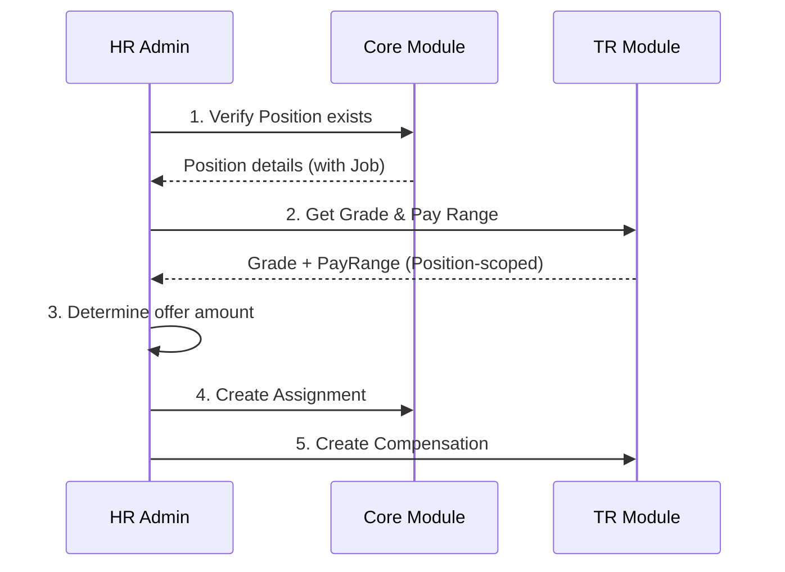
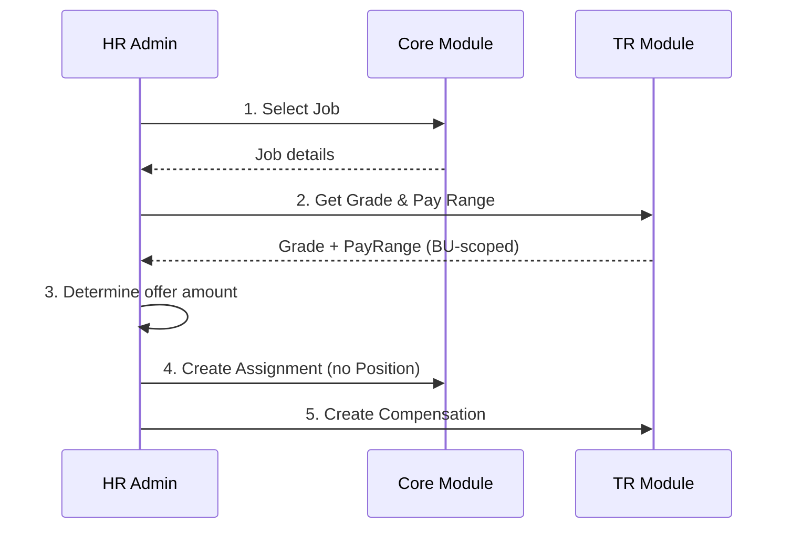

# New Hire Compensation Setup Guide

**Version**: 1.0  
**Last Updated**: 2025-12-17  
**Audience**: HR Administrators, Recruiters  
**Reading Time**: 15-20 minutes

---

## Overview

This guide provides step-by-step instructions for setting up compensation for new hires in both position-based and job-based staffing models.

---

## Position-Based Model

### Workflow



### Step-by-Step Process

**Step 1: Verify Position Exists**
```python
# GET /api/core/v1/positions/{position_id}
position = core_api.get_position("POS-ENG-001")

# Verify position is available
assert position['status'] == 'ACTIVE'
assert position['current_incumbents'] < position['max_incumbents']
```

**Step 2: Get Grade and Pay Range**
```python
# Get job from position
job = core_api.get_job(position['job_id'])
grade_code = job['grade_code']  # e.g., "G7"

# Get pay range (system resolves scope automatically)
pay_range = integration_api.get_pay_range_for_position(
    grade_code=grade_code,
    position_id=position['id']
)

# Display to recruiter
print(f"Pay Range: {pay_range['min_amount']:,} - {pay_range['max_amount']:,} {pay_range['currency']}")
```

**Step 3: Determine Offer Amount**
```python
# Validate offer is within range
offer_amount = 140_000_000  # VND

validation = integration_api.validate_compensation({
    "grade_code": grade_code,
    "position_id": position['id'],
    "base_salary": offer_amount,
    "currency": "VND"
})

if not validation['valid']:
    raise ValueError(f"Offer outside range: {validation['errors']}")
```

**Step 4: Create Assignment**
```python
# Hire employee to position
assignment = core_api.create_assignment({
    "employee_id": employee_id,
    "staffing_model": "POSITION_BASED",
    "position_id": position['id'],
    "job_id": job['id'],
    "business_unit_id": position['business_unit_id'],
    "effective_start_date": "2025-01-15"
})

# Update position incumbent count
position['current_incumbents'] += 1
```

**Step 5: Create Compensation**
```python
compensation = tr_api.create_employee_compensation({
    "employee_id": employee_id,
    "assignment_id": assignment['id'],
    "grade_code": grade_code,
    "base_salary": offer_amount,
    "currency": "VND",
    "effective_date": "2025-01-15"
})
```

---

## Job-Based Model

### Workflow



### Step-by-Step Process

**Step 1: Select Job**
```python
job = core_api.get_job("JOB-BACKEND-SENIOR")
grade_code = job['grade_code']  # "G7"
```

**Step 2: Get Pay Range**
```python
# For job-based, specify BU context
pay_range = integration_api.get_pay_range_for_bu(
    grade_code=grade_code,
    business_unit_id=bu_engineering_id
)
```

**Step 3-5: Same as Position-Based**
```python
# Create assignment WITHOUT position
assignment = core_api.create_assignment({
    "employee_id": employee_id,
    "staffing_model": "JOB_BASED",
    "position_id": None,  # No position!
    "job_id": job['id'],
    "business_unit_id": bu_engineering_id,
    "supervisor_assignment_id": manager_assignment_id,
    "effective_start_date": "2025-01-15"
})

# Create compensation (same as position-based)
compensation = tr_api.create_employee_compensation({...})
```

---

## Comparison

| Aspect | Position-Based | Job-Based |
|--------|----------------|-----------|
| **Position required?** | Yes | No |
| **Pay range scope** | Position > BU > LE > Global | BU > LE > Global |
| **Steps** | 5 steps | 5 steps |
| **Approval** | Position + Hire | Hire only |
| **Flexibility** | Lower | Higher |

---

## Common Issues

**Issue**: "Position not found"
- **Solution**: Verify position exists and is ACTIVE

**Issue**: "Offer outside pay range"
- **Solution**: Adjust offer or request exception approval

**Issue**: "Grade not found"
- **Solution**: Ensure job has valid grade_code referencing TR.GradeVersion

---

**See Also**:
- [Conceptual Guide](./01-conceptual-guide.md)
- [Technical Guide](./02-technical-guide.md)
