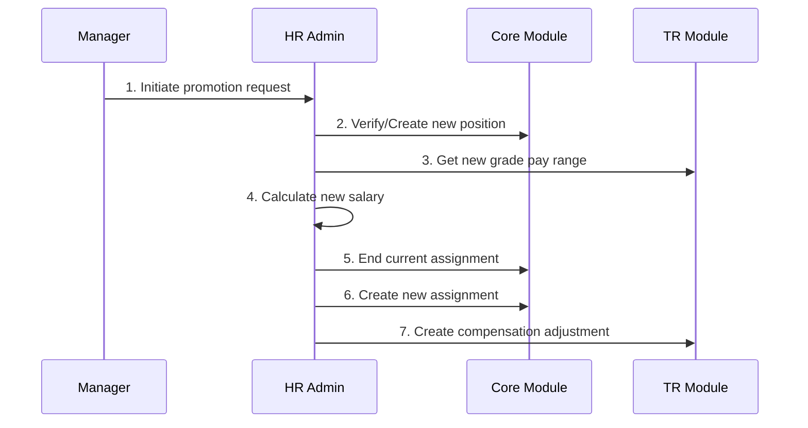

# Promotion Process Guide

**Version**: 1.0  
**Last Updated**: 2025-12-17  
**Audience**: HR Administrators, Managers  
**Reading Time**: 15-20 minutes

---

## Overview

Guide for processing promotions with grade changes in both staffing models.

---

## Position-Based Promotion

### Scenario: Mid Engineer → Senior Engineer

**Current State**:
```yaml
Position: POS-ENG-MID-001
Job: JOB-BACKEND-MID (Grade G6)
Salary: 90,000,000 VND
```

**Target State**:
```yaml
Position: POS-ENG-SENIOR-002
Job: JOB-BACKEND-SENIOR (Grade G7)
Salary: 125,000,000 VND (39% increase)
```

### Workflow



### Steps

**Step 1: Determine New Salary**
```python
# Get current compensation
current_comp = tr_api.get_employee_compensation(employee_id)
current_salary = current_comp['base_salary']  # 90M VND

# Get new grade pay range
new_pay_range = integration_api.get_pay_range_for_position(
    grade_code="G7",
    position_id="POS-ENG-SENIOR-002"
)

# Calculate promotion increase (typically 10-15%)
promotion_increase_pct = 12  # 12%
new_salary = current_salary * (1 + promotion_increase_pct / 100)

# Ensure at least minimum of new grade
new_salary = max(new_salary, new_pay_range['min_amount'])

# Validate within range
assert new_salary <= new_pay_range['max_amount'], "Exceeds grade maximum"
```

**Step 2: End Current Assignment**
```python
core_api.end_assignment(
    assignment_id=current_assignment_id,
    effective_end_date="2025-03-31"
)
```

**Step 3: Create New Assignment**
```python
new_assignment = core_api.create_assignment({
    "employee_id": employee_id,
    "staffing_model": "POSITION_BASED",
    "position_id": "POS-ENG-SENIOR-002",
    "job_id": "JOB-BACKEND-SENIOR",
    "effective_start_date": "2025-04-01"
})
```

**Step 4: Create Compensation Adjustment**
```python
adjustment = tr_api.create_compensation_adjustment({
    "employee_id": employee_id,
    "adjustment_type": "PROMOTION",
    "old_assignment_id": current_assignment_id,
    "new_assignment_id": new_assignment['id'],
    "old_grade_code": "G6",
    "new_grade_code": "G7",
    "current_amount": 90_000_000,
    "proposed_amount": 125_000_000,
    "increase_amount": 35_000_000,
    "increase_pct": 38.89,
    "effective_date": "2025-04-01",
    "rationale": "Promotion to Senior Engineer"
})
```

---

## Job-Based Promotion

### Simpler Process

```python
# Step 1: End current assignment
core_api.end_assignment(current_assignment_id, "2025-03-31")

# Step 2: Create new assignment (new job, no position change)
new_assignment = core_api.create_assignment({
    "employee_id": employee_id,
    "staffing_model": "JOB_BASED",
    "position_id": None,
    "job_id": "JOB-BACKEND-SENIOR",  # New job with G7
    "business_unit_id": bu_id,
    "effective_start_date": "2025-04-01"
})

# Step 3: Create compensation adjustment (same as position-based)
adjustment = tr_api.create_compensation_adjustment({...})
```

---

## Salary Adjustment Guidelines

### Typical Promotion Increases

| Scenario | Increase % | Example |
|----------|-----------|---------|
| Single grade (G6→G7) | 10-15% | 90M → 100M-103M |
| Double grade (G6→G8) | 20-30% | 90M → 108M-117M |
| To management | 15-20% | 90M → 103M-108M |

### Positioning in New Range

```python
def calculate_promotion_salary(
    current_salary: float,
    new_pay_range: dict,
    performance_rating: str
) -> float:
    """
    Calculate new salary based on performance and range
    """
    # Base increase: 12%
    base_increase = current_salary * 0.12
    new_salary = current_salary + base_increase
    
    # Adjust based on performance
    if performance_rating == "EXCEEDS":
        # Position higher in range
        target_compa_ratio = 90  # 90% of midpoint
    else:  # MEETS
        # Position at entry of range
        target_compa_ratio = 80  # 80% of midpoint
    
    target_salary = new_pay_range['mid_amount'] * (target_compa_ratio / 100)
    
    # Use higher of calculated or target
    final_salary = max(new_salary, target_salary)
    
    # Ensure within range
    final_salary = max(final_salary, new_pay_range['min_amount'])
    final_salary = min(final_salary, new_pay_range['max_amount'])
    
    return final_salary
```

---

## Approval Workflow

```yaml
Approval Thresholds:
  0-10% increase: Manager approval
  10-20% increase: Director approval
  >20% increase: VP approval
  
Double-grade promotion: Always requires VP approval
```

---

**See Also**:
- [Conceptual Guide](./01-conceptual-guide.md)
- [Merit Review Guide](./05-merit-review-process.md)
