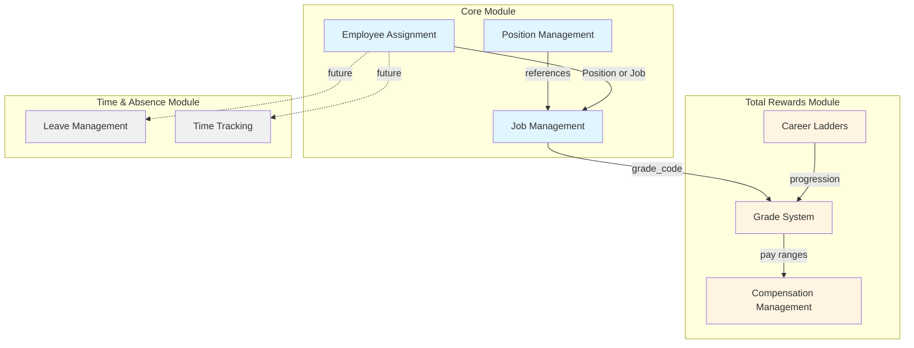

# Cross-Module Integration Documentation

**Version**: 1.0  
**Last Updated**: 2025-12-17  
**Purpose**: Central hub for all cross-module integration documentation in xTalent

---

## 📋 Overview

This directory contains comprehensive integration guides that explain how different xTalent modules work together. Each integration area includes both conceptual guides (for business users) and technical guides (for developers).

### Why Integration Documentation?

Modern HR systems are complex, with multiple modules that must work seamlessly together. Understanding these integrations is critical for:

- **HR Administrators**: To configure and manage the system effectively
- **Developers**: To implement features correctly across module boundaries
- **Business Analysts**: To design processes that leverage multiple modules
- **System Architects**: To understand data flow and dependencies

---

## 🔗 Available Integrations

### Core ↔ Total Rewards Integration

The integration between Core (job/position management) and Total Rewards (compensation/grades) is fundamental to the xTalent system.

#### For Business Users (HR, Compensation Managers)

- **[Conceptual Integration Guide](./CO-TR-integration/01-conceptual-guide.md)** ⭐ **START HERE**
  - Understand how jobs, positions, grades, and ladders work together
  - Learn the difference between position-based and job-based staffing
  - See real-world examples and workflows
  - **Reading Time**: 30-40 minutes

#### For Technical Users (Developers, Implementers)

- **[Technical Integration Guide](./CO-TR-integration/02-technical-guide.md)**
  - Database schema and relationships
  - API integration points
  - Code examples for grade and pay range resolution
  - Event-driven integration patterns
  - **Reading Time**: 45-60 minutes

#### Scenario-Specific Guides

Practical, step-by-step guides for common workflows:

- **[New Hire Compensation Setup](./CO-TR-integration/03-new-hire-setup.md)**
  - How to set up compensation for new hires
  - Covers both position-based and job-based models
  - Includes API examples and validation rules

- **[Promotion Process](./CO-TR-integration/04-promotion-process.md)**
  - Processing promotions with grade changes
  - Salary adjustment logic
  - Approval workflows

- **[Merit Review Process](./CO-TR-integration/05-merit-review-process.md)**
  - Annual merit review cycle
  - Eligibility determination
  - Compa-ratio calculation
  - Budget tracking

#### Migration & Implementation

- **[Migration Guide: JobGrade → GradeVersion](./CO-TR-integration/06-migration-guide.md)**
  - Migrating from Core.JobGrade (deprecated) to TR.GradeVersion
  - Data migration scripts
  - Validation and rollback procedures

---

## 🗺️ Integration Map

---

## 📚 Quick Navigation by Role

### I'm an HR Administrator
**Start here**: [Conceptual Integration Guide](./CO-TR-integration/01-conceptual-guide.md)

Then explore:
- [New Hire Setup](./CO-TR-integration/03-new-hire-setup.md)
- [Promotion Process](./CO-TR-integration/04-promotion-process.md)
- [Merit Review Process](./CO-TR-integration/05-merit-review-process.md)

### I'm a Developer
**Start here**: [Technical Integration Guide](./CO-TR-integration/02-technical-guide.md)

Then explore:
- [New Hire Setup](./CO-TR-integration/03-new-hire-setup.md) - for API examples
- [Migration Guide](./CO-TR-integration/06-migration-guide.md) - for data migration

### I'm a Compensation Manager
**Start here**: [Conceptual Integration Guide](./CO-TR-integration/01-conceptual-guide.md)

Focus on:
- Section: "Grade System Integration"
- Section: "Career Ladder Integration"
- [Merit Review Process](./CO-TR-integration/05-merit-review-process.md)

### I'm implementing a new system
**Follow this sequence**:
1. [Conceptual Integration Guide](./CO-TR-integration/01-conceptual-guide.md) - Understand the concepts
2. [Technical Integration Guide](./CO-TR-integration/02-technical-guide.md) - Understand the implementation
3. [Migration Guide](./CO-TR-integration/06-migration-guide.md) - Plan your migration
4. Scenario guides - Implement specific workflows

---

## 🔮 Future Integrations

The following integrations are planned for future documentation:

### Core ↔ Time & Absence
- How employee assignments affect leave eligibility
- Time tracking for different employment types
- Absence impact on compensation

### Total Rewards ↔ Time & Absence
- Overtime compensation calculation
- Leave impact on payroll
- Attendance bonuses

### Core ↔ Talent Acquisition
- Requisition to position mapping
- Offer management integration
- New hire onboarding

---

## 📖 Related Documentation

### Core Module Documentation
- [Job & Position Management Guide](../CO/01-concept/03-job-position-guide.md)
- [Staffing Models Guide](../CO/01-concept/08-staffing-models-guide.md)
- [Organization Structure Guide](../CO/01-concept/02-organization-structure-guide.md)

### Total Rewards Module Documentation
- [Compensation Management Guide](../TR/01-concept/03-compensation-management-guide.md)
- [Variable Pay Guide](../TR/01-concept/04-variable-pay-guide.md)
- [Benefits Administration Guide](../TR/01-concept/05-benefits-administration-guide.md)

---

## 🤝 Contributing

When adding new integration documentation:

1. **Follow the structure**: Conceptual guide + Technical guide + Scenario guides
2. **Use consistent terminology**: Refer to existing guides
3. **Include diagrams**: Visual aids improve understanding
4. **Provide examples**: Real-world scenarios and code samples
5. **Cross-reference**: Link to related documentation

---

## 📞 Support

For questions about integration documentation:
- **Business questions**: Contact HR Operations team
- **Technical questions**: Contact Development team
- **Documentation feedback**: Submit via documentation review process

---

## 📝 Document Status

| Integration | Conceptual | Technical | Scenarios | Status |
|-------------|-----------|-----------|-----------|--------|
| Core ↔ TR | ✅ Complete | ✅ Complete | ✅ Complete | **Live** |
| Core ↔ TA | 📝 Planned | 📝 Planned | 📝 Planned | Planned |
| TR ↔ TA | 📝 Planned | 📝 Planned | 📝 Planned | Planned |

**Last Review**: 2025-12-17  
**Next Review**: 2026-03-17 (Quarterly)
