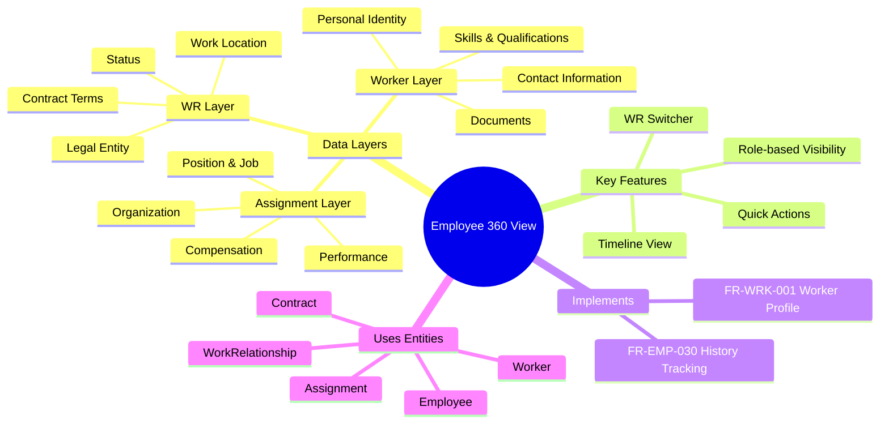
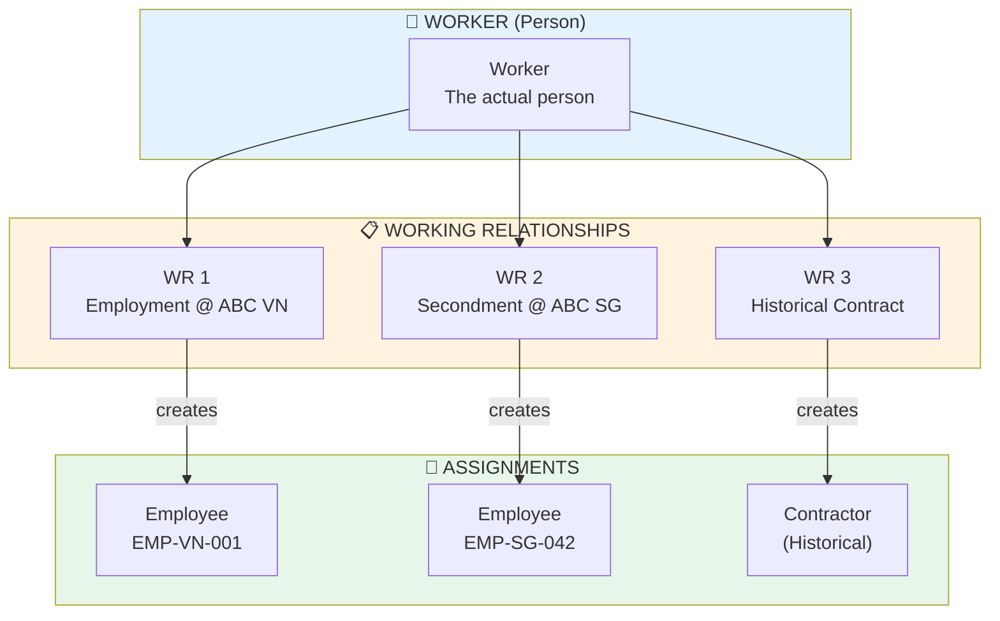
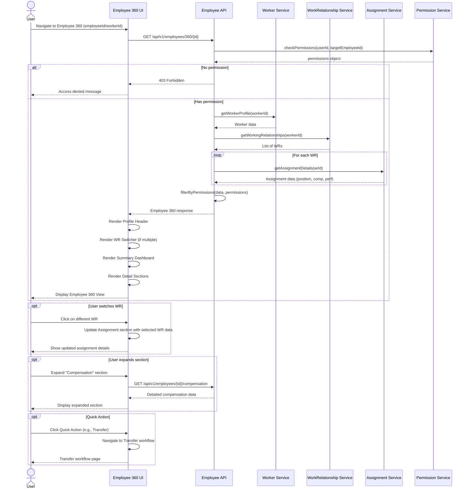

---
# === METADATA ===
id: FEAT-CO-016
type: FEATURE
module: CORE
sub_module: EMPLOYMENT
title: "Employee 360 View (Hồ Sơ Nhân Viên Toàn Diện)"
version: "1.0.0"
status: DRAFT
priority: HIGH
phase: 1

# === ACTORS ===
actors:
  - HR Administrator
  - HR Manager
  - Employee (Self)
  - Manager
  - Auditor

# === TRIGGERS ===
triggers:
  - "User clicks on employee from Global Search results"
  - "User clicks on employee name from org chart"
  - "User navigates directly via employee URL"
  - "Manager clicks on team member from team view"

# === PRE-CONDITIONS ===
preconditions:
  - "User is authenticated and authorized"
  - "Employee record exists in system"
  - "User has permission to view employee data (role-based)"
  - "At least one active or historical working relationship exists"

# === POST-CONDITIONS ===
postconditions:
  - "Comprehensive employee profile displayed"
  - "All working relationships visible (with access control)"
  - "Current and historical data accessible"
  - "Quick actions available based on user role"

# === USER STORY ===
user_story:
  as: "HR Administrator"
  i_want: "view a comprehensive 360-degree profile of an employee showing all their information across Worker, Working Relationship, and Assignment layers"
  so_that: "I can get complete visibility into an employee's identity, employment history, organizational position, and related data in a single unified view"

# === ACCEPTANCE CRITERIA (Gherkin) ===
acceptance_criteria:
  - scenario: "View employee with single working relationship"
    given: "Employee EMP-001 has one active employment with ABC Corp Vietnam"
    when: "HR Admin navigates to Employee 360 for EMP-001"
    then: |
      Profile header shows Worker identity (name, photo, contact)
      AND Current WR summary shows ABC Corp VN employment
      AND Assignment details show position, department, manager
      AND Related data sections are accessible (compensation, time, performance)

  - scenario: "View employee with multiple working relationships"
    given: "Worker W-001 has 2 active WRs (employment at ABC VN, secondment at ABC SG) and 1 historical (contract at XYZ)"
    when: "HR Admin views Employee 360"
    then: |
      WR Switcher shows all 3 relationships with status indicators
      AND Primary WR is selected by default
      AND User can switch between WRs to see specific assignment data
      AND Historical WR is marked distinctly

  - scenario: "Role-based data visibility"
    given: "Employee Nguyễn A views their own profile (self-service)"
    when: "Nguyễn A navigates to their Employee 360"
    then: |
      Personal information is fully visible
      AND Compensation details show appropriate level (based on self-service config)
      AND Manager section shows reporting line
      AND Edit actions are available for self-service fields only

  - scenario: "View WR timeline"
    given: "Employee has 5-year employment history with promotions and transfers"
    when: "User expands Working Relationship Timeline section"
    then: |
      Visual timeline shows all career events
      AND Promotions, transfers, salary changes marked as milestones
      AND Can click any event to view details

  - scenario: "Navigate to related entities"
    given: "Employee is viewing details on Employee 360"
    when: "User clicks on Manager name, Department, or Position"
    then: |
      Navigation to related entity detail page occurs
      AND Breadcrumb allows return to original profile

  - scenario: "Quick actions for HR Admin"
    given: "HR Admin is viewing active employee's 360 profile"
    when: "User opens Quick Actions menu"
    then: |
      Context-sensitive actions available (Transfer, Promote, Adjust Compensation, Terminate)
      AND Actions respect employee's current status
      AND Actions link to relevant workflows

# === DATA CONTRACT ===
data_contract:
  input:
    employeeId: "string"
    workerId: "string?"
    viewOptions:
      wrId: "string?"
      includeHistorical: "boolean"
      expandSections: "string[]?"
  
  output:
    worker:
      workerId: "string"
      fullNameVi: "string"
      fullNameEn: "string"
      preferredName: "string?"
      dateOfBirth: "date"
      gender: "string"
      nationality: "string"
      maritalStatus: "string?"
      photoUrl: "string?"
      personalEmail: "string"
      phone: "string"
      addresses:
        - type: "string"
          fullAddress: "string"
      emergencyContacts:
        - name: "string"
          relationship: "string"
          phone: "string"
      identityDocuments:
        - type: "string"
          number: "string"
          issuedDate: "date?"
          expiryDate: "date?"
      skills:
        - skillName: "string"
          proficiencyLevel: "string"
          verified: "boolean"
      education:
        - institution: "string"
          degree: "string"
          graduationYear: "number"
      certifications:
        - name: "string"
          issuer: "string"
          validUntil: "date?"
    
    workingRelationships:
      - wrId: "string"
        legalEntityId: "string"
        legalEntityName: "string"
        legalEntityCode: "string"
        country: "string"
        wrType: "string"
        wrStatus: "string"
        startDate: "date"
        endDate: "date?"
        tenure: "string"
        isPrimary: "boolean"
        contractType: "string"
        workLocation: "string"
        workSchedule: "string"
        workEmail: "string?"
        assignment:
          employeeId: "string"
          employeeNumber: "string"
          jobTitle: "string"
          jobFamily: "string"
          jobLevel: "string"
          positionId: "string"
          positionTitle: "string"
          department: "string"
          division: "string?"
          team: "string?"
          costCenter: "string?"
          location: "string"
          manager:
            employeeId: "string"
            name: "string"
            jobTitle: "string"
          directReports:
            count: "number"
            items:
              - employeeId: "string"
                name: "string"
                jobTitle: "string"
          compensation:
            baseSalary: "number"
            currency: "string"
            totalPackage: "number?"
            nextReviewDate: "date?"
          benefits:
            - benefitType: "string"
              planName: "string"
              enrollmentStatus: "string"
          timeAndAttendance:
            leaveBalance:
              - leaveType: "string"
                balance: "number"
            currentMonth:
              workingDays: "number"
              attended: "number"
          performance:
            currentRating: "string?"
            goalsProgress:
              total: "number"
              onTrack: "number"
    
    timeline:
      events:
        - eventId: "string"
          eventType: "string"
          eventDate: "date"
          wrId: "string"
          summary: "string"
          details: "object"
    
    permissions:
      canEdit: "boolean"
      canEditSections: "string[]"
      visibleSections: "string[]"
      availableActions: "string[]"

# === REFERENCES TO EXTERNAL DOCS ===
requirements:
  - "[[FR-WRK-001]]"  # Create Worker Profile
  - "[[FR-WRK-002]]"  # Update Worker Profile
  - "[[FR-EMP-001]]"  # Create Employee Record
  - "[[FR-WR-001]]"   # Create Working Relationship
  - "[[FR-EMP-030]]"  # Employment History Tracking

business_rules:
  - "[[BR-WRK-001]]"  # Worker Identification
  - "[[BR-EMP-001]]"  # Employee Creation Validation
  - "[[BR-WR-001]]"   # Working Relationship Rules

related_ontology:
  - "[[Worker]]"
  - "[[Employee]]"
  - "[[WorkRelationship]]"
  - "[[Assignment]]"
  - "[[Contract]]"
  - "[[Position]]"
  - "[[BusinessUnit]]"

related_features:
  - "[[FEAT-CO-001]]"  # Create Worker Profile
  - "[[FEAT-CO-002]]"  # Update Worker Profile
  - "[[FEAT-CO-010]]"  # Hire Employee
  - "[[FEAT-CO-014]]"  # View Working Records

concept_guides:
  - "00-global/note/emp360_analyze.md"
---

# Employee 360 View (Hồ Sơ Nhân Viên Toàn Diện)

> **Feature**: Comprehensive, unified view of employee information across Worker, Working Relationship, and Assignment layers

## 1. Overview



## 2. User Story

**As an** HR Administrator  
**I want to** view a comprehensive 360-degree profile of an employee showing all their information across Worker, Working Relationship, and Assignment layers  
**So that** I can get complete visibility into an employee's identity, employment history, organizational position, and related data in a single unified view

## 3. Business Context

### Vision
> **"Một cái nhìn toàn diện về con người - không chỉ là nhân viên"**

Employee 360 View is the central hub for viewing all information related to an individual in the HCM system. It's the destination from Global Search when users search for employees, providing a comprehensive overview and drill-down capability into every aspect of the employee data graph.

### Data Model Foundation



### Key Objectives

| Objective | Description | Success Metric |
|-----------|-------------|----------------|
| **Comprehensive** | Display all related information in one view | 100% data coverage |
| **Intuitive** | User finds information in < 3 clicks | Task completion < 10s |
| **Contextual** | Information adapts to viewer's role | Role satisfaction > 85% |
| **Connected** | Show relationships and navigation paths | Graph navigation success |
| **Actionable** | Quick actions from current context | Action completion > 70% |

## 4. Acceptance Criteria

### Scenario 1: View employee with single working relationship

```gherkin
Given Employee EMP-001 has one active employment with ABC Corp Vietnam
  And Employment started on 2020-01-15 (5 years tenure)
  And Current position is "Senior Software Engineer" in Engineering dept
When HR Admin navigates to Employee 360 for EMP-001
Then Profile header displays:
  | Field         | Value                           |
  | Photo         | Employee profile picture        |
  | Name          | Nguyễn Văn A                   |
  | Worker ID     | W-001                          |
  | Personal Email| nguyen.a@gmail.com             |
  | Status        | ✅ Active                       |
And Current WR summary shows:
  | Field         | Value                           |
  | Legal Entity  | ABC Corporation Vietnam         |
  | Type          | Employment (Full-time)          |
  | Since         | Jan 2020 (5yr tenure)           |
  | Role          | Senior Software Engineer        |
And Assignment details are accessible:
  | Section       | Key Data                        |
  | Organization  | Department, Team, Manager       |
  | Compensation  | Salary, Benefits, Next Review   |
  | Time          | Leave balance, Attendance       |
  | Performance   | Current rating, Goals progress  |
```

### Scenario 2: View employee with multiple working relationships

```gherkin
Given Worker W-001 has working relationships:
  | WR Type    | Legal Entity    | Status      | Role              |
  | Employment | ABC Corp VN     | Active      | Senior Engineer   |
  | Secondment | ABC Corp SG     | Active      | Tech Lead Regional|
  | Contract   | XYZ Consulting  | Completed   | Tech Consultant   |
When HR Admin views Employee 360 for W-001
Then WR Switcher panel shows all 3 relationships:
  And ABC Corp VN is marked as PRIMARY with (✓ SELECTED)
  And ABC Corp SG shows [View →] action to switch
  And XYZ Consulting shows HISTORY badge and [View →] action
  And Each WR card shows: Legal Entity, Type, Role, Period, Status
When User clicks [View →] on ABC Corp SG
Then Assignment section updates to show Singapore data:
  | Field       | Value               |
  | Employee ID | EMP-SG-042          |
  | Job Title   | Tech Lead Regional  |
  | Department  | Regional Technology |
  | Manager     | John D              |
```

### Scenario 3: Self-service view

```gherkin
Given Employee Nguyễn A is logged into self-service portal
When Nguyễn A navigates to their own Employee 360 profile
Then Personal information section is fully visible and editable (for allowed fields)
  And Compensation shows "View Statement" button (not raw salary)
  And Performance shows their own goals and reviews
  And Edit button appears for self-service sections:
    | Section          | Editable Fields                    |
    | Contact Info     | Phone, Address, Emergency Contact  |
    | Skills           | Add/Edit personal skills           |
    | Documents        | Upload personal documents          |
```

### Scenario 4: WR Timeline visualization

```gherkin
Given Employee has 5-year employment history:
  | Date       | Event Type      | Details                          |
  | 2020-01    | HIRE           | Junior Engineer, G1              |
  | 2020-04    | PROBATION_END  | Completed probation              |
  | 2021-06    | PROMOTION      | → Engineer, G2, +20% salary      |
  | 2022-07    | PROMOTION      | → Senior Engineer, G3, +25%      |
  | 2023-03    | TRANSFER       | Backend → Platform Team          |
  | 2024-07    | SECONDMENT     | + ABC Corp Singapore assignment  |
When User expands "Working Relationship Timeline" section
Then Visual timeline displays:
  - Horizontal axis: 2020 ─── 2021 ─── 2022 ─── 2023 ─── 2024 ─── 2025 →
  - ABC Corp VN bar: ████████████████████████████████████████████████████▶
  - ABC Corp SG bar:                                   ██████████████▶
  - Event markers (●) at each career milestone
  - Click any event shows detail popup
```

### Scenario 5: Quick actions for HR Admin

```gherkin
Given HR Admin is viewing Employee 360 for active employee Singh A
When HR Admin clicks [⚡ Actions ▼] button in profile header
Then Quick Actions dropdown shows:
  | Action                | Description                    |
  | 📋 Transfer           | → Transfer Employee workflow   |
  | 📈 Promote            | → Promotion workflow           |
  | 💰 Adjust Compensation| → Compensation adjustment      |
  | 📅 Schedule Review    | → Performance review scheduler |
  | ⏹️ Terminate          | → Termination workflow         |
  And Actions are contextual to employee status
  And Clicking action navigates to respective workflow
```

## 5. Data Contract

### Input Schema (JSON5)

```json5
{
  // Required: Employee or Worker identification
  employeeId: "e7f45c23-1234-5678",  // UUID of specific employee assignment
  workerId: "w9a12b34-5678-90cd",     // OR Worker UUID (shows all WRs)
  
  // View options
  viewOptions: {
    wrId: "wr-abc-001",              // Specific WR to show (optional)
    includeHistorical: true,          // Include completed WRs
    expandSections: ["timeline", "compensation"]  // Auto-expand sections
  }
}
```

### Output Schema (JSON5)

```json5
{
  // Worker Layer - Shared identity
  worker: {
    workerId: "W-001",
    fullNameVi: "Nguyễn Văn A",
    fullNameEn: "Nguyen Van A",
    dateOfBirth: "1990-03-15",
    gender: "male",
    nationality: "Vietnamese",
    photoUrl: "/photos/w001.jpg",
    personalEmail: "nguyen.a@gmail.com",
    phone: "+84 912 345 678",
    addresses: [
      { type: "permanent", fullAddress: "456 Le Loi, D3, HCMC" },
      { type: "current", fullAddress: "123 Nguyen Hue, D1, HCMC" }
    ],
    emergencyContacts: [
      { name: "Nguyễn Thị B", relationship: "Spouse", phone: "+84 909 xxx" }
    ],
    identityDocuments: [
      { type: "CCCD", number: "079190xxxx", expiryDate: null },
      { type: "Passport", number: "Cxxxxxx", expiryDate: "2030-12-31" }
    ],
    skills: [
      { skillName: "Python", proficiencyLevel: "Expert", verified: true },
      { skillName: "AWS", proficiencyLevel: "Advanced", verified: true }
    ],
    certifications: [
      { name: "AWS Solutions Architect", issuer: "Amazon", validUntil: "2026-05-01" }
    ]
  },
  
  // Working Relationships Layer
  workingRelationships: [
    {
      wrId: "WR-001",
      legalEntityName: "ABC Corporation Vietnam",
      legalEntityCode: "ABC-VN",
      country: "Vietnam",
      wrType: "EMPLOYMENT",
      wrStatus: "ACTIVE",
      startDate: "2020-01-15",
      endDate: null,
      tenure: "4 years 11 months",
      isPrimary: true,
      contractType: "Indefinite Term",
      workLocation: "HCM Office",
      workEmail: "nguyen.a@abccorp.com.vn",
      
      // Assignment data specific to this WR
      assignment: {
        employeeId: "EMP-VN-001",
        employeeNumber: "EMP-VN-001",
        jobTitle: "Senior Software Engineer",
        jobFamily: "Engineering > Software Development",
        jobLevel: "L5",
        positionId: "POS-ENG-042",
        department: "Engineering",
        division: "Technology",
        team: "Platform Team",
        costCenter: "CC-ENG-001",
        location: "HCM Office",
        
        manager: {
          employeeId: "EMP-VN-MGR-001",
          name: "Trần Văn B",
          jobTitle: "Engineering Manager"
        },
        
        directReports: {
          count: 8,
          items: [
            { employeeId: "EMP-003", name: "Ngô Văn D", jobTitle: "Software Engineer" }
            // ... more
          ]
        },
        
        compensation: {
          baseSalary: 90000000,
          currency: "VND",
          totalPackage: 120000000,
          nextReviewDate: "2026-03-01"
        },
        
        benefits: [
          { benefitType: "Health", planName: "Premium Health Care", enrollmentStatus: "ENROLLED" }
        ],
        
        timeAndAttendance: {
          leaveBalance: [
            { leaveType: "Annual", balance: 12 }
          ],
          currentMonth: { workingDays: 20, attended: 17 }
        },
        
        performance: {
          currentRating: "Exceeds Expectations",
          goalsProgress: { total: 4, onTrack: 3 }
        }
      }
    }
    // ... more WRs
  ],
  
  // Timeline of career events
  timeline: {
    events: [
      {
        eventId: "EVT-001",
        eventType: "HIRE",
        eventDate: "2020-01-15",
        wrId: "WR-001",
        summary: "Hired as Junior Engineer at ABC Corp VN"
      }
      // ... more events
    ]
  },
  
  // Role-based permissions
  permissions: {
    canEdit: true,
    canEditSections: ["worker.contact", "worker.skills"],
    visibleSections: ["all"],
    availableActions: ["transfer", "promote", "adjust_compensation", "terminate"]
  }
}
```

## 6. Activities Flow



## 7. UI Sketch

### Desktop View - Profile Header + WR Switcher

```
┌──────────────────────────────────────────────────────────────────────────────┐
│  ← Back to Search                                            [⋯] Actions ▼   │
├──────────────────────────────────────────────────────────────────────────────┤
│                                                                              │
│   ┌────────┐   NGUYỄN VĂN A                          ┌────────────────────┐  │
│   │        │   Worker ID: W-001                       │  ✅ Active         │  │
│   │  📷    │                                          │  📍 Ho Chi Minh    │  │
│   │ Photo  │   📧 nguyen.a@gmail.com (Personal)       │  🎂 34 years       │  │
│   │        │   📱 0912-345-678                        │                    │  │
│   └────────┘                                          └────────────────────┘  │
│                                                                              │
│   ┌──────────────────────────────────────────────────────────────────────┐   │
│   │ 📋 CURRENT WORKING RELATIONSHIP                                  [▼] │   │
│   │ ━━━━━━━━━━━━━━━━━━━━━━━━━━━━━━━━━━━━━━━━━━━━━━━━━━━━━━━━━━━━━━━━━━━ │   │
│   │ 🏢 ABC Corporation Vietnam          Type: Employment (Full-time)     │   │
│   │ 👔 Senior Software Engineer         Since: Jan 2020 (5yr 0mo)        │   │
│   │ 🏛️ Engineering Department           Manager: Trần Văn B              │   │
│   └──────────────────────────────────────────────────────────────────────┘   │
│                                                                              │
│   Skills: Python ● AWS ● React ● System Design ● +5 more                    │
│                                                                              │
│   ┌──────────────┐ ┌──────────────┐ ┌──────────────┐ ┌──────────────────┐   │
│   │ 📧 Message   │ │ 📅 Schedule  │ │ 📊 Org Chart │ │ ⚡ Actions ▼     │   │
│   └──────────────┘ └──────────────┘ └──────────────┘ └──────────────────┘   │
│                                                                              │
└──────────────────────────────────────────────────────────────────────────────┘
```

### Desktop View - Summary Dashboard

```
┌──────────────────────────────────────────────────────────────────────────────┐
│  SUMMARY DASHBOARD                                                            │
├──────────────────────────────────────────────────────────────────────────────┤
│                                                                              │
│  ┌───────────────────────────────┐  ┌───────────────────────────────┐       │
│  │ 👤 WORKER PROFILE             │  │ 📋 CURRENT WR                 │       │
│  │ ───────────────────────────── │  │ ───────────────────────────── │       │
│  │ Name: Nguyễn Văn A            │  │ Legal Entity: ABC Corp VN     │       │
│  │ DOB: Mar 15, 1990 (34y)       │  │ Type: Employment              │       │
│  │ Nationality: Vietnamese       │  │ Contract: Indefinite          │       │
│  │ Skills: 12 verified           │  │ Location: HCM Office          │       │
│  │ Certifications: 5             │  │ Since: Jan 2020 (5yr)         │       │
│  │                               │  │ Status: Active ✅              │       │
│  │ [View Personal Info →]        │  │ [View WR Details →]           │       │
│  └───────────────────────────────┘  └───────────────────────────────┘       │
│                                                                              │
│  ━━━━━━━━━━━━━━━━━━━━━━━━━━━━━━━━━━━━━━━━━━━━━━━━━━━━━━━━━━━━━━━━━━━━━━━━━  │
│  📊 ASSIGNMENT DETAILS (Employee @ ABC Corp VN)                              │
│  ━━━━━━━━━━━━━━━━━━━━━━━━━━━━━━━━━━━━━━━━━━━━━━━━━━━━━━━━━━━━━━━━━━━━━━━━━  │
│                                                                              │
│  ┌───────────────────────────────┐  ┌───────────────────────────────┐       │
│  │ 🏢 ORGANIZATION               │  │ 🕐 TIME & ATTENDANCE          │       │
│  │ Position: Senior Engineer     │  │ This Month: ━━━━━━━━━ 85%     │       │
│  │ Department: Engineering       │  │ 17/20 working days            │       │
│  │ Grade: L5                     │  │ Leave Balance                 │       │
│  │ Manager: Trần Văn B           │  │ Annual: 12 days               │       │
│  │ Reports: 8 people             │  │ [View Timesheet →]            │       │
│  │ [View Org Chart →]            │  │                               │       │
│  └───────────────────────────────┘  └───────────────────────────────┘       │
│                                                                              │
│  ┌───────────────────────────────┐  ┌───────────────────────────────┐       │
│  │ 💰 COMPENSATION               │  │ 🎯 PERFORMANCE                │       │
│  │ Annual Package                │  │ Current Rating                │       │
│  │ Base: ██████████░ 70%         │  │ ★★★★★ Exceeds                 │       │
│  │ Variable: ████░░░ 20%         │  │                               │       │
│  │ Benefits: ██░░░░░ 10%         │  │ Goals Progress                │       │
│  │ Next Review: Mar 2026         │  │ ━━━━━━━━━━━━ 75%              │       │
│  │ [View Details →]              │  │ 3/4 goals on track            │       │
│  └───────────────────────────────┘  └───────────────────────────────┘       │
│                                                                              │
└──────────────────────────────────────────────────────────────────────────────┘
```

### Mobile View

```
┌────────────────────────────┐
│ ← Employee 360      [···]  │
├────────────────────────────┤
│                            │
│      ┌──────────┐          │
│      │   📷     │          │
│      │  Photo   │          │
│      └──────────┘          │
│  NGUYỄN VĂN A              │
│  Senior Software Engineer  │
│  ✅ Active • 🏢 ABC Corp VN │
│                            │
│  ┌────────────────────────┐│
│  │ 📋 WR: ABC Corp VN  ▼  ││
│  └────────────────────────┘│
│                            │
│  ╭────────╮ ╭────────╮     │
│  │ 👤     │ │ 📋     │     │
│  │ Worker │ │ WR     │     │
│  ╰────────╯ ╰────────╯     │
│  ╭────────╮ ╭────────╮     │
│  │ 🏢     │ │ 💰     │     │
│  │ Org    │ │ Comp   │     │
│  ╰────────╯ ╰────────╯     │
│                            │
│  ──── DETAILS ────         │
│                            │
│  ▸ Personal Information    │
│  ▸ Working Relationship    │
│  ▸ Organization            │
│  ▸ Compensation            │
│  ▸ Performance & Goals     │
│  ▸ Timeline                │
│                            │
│  ┌────────────────────────┐│
│  │    [⚡ Quick Actions]   ││
│  └────────────────────────┘│
└────────────────────────────┘
```

## 8. Business Rules

### Data Visibility Rules
- **Self-service**: Employees can view their own full profile, with compensation shown as statements (not raw figures unless configured)
- **Manager view**: Managers can view direct reports' profiles with position-relevant data
- **HR Admin**: Full access to all employee data within their scope
- **Cross-WR visibility**: Worker-level data shared across all WRs; assignment data is WR-specific

### Multiple WR Handling
- Primary WR is auto-selected on first view
- WR Switcher shows status indicators (Active/Inactive/Historical)
- Switching WR only affects Assignment section; Worker data remains constant
- Historical WRs are viewable but marked distinctly

### Action Availability
- Quick actions are context-sensitive based on employee status and viewer role
- Terminated employees show limited actions (view history only)
- Actions requiring approval show approval indicator

## 9. Integration Points

### Entry Points
- Global Search results → Employee 360
- Org Chart click → Employee 360
- Team list click → Employee 360
- Working Records → Employee 360

### Exit Points (Navigation)
- Manager name → Manager's Employee 360
- Department → Business Unit detail
- Position → Position detail
- Org Chart → Interactive org visualization
- Quick Action → Respective workflow

## 10. Success Metrics

| Metric | Target | Description |
|--------|--------|-------------|
| Page Load Time | < 2s | Initial profile load with summary |
| Data Coverage | 100% | All entity data accessible |
| Role Accuracy | > 99% | Correct data visibility per role |
| Action Completion | > 70% | Quick actions lead to completion |
| User Satisfaction | > 85% | NPS for finding information |

## 11. API Mapping (Module Core)

> **Note**: Danh sách APIs từ module Core (CO) cần sử dụng cho Employee 360 View.  
> APIs đánh dấu `(*)` = chưa có trong Core API Catalogue, cần bổ sung hoặc thuộc module khác.

#### API Type Legend

> **Theo chuẩn API Catalogue** (core-hr-api-catalog.md và các catalogue khác)

| Type | Icon | Pattern | Description |
|------|------|---------|-------------|
| **CRUD** | 📋 | `GET /entities/{id}` | Basic Read operations - đọc entity đơn lẻ |
| **Query** | 🔍 | `GET /entities/query/{name}` hoặc `GET /entities/{id}/{sub}` | Search, filter, sub-resource navigation |
| **Business Action** | ⚡ | `POST /entities/{id}/actions/{name}` | Workflow operations - thay đổi state |

### 11.1 Main API Endpoint

| Method | Path | Type | Description | Source |
|--------|------|------|-------------|--------|
| `GET` | `/api/v1/employees/360/{id}` | 🔍 Query | **Composite API** - Orchestrate data from all layers | Cần tạo mới (*) |

### 11.2 Worker Layer APIs

| # | Method | Path | Type | Purpose | API Catalog |
|---|--------|------|------|---------|-------------|
| 1 | `GET` | `/workers/{id}` | 📋 CRUD | Get worker profile (name, DOB, gender, nationality) | core-hr-api-catalog.md |
| 2 | `GET` | `/workers/{id}/employments` | 🔍 Query | Get all employment records | core-hr-api-catalog.md |
| 3 | `GET` | `/contacts/query/by-owner` | 🔍 Query | Get contacts (phone, email) | person-position-api-catalog.md |
| 4 | `GET` | `/contacts/query/emergency` | 🔍 Query | Get emergency contacts | person-position-api-catalog.md |
| 5 | `GET` | `/addresses/query/by-owner` | 🔍 Query | Get all addresses | location-geography-api-catalog.md |
| 6 | `GET` | `/documents/query/by-owner` | 🔍 Query | Get identity documents | person-position-api-catalog.md |
| 7 | `GET` | `/worker-qualifications/query/by-worker/{workerId}` | 🔍 Query | Get education, certifications | person-position-api-catalog.md |
| 8 | `GET` | `/worker-qualifications/query/education/{workerId}` | 🔍 Query | Get education records specifically | person-position-api-catalog.md |
| 9 | `GET` | `/worker-qualifications/query/certifications/{workerId}` | 🔍 Query | Get certifications specifically | person-position-api-catalog.md |
| 10 | `GET` | `/worker-relationships/query/emergency-contacts/{workerId}` | 🔍 Query | Get emergency contact relationships | person-position-api-catalog.md |
| 11 | `GET` | `/skills/{id}/workers` | 🔍 Query | Workers possessing specific skill | skills-competencies-api-catalog.md |

### 11.3 Working Relationship Layer APIs

| # | Method | Path | Type | Purpose | API Catalog |
|---|--------|------|------|---------|-------------|
| 12 | `GET` | `/work-relationships/{id}` | 📋 CRUD | Get WR details | core-hr-api-catalog.md |
| 13 | `GET` | `/work-relationships` | 📋 CRUD | List all WRs for a worker (filter by workerId) | core-hr-api-catalog.md |
| 14 | `GET` | `/legal-entities/{id}` | 📋 CRUD | Get legal entity info | organization-structure-api-catalog.md |
| 15 | `GET` | `/contracts/{id}` | 📋 CRUD | Get contract details | core-hr-api-catalog.md |
| 16 | `GET` | `/employees/{id}/contracts` | 🔍 Query | Get all contracts for employee | core-hr-api-catalog.md |
| 17 | `GET` | `/work-locations/{id}` | 📋 CRUD | Get work location details | location-geography-api-catalog.md |

### 11.4 Assignment Layer APIs

| # | Method | Path | Type | Purpose | API Catalog |
|---|--------|------|------|---------|-------------|
| 18 | `GET` | `/employees/{id}` | 📋 CRUD | Get employee assignment details | core-hr-api-catalog.md |
| 19 | `GET` | `/employees/{id}/assignments` | 🔍 Query | Get all assignments (current + historical) | core-hr-api-catalog.md |
| 20 | `GET` | `/assignments/{id}` | 📋 CRUD | Get assignment by ID | core-hr-api-catalog.md |
| 21 | `GET` | `/assignments/{id}/history` | 🔍 Query | Get assignment history | core-hr-api-catalog.md |
| 22 | `GET` | `/positions/{id}` | 📋 CRUD | Get position details | person-position-api-catalog.md |
| 23 | `GET` | `/positions/{id}/assignments` | 🔍 Query | Get current incumbents | person-position-api-catalog.md |
| 24 | `GET` | `/jobs/{id}` | 📋 CRUD | Get job template details | job-architecture-api-catalog.md |
| 25 | `GET` | `/jobs/{id}/profiles` | 🔍 Query | Get job profiles (descriptions) | job-architecture-api-catalog.md |
| 26 | `GET` | `/job-levels/{id}` | 📋 CRUD | Get job level details | job-architecture-api-catalog.md |
| 27 | `GET` | `/business-units/{id}` | 📋 CRUD | Get department/division info | organization-structure-api-catalog.md |
| 28 | `GET` | `/business-units/{id}/manager` | 🔍 Query | Get current BU manager | organization-structure-api-catalog.md |
| 29 | `GET` | `/employees/{id}/directReports` | 🔍 Query | Get direct reports list | core-hr-api-catalog.md |

### 11.5 Compensation APIs

| # | Method | Path | Type | Purpose | API Catalog |
|---|--------|------|------|---------|-------------|
| 30 | `GET` | `/compensation-bases/query/current/{wrId}` | 🔍 Query | Get current salary | compensation-basis-api-catalog.md |
| 31 | `GET` | `/compensation-bases/query/by-work-relationship/{wrId}` | 🔍 Query | Get salary history | compensation-basis-api-catalog.md |

### 11.6 Related Data APIs (Thuộc Module Khác)

| # | Method | Path | Type | Purpose | Module | Status |
|---|--------|------|------|---------|--------|--------|
| 32 | `GET` | `/leave-balances/query/by-employee/{empId}` | 🔍 Query | Get leave balances | Time & Attendance (*) | Chưa có |
| 33 | `GET` | `/attendance/query/monthly-summary/{empId}` | 🔍 Query | Get attendance this month | Time & Attendance (*) | Chưa có |
| 34 | `GET` | `/performance-ratings/query/current/{empId}` | 🔍 Query | Get current performance rating | Performance Management (*) | Chưa có |
| 35 | `GET` | `/goals/query/by-employee/{empId}` | 🔍 Query | Get goals progress | Performance Management (*) | Chưa có |
| 36 | `GET` | `/benefit-enrollments/query/by-employee/{empId}` | 🔍 Query | Get benefit enrollments | Benefits (*) | Chưa có |

### 11.7 Timeline APIs

| # | Method | Path | Type | Purpose | API Catalog |
|---|--------|------|------|---------|-------------|
| 37 | `GET` | `/employees/{id}/history` | 🔍 Query | Employment history timeline | core-hr-api-catalog.md |
| 38 | `GET` | `/assignments/{id}/history` | 🔍 Query | Assignment change history | core-hr-api-catalog.md |
| 39 | `GET` | `/compensation-bases/{id}/history` | 🔍 Query | Salary change history (SCD chain) | compensation-basis-api-catalog.md |

### 11.8 Permission APIs

| # | Method | Path | Type | Purpose | API Catalog |
|---|--------|------|------|---------|-------------|
| 40 | `GET` | `/permissions/check` | 🔍 Query | Check user permissions for target employee | Platform/Security (*) | Cần tạo |

### 11.9 Quick Actions APIs (Business Actions)

| # | Action | Method | Path | Type | API Catalog | Status |
|---|--------|--------|------|------|-------------|--------|
| 41 | Transfer | `POST` | `/assignments/{id}/actions/transfer` | ⚡ Business Action | core-hr-api-catalog.md | ✅ Available |
| 42 | Promote | `POST` | `/assignments/{id}/actions/promote` | ⚡ Business Action | core-hr-api-catalog.md | ✅ Available |
| 43 | Change Position | `POST` | `/assignments/{id}/actions/changePosition` | ⚡ Business Action | core-hr-api-catalog.md | ✅ Available |
| 44 | Change Manager | `POST` | `/assignments/{id}/actions/changeManager` | ⚡ Business Action | core-hr-api-catalog.md | ✅ Available |
| 45 | Adjust Compensation | `POST` | `/compensation-bases/{id}/actions/adjustSalary` | ⚡ Business Action | compensation-basis-api-catalog.md | ✅ Available |
| 46 | Terminate | `POST` | `/employees/{id}/actions/terminate` | ⚡ Business Action | core-hr-api-catalog.md | ✅ Available |
| 47 | Schedule Review | `POST` | `/performance-reviews/actions/schedule` | ⚡ Business Action | Performance Management (*) | Chưa có |

### 11.10 Summary

#### API Count by Type (Module Core Only)

| Type | Icon | Count | Pattern | Description |
|------|------|-------|---------|-------------|
| CRUD | 📋 | 12 | `GET /entities/{id}` | Basic entity read operations |
| Query | 🔍 | 22 | `GET .../query/...` hoặc `GET .../{id}/{sub}` | Search, filter, sub-resources |
| Business Action | ⚡ | 6 | `POST .../actions/...` | Workflow operations |
| **Total** | - | **40** | - | - |

#### API Count by Category (Module Core Only)

| Category | 📋 CRUD | 🔍 Query | ⚡ Business Action | Total |
|----------|---------|----------|-------------------|-------|
| Worker Layer | 1 | 10 | 0 | 11 |
| Working Relationship Layer | 5 | 1 | 0 | 6 |
| Assignment Layer | 6 | 6 | 0 | 12 |
| Compensation | 0 | 2 | 0 | 2 |
| Timeline | 0 | 3 | 0 | 3 |
| Quick Actions | 0 | 0 | 6 | 6 |
| **Sub-total Core** | **12** | **22** | **6** | **40** |

#### APIs Cần Bổ Sung (Không thuộc Core)

| Category | Count | Module Phụ Trách |
|----------|-------|------------------|
| Composite/Orchestration API | 1 | Core - cần tạo mới |
| Leave & Attendance | 2 | Time & Attendance (TA) |
| Performance & Goals | 2 | Performance Management (PM) |
| Benefits | 1 | Benefits (BN) |
| Permissions | 1 | Platform/Security (PL) |
| Performance Review (action) | 1 | Performance Management (PM) |
| **Total Missing** | **8** | - |

#### API Catalog References

| Catalog | APIs Used | Location |
|---------|-----------|----------|
| core-hr-api-catalog.md | 19 | `/03.api/` |
| person-position-api-catalog.md | 10 | `/03.api/` |
| job-architecture-api-catalog.md | 3 | `/03.api/` |
| organization-structure-api-catalog.md | 4 | `/03.api/` |
| location-geography-api-catalog.md | 2 | `/03.api/` |
| skills-competencies-api-catalog.md | 1 | `/03.api/` |
| compensation-basis-api-catalog.md | 3 | `/03.api/` |

---

### 11.11 Next Steps

1. **Tạo Composite API** (`GET /employees/360/{id}`) để orchestrate dữ liệu từ các layer
2. **Coordinate với module khác** để hoàn thiện APIs:
   - Time & Attendance: Leave balances, attendance summary
   - Performance Management: Ratings, goals, review scheduling
   - Benefits: Enrollment status
3. **Tạo Flow document** (`employee-360-view.flow.md`) để mô tả orchestration logic
4. **Tạo API Spec** cho composite endpoint với full request/response schema
