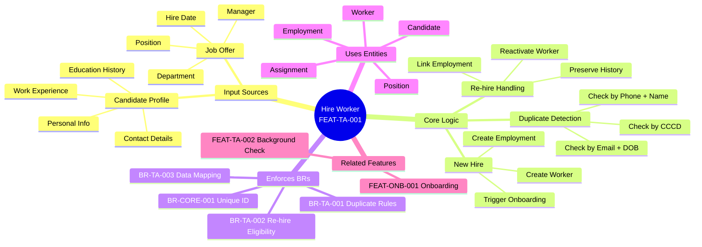
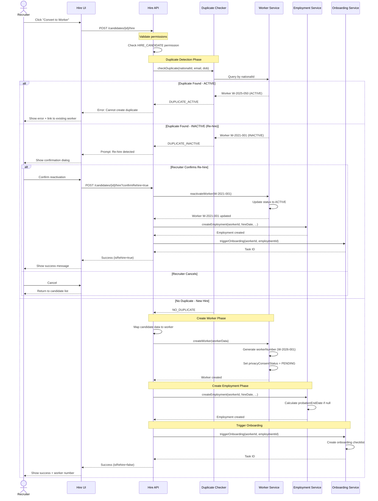

# Feature: Candidate to Worker Conversion (Hiring)

## 1. Overview



**Key Characteristics**:
- **Duplicate Prevention**: Enterprise-grade deduplication using multiple identifiers
- **Re-hire Support**: Seamless reactivation of former employees
- **Data Integrity**: Automatic mapping from candidate profile to worker
- **Audit Trail**: Complete history of hire/re-hire decisions

---

## 2. User Story

**As a** Recruiter  
**I want to** convert a hired candidate into an active Worker without re-entering data  
**So that** onboarding can start immediately and we avoid duplicate worker records

**Business Value**:
- ✅ Reduce data entry time by 80% (auto-mapping from candidate profile)
- ✅ Prevent duplicate worker records (critical for payroll accuracy)
- ✅ Support re-hire scenarios (preserve employment history)
- ✅ Accelerate time-to-productivity (instant onboarding trigger)

---

## 3. Acceptance Criteria

### Scenario 1: New hire - First time employee

```gherkin
Given Candidate "John Doe" with CCCD "001234567890" has never worked here
  And Candidate has education level "Bachelor in Computer Science"
  And Candidate has 5 years of experience
  And Job offer for Position "Senior Developer" is signed
When Recruiter converts candidate to worker with hire date "2026-02-01"
Then New Worker record is created with:
  | Field | Value |
  | id | Auto-generated UUID |
  | workerNumber | W-2026-001 (sequential) |
  | status | ACTIVE |
  | legalName | {"firstName": "John", "lastName": "Doe"} |
  | highestEducationLevel | BACHELOR |
  | totalYearsOfExperience | 5 |
  | privacyConsentStatus | PENDING |
And Employment record is created with:
  | Field | Value |
  | workerId | {Worker.id} |
  | hireDate | 2026-02-01 |
  | employmentType | FULL_TIME |
  | status | ACTIVE |
And Onboarding task is triggered with taskId returned
And System returns status "SUCCESS"
```

### Scenario 2: Re-hire - Former employee returns

```gherkin
Given Candidate "Jane Smith" with CCCD "098765432100"
  And Worker W-2021-001 exists with:
    | Field | Value |
    | legalName | {"firstName": "Jane", "lastName": "Smith"} |
    | nationalId | 098765432100 |
    | status | INACTIVE |
  And Previous employment ended on "2024-06-30" with reason "RESIGNATION"
When Recruiter converts candidate to worker
Then System detects duplicate by CCCD
  And System prompts: "Re-hire detected. Worker W-2021-001 (Jane Smith) worked here from 2021-03-01 to 2024-06-30. Reactivate this record?"
When Recruiter confirms reactivation
Then Worker W-2021-001 status changes to ACTIVE
  And Worker.updatedAt is updated
  And New Employment record is created (separate from previous employment)
  And System returns:
    | Field | Value |
    | workerId | W-2021-001 |
    | isRehire | true |
    | previousWorkerId | W-2021-001 |
    | status | SUCCESS |
```

### Scenario 3: Duplicate detection - Active employee

```gherkin
Given Candidate "Mike Johnson" with CCCD "111222333444"
  And Worker W-2025-050 exists with:
    | Field | Value |
    | legalName | {"firstName": "Mike", "lastName": "Johnson"} |
    | nationalId | 111222333444 |
    | status | ACTIVE |
When Recruiter attempts to convert candidate
Then System blocks conversion
  And System returns error:
    | Field | Value |
    | status | DUPLICATE_DETECTED |
    | message | Worker W-2025-050 is already ACTIVE. Cannot create duplicate. |
  And System suggests: "Review existing worker record or contact HR Admin"
```

### Scenario 4: Data mapping from candidate profile

```gherkin
Given Candidate profile contains:
  | Field | Value |
  | firstName | Anthony |
  | lastName | Nguyen |
  | preferredName | Tony |
  | email | tony.nguyen@gmail.com |
  | phone | +84901234567 |
  | dateOfBirth | 1995-05-15 |
  | gender | MALE |
  | highestDegree | Master of Business Administration |
  | totalExperience | 8 years |
  | currentAddress | 123 Le Loi, District 1, HCMC |
When Conversion happens
Then Worker is created with:
  | Worker Field | Mapped From | Value |
  | legalName.firstName | Candidate.firstName | Anthony |
  | legalName.lastName | Candidate.lastName | Nguyen |
  | preferredName | Candidate.preferredName | Tony |
  | dateOfBirth | Candidate.dateOfBirth | 1995-05-15 |
  | gender | Candidate.gender | MALE |
  | highestEducationLevel | Candidate.highestDegree | MASTER |
  | totalYearsOfExperience | Candidate.totalExperience | 8 |
And Email record is created linked to Worker
And Phone record is created linked to Worker
And Address record is created linked to Worker
```

---

## 4. Data Contract

### Input

```json5
{
  // Candidate identification
  candidateId: "string",              // UUID of candidate in ATS
  
  // Employment details
  hireDate: "date",                   // YYYY-MM-DD format
  jobOfferId: "string",               // Reference to signed offer
  positionId: "string",               // Target position
  departmentId: "string",             // Target department
  managerId: "string",                // Direct manager worker ID
  employmentType: "FULL_TIME | PART_TIME | CONTRACT | INTERN",
  probationEndDate: "date?",          // Optional, calculated if null
  
  // Override options (optional)
  overrideData: {
    preferredName: "string?",         // Override candidate's preferred name
    photoUrl: "string?",              // Upload new photo
  },
  
  // Re-hire handling
  confirmRehire: "boolean?",          // If duplicate detected, confirm reactivation
}
```

### Output

```json5
{
  // Worker information
  workerId: "string",                 // UUID of created/reactivated worker
  workerNumber: "string",             // Human-readable ID (W-2026-001)
  employmentId: "string",             // UUID of employment record
  
  // Re-hire metadata
  isRehire: "boolean",                // true if reactivated existing worker
  previousWorkerId: "string?",        // Same as workerId if re-hire
  previousEmploymentCount: "number?", // How many times worked here before
  
  // Onboarding
  onboardingTaskId: "string",         // ID of triggered onboarding workflow
  
  // Status
  status: "SUCCESS | DUPLICATE_DETECTED | VALIDATION_ERROR | PERMISSION_DENIED",
  message: "string?",                 // Human-readable message
  
  // Validation errors (if status = VALIDATION_ERROR)
  errors: [
    {
      field: "string",                // e.g., "hireDate"
      code: "string",                 // e.g., "HIRE_DATE_IN_PAST"
      message: "string",              // Human-readable error
    }
  ],
  
  // Duplicate details (if status = DUPLICATE_DETECTED)
  duplicateWorker: {
    workerId: "string",
    workerNumber: "string",
    fullName: "string",
    status: "ACTIVE | INACTIVE",
    lastEmploymentEndDate: "date?",
    matchedBy: "NATIONAL_ID | EMAIL_DOB | PHONE_NAME",
  },
}
```

---

## 5. Activities Flow



---

## 6. Business Rules Reference

### BR-TA-001: Duplicate Worker Detection Rules

**Rule**: System MUST check for duplicates using multiple identifiers before creating a new Worker.

**Detection Strategy** (Priority Order):
1. **Primary**: National ID (CCCD/CMND/Passport) - Exact match
2. **Secondary**: Email + Date of Birth - Exact match
3. **Tertiary**: Phone + Name (fuzzy) - Similarity > 90%

**Actions**:
- If duplicate is **ACTIVE** → Block creation, show error
- If duplicate is **INACTIVE** → Prompt for re-hire confirmation
- If duplicate is **MERGED** → Redirect to target worker

**See**: `[[worker-duplicate-detection.brs.md]]` for complete rules

---

### BR-TA-002: Re-hire Eligibility Rules

**Rule**: Former employees can be re-hired if they meet eligibility criteria.

**Eligibility Criteria**:
- ✅ Previous employment status = TERMINATED (any reason except FIRED_FOR_CAUSE)
- ✅ No active legal disputes with company
- ✅ Passed background check (if required for position)
- ✅ Minimum 30 days since last termination date

**Re-hire Process**:
1. Reactivate existing Worker record (do NOT create new)
2. Create new Employment record (separate from previous)
3. Preserve all historical data (nameHistory, previous employments)
4. Reset probation period (if applicable)

**See**: `[[re-hire-eligibility.brs.md]]` for complete rules

---

### BR-TA-003: Data Mapping from Candidate to Worker

**Rule**: Candidate profile data MUST be automatically mapped to Worker attributes.

**Mapping Table**:

| Candidate Field | Worker Field | Transformation |
|-----------------|--------------|----------------|
| firstName, lastName | legalName (JSON) | Direct mapping |
| preferredName | preferredName | Direct mapping |
| email | hasEmailAddresses (relation) | Create Email entity |
| phone | hasPhoneNumbers (relation) | Create Phone entity |
| dateOfBirth | dateOfBirth | Direct mapping |
| gender | gender | Map to enum (MALE/FEMALE/OTHER) |
| highestDegree | highestEducationLevel | Map to enum (BACHELOR/MASTER/DOCTORATE) |
| totalExperience | totalYearsOfExperience | Direct mapping (number) |
| currentAddress | hasAddresses (relation) | Create Address entity |
| nationalId | hasNationalIds (relation) | Create NationalId entity |

**Privacy Consent**:
- New Worker created with `privacyConsentStatus = PENDING`
- Onboarding checklist includes "Accept Privacy Policy" task

**See**: `[[candidate-worker-mapping.brs.md]]` for complete rules

---

## 7. UI Sketch

### Hire Confirmation Screen

```
┌────────────────────────────────────────────────────────────────┐
│  Convert Candidate to Worker                                   │
├────────────────────────────────────────────────────────────────┤
│                                                                 │
│  📋 Candidate Information                                       │
│  ┌──────────────────────────────────────────────────────────┐  │
│  │  Name:        Anthony Nguyen (Tony)                      │  │
│  │  Email:       tony.nguyen@gmail.com                      │  │
│  │  Phone:       +84 901 234 567                            │  │
│  │  DOB:         1995-05-15                                 │  │
│  │  CCCD:        001234567890                               │  │
│  │  Education:   Master of Business Administration          │  │
│  │  Experience:  8 years                                    │  │
│  └──────────────────────────────────────────────────────────┘  │
│                                                                 │
│  💼 Employment Details                                          │
│  ┌──────────────────────────────────────────────────────────┐  │
│  │  Position:       Senior Developer                        │  │
│  │  Department:     Engineering                             │  │
│  │  Manager:        Jane Smith (W-2023-045)                 │  │
│  │  Hire Date:      [2026-02-01] 📅                         │  │
│  │  Type:           [Full-time ▼]                           │  │
│  │  Probation End:  [2026-05-01] 📅 (Auto-calculated)       │  │
│  └──────────────────────────────────────────────────────────┘  │
│                                                                 │
│  ⚙️ Options                                                     │
│  ┌──────────────────────────────────────────────────────────┐  │
│  │  ☐ Send welcome email immediately                        │  │
│  │  ☑ Trigger onboarding checklist                          │  │
│  │  ☑ Notify manager                                        │  │
│  └──────────────────────────────────────────────────────────┘  │
│                                                                 │
│  ┌──────────────────────────────────────────────────────────┐  │
│  │  [Cancel]                         [Convert to Worker] ✓  │  │
│  └──────────────────────────────────────────────────────────┘  │
└────────────────────────────────────────────────────────────────┘
```

### Re-hire Detection Dialog

```
┌────────────────────────────────────────────────────────────────┐
│  ⚠️ Re-hire Detected                                            │
├────────────────────────────────────────────────────────────────┤
│                                                                 │
│  This candidate has worked here before:                         │
│                                                                 │
│  ┌──────────────────────────────────────────────────────────┐  │
│  │  Worker ID:      W-2021-001                              │  │
│  │  Name:           Jane Smith                              │  │
│  │  Previous Role:  Marketing Manager                       │  │
│  │  Hire Date:      2021-03-01                              │  │
│  │  End Date:       2024-06-30                              │  │
│  │  Reason:         Resignation (Voluntary)                 │  │
│  │  Matched By:     CCCD (098765432100)                     │  │
│  └──────────────────────────────────────────────────────────┘  │
│                                                                 │
│  Would you like to reactivate this worker record?              │
│                                                                 │
│  ✅ Benefits of reactivation:                                   │
│     • Preserve employment history                              │
│     • Maintain seniority calculation                           │
│     • Keep previous performance records                        │
│                                                                 │
│  ┌──────────────────────────────────────────────────────────┐  │
│  │  [View Full History]  [Cancel]  [Reactivate Worker] ✓   │  │
│  └──────────────────────────────────────────────────────────┘  │
└────────────────────────────────────────────────────────────────┘
```

---

## 8. Related Documents

### Business Rules
- `[[worker-duplicate-detection.brs.md]]` - Duplicate detection algorithms
- `[[re-hire-eligibility.brs.md]]` - Re-hire eligibility criteria
- `[[candidate-worker-mapping.brs.md]]` - Data mapping specifications

### Ontology
- `[[Worker.onto.md]]` - Worker entity definition
- `[[Employment.onto.md]]` - Employment relationship
- `[[Candidate.onto.md]]` - Candidate entity (ATS)

### Flows
- `[[check-duplicate-worker.flow.md]]` - Duplicate detection workflow
- `[[onboarding-workflow.flow.md]]` - Employee onboarding orchestration

### APIs
- `[[create-worker.api.md]]` - Worker creation API
- `[[create-employment.api.md]]` - Employment creation API

---

*Feature Status: DRAFT - Ready for Review*  
*Last Updated: 2026-01-26*
