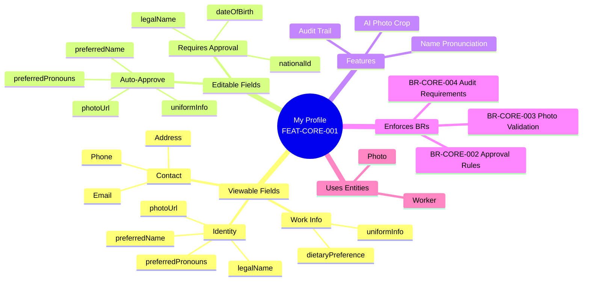
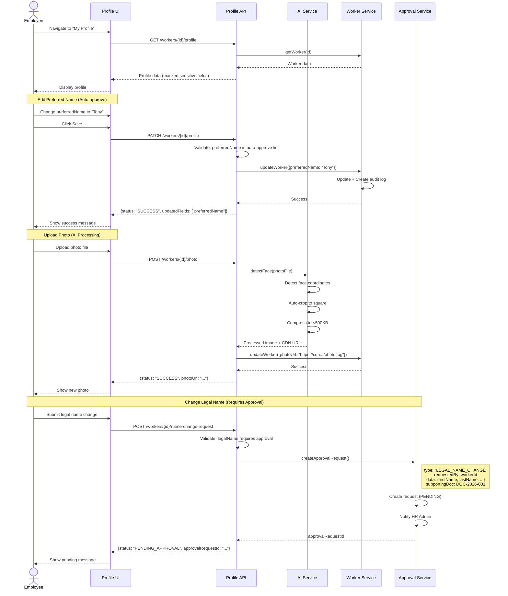

# Feature: Personal Profile Management (My Profile)

## 1. Overview



---

## 2. User Story

**As an** Employee  
**I want to** view and update my personal information (photo, preferred name, pronouns)  
**So that** colleagues can recognize me correctly and I can maintain my professional identity

**Business Value**:
- ✅ Improve employee engagement (personalized experience)
- ✅ Support DEI initiatives (pronouns, preferred name)
- ✅ Reduce HR admin workload (self-service for simple updates)
- ✅ Ensure data accuracy (employees maintain their own data)

---

## 3. Acceptance Criteria

### Scenario 1: View own profile

```gherkin
Given Employee "Tony Nguyen" (W-2025-100) is logged in
When they navigate to "My Profile"
Then System displays:
  | Section | Fields |
  | Identity | preferredName: "Tony", legalName: {"firstName": "Anthony", "lastName": "Nguyen"}, photoUrl, preferredPronouns: "HE_HIM" |
  | Contact | Email: tony.nguyen@company.com, Phone: +84901234567, Address: HCMC |
  | Work | uniformInfo: {"shirt": "L", "shoes": 42}, dietaryPreference: "NONE" |
And Edit buttons are visible for editable fields
And Sensitive fields (nationalId, dateOfBirth) are masked: "***"
```

### Scenario 2: Update preferred name (auto-approve)

```gherkin
Given Employee's current preferredName is "Anthony"
When they change it to "Tony" and click Save
Then preferredName is updated to "Tony" immediately
And Worker.updatedAt is updated
And Audit log is created:
  | Field | Value |
  | action | UPDATE_PREFERRED_NAME |
  | oldValue | Anthony |
  | newValue | Tony |
  | changedBy | W-2025-100 |
  | timestamp | 2026-01-26T14:30:00Z |
And No approval workflow is triggered
And Success message is shown: "Preferred name updated successfully"
```

### Scenario 3: Update legal name (requires approval)

```gherkin
Given Employee wants to change legalName due to marriage
  And Employee uploads marriage certificate (DOC-2026-001)
When they submit name change request:
  | Field | Old Value | New Value |
  | firstName | Nguyen | Tran |
  | lastName | Lan | Lan |
  | changeReason | MARRIAGE |
  | supportingDocumentId | DOC-2026-001 |
Then Change request is created with status PENDING
And HR Admin receives notification
And legalName remains unchanged (still "Nguyen Lan")
And Employee sees message: "Name change request submitted. Pending HR approval."
And approvalRequestId is returned
```

### Scenario 4: Upload profile photo with AI cropping

```gherkin
Given Employee uploads a photo (1920x1080, 2MB, JPEG)
  And Photo contains employee's face
When System processes the image
Then AI face detection runs
And Photo is auto-cropped to square (800x800) centered on face
And Photo is compressed to <500KB
And photoUrl is updated to new CDN URL
And Old photo is archived (not deleted)
And Success message: "Profile photo updated"
```

---

## 4. Data Contract

### Input

```json5
{
  workerId: "string",                 // UUID of worker
  
  updates: {
    // Auto-approve fields
    preferredName: "string?",         // Max 100 chars
    photoFile: "File?",               // JPEG/PNG, max 5MB
    preferredPronouns: "HE_HIM | SHE_HER | THEY_THEM | OTHER | PREFER_NOT_TO_SAY?",
    uniformInfo: {
      shirt: "S | M | L | XL | XXL | XXXL?",
      shoes: "number?",               // 35-45
      hat: "S | M | L?",
      type: "MALE | FEMALE | UNISEX?",
    },
    dietaryPreference: "NONE | VEGETARIAN | VEGAN | HALAL | KOSHER | GLUTEN_FREE?",
    
    // Requires approval
    legalNameChange: {
      firstName: "string?",
      middleName: "string?",
      lastName: "string?",
      supportingDocumentId: "string",  // Required for legal name change
      changeReason: "MARRIAGE | LEGAL_CHANGE | CORRECTION",
    },
  },
}
```

### Output

```json5
{
  workerId: "string",
  updatedFields: ["preferredName", "photoUrl"],  // List of fields actually updated
  requiresApproval: "boolean",                   // true if any field needs approval
  approvalRequestId: "string?",                  // If approval workflow triggered
  
  status: "SUCCESS | PENDING_APPROVAL | VALIDATION_ERROR | PERMISSION_DENIED",
  message: "string?",
  
  errors: [
    {
      field: "photoFile",
      code: "FILE_TOO_LARGE",
      message: "Photo must be less than 5MB",
    }
  ],
}
```

---

## 5. Activities Flow



---

## 6. Business Rules Reference

### BR-CORE-002: Profile Update Approval Rules

**Rule**: Profile updates are categorized into auto-approve and requires-approval.

**Auto-Approve Fields** (No approval needed):
- `preferredName`
- `photoUrl`
- `preferredPronouns`
- `uniformInfo`
- `dietaryPreference`

**Requires Approval** (HR Admin must approve):
- `legalName` (firstName, middleName, lastName)
- `dateOfBirth`
- `nationalId`
- `gender` (legal gender)

**Approval Workflow**:
1. Employee submits change request
2. HR Admin receives notification
3. HR Admin reviews + supporting documents
4. If approved → Update Worker + Add to nameHistory
5. If rejected → Notify employee with reason

---

### BR-CORE-003: Photo Upload Validation Rules

**Rule**: Profile photos must meet quality and security standards.

**Technical Requirements**:
- **Format**: JPEG, PNG, WebP
- **Max Size**: 5MB (original), <500KB (processed)
- **Min Dimensions**: 200x200 pixels
- **Max Dimensions**: 4000x4000 pixels
- **Aspect Ratio**: Auto-cropped to 1:1 (square)

**AI Processing**:
1. **Face Detection**: Must contain exactly 1 face
2. **Auto-Crop**: Center on face, square crop
3. **Compression**: Optimize to <500KB without quality loss
4. **Content Moderation**: Block inappropriate images (NSFW filter)

**Storage**:
- Original photo: Archived in cold storage
- Processed photo: CDN (https://cdn.company.com/photos/{workerId}.jpg)

---

### BR-CORE-004: Name Change Audit Requirements

**Rule**: All legal name changes must be fully audited for compliance.

**Audit Trail Must Include**:
- Previous name (firstName, middleName, lastName)
- New name
- Change reason (MARRIAGE, LEGAL_CHANGE, CORRECTION)
- Effective date
- Supporting document reference
- Approved by (HR Admin ID)
- Approval timestamp

**Storage**:
- Add entry to `Worker.nameHistory` array
- Create audit log in system audit table
- Archive supporting document for 10 years (VN Labor Law)

---

## 7. UI Sketch

### My Profile View

```
┌────────────────────────────────────────────────────────────────┐
│  My Profile                                          [Edit] ✏️  │
├────────────────────────────────────────────────────────────────┤
│                                                                 │
│  ┌─────────┐                                                    │
│  │  Photo  │  Tony Nguyen (He/Him)                             │
│  │  [150px]│  Senior Developer • Engineering                   │
│  │  Square │  W-2025-100                                       │
│  └─────────┘                                                    │
│              [Change Photo] 📷                                  │
│                                                                 │
│  ━━━━━━━━━━━━━━━━━━━━━━━━━━━━━━━━━━━━━━━━━━━━━━━━━━━━━━━━━━━  │
│                                                                 │
│  📋 Personal Information                                        │
│  ┌──────────────────────────────────────────────────────────┐  │
│  │  Legal Name:       Anthony Nguyen                        │  │
│  │  Preferred Name:   Tony                          [Edit]  │  │
│  │  Pronouns:         He/Him                        [Edit]  │  │
│  │  Date of Birth:    ***-**-15 (Masked)                    │  │
│  │  CCCD:             ************90 (Masked)                │  │
│  └──────────────────────────────────────────────────────────┘  │
│                                                                 │
│  📞 Contact Information                                         │
│  ┌──────────────────────────────────────────────────────────┐  │
│  │  Email:            tony.nguyen@company.com                │  │
│  │  Phone:            +84 901 234 567                        │  │
│  │  Address:          123 Le Loi, District 1, HCMC          │  │
│  └──────────────────────────────────────────────────────────┘  │
│                                                                 │
│  👕 Work Preferences                                            │
│  ┌──────────────────────────────────────────────────────────┐  │
│  │  Uniform Size:     Shirt: L, Shoes: 42, Hat: M  [Edit]  │  │
│  │  Dietary:          None                          [Edit]  │  │
│  └──────────────────────────────────────────────────────────┘  │
│                                                                 │
└────────────────────────────────────────────────────────────────┘
```

### Edit Profile Modal

```
┌────────────────────────────────────────────────────────────────┐
│  Edit Profile                                          [X]      │
├────────────────────────────────────────────────────────────────┤
│                                                                 │
│  Preferred Name                                                 │
│  ┌──────────────────────────────────────────────────────────┐  │
│  │  Tony                                                    │  │
│  └──────────────────────────────────────────────────────────┘  │
│  ℹ️ This is how colleagues will see your name                  │
│                                                                 │
│  Pronouns                                                       │
│  ┌──────────────────────────────────────────────────────────┐  │
│  │  [He/Him ▼]                                              │  │
│  └──────────────────────────────────────────────────────────┘  │
│                                                                 │
│  Uniform Sizes                                                  │
│  ┌──────────────────────────────────────────────────────────┐  │
│  │  Shirt: [L ▼]   Shoes: [42 ▼]   Hat: [M ▼]              │  │
│  └──────────────────────────────────────────────────────────┘  │
│                                                                 │
│  Dietary Preference                                             │
│  ┌──────────────────────────────────────────────────────────┐  │
│  │  [None ▼]                                                │  │
│  └──────────────────────────────────────────────────────────┘  │
│                                                                 │
│  ┌──────────────────────────────────────────────────────────┐  │
│  │  [Cancel]                                    [Save] ✓    │  │
│  └──────────────────────────────────────────────────────────┘  │
└────────────────────────────────────────────────────────────────┘
```

---

## 8. Related Documents

### Business Rules
- `[[profile-update-approval.brs.md]]` - Approval workflow rules
- `[[photo-validation.brs.md]]` - Photo upload validation
- `[[name-change-audit.brs.md]]` - Name change audit requirements

### Ontology
- `[[Worker.onto.md]]` - Worker entity with profile fields

### Flows
- `[[profile-update-approval.flow.md]]` - Approval workflow orchestration

---

*Feature Status: DRAFT - Ready for Review*  
*Last Updated: 2026-01-26*
