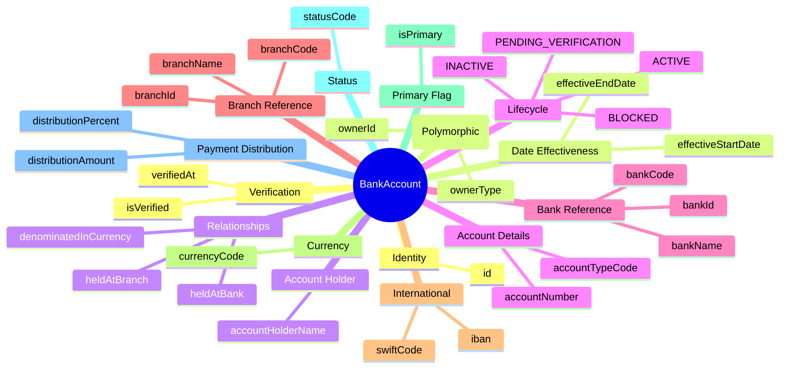
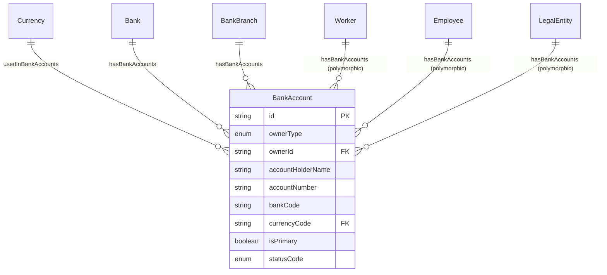
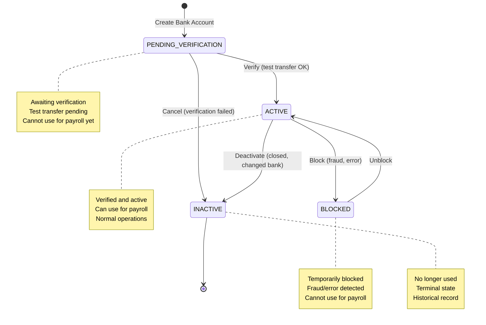

# Entity: BankAccount

## 1. Overview

The **BankAccount** entity stores banking details for payroll purposes (direct deposit/EFT). It is a **polymorphic entity** that can be owned by Worker, Employee, or LegalEntity. Vietnam has specific banking system codes (CITAD, Napas) and account name format requirements.

**Key Concept**:
```
BankAccount = Polymorphic (Worker/Employee/LegalEntity)
VN Banking: CITAD code + Account Number (10-14 digits)
Account Holder Name: Must match owner (uppercase, no accents for VN)
```



**Design Rationale**:
- **Polymorphic Owner**: Same entity for Worker, Employee, LegalEntity bank accounts
- **VN Banking Support**: CITAD codes, account name format (uppercase, no accents)
- **Payment Distribution**: Split payments (percent or fixed amount)
- **Verification**: Test transfer before activation

---

## 2. Attributes

### 2.1 Identity Attributes

| Attribute | Type | Required | Description |
|-----------|------|----------|-------------|
| id | string | ✓ | Unique internal identifier (UUID) |

### 2.2 Owner Reference (Polymorphic)

| Attribute | Type | Required | Description |
|-----------|------|----------|-------------|
| ownerType | enum | ✓ | WORKER, EMPLOYEE, LEGAL_ENTITY |
| ownerId | string | ✓ | Reference to owner entity |

### 2.3 Account Holder

| Attribute | Type | Required | Description |
|-----------|------|----------|-------------|
| accountHolderName | string | ✓ | Name on account (uppercase, no accents for VN) |

### 2.4 Account Details

| Attribute | Type | Required | Description |
|-----------|------|----------|-------------|
| accountNumber | string | ✓ | Account number (10-14 digits for VN) |
| accountTypeCode | enum | | CHECKING, SAVINGS, SALARY |

### 2.5 Bank Reference

| Attribute | Type | Required | Description |
|-----------|------|----------|-------------|
| bankId | string | | Bank master reference |
| bankCode | string | | CITAD/short code (VCB, TCB) |
| bankName | string | | Bank name |

### 2.6 Branch Reference

| Attribute | Type | Required | Description |
|-----------|------|----------|-------------|
| branchId | string | | Branch master reference |
| branchCode | string | | Branch code |
| branchName | string | | Branch name |

### 2.7 International Codes

| Attribute | Type | Required | Description |
|-----------|------|----------|-------------|
| iban | string | | IBAN (not common for VN domestic) |
| swiftCode | string | | SWIFT/BIC (international) |

### 2.8 Currency

| Attribute | Type | Required | Description |
|-----------|------|----------|-------------|
| currencyCode | string | ✓ | Currency (ISO 4217, default VND) |

### 2.9 Primary Flag

| Attribute | Type | Required | Description |
|-----------|------|----------|-------------|
| isPrimary | boolean | ✓ | Primary account for payroll? |

### 2.10 Status

| Attribute | Type | Required | Description |
|-----------|------|----------|-------------|
| statusCode | enum | ✓ | PENDING_VERIFICATION, ACTIVE, INACTIVE, BLOCKED |

### 2.11 Payment Distribution

| Attribute | Type | Required | Description |
|-----------|------|----------|-------------|
| distributionPercent | decimal | | Percentage for split payments |
| distributionAmount | decimal | | Fixed amount for split payments |

### 2.12 Verification

| Attribute | Type | Required | Description |
|-----------|------|----------|-------------|
| isVerified | boolean | ✓ | Account verified? |
| verifiedAt | datetime | | Verification timestamp |

### 2.13 Date Effectiveness

| Attribute | Type | Required | Description |
|-----------|------|----------|-------------|
| effectiveStartDate | date | | Effective for payroll from |
| effectiveEndDate | date | | Effective until |

### 2.14 Audit Attributes

| Attribute | Type | Required | Description |
|-----------|------|----------|-------------|
| createdAt | datetime | ✓ | Record creation timestamp |
| updatedAt | datetime | ✓ | Last modification timestamp |
| createdBy | string | ✓ | User who created record |
| updatedBy | string | ✓ | User who last modified |

---

## 3. Relationships



### Related Entities

| Entity | Relationship | Cardinality | Description |
|--------|--------------|-------------|-------------|
| [[Currency]] | denominatedInCurrency | N:1 | Account currency |
| [[Bank]] | heldAtBank | N:1 | Bank (if using master) |
| [[BankBranch]] | heldAtBranch | N:1 | Branch (if using master) |

---

## 4. Lifecycle



### State Descriptions

| State | Description | Allowed Operations |
|-------|-------------|-------------------|
| **PENDING_VERIFICATION** | Awaiting verification | Can verify, can cancel |
| **ACTIVE** | Verified and active | Can deactivate, can block, use for payroll |
| **BLOCKED** | Temporarily blocked | Can unblock |
| **INACTIVE** | No longer used | Read-only, historical |

### Transition Rules

| From | To | Trigger | Guard Condition |
|------|-----|---------|--------------------|
| PENDING_VERIFICATION | ACTIVE | verify | Test transfer successful |
| PENDING_VERIFICATION | INACTIVE | cancel | Verification failed/cancelled |
| ACTIVE | INACTIVE | deactivate | Account closed/changed |
| ACTIVE | BLOCKED | block | Fraud/error detected |
| BLOCKED | ACTIVE | unblock | Block removed |

---

## 5. Business Rules Reference

### Validation Rules
- **OnePrimaryBankAccountPerOwner**: At most ONE primary account per owner
- **EffectiveDateConsistency**: effectiveStartDate < effectiveEndDate (if set)
- **DistributionValidation**: Cannot have both percent and amount
- **VNBankAccountFormat**: VN accounts should be 10-14 digits (WARNING)

### Business Constraints
- **AccountHolderNameMatch**: Name should match owner (WARNING)
- **TotalDistributionPercent**: Sum of percent <= 100% (WARNING)
- **VNAccountHolderNameFormat**: Uppercase, no accents for VN (INFO)
- **ActiveAccountRequirements**: ACTIVE must be verified (WARNING)
- **BlockedAccountRestrictions**: BLOCKED cannot be used for payroll

### VN Banking System
- **Bank Code**: 8-digit CITAD or short code (VCB, TCB, ACB, etc.)
- **Account Number**: 10-14 digits typically
- **Account Name**: Uppercase, no accents (NGUYEN VAN A) for compatibility
- **Branch**: Optional but recommended for older CITAD transfers
- **Napas 24/7**: Uses BIN + Account Number (branch less critical)

### Payment Distribution (Split Payments)
- **Percent-Based**: distributionPercent (e.g., 70% to Account A, 30% to Account B)
- **Amount-Based**: distributionAmount (e.g., 5,000,000 VND to savings, rest to checking)
- **Validation**: Cannot mix percent and amount in same account
- **Total Check**: Sum of percents <= 100%

### Related Business Rules Documents
- See `[[bank-account-management.brs.md]]` for complete business rules catalog
- See `[[vn-banking-integration.brs.md]]` for VN banking system integration
- See `[[payroll-distribution.brs.md]]` for split payment rules

---

## 6. Use Cases

### Use Case 1: Employee Primary Bank Account (VN)

```yaml
BankAccount:
  id: "ba-001"
  ownerType: "EMPLOYEE"
  ownerId: "emp-001"
  accountHolderName: "NGUYEN VAN A"  # Uppercase, no accents
  accountNumber: "1234567890"  # 10 digits
  bankCode: "VCB"  # Vietcombank
  bankName: "Ngân hàng TMCP Ngoại thương Việt Nam"
  branchName: "Chi nhánh TP.HCM"
  currencyCode: "VND"
  isPrimary: true
  statusCode: "ACTIVE"
  isVerified: true
```

### Use Case 2: Split Payment (Savings + Checking)

```yaml
# Primary Account (70% to checking)
BankAccount_Checking:
  ownerType: "EMPLOYEE"
  accountNumber: "1111111111"
  bankCode: "VCB"
  isPrimary: true
  distributionPercent: 70.0
  statusCode: "ACTIVE"

# Secondary Account (30% to savings)
BankAccount_Savings:
  ownerType: "EMPLOYEE"
  accountNumber: "2222222222"
  bankCode: "TCB"
  isPrimary: false
  distributionPercent: 30.0
  accountTypeCode: "SAVINGS"
  statusCode: "ACTIVE"
```

### Use Case 3: Legal Entity Bank Account

```yaml
BankAccount:
  ownerType: "LEGAL_ENTITY"
  ownerId: "le-001"
  accountHolderName: "CONG TY CO PHAN VNG"
  accountNumber: "9999999999"
  bankCode: "VCB"
  branchName: "Chi nhánh Quận 1"
  currencyCode: "VND"
  isPrimary: true
  statusCode: "ACTIVE"
```

---

*Document Status: APPROVED - Based on Oracle HCM, SAP SuccessFactors, Workday patterns*  
*VN Banking: CITAD, Napas 24/7 compatibility*
