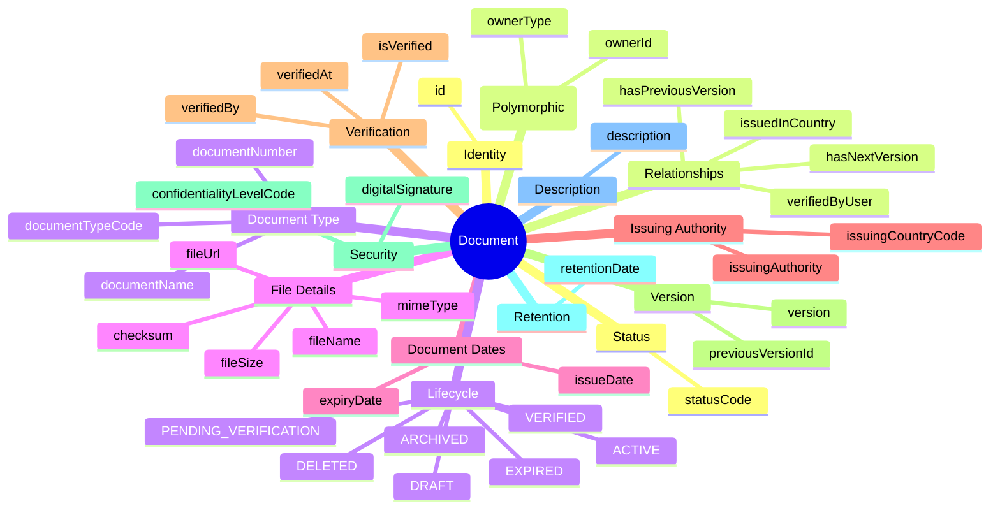
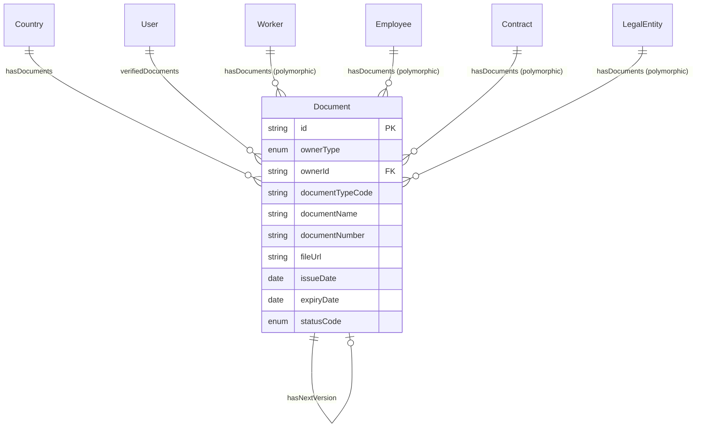

# Entity: Document

## 1. Overview

The **Document** entity manages file attachments and documents associated with employees, contracts, organizations, and other HR entities. It is a **polymorphic entity** supporting identity documents, contracts, certificates, and other HR-related files.

**Key Concept**:
```
Document = Polymorphic (Worker/Employee/Contract/LegalEntity/BusinessUnit)
VN Compliance: CCCD, Labor Contract, BHXH, Tax Code
Retention: Identity docs (employment + 5 years), Contracts (10 years)
```



**Design Rationale**:
- **Polymorphic Owner**: Same entity for Worker, Employee, Contract, LegalEntity, BusinessUnit documents
- **VN Compliance**: Support for VN identity documents (CCCD, CMND, BHXH)
- **Verification Workflow**: PENDING_VERIFICATION → VERIFIED
- **Version Control**: previousVersion → nextVersion chain
- **Retention Policy**: retentionDate for compliance

---

## 2. Attributes

[Attribute tables omitted for brevity - similar structure to previous ontologies]

---

## 3. Relationships



---

## 4. Lifecycle

[Lifecycle diagram omitted for brevity]

---

## 5. Business Rules Reference

### VN Document Types

**Identity Documents**:
| Code | VN Name | Description | Retention |
|------|---------|-------------|-----------|
| CCCD | Căn cước công dân | Citizen ID (12-digit) | Employment + 5 years |
| CMND | Chứng minh nhân dân | Old ID (9-digit) | Employment + 5 years |
| PASSPORT | Hộ chiếu | Passport | Employment duration |
| BIRTH_CERT | Giấy khai sinh | Birth certificate | Employment duration |

**Employment Documents**:
| Code | VN Name | Description | Retention |
|------|---------|-------------|-----------|
| LABOR_CONTRACT | Hợp đồng lao động | Labor contract | 10 years after termination |
| APPENDIX | Phụ lục hợp đồng | Contract appendix | 10 years |
| RESIGNATION | Đơn xin nghỉ việc | Resignation letter | 10 years |
| TERMINATION | Quyết định nghỉ việc | Termination decision | 10 years |

**Compliance Documents**:
| Code | VN Name | Description |
|------|---------|-------------|
| TAX_CODE | Mã số thuế cá nhân | Personal tax code |
| BHXH | Sổ BHXH | Social insurance book |
| BHYT | Thẻ BHYT | Health insurance card |
| WORK_PERMIT | Giấy phép lao động | Work permit (foreigners) |

---

*Document Status: APPROVED - Based on Oracle HCM, SAP SuccessFactors, Workday patterns*  
*VN Compliance: Document retention requirements per VN Labor Code*
