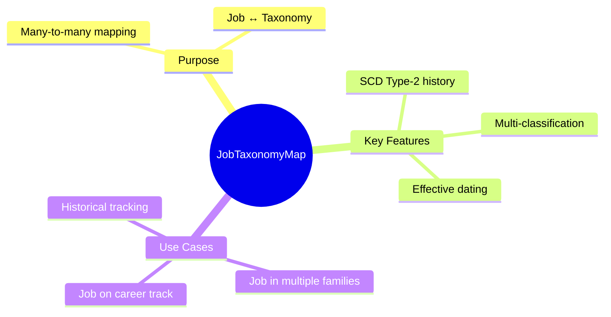
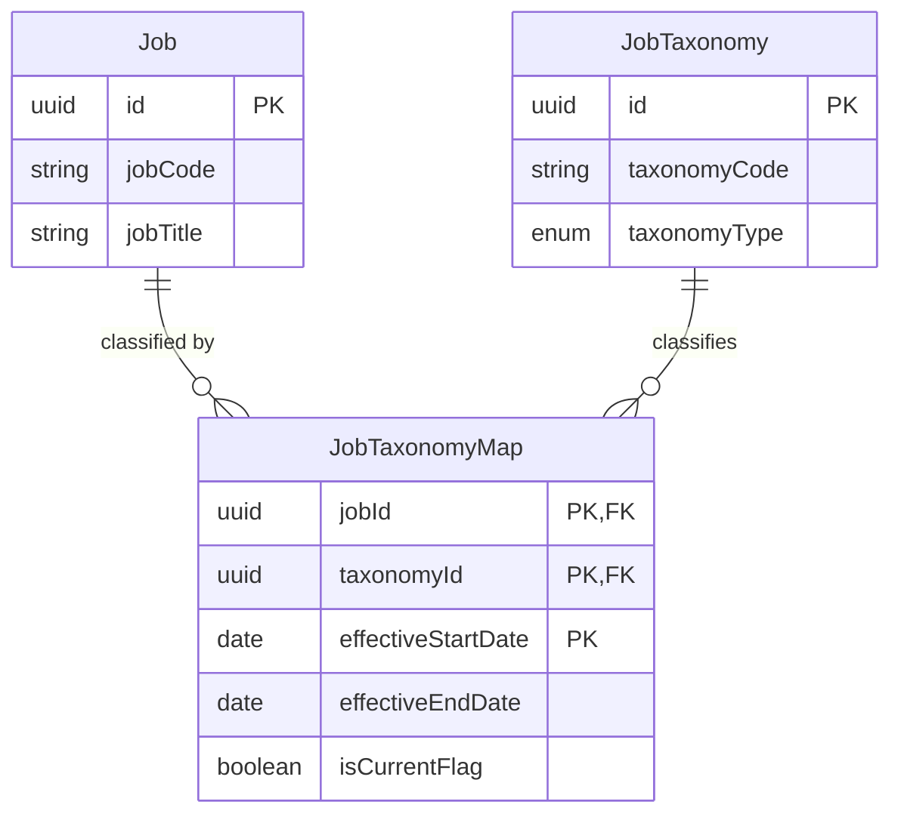
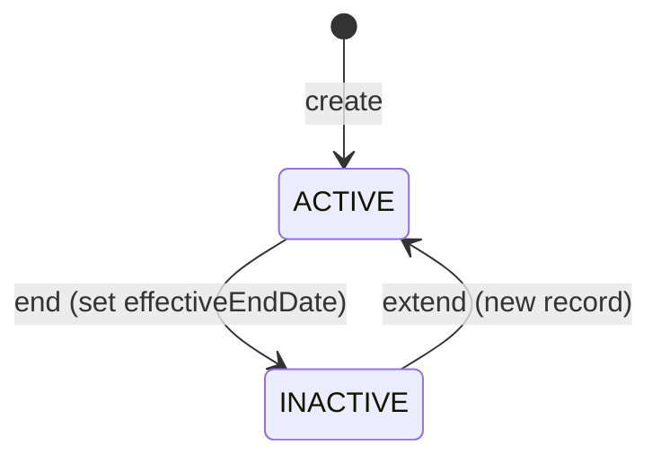

# Entity: JobTaxonomyMap

## 1. Overview

**JobTaxonomyMap** is a junction entity that enables many-to-many mapping between [[Job]]s and [[JobTaxonomy]] nodes. A single job can belong to multiple taxonomy classifications (e.g., both a FAMILY and a TRACK).



### Key Behaviors

| Behavior | Description |
|----------|-------------|
| **Multi-classification** | One job can map to multiple taxonomy nodes |
| **Historical** | SCD Type-2 tracks mapping changes over time |
| **Tree-agnostic** | Job can map to nodes in different trees |

---

## 2. Attributes

### Primary Key (Composite)

| Attribute | Type | Req | Description |
|-----------|------|-----|-------------|
| `jobId` | uuid | Y | FK → [[Job]] |
| `taxonomyId` | uuid | Y | FK → [[JobTaxonomy]] |
| `effectiveStartDate` | date | Y | Start of mapping |

### SCD Type-2

| Attribute | Type | Req | Description |
|-----------|------|-----|-------------|
| `effectiveEndDate` | date | N | End of mapping (null = current) |
| `isCurrentFlag` | boolean | Y | Current version indicator |

---

## 3. Relationships



### Relationship Details

| Relationship | Target | Cardinality | Description |
|--------------|--------|-------------|-------------|
| `job` | [[Job]] | N:1 | The job being classified |
| `taxonomyNode` | [[JobTaxonomy]] | N:1 | The taxonomy classification |

---

## 4. Lifecycle



### State Definitions

| State | Description |
|-------|-------------|
| `ACTIVE` | Mapping is current (isCurrentFlag = true) |
| `INACTIVE` | Mapping ended (effectiveEndDate set) |

---

## 5. Business Rules Reference

| Rule | Type | Description |
|------|------|-------------|
| BR-JTM-001 | Validation | Composite PK: (jobId, taxonomyId, effectiveStartDate) |
| BR-JTM-002 | Validation | Only one current mapping per job-taxonomy pair |

### Example: Multi-Classification

```
Job: "Senior Software Engineer" (JOB-001)
├── Maps to: "Software Engineering" (FAMILY)
├── Maps to: "IC Track - Senior" (TRACK)
└── Maps to: "Technology" (FAMILY_GROUP)

All mappings are valid simultaneously, enabling:
- Family-based reporting
- Career track progression
- High-level grouping
```

---

*References*: [[Job]], [[JobTaxonomy]], [[TaxonomyTree]]
