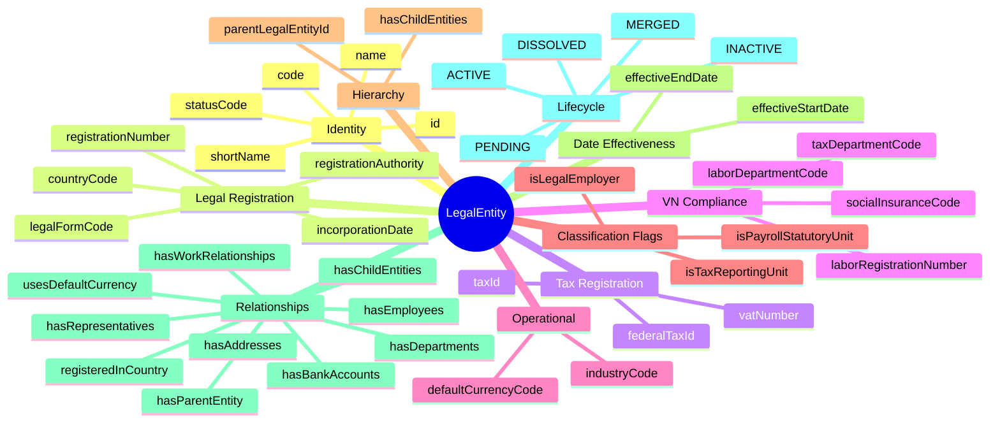
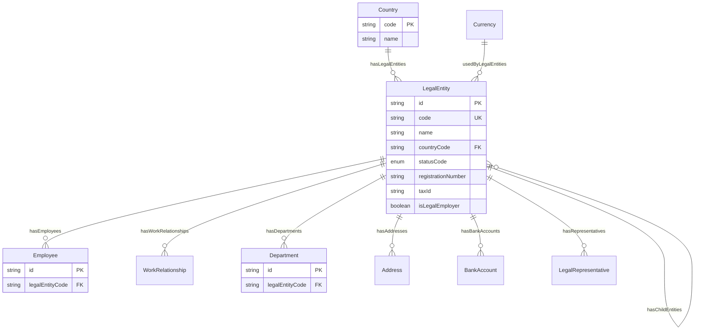
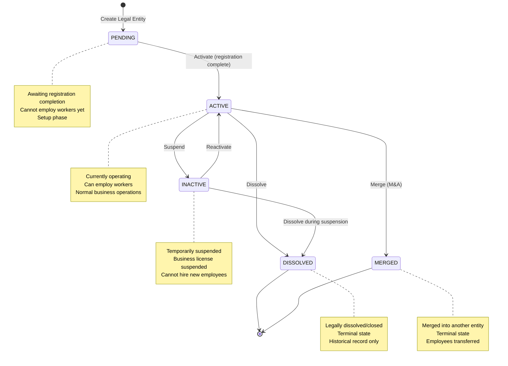

# Entity: LegalEntity

## 1. Overview

The **LegalEntity** represents a legally recognized organization with rights and responsibilities under commercial law. It serves as the **legal employer** for payroll, tax reporting, and regulatory compliance purposes. This is the fundamental entity for multi-company HCM implementations.

**Key Concept**:
```
LegalEntity = Legal/Tax boundary for employment
Employee belongs to ONE LegalEntity
WorkRelationship links Worker to LegalEntity
```



**Design Rationale**:
- **Legal/Tax Focus**: Handles legal registration, tax compliance, NOT management hierarchy
- **Multi-Company Support**: Corporate groups with parent-child relationships
- **VN Compliance**: Full support for VN Enterprise Law and tax requirements
- **Classification Flags**: Oracle pattern for Legal Employer, PSU, TRU

---

## 2. Attributes

### 2.1 Identity Attributes

| Attribute | Type | Required | Description |
|-----------|------|----------|-------------|
| id | string | ✓ | Unique internal identifier (UUID) |
| code | string | ✓ | Business code (unique, used in references) |
| name | string | ✓ | Full legal registered name |
| shortName | string | | Short/display name |
| statusCode | enum | ✓ | PENDING, ACTIVE, INACTIVE, DISSOLVED, MERGED |

### 2.2 Legal Registration Attributes

| Attribute | Type | Required | Description |
|-----------|------|----------|-------------|
| countryCode | string | ✓ | Country of registration (ISO 3166-1) |
| legalFormCode | string | | Legal structure (LLC, JSC, etc.) |
| registrationNumber | string | | Business registration ID |
| incorporationDate | date | | Date of incorporation |
| registrationAuthority | string | | Registering government body |

### 2.3 Tax Registration Attributes

| Attribute | Type | Required | Description |
|-----------|------|----------|-------------|
| taxId | string | | Primary tax identifier |
| federalTaxId | string | | Federal tax ID (US/federal systems) |
| vatNumber | string | | VAT/GST registration |

### 2.4 VN Specific Compliance Attributes

| Attribute | Type | Required | Description |
|-----------|------|----------|-------------|
| socialInsuranceCode | string | | Mã đơn vị BHXH |
| laborRegistrationNumber | string | | Đăng ký sử dụng lao động |
| laborDepartmentCode | string | | Mã Sở LĐTBXH |
| taxDepartmentCode | string | | Mã Cục thuế quản lý |

### 2.5 Operational Attributes

| Attribute | Type | Required | Description |
|-----------|------|----------|-------------|
| defaultCurrencyCode | string | | Default currency (ISO 4217) |
| industryCode | string | | Industry classification (ISIC/NAICS) |

### 2.6 Classification Flags (Oracle Pattern)

| Attribute | Type | Required | Description |
|-----------|------|----------|-------------|
| isLegalEmployer | boolean | ✓ | Can employ workers? |
| isPayrollStatutoryUnit | boolean | ✓ | Responsible for payroll taxes? |
| isTaxReportingUnit | boolean | ✓ | Tax reporting unit? |

### 2.7 Hierarchy Attributes

| Attribute | Type | Required | Description |
|-----------|------|----------|-------------|
| parentLegalEntityId | string | | Parent entity (corporate group) |

### 2.8 Date Effectiveness Attributes

| Attribute | Type | Required | Description |
|-----------|------|----------|-------------|
| effectiveStartDate | date | ✓ | Entity becomes active |
| effectiveEndDate | date | | Entity becomes inactive |

### 2.9 Audit Attributes

| Attribute | Type | Required | Description |
|-----------|------|----------|-------------|
| createdAt | datetime | ✓ | Record creation timestamp |
| updatedAt | datetime | ✓ | Last modification timestamp |
| createdBy | string | ✓ | User who created record |
| updatedBy | string | ✓ | User who last modified |

---

## 3. Relationships



### Related Entities

| Entity | Relationship | Cardinality | Description |
|--------|--------------|-------------|-------------|
| [[Country]] | registeredInCountry | N:1 | Country of registration |
| [[Currency]] | usesDefaultCurrency | N:1 | Default currency |
| [[LegalEntity]] | hasParentEntity | N:1 | Parent entity (self-ref) |
| [[LegalEntity]] | hasChildEntities | 1:N | Child entities (self-ref) |
| [[Employee]] | hasEmployees | 1:N | Employees of this entity |
| [[WorkRelationship]] | hasWorkRelationships | 1:N | Work relationships |
| [[Department]] | hasDepartments | 1:N | Departments/Business Units |
| [[Address]] | hasAddresses | 1:N | Legal/business addresses |
| [[BankAccount]] | hasBankAccounts | 1:N | Company bank accounts |
| [[LegalRepresentative]] | hasRepresentatives | 1:N | Legal representatives (sign contracts) |

---

## 4. Lifecycle



### State Descriptions

| State | Description | Allowed Operations |
|-------|-------------|-------------------|
| **PENDING** | Awaiting registration completion | Can activate when ready |
| **ACTIVE** | Currently operating legal entity | Can suspend, dissolve, merge, employ workers |
| **INACTIVE** | Temporarily not operating | Can reactivate, dissolve |
| **DISSOLVED** | Legally dissolved/closed | Read-only, historical record |
| **MERGED** | Merged into another entity | Read-only, historical record |

### Transition Rules

| From | To | Trigger | Guard Condition |
|------|-----|---------|--------------------|
| PENDING | ACTIVE | activate | Registration completed, documents submitted |
| ACTIVE | INACTIVE | suspend | Temporary suspension (license suspended) |
| INACTIVE | ACTIVE | reactivate | Suspension lifted |
| ACTIVE | DISSOLVED | dissolve | Legal dissolution process completed |
| ACTIVE | MERGED | merge | Merged into another entity (M&A) |
| INACTIVE | DISSOLVED | dissolve | Dissolution during suspension |

---

## 5. Business Rules Reference

### Validation Rules
- **LegalEntityCodeUniqueness**: code unique across all entities
- **RegistrationNumberUniqueness**: registrationNumber unique within country
- **TaxIdUniqueness**: taxId unique within country
- **EffectiveDateConsistency**: effectiveStartDate < effectiveEndDate (if set)
- **ActiveEntityRequirements**: ACTIVE entity must have registrationNumber and taxId (WARNING)
- **ParentChildConsistency**: Entity cannot be its own parent (prevent circular hierarchy)
- **VNRegistrationFormat**: VN entities should have 10-digit registrationNumber (WARNING)

### Business Constraints
- **LegalEmployerFlag**: If isLegalEmployer = true, can have Employees/WorkRelationships
- **VNSocialInsuranceRequired**: VN entities with employees need socialInsuranceCode (WARNING)
- **DissolvedEntityRestrictions**: DISSOLVED/MERGED entities cannot have new Employees
- **InactiveEntityWarning**: INACTIVE entities should not have ACTIVE employees (WARNING)

### VN Enterprise Law Compliance
- **Registration Number**: Mã số doanh nghiệp (10 digits)
- **Tax ID**: Mã số thuế (usually same as registration number)
- **Legal Forms**: LLC (TNHH), JSC (Cổ phần), PRIVATE (Tư nhân), PARTNERSHIP (Hợp danh), BRANCH (Chi nhánh), REP_OFFICE (Văn phòng đại diện)
- **Social Insurance**: Mã đơn vị BHXH required for entities with employees
- **Labor Registration**: Đăng ký sử dụng lao động required

### Classification Flags (Oracle Pattern)
- **Legal Employer**: Can directly employ workers (isLegalEmployer = true)
- **Payroll Statutory Unit (PSU)**: Responsible for payroll taxes (isPayrollStatutoryUnit = true)
- **Tax Reporting Unit (TRU)**: Tax reporting unit (isTaxReportingUnit = true)
- **Use Case**: Same entity can be Legal Employer + PSU + TRU (all flags true)

### Corporate Hierarchy
- **Parent-Child**: Legal entities can form hierarchies (holding company → subsidiaries)
- **Circular Prevention**: Entity cannot be its own parent
- **Use Case**: VNG Corporation (parent) → VNG HCM (child), VNG HN (child)

### Separation from Organization
- **Legal Entity**: Legal/tax aspects ONLY (registration, tax, compliance)
- **Department/Business Unit**: Management hierarchy (separate entity)
- **Relationship**: Department.legalEntityCode references LegalEntity.code

### Related Business Rules Documents
- See `[[legal-entity-management.brs.md]]` for complete business rules catalog
- See `[[vn-enterprise-law-compliance.brs.md]]` for Vietnam-specific requirements
- See `[[corporate-hierarchy.brs.md]]` for parent-child relationship rules
- See `[[tax-compliance.brs.md]]` for tax registration and reporting rules

---

## 6. VN Legal Forms Reference

### Common VN Legal Forms

| Code | VN Name | English | Description |
|------|---------|---------|-------------|
| LLC | Công ty TNHH | Limited Liability Company | Most common for SMEs |
| JSC | Công ty Cổ phần | Joint Stock Company | Public/private corporations |
| PRIVATE | Doanh nghiệp tư nhân | Private Enterprise | Individual ownership |
| PARTNERSHIP | Công ty hợp danh | Partnership | General partnership |
| BRANCH | Chi nhánh | Branch Office | Branch of parent company |
| REP_OFFICE | Văn phòng đại diện | Representative Office | Non-trading office |

### Example: VN Legal Entity

```yaml
LegalEntity:
  id: "le-001"
  code: "VNG-HCM"
  name: "Công ty Cổ phần VNG"
  shortName: "VNG Corporation"
  statusCode: "ACTIVE"
  countryCode: "VN"
  legalFormCode: "JSC"
  registrationNumber: "0309675393"  # 10 digits
  taxId: "0309675393"  # Same as registration
  incorporationDate: "2004-04-01"
  registrationAuthority: "Sở Kế hoạch và Đầu tư TP.HCM"
  socialInsuranceCode: "800-0309675393"
  laborDepartmentCode: "LDTBXH-HCM"
  taxDepartmentCode: "TCT-HCM"
  defaultCurrencyCode: "VND"
  isLegalEmployer: true
  isPayrollStatutoryUnit: true
  isTaxReportingUnit: true
  effectiveStartDate: "2004-04-01"
```

---

*Document Status: APPROVED - Based on Oracle HCM, SAP SuccessFactors, Workday patterns*  
*VN Compliance: Enterprise Law 2020, Tax Law, Labor Code 2019*
