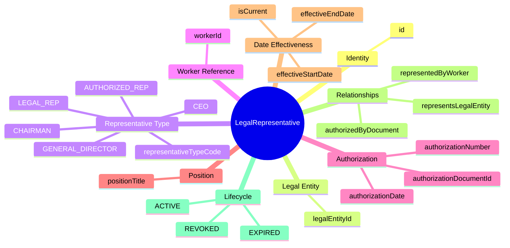
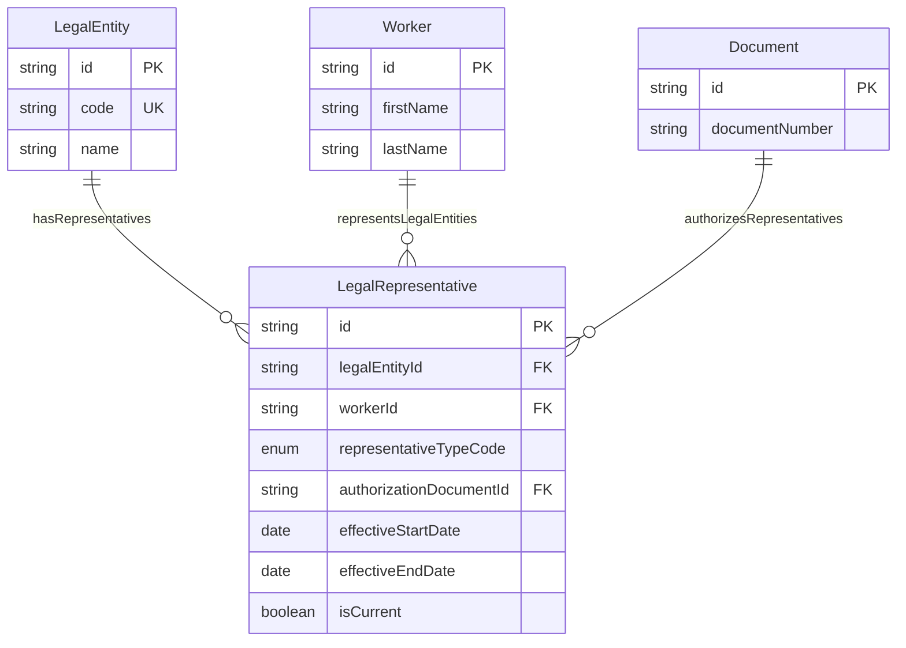
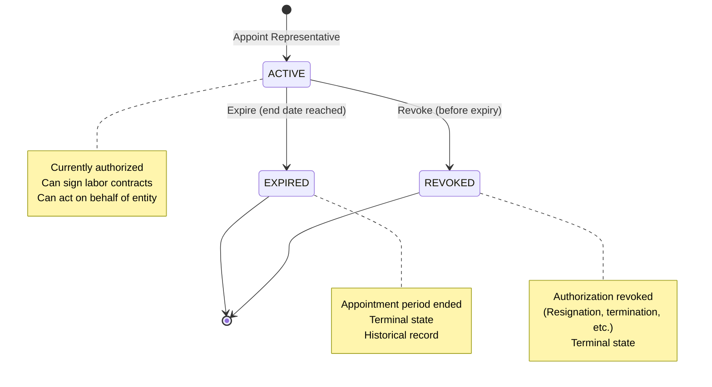

# Entity: LegalRepresentative

## 1. Overview

The **LegalRepresentative** entity tracks individuals authorized to act on behalf of a Legal Entity, particularly for signing labor contracts and other legal documents. This is a **critical requirement** for Vietnam Labor Law compliance.

**Key Concept**:
```
LegalEntity + Worker → LegalRepresentative (authorized to sign HĐLĐ)
Labor Contract signed by: "Đại diện bởi Ông/Bà [Name], Chức vụ [Title]"
```

This is a **date-effective** entity, allowing tracking of representative changes over time.



**Design Rationale**:
- **VN Labor Law Compliance**: Labor contracts must specify who signs on behalf of employer
- **Date-Effective Tracking**: Representatives change over time (promotions, resignations)
- **Worker Reference**: References Worker (not Employee) - representative may not be employee
- **Authorization Types**: Legal Rep (inherent), Authorized Rep (delegated), CEO, etc.

---

## 2. Attributes

### 2.1 Identity Attributes

| Attribute | Type | Required | Description |
|-----------|------|----------|-------------|
| id | string | ✓ | Unique internal identifier (UUID) |

### 2.2 Legal Entity Reference

| Attribute | Type | Required | Description |
|-----------|------|----------|-------------|
| legalEntityId | string | ✓ | Legal entity being represented |

### 2.3 Representative Type

| Attribute | Type | Required | Description |
|-----------|------|----------|-------------|
| representativeTypeCode | enum | ✓ | LEGAL_REP, AUTHORIZED_REP, CEO, CHAIRMAN, GENERAL_DIRECTOR |

### 2.4 Worker Reference

| Attribute | Type | Required | Description |
|-----------|------|----------|-------------|
| workerId | string | ✓ | Person acting as representative (Worker, not Employee) |

### 2.5 Authorization Document

| Attribute | Type | Required | Description |
|-----------|------|----------|-------------|
| authorizationDocumentId | string | | Authorization document reference |
| authorizationNumber | string | | Authorization document number |
| authorizationDate | date | | Date authorization granted |

### 2.6 Position/Title

| Attribute | Type | Required | Description |
|-----------|------|----------|-------------|
| positionTitle | string | | Official position/title (Giám đốc, Tổng giám đốc, etc.) |

### 2.7 Date Effectiveness

| Attribute | Type | Required | Description |
|-----------|------|----------|-------------|
| effectiveStartDate | date | ✓ | Appointment becomes effective |
| effectiveEndDate | date | | Appointment expires |
| isCurrent | boolean | ✓ | Current effective record flag |

### 2.8 Audit Attributes

| Attribute | Type | Required | Description |
|-----------|------|----------|-------------|
| createdAt | datetime | ✓ | Record creation timestamp |
| updatedAt | datetime | ✓ | Last modification timestamp |
| createdBy | string | ✓ | User who created record |
| updatedBy | string | ✓ | User who last modified |

---

## 3. Relationships



### Related Entities

| Entity | Relationship | Cardinality | Description |
|--------|--------------|-------------|-------------|
| [[LegalEntity]] | representsLegalEntity | N:1 | Legal entity being represented |
| [[Worker]] | representedByWorker | N:1 | Person acting as representative |
| [[Document]] | authorizedByDocument | N:1 | Authorization document (if applicable) |

---

## 4. Lifecycle



### State Descriptions

| State | Description | Allowed Operations |
|-------|-------------|-------------------|
| **ACTIVE** | Currently authorized representative | Can expire, can revoke |
| **EXPIRED** | Appointment period ended | Read-only, historical record |
| **REVOKED** | Authorization revoked before expiry | Read-only, historical record |

### Transition Rules

| From | To | Trigger | Guard Condition |
|------|-----|---------|--------------------|
| ACTIVE | EXPIRED | expire | Appointment period ended (effectiveEndDate reached) |
| ACTIVE | REVOKED | revoke | Authorization revoked (resignation, termination, etc.) |

---

## 5. Business Rules Reference

### Validation Rules
- **OneRepresentativePerTypePerPeriod**: At most ONE representative of each type active at any time (WARNING)
- **DateEffectivenessConsistency**: effectiveStartDate < effectiveEndDate (if set)
- **AuthorizationDocumentRequired**: AUTHORIZED_REP must have authorization document (WARNING)
- **WorkerMustExist**: Worker referenced must exist

### Business Constraints
- **CurrentRecordFlag**: isCurrent = true only for current effective records
- **LegalRepNoAuthorizationNeeded**: LEGAL_REP has inherent authority (no document needed)
- **RepresentativeSigningAuthority**: ACTIVE representative can sign labor contracts

### VN Labor Law Compliance
- **Labor Contract Signature**: Contract must specify representative name and title
- **Required Information**: "Đại diện bởi Ông/Bà [Name], Chức vụ [Title], theo Giấy ủy quyền số [Number]..."
- **Legal Representative**: Person with inherent authority (CEO, General Director, Chairman)
- **Authorized Representative**: Person with delegated authority (requires authorization document)

### Representative Types

| Type | VN Name | Description | Authorization Doc Required? |
|------|---------|-------------|----------------------------|
| LEGAL_REP | Người đại diện pháp luật | Legal representative (inherent authority) | No |
| AUTHORIZED_REP | Người được ủy quyền | Authorized representative (delegated) | Yes |
| CEO | Giám đốc | Chief Executive Officer | No (if legal rep) |
| CHAIRMAN | Chủ tịch HĐQT | Chairman of Board | No (if legal rep) |
| GENERAL_DIRECTOR | Tổng giám đốc | General Director | No (if legal rep) |

### Date-Effective Pattern
- **New Appointment**: Creates new record with new effectiveStartDate
- **Historical Records**: Old records have effectiveEndDate = new record's effectiveStartDate - 1 day
- **Current Record**: isCurrent = true, effectiveEndDate = null or future date
- **Query Pattern**: `WHERE isCurrent = true` for current representatives

### Related Business Rules Documents
- See `[[legal-representative-management.brs.md]]` for complete business rules catalog
- See `[[vn-labor-contract-signing.brs.md]]` for VN labor contract requirements
- See `[[authorization-management.brs.md]]` for authorization document rules

---

## 6. Use Cases

### Use Case 1: Labor Contract Signing

```yaml
# Scenario: New employee hired, labor contract needs signature

LegalEntity:
  code: "VNG-HCM"
  name: "Công ty Cổ phần VNG"

LegalRepresentative:
  id: "rep-001"
  legalEntityId: "le-001"
  representativeTypeCode: "CEO"
  workerId: "worker-ceo"
  positionTitle: "Giám đốc"
  effectiveStartDate: "2020-01-01"
  effectiveEndDate: null
  isCurrent: true

# Labor Contract Text:
# "Bên A: Công ty Cổ phần VNG
#  Đại diện bởi Ông Nguyễn Văn A, Chức vụ Giám đốc"
```

### Use Case 2: Authorized Representative (Delegation)

```yaml
# Scenario: CEO delegates signing authority to HR Director

LegalRepresentative:
  id: "rep-002"
  legalEntityId: "le-001"
  representativeTypeCode: "AUTHORIZED_REP"
  workerId: "worker-hr-director"
  positionTitle: "Giám đốc Nhân sự"
  authorizationDocumentId: "doc-001"
  authorizationNumber: "UQ-2024-001"
  authorizationDate: "2024-01-15"
  effectiveStartDate: "2024-01-15"
  effectiveEndDate: "2024-12-31"
  isCurrent: true

# Labor Contract Text:
# "Bên A: Công ty Cổ phần VNG
#  Đại diện bởi Bà Trần Thị B, Chức vụ Giám đốc Nhân sự
#  Theo Giấy ủy quyền số UQ-2024-001 ngày 15/01/2024"
```

### Use Case 3: Representative Change (CEO Transition)

```yaml
# Old Representative (expired)
LegalRepresentative_Old:
  id: "rep-001"
  representativeTypeCode: "CEO"
  workerId: "worker-old-ceo"
  effectiveStartDate: "2020-01-01"
  effectiveEndDate: "2024-06-30"  # Set when new CEO appointed
  isCurrent: false

# New Representative (current)
LegalRepresentative_New:
  id: "rep-003"
  representativeTypeCode: "CEO"
  workerId: "worker-new-ceo"
  effectiveStartDate: "2024-07-01"
  effectiveEndDate: null
  isCurrent: true
```

---

*Document Status: APPROVED - Based on VN Labor Law requirements and DBML design*  
*VN Labor Law Compliance: Labor Code 2019, Enterprise Law 2020*
