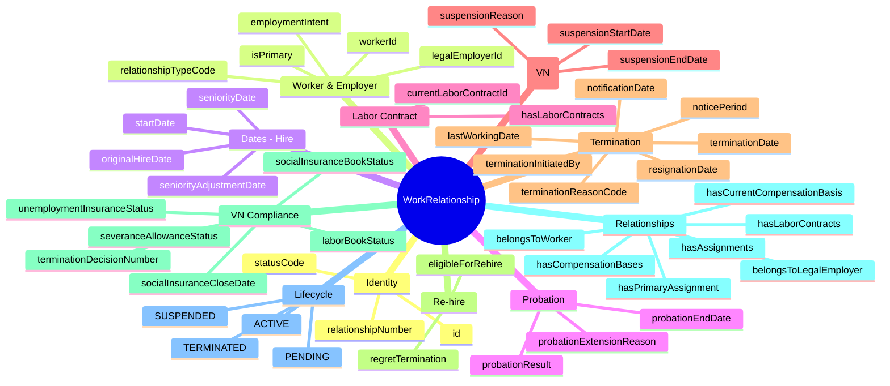
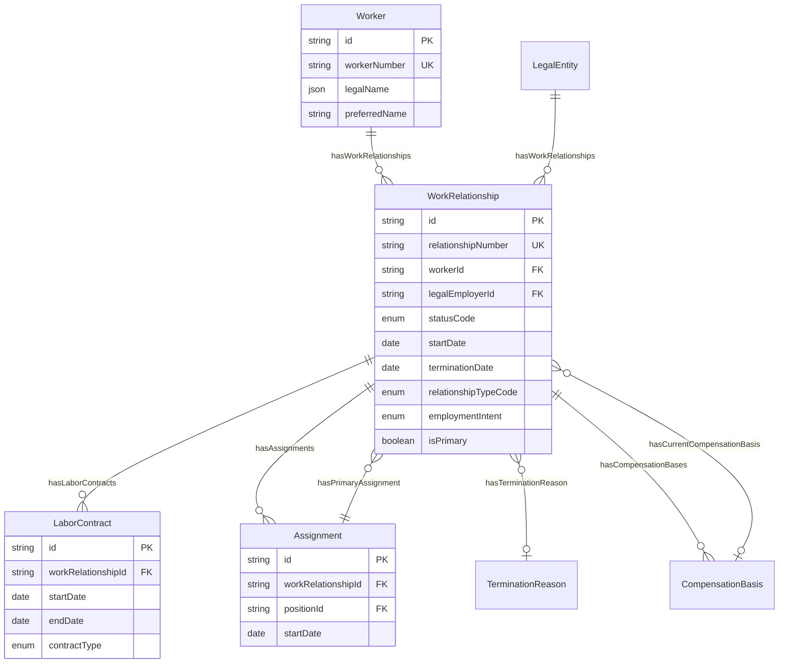
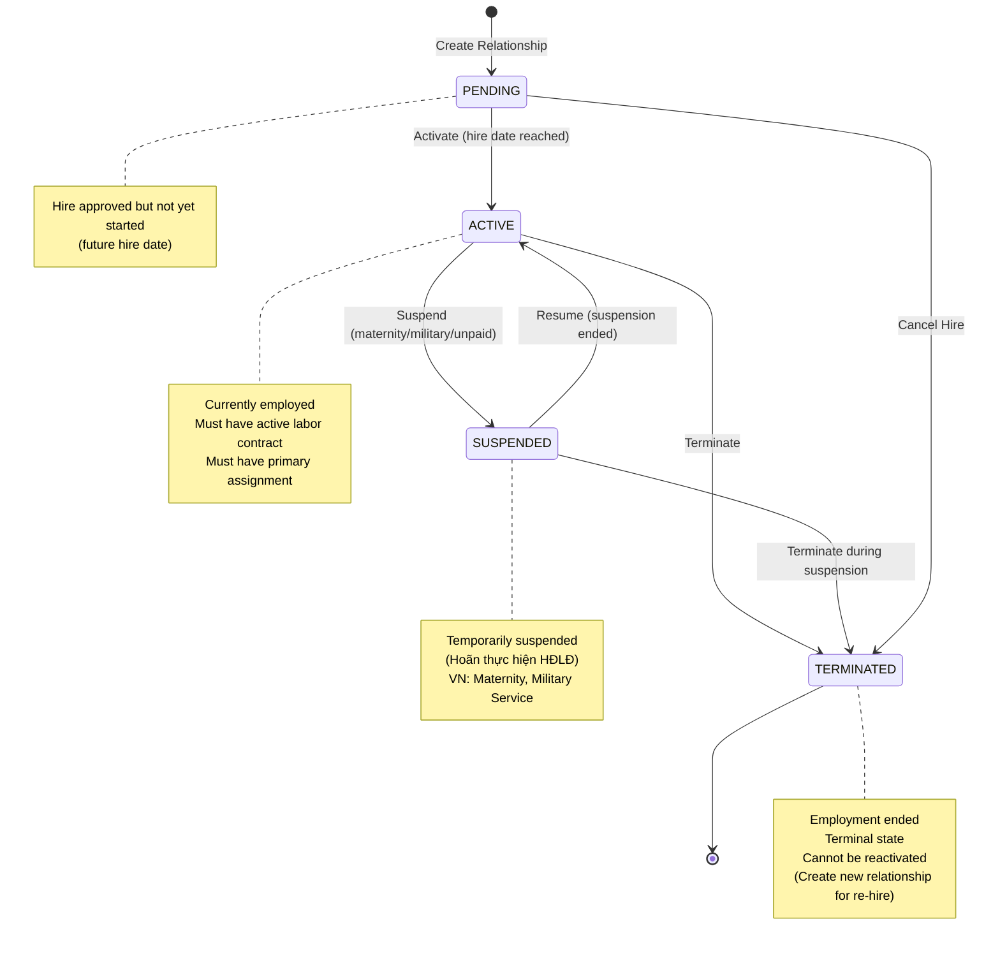

# Entity: WorkRelationship

## 1. Overview

The **WorkRelationship** entity represents the legal and contractual engagement between a Worker (Person) and a Legal Employer (Company). It is the foundational layer that tracks the duration, type, and status of employment or contingent work arrangements. A single Worker may have multiple WorkRelationships (concurrently for multi-job scenarios, or sequentially for re-hires).

**Key Characteristics**:
- **Person-Independent**: Separates employment relationship from person identity
- **Contract-Agnostic**: Can have multiple labor contracts (renewals) within same relationship
- **Re-hire Friendly**: Tracks original hire date for seniority calculation
- **VN Compliant**: Full support for VN Labor Law requirements (probation, suspension, severance)

**Design Pattern**: WorkRelationship is the anchor for:
- Labor Contracts (1:N) - Contract renewals don't break the relationship
- Assignments (1:N) - Multiple jobs/positions within same employment
- Time & Attendance - Relationship status determines eligibility

---

## 2. Attributes

### 2.1 Identity Attributes

| Attribute | Type | Required | Description |
|-----------|------|----------|-------------|
| id | string | ✓ | Unique internal identifier (UUID) |
| relationshipNumber | string | | Human-readable ID (WR-2026-001) |
| statusCode | enum | ✓ | PENDING, ACTIVE, SUSPENDED, TERMINATED |

### 2.2 Worker & Employer Attributes

| Attribute | Type | Required | Description |
|-----------|------|----------|-------------|
| workerId | string | ✓ | Reference to Worker entity |
| legalEmployerId | string | ✓ | Reference to Legal Entity |
| relationshipTypeCode | enum | ✓ | EMPLOYEE, CONTINGENT, CONTRACTOR, INTERN, NON_WORKER |
| employmentIntent | enum | | PERMANENT, FIXED_TERM, SEASONAL, PROJECT_BASED |
| isPrimary | boolean | ✓ | Primary employment? (for multi-job) |

### 2.3 Dates - Hire & Start

| Attribute | Type | Required | Description |
|-----------|------|----------|-------------|
| startDate | date | ✓ | Hire date (Ngày bắt đầu làm việc) |
| originalHireDate | date | | First hire date (for re-hires) |
| seniorityDate | date | | Date for seniority calculation |

### 2.4 Probation Attributes

| Attribute | Type | Required | Description |
|-----------|------|----------|-------------|
| probationEndDate | date | | Expected end of probation |
| probationResult | enum | | PASSED, FAILED, EXTENDED, IN_PROGRESS |
| probationExtensionReason | string | | Reason for extension |

### 2.5 Labor Contract Attributes

| Attribute | Type | Required | Description |
|-----------|------|----------|-------------|
| currentLaborContractId | string | | Currently active contract |

### 2.6 Suspension Attributes (VN Specific)

| Attribute | Type | Required | Description |
|-----------|------|----------|-------------|
| suspensionStartDate | date | | Start of suspension (Hoãn HĐLĐ) |
| suspensionEndDate | date | | Expected end of suspension |
| suspensionReason | string | | Maternity, Military, Unpaid Leave |

### 2.7 Termination Attributes

| Attribute | Type | Required | Description |
|-----------|------|----------|-------------|
| terminationDate | date | | Official end date (Ngày chấm dứt) |
| lastWorkingDate | date | | Last day actually worked |
| notificationDate | date | | Date termination was notified |
| resignationDate | date | | Date employee resigned (if voluntary) |
| terminationReasonCode | string | | Reference code to TerminationReason |
| terminationInitiatedBy | enum | | EMPLOYEE, EMPLOYER, MUTUAL, AUTOMATIC |
| noticePeriod | number | | Required notice period (days) |

### 2.8 Re-hire Attributes

| Attribute | Type | Required | Description |
|-----------|------|----------|-------------|
| eligibleForRehire | boolean | | Can be re-hired? (false if fired) |
| regretTermination | boolean | | Regret losing this employee? |

### 2.9 VN Labor Law Compliance Attributes

| Attribute | Type | Required | Description |
|-----------|------|----------|-------------|
| terminationDecisionNumber | string | | Số quyết định thôi việc |
| terminationDecisionDate | date | | Ngày ký quyết định |
| laborBookStatus | enum | | Status of Sổ lao động return |
| socialInsuranceCloseDate | date | | Ngày chốt sổ BHXH |
| severanceAllowanceStatus | enum | | Trợ cấp thôi việc status |
| unemploymentInsuranceStatus | enum | | Sổ BHTN status |

### 2.10 Projected Dates

| Attribute | Type | Required | Description |
|-----------|------|----------|-------------|
| projectedTerminationDate | date | | Expected end (fixed-term contracts) |

### 2.11 Audit Attributes

| Attribute | Type | Required | Description |
|-----------|------|----------|-------------|
| createdAt | datetime | ✓ | Record creation timestamp |
| updatedAt | datetime | ✓ | Last modification timestamp |
| createdBy | string | ✓ | User who created record |
| updatedBy | string | ✓ | User who last modified |

---

## 3. Relationships

### Related Entities

| Entity | Relationship | Cardinality | Description |
|--------|--------------|-------------|-------------|
| [[Worker]] | belongsToWorker | N:1 | The person in this relationship |
| [[LegalEntity]] | belongsToLegalEmployer | N:1 | The contracting company |
| [[LaborContract]] | hasLaborContracts | 1:N | Associated labor contracts |
| [[Assignment]] | hasAssignments | 1:N | Job assignments in this relationship |
| [[Assignment]] | hasPrimaryAssignment | N:1 | Primary job assignment |
| [[TerminationReason]] | hasTerminationReason | N:1 | Reason for termination |
| [[CompensationBasis]] | hasCompensationBases | 1:N | Salary history records (SCD Type-2) |
| [[CompensationBasis]] | hasCurrentCompensationBasis | N:1 | Current effective salary basis |

---

## 4. Lifecycle

### State Descriptions

| State | Description | Allowed Operations |
|-------|-------------|-------------------|
| **PENDING** | Hire approved, waiting for start date | Can edit, can cancel |
| **ACTIVE** | Currently employed | All operations, can suspend/terminate |
| **SUSPENDED** | Temporarily suspended (VN: Hoãn HĐLĐ) | Can resume, can terminate |
| **TERMINATED** | Employment ended | Read-only, cannot reactivate |

### Transition Rules

| From | To | Trigger | Guard Condition |
|------|-----|---------|--------------------|
| PENDING | ACTIVE | activate | startDate reached AND probation started |
| ACTIVE | SUSPENDED | suspend | Valid suspension reason |
| SUSPENDED | ACTIVE | resume | Suspension period ended |
| ACTIVE | TERMINATED | terminate | terminationDate set AND reason provided |
| SUSPENDED | TERMINATED | terminate | Termination during suspension |
| PENDING | TERMINATED | cancelHire | Hire cancelled before start |

---

## 5. Business Rules Reference

### Validation Rules
- **UniqueActiveRelationship**: A Worker can have only ONE ACTIVE primary relationship per Legal Employer
- **StartDateBeforeEnd**: Start date must be before termination date
- **ProbationPeriodValidation**: Probation must be 6/30/60/180 days (VN Labor Law)
- **SuspensionDatesConsistency**: SUSPENDED status requires suspensionStartDate and suspensionEndDate
- **PrimaryAssignmentRequired**: ACTIVE relationship must have primary assignment

### Business Constraints
- **OriginalHireDateTracking**: For re-hires, originalHireDate = first hire date
- **SeniorityCalculation**: seniorityDate → originalHireDate → startDate (fallback chain)
- **NoticePeriodCompliance**: Notice period must comply with contract and VN Labor Law
- **TerminationDocumentation**: VN requires terminationDecisionNumber and terminationDecisionDate
- **RehireEligibility**: Fired workers should have eligibleForRehire = false
- **SeveranceCalculation**: Eligibility based on VN Labor Law Article 46 (>= 12 months)
- **LaborContractLinkage**: ACTIVE relationship must have ACTIVE LaborContract

### Vietnam-Specific Rules
- **Probation Periods**: 
  - 6 days: Simple jobs
  - 30 days: Technical jobs requiring vocational training
  - 60 days: Jobs requiring college degree
  - 180 days: Managerial positions
- **Suspension Reasons**: Maternity leave, Military service, Unpaid leave (Hoãn thực hiện HĐLĐ)
- **Termination Documentation**: Quyết định thôi việc (termination decision) is mandatory
- **Labor Book**: Sổ lao động must be returned to employee upon termination
- **Social Insurance**: BHXH must be closed (chốt sổ) upon termination
- **Severance**: Trợ cấp thôi việc = 0.5 month salary per year of service (if >= 12 months)

### Related Business Rules Documents
- See `[[work-relationship-management.brs.md]]` for complete business rules catalog
- See `[[vn-labor-law-compliance.brs.md]]` for Vietnam-specific requirements
- See `[[probation-management.brs.md]]` for probation period rules
- See `[[termination-process.brs.md]]` for termination workflow rules
- See `[[severance-calculation.brs.md]]` for severance allowance calculation

---

*Document Status: APPROVED - Based on Oracle HCM, SAP SuccessFactors, Workday standards*  
*VN Labor Law Compliance: Decree 145/2020/NĐ-CP, Labor Code 2019*
