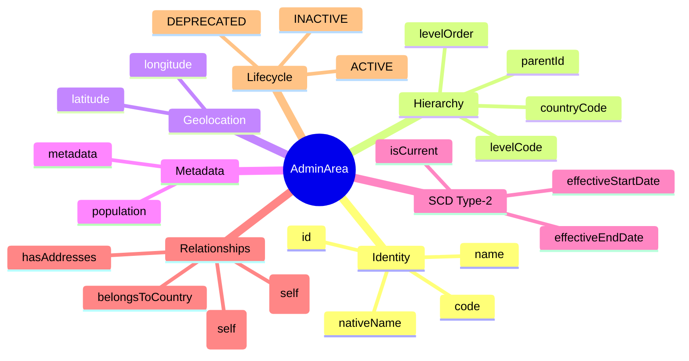
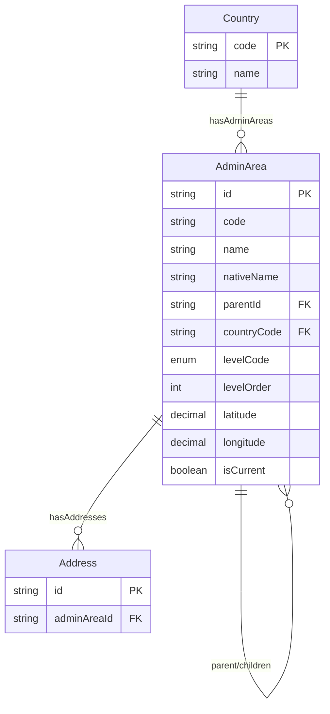
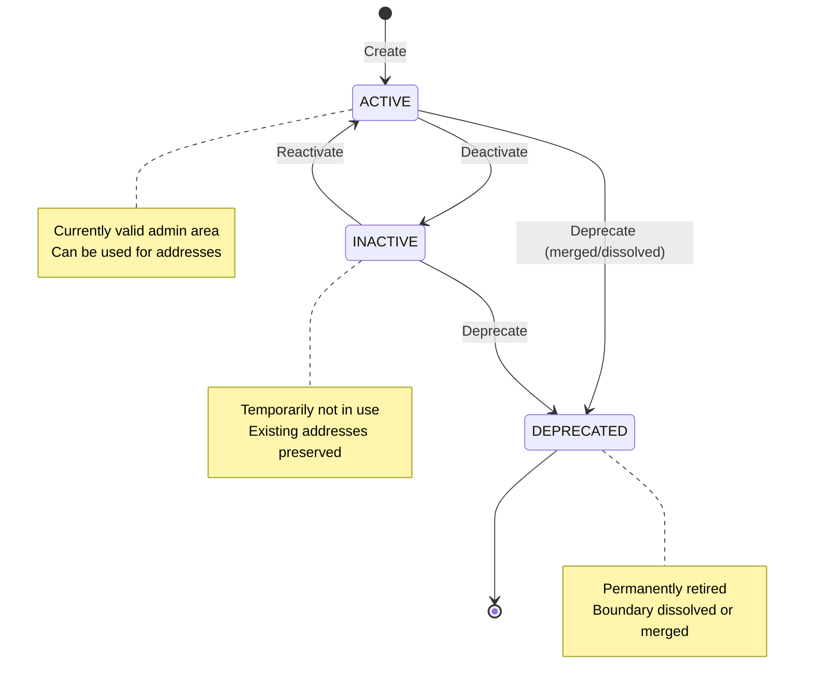

# Entity: AdminArea

## 1. Overview

**AdminArea** represents a node in an N-level administrative division hierarchy within a country. It is a **dynamic, self-referential** entity that supports varying hierarchy depths per country (e.g., Vietnam has 3 levels: Province → District → Ward, while US may have State → County → City → ZIP).

This design aligns with:
- **DBML `geo.admin_area`** table
- **Oracle HCM Geographic Hierarchy** (up to 10 levels)
- **Workday Location Hierarchy** pattern

**Key Concept**:
```
Country → AdminArea (N-level self-referential)
└── VN: Province (Tỉnh) → District (Quận) → Ward (Phường)
└── US: State → County → City → ZIP Code
└── [Custom per country...]
```



### Level Codes by Country

| Country | Level 1 | Level 2 | Level 3 | Level 4 |
|---------|---------|---------|---------|---------|
| Vietnam (VN) | PROVINCE (Tỉnh/TP) | DISTRICT (Quận/Huyện) | WARD (Phường/Xã) | - |
| USA (US) | STATE | COUNTY | CITY | ZIP_CODE |
| Japan (JP) | REGION | PREFECTURE | CITY | WARD |
| China (CN) | PROVINCE | CITY | DISTRICT | SUBDISTRICT |

---

## 2. Attributes

### 2.1 Identity Attributes

| Attribute | Type | Required | Description |
|-----------|------|----------|-------------|
| id | string | ✓ | Unique internal identifier (UUID) |
| code | string | ✓ | Administrative code (unique per country+level) |
| name | string | ✓ | English/International name |
| nativeName | string | | Local language name (Tên tiếng Việt) |

### 2.2 Hierarchy Attributes

| Attribute | Type | Required | Description |
|-----------|------|----------|-------------|
| parentId | string | | FK → self. Null = top level within country |
| countryCode | string | ✓ | FK → Country (ISO 3166-1 alpha-2) |
| levelCode | enum | ✓ | PROVINCE, STATE, DISTRICT, WARD, etc. |
| levelOrder | integer | ✓ | Numeric level (1 = highest, 2, 3...) |

### 2.3 Geolocation

| Attribute | Type | Required | Description |
|-----------|------|----------|-------------|
| latitude | decimal | | Center point latitude (-90 to 90) |
| longitude | decimal | | Center point longitude (-180 to 180) |

### 2.4 Metadata

| Attribute | Type | Required | Description |
|-----------|------|----------|-------------|
| population | integer | | Population count |
| metadata | json | | Extended data (area_km2, timezone, etc.) |

### 2.5 SCD Type-2 (History)

| Attribute | Type | Required | Description |
|-----------|------|----------|-------------|
| effectiveStartDate | date | ✓ | Version start date |
| effectiveEndDate | date | | Version end date (null = current) |
| isCurrent | boolean | ✓ | Current version flag |

---

## 3. Relationships



### Related Entities

| Entity | Relationship | Cardinality | Description |
|--------|--------------|-------------|-------------|
| [[AdminArea]] | parent | N:1 | Parent in hierarchy (self-referential) |
| [[AdminArea]] | children | 1:N | Children in hierarchy (self-referential) |
| [[Country]] | belongsToCountry | N:1 | Country this area belongs to |
| [[Address]] | hasAddresses | 1:N | Addresses in this admin area |

---

## 4. Lifecycle



### State Descriptions

| State | Description | Allowed Operations |
|-------|-------------|-------------------|
| **ACTIVE** | Currently valid administrative division | Can be used for new addresses |
| **INACTIVE** | Temporarily disabled | Cannot assign new addresses |
| **DEPRECATED** | Permanently retired (boundary change) | Read-only, historical |

---

## 5. Business Rules Reference

### Validation Rules
- **UniqueCodePerCountryLevel**: Code unique within country + levelCode
- **ParentMustBeHigherLevel**: Parent's levelOrder < this.levelOrder
- **ParentSameCountry**: Parent must be in same country
- **SingleCurrentVersion**: Only one current version per code

### VN Administrative Structure

| Level | levelCode | levelOrder | Vietnamese Name | Count (2024) |
|-------|-----------|------------|-----------------|--------------|
| 1 | PROVINCE | 1 | Tỉnh/Thành phố trực thuộc TW | 63 |
| 2 | DISTRICT | 2 | Quận/Huyện/Thị xã/TP thuộc tỉnh | ~700 |
| 3 | WARD | 3 | Phường/Xã/Thị trấn | ~11,000 |

### Example: VN Hierarchy

```
VN (Country)
└── VN-SG: "Ho Chi Minh City" / "Thành phố Hồ Chí Minh" [PROVINCE, level=1]
    ├── 760: "District 1" / "Quận 1" [DISTRICT, level=2]
    │   ├── 26734: "Ben Nghe Ward" / "Phường Bến Nghé" [WARD, level=3]
    │   ├── 26737: "Da Kao Ward" / "Phường Đa Kao" [WARD, level=3]
    │   └── ...
    ├── 769: "District 3" / "Quận 3" [DISTRICT, level=2]
    └── ...
└── VN-26: "Thua Thien Hue" / "Thừa Thiên Huế" [PROVINCE, level=1]
    └── ...
```

### Use Cases

**1. Address Validation**:
When user enters address, validate ward → district → province chain.

**2. Tax Jurisdiction**:
Determine tax zone from admin area hierarchy.

**3. Redistricting**:
When boundaries change (SCD Type-2), create new version with updated parent.

---

*Document Status: APPROVED*  
*Based on: Oracle HCM Geographic Hierarchy, Workday Location Hierarchy, geo.admin_area DBML*  
*VN Compliance: 63 provinces, ~700 districts, ~11,000 wards*
