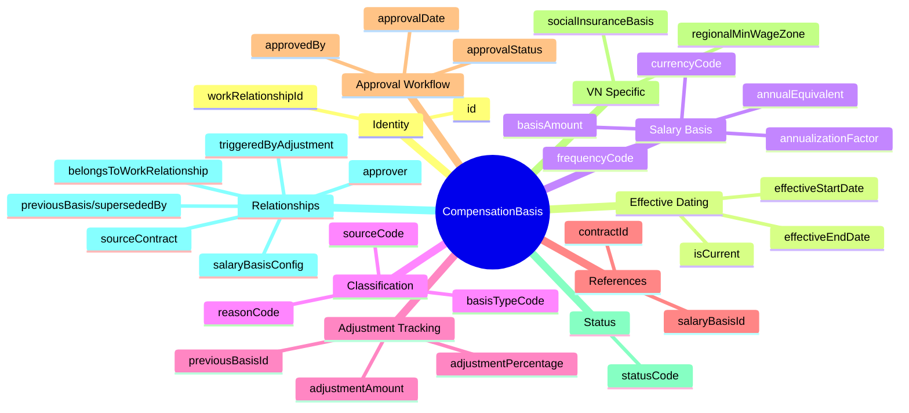
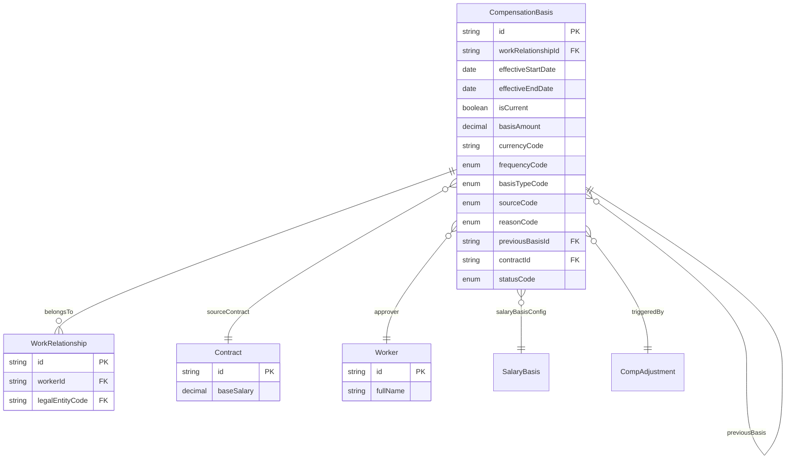
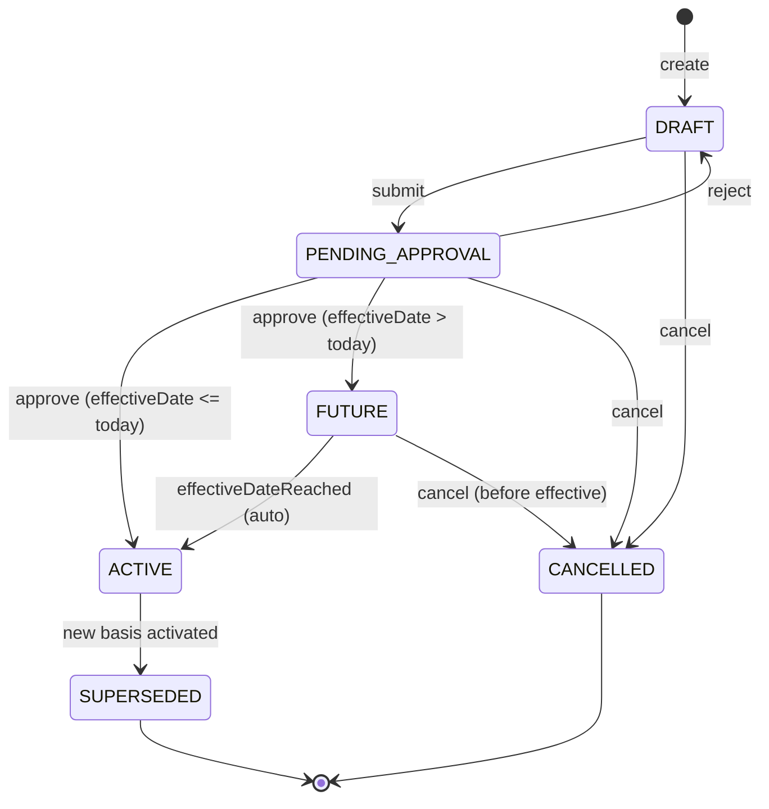

# Entity: CompensationBasis

## 1. Overview

The **CompensationBasis** (Mức Lương Hiệu Lực) entity represents the **operational salary** of an employee within a work relationship. It is the salary amount used for:

- **Payroll calculation** (base for pay processing)
- **BHXH/BHYT/BHTN** (social insurance contribution basis)
- **Analytics** (salary trends, compa-ratio, market positioning)

**Key Design Principle** (Golden Rule):
```
Contract         = Legal Minimum / Agreement (static, for audit)
CompensationBasis = Operational Effective Value (dynamic, for payroll)
TotalRewards      = Formula & Logic (configuration)

Ba lớp KHÔNG ĐƯỢC trùng vai.
```



**Design Rationale**:
- **Link to WorkRelationship** (not Employee): Salary changes within same employment context
- **SCD Type-2**: Date-effective with previousBasisId chain for full history
- **Separation from Contract**: Contract = legal, CompensationBasis = operational
- **VN Compliance**: Supports BHXH minimum wage validation

---

## 2. Attributes

### 2.1 Identity

| Attribute | Type | Required | Description |
|-----------|------|----------|-------------|
| id | string | ✓ | Unique internal identifier (UUID) |
| workRelationshipId | string | ✓ | Link to WorkRelationship |

### 2.2 Effective Dating (SCD Type-2)

| Attribute | Type | Required | Description |
|-----------|------|----------|-------------|
| effectiveStartDate | date | ✓ | When this basis becomes effective |
| effectiveEndDate | date | | When this basis ends (null = current) |
| isCurrent | boolean | ✓ | Is this the current effective record |

### 2.3 Salary Basis

| Attribute | Type | Required | Description |
|-----------|------|----------|-------------|
| basisAmount | decimal | ✓ | Operational salary amount |
| currencyCode | string | ✓ | Currency (ISO 4217, default: VND) |
| frequencyCode | enum | ✓ | MONTHLY/HOURLY/ANNUALLY/etc. |
| annualizationFactor | decimal | | Factor for annual calculation |
| annualEquivalent | decimal | | Calculated annual salary |

### 2.4 Classification

| Attribute | Type | Required | Description |
|-----------|------|----------|-------------|
| basisTypeCode | enum | ✓ | LEGAL_BASE / OPERATIONAL_BASE / MARKET_ADJUSTED |
| sourceCode | enum | ✓ | CONTRACT / MANUAL / FORMULA / PROMOTION |
| reasonCode | enum | | HIRE / PROBATION_END / ANNUAL_REVIEW / etc. |

**Basis Type Codes**:
| Code | VN Name | Description |
|------|---------|-------------|
| LEGAL_BASE | Mức lương pháp lý | Copied from Contract for audit |
| OPERATIONAL_BASE | Mức lương vận hành | Current effective for payroll |
| MARKET_ADJUSTED | Điều chỉnh thị trường | After market analysis |

**Reason Codes**:
| Code | VN Name | Description |
|------|---------|-------------|
| HIRE | Tuyển dụng | New hire salary |
| PROBATION_END | Hết thử việc | After probation completion |
| ANNUAL_REVIEW | Xét lương hàng năm | Annual merit increase |
| PROMOTION | Thăng chức | Promotion increase |
| MARKET_ADJUSTMENT | Điều chỉnh thị trường | Market rate adjustment |

### 2.5 Adjustment Tracking

| Attribute | Type | Required | Description |
|-----------|------|----------|-------------|
| adjustmentAmount | decimal | | Delta from previous basis |
| adjustmentPercentage | decimal | | % change from previous |
| previousBasisId | string | | Link to previous record (SCD chain) |

### 2.6 References

| Attribute | Type | Required | Description |
|-----------|------|----------|-------------|
| contractId | string | | Source contract (for LEGAL_BASE) |
| salaryBasisId | string | | Link to SalaryBasis config |

### 2.7 Approval Workflow

| Attribute | Type | Required | Description |
|-----------|------|----------|-------------|
| approvalStatus | enum | | PENDING / APPROVED / REJECTED |
| approvedBy | string | | Approver Worker ID |
| approvalDate | datetime | | Approval timestamp |
| nextReviewDate | date | | Next salary review |

### 2.8 VN Specific

| Attribute | Type | Required | Description |
|-----------|------|----------|-------------|
| socialInsuranceBasis | decimal | | SI basis if different from basisAmount |
| regionalMinWageZone | enum | | ZONE_I / II / III / IV |

### 2.9 Status

| Attribute | Type | Required | Description |
|-----------|------|----------|-------------|
| statusCode | enum | ✓ | DRAFT / PENDING_APPROVAL / ACTIVE / FUTURE / SUPERSEDED / CANCELLED |

### 2.10 Audit

| Attribute | Type | Required | Description |
|-----------|------|----------|-------------|
| createdAt | datetime | ✓ | Creation timestamp |
| updatedAt | datetime | ✓ | Last modification |
| createdBy | string | ✓ | Creator |
| updatedBy | string | ✓ | Last modifier |

---

## 3. Relationships



### Related Entities

| Relationship | Target | Cardinality | Description |
|--------------|--------|-------------|-------------|
| belongsToWorkRelationship | [[WorkRelationship]] | N:1 | Core link - employment context |
| sourceContract | [[Contract]] | N:1 | For LEGAL_BASE tracing |
| previousBasis | [[CompensationBasis]] | N:1 | SCD chain (self-ref) |
| supersededBy | [[CompensationBasis]] | 1:N | SCD inverse |
| approver | [[Worker]] | N:1 | Approval workflow |
| salaryBasisConfig | [[SalaryBasis]] | N:1 | Configuration reference |
| triggeredByAdjustment | [[CompAdjustment]] | N:1 | Source from comp cycle |

---

## 4. Lifecycle



### State Descriptions

| State | Description |
|-------|-------------|
| DRAFT | Created, not yet submitted for approval |
| PENDING_APPROVAL | Submitted, awaiting manager approval |
| ACTIVE | Currently in effect, isCurrent = true |
| FUTURE | Approved but effective date is in future |
| SUPERSEDED | Replaced by newer record |
| CANCELLED | Voided before activation |

### Transitions

| From | To | Trigger | Guard |
|------|----|---------|----- |
| DRAFT | PENDING_APPROVAL | submit | All required fields populated |
| DRAFT | CANCELLED | cancel | User has permission |
| PENDING_APPROVAL | ACTIVE | approve | effectiveStartDate <= today |
| PENDING_APPROVAL | FUTURE | approve | effectiveStartDate > today |
| PENDING_APPROVAL | DRAFT | reject | Rejection reason provided |
| FUTURE | ACTIVE | effectiveDateReached | Auto-transition by system |
| ACTIVE | SUPERSEDED | supersede | New basis becomes ACTIVE |

---

## 5. Business Rules Reference

### Validation Rules

| Rule | Description | Severity |
|------|-------------|----------|
| BasisAmountRequired | basisAmount must be positive | ERROR |
| EffectiveDateRequired | effectiveStartDate is mandatory | ERROR |
| WorkRelationshipRequired | Must link to WorkRelationship | ERROR |
| LegalBaseMustHaveContract | LEGAL_BASE requires contractId | ERROR |
| NoOverlappingPeriods | No overlapping ACTIVE records | ERROR |

### Business Rules

| Rule | Description | Severity |
|------|-------------|----------|
| BaseSalaryMinWage | basisAmount ≥ Regional Min Wage (VN BHXH) | WARNING |
| ApprovalRequired | Large increases need approval | WARNING |
| PreviousBasisSuperseded | Auto-supersede previous on ACTIVE | INFO |
| ICurrentFlagSync | Only one isCurrent per WorkRelationship | INFO |
| AnnualEquivalentCalculation | Auto-calculate annual equivalent | INFO |

### Related Business Rules Documents
- See `[[compensation-management.brs.md]]` for complete business rules
- See `[[vn-bhxh-compliance.brs.md]]` for VN social insurance rules
- See `[[salary-change-workflow.flow.md]]` for approval process

---

## 6. Use Cases

### Use Case 1: Tuyển dụng mới (New Hire - LEGAL_BASE)

```yaml
CompensationBasis:
  id: "cb-001"
  workRelationshipId: "wr-001"
  contractId: "contract-001"
  basisTypeCode: LEGAL_BASE
  sourceCode: CONTRACT
  reasonCode: HIRE
  basisAmount: 15000000
  currencyCode: VND
  frequencyCode: MONTHLY
  annualizationFactor: 12
  annualEquivalent: 180000000
  effectiveStartDate: "2024-02-01"
  isCurrent: true
  statusCode: ACTIVE
  notes: "Initial salary from labor contract"
```

### Use Case 2: Hết thử việc (Probation End)

```yaml
CompensationBasis:
  id: "cb-002"
  workRelationshipId: "wr-001"
  previousBasisId: "cb-001"  # Link to hire basis
  basisTypeCode: OPERATIONAL_BASE
  sourceCode: MANUAL_ADJUST
  reasonCode: PROBATION_END
  basisAmount: 20000000  # Increased from 15M
  adjustmentAmount: 5000000
  adjustmentPercentage: 33.33
  currencyCode: VND
  frequencyCode: MONTHLY
  effectiveStartDate: "2024-04-01"
  approvalStatus: APPROVED
  approvedBy: "manager-001"
  approvalDate: "2024-03-25T10:00:00"
  isCurrent: true
  statusCode: ACTIVE
```

### Use Case 3: Xét lương hàng năm (Annual Review via Comp Cycle)

```yaml
CompensationBasis:
  id: "cb-003"
  workRelationshipId: "wr-001"
  previousBasisId: "cb-002"
  basisTypeCode: OPERATIONAL_BASE
  sourceCode: COMP_CYCLE
  reasonCode: ANNUAL_REVIEW
  basisAmount: 22000000  # 10% increase
  adjustmentAmount: 2000000
  adjustmentPercentage: 10.00
  currencyCode: VND
  frequencyCode: MONTHLY
  effectiveStartDate: "2025-01-01"
  nextReviewDate: "2026-01-01"
  approvalStatus: APPROVED
  isCurrent: true
  statusCode: ACTIVE
  notes: "Comp Review Cycle 2025, Performance Rating: Exceeds Expectations"
```

### Use Case 4: Thăng chức (Promotion)

```yaml
CompensationBasis:
  id: "cb-004"
  workRelationshipId: "wr-001"
  previousBasisId: "cb-003"
  basisTypeCode: OPERATIONAL_BASE
  sourceCode: PROMOTION
  reasonCode: PROMOTION
  basisAmount: 30000000  # Significant increase
  adjustmentAmount: 8000000
  adjustmentPercentage: 36.36
  currencyCode: VND
  frequencyCode: MONTHLY
  effectiveStartDate: "2025-07-01"
  approvalStatus: APPROVED
  isCurrent: true
  statusCode: ACTIVE
  notes: "Promoted to Senior Engineer"
```

---

## 7. Architecture Position

```
┌─────────────────────────────────────────────────────────────────┐
│  Contract (Legal Layer)                                         │
│  └── baseSalary (LEGAL, static, signed amount)                 │
│      │                                                         │
│      └── [CREATE] → CompensationBasis (basisTypeCode=LEGAL)    │
└─────────────────────────────────────────────────────────────────┘
                                │
                                ▼
┌─────────────────────────────────────────────────────────────────┐
│  WorkRelationship (Employment Context)                          │
│  └── CompensationBasis (OPERATIONAL, date-effective)           │
│      ├── basisAmount (current effective salary)                │
│      ├── frequencyCode (MONTHLY/HOURLY/...)                    │
│      ├── reasonCode (HIRE/PROBATION_END/ANNUAL_REVIEW)         │
│      └── sourceCode (CONTRACT/MANUAL/FORMULA/PROMOTION)        │
│          │                                                     │
│          ├── → Payroll Input                                   │
│          ├── → BHXH Calculation                                │
│          └── → Analytics                                       │
└─────────────────────────────────────────────────────────────────┘
                                ▲
                                │
┌─────────────────────────────────────────────────────────────────┐
│  TotalRewards (Formula Layer)                                   │
│  └── CompensationPlan + Eligibility Rule + Formula Engine      │
│      └── [OUTPUT] → CompensationBasis (sourceCode=FORMULA)     │
└─────────────────────────────────────────────────────────────────┘
```

---

*Document Status: APPROVED - Based on Oracle HCM, SAP SuccessFactors, Workday + VN Labor Law*  
*VN Compliance: Bộ Luật Lao Động 2019 (Điều 21, 96), Nghị định 141/2017/NĐ-CP (Regional Min Wage)*

