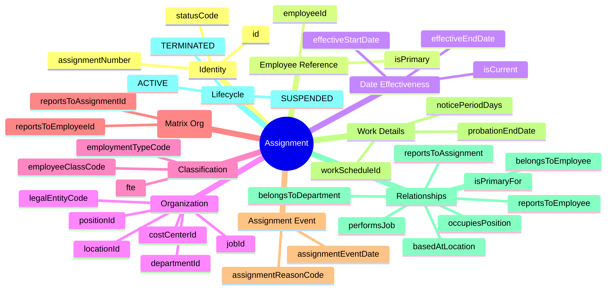
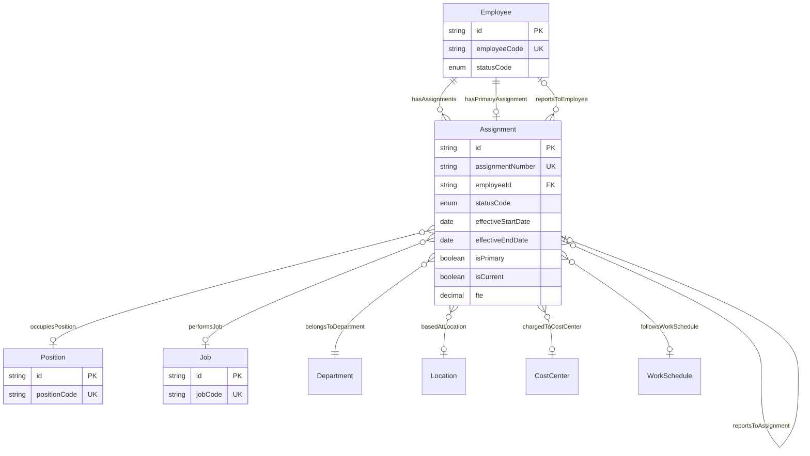
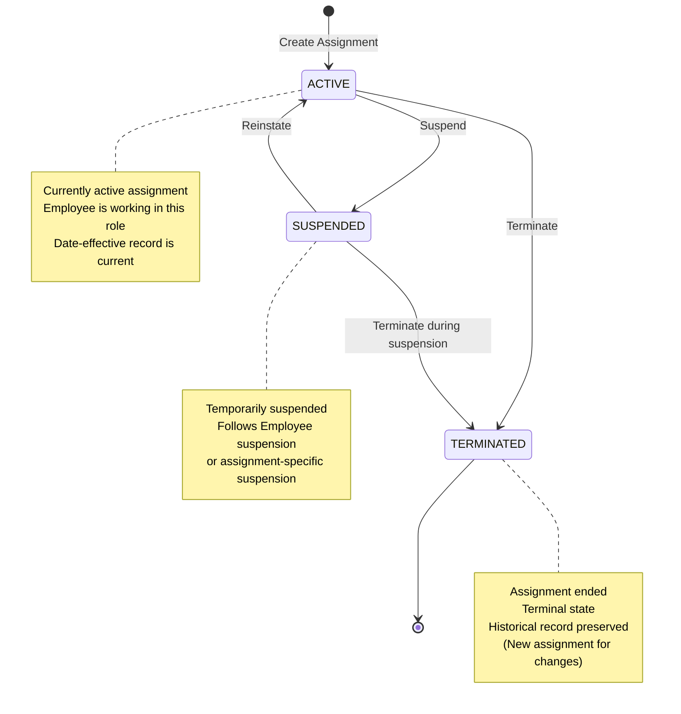

# Entity: Assignment

## 1. Overview

The **Assignment** entity represents the link between an **Employee** and their **organizational context** (Position, Job, Department, Location). It is the **date-effective** record that tracks all changes to an employee's job information over time.

**Key Concept**:
```
Employee + Assignment → Position/Job/Department/Location (at a point in time)
```

Every change (promotion, transfer, raise) creates a **new Assignment record** with a new effectiveStartDate, preserving complete history.



**Design Rationale**:
- **Date-Effective Tracking**: Complete history of all job changes
- **Matrix Organization Support**: Assignment-level manager (reportsTo) separate from Employee-level
- **Multi-Job Support**: Employee can have multiple concurrent assignments (with FTE split)
- **Organizational Flexibility**: Position-based OR Job-based (or both)

---

## 2. Attributes

### 2.1 Identity Attributes

| Attribute | Type | Required | Description | DB Column |
|-----------|------|----------|-------------|----------|
| id | string | ✓ | Unique internal identifier (UUID) | employment.assignment.id |
| assignmentNumber | string | | Human-readable ID (ASG-2026-001) | <<employment.assignment.assignment_number>> |
| statusCode | enum | ✓ | ACTIVE, SUSPENDED, TERMINATED | employment.assignment.status_code → common.code_list(ASSIGNMENT_STATUS) |

### 2.2 Employee Reference Attributes

| Attribute | Type | Required | Description | DB Column |
|-----------|------|----------|-------------|----------|
| employeeId | string | ✓ | Reference to Employee | employment.assignment.employee_id → employment.employee.id |
| isPrimary | boolean | ✓ | Primary assignment flag (for multi-job) | <<employment.assignment.is_primary>> |

### 2.3 Date Effectiveness Attributes

| Attribute | Type | Required | Description | DB Column |
|-----------|------|----------|-------------|----------|
| effectiveStartDate | date | ✓ | Record becomes effective | employment.assignment.start_date |
| effectiveEndDate | date | | Record expires (null = current) | employment.assignment.end_date |
| isCurrent | boolean | ✓ | Current effective record flag | <<employment.assignment.is_current_flag>> |

### 2.4 Organizational Structure Attributes

| Attribute | Type | Required | Description | DB Column |
|-----------|------|----------|-------------|----------|
| positionId | string | | Position being occupied | employment.assignment.position_id → jobpos.position.id |
| jobId | string | | Job profile/role | <<employment.assignment.job_id>> → jobpos.job.id |
| departmentId | string | ✓ | Department/Business Unit | employment.assignment.business_unit_id → org_bu.unit.id |
| legalEntityCode | string | ✓ | Legal entity (must match Employee) | <<employment.assignment.legal_entity_code>> → org_legal.entity.code |
| locationId | string | | Work location | employment.assignment.primary_location_id → facility.work_location.id |
| costCenterId | string | | Cost center (if different from dept) | (employment.assignment.metadata.cost_center_id) |

### 2.5 Employment Classification Attributes

| Attribute | Type | Required | Description | DB Column |
|-----------|------|----------|-------------|----------|
| employeeClassCode | string | | WHITE_COLLAR, BLUE_COLLAR, EXECUTIVE | (employment.assignment.metadata.employee_class_code) |
| employmentTypeCode | string | | REGULAR, INTERN, CONTRACTOR | (employment.assignment.metadata.employment_type_code) |
| fte | decimal | | Full-Time Equivalent (0.0-1.0) | employment.assignment.fte |

### 2.6 Manager Relationship Attributes (Matrix Org)

| Attribute | Type | Required | Description | DB Column |
|-----------|------|----------|-------------|----------|
| reportsToEmployeeId | string | | Manager's Employee record | <<employment.assignment.supervisor_employee_id>> → employment.employee.id |
| reportsToAssignmentId | string | | Manager's Assignment record | employment.assignment.supervisor_assignment_id → employment.assignment.id |

### 2.7 Assignment Event Attributes

| Attribute | Type | Required | Description | DB Column |
|-----------|------|----------|-------------|----------|
| assignmentReasonCode | string | | HIRE, PROMOTION, TRANSFER, DATA_CHANGE | employment.assignment.reason_code → common.code_list(ASSIGN_CHANGE_REASON) |
| assignmentEventDate | date | | Date event occurred | (employment.assignment.metadata.assignment_event_date) |

### 2.8 Work Details Attributes

| Attribute | Type | Required | Description | DB Column |
|-----------|------|----------|-------------|----------|
| probationEndDate | date | | Probation end for this assignment | (employment.assignment.metadata.probation_end_date) |
| workScheduleId | string | | Work schedule/pattern | employment.assignment.work_pattern_code → time_attendance.work_pattern.code |
| noticePeriodDays | integer | | Notice period (days) | (employment.assignment.metadata.notice_period_days) |

### 2.9 Audit Attributes

| Attribute | Type | Required | Description | DB Column |
|-----------|------|----------|-------------|----------|
| createdAt | datetime | ✓ | Record creation timestamp | employment.assignment.created_at |
| updatedAt | datetime | ✓ | Last modification timestamp | employment.assignment.updated_at |
| createdBy | string | ✓ | User who created record | <<employment.assignment.created_by>> |
| updatedBy | string | ✓ | User who last modified | <<employment.assignment.updated_by>> |

---

## 3. Relationships



### Related Entities

| Entity | Relationship | Cardinality | Description |
|--------|--------------|-------------|-------------|
| [[Employee]] | belongsToEmployee | N:1 | The employee this assignment belongs to |
| [[Employee]] | isPrimaryFor | N:1 | If primary, reference to employee |
| [[Position]] | occupiesPosition | N:1 | Position being occupied |
| [[Job]] | performsJob | N:1 | Job profile/role |
| [[Department]] | belongsToDepartment | N:1 | Department/Business Unit |
| [[Location]] | basedAtLocation | N:1 | Work location |
| [[CostCenter]] | chargedToCostCenter | N:1 | Cost center |
| [[Employee]] | reportsToEmployee | N:1 | Manager's Employee (matrix org) |
| [[Assignment]] | reportsToAssignment | N:1 | Manager's Assignment (self-ref) |
| [[Assignment]] | hasDirectReports | 1:N | Direct reports (self-ref) |
| [[WorkSchedule]] | followsWorkSchedule | N:1 | Work schedule/pattern |

---

## 4. Lifecycle



### State Descriptions

| State | Description | Allowed Operations |
|-------|-------------|-------------------|
| **ACTIVE** | Currently active assignment | Can suspend, can terminate, can update |
| **SUSPENDED** | Temporarily suspended | Can reinstate, can terminate |
| **TERMINATED** | Assignment ended | Read-only, historical record |

### Transition Rules

| From | To | Trigger | Guard Condition |
|------|-----|---------|--------------------|
| ACTIVE | SUSPENDED | suspend | Suspension action triggered |
| SUSPENDED | ACTIVE | reinstate | Suspension lifted |
| ACTIVE | TERMINATED | terminate | Assignment ended (transfer/termination/end date) |
| SUSPENDED | TERMINATED | terminate | Termination during suspension |

---

## 5. Business Rules Reference

### Validation Rules
- **AssignmentNumberUniqueness**: assignmentNumber unique across all assignments
- **EmployeeLegalEntityMatch**: Assignment.legalEntityCode must match Employee.legalEntityCode
- **OnePrimaryAssignmentPerEmployee**: Employee can have at most ONE primary assignment
- **DateEffectivenessConsistency**: effectiveStartDate < effectiveEndDate (if set)
- **FTEValidation**: FTE must be between 0.0 and 1.0
- **ManagerValidation**: reportsToEmployee must reference ACTIVE Employee

### Business Constraints
- **CurrentRecordFlag**: isCurrent = true only for current effective records
- **StatusSyncWithEmployee**: Assignment status syncs with Employee status (WARNING)
- **ManagerAssignmentConsistency**: reportsToAssignment.employeeId must match reportsToEmployeeId
- **PrimaryAssignmentRequired**: ACTIVE Employee must have ACTIVE primary assignment (WARNING)
- **PositionOrJobRequired**: Assignment should have Position or Job defined (WARNING)
- **AssignmentEventTracking**: Major changes should have assignmentReasonCode (INFO)

### Staffing Model Conditional Constraints

These constraints are conditional based on `LegalEntity.staffingModelCode`. See [[LegalEntity]] for staffing model configuration.

| Rule ID | Condition | Constraint | Severity |
|---------|-----------|------------|----------|
| **PositionRequiredWhenPositionBased** | LegalEntity.staffingModelCode = 'POSITION_BASED' | positionId IS NOT NULL | ERROR |
| **JobRequiredWhenJobBased** | LegalEntity.staffingModelCode = 'JOB_BASED' AND positionId IS NULL | jobId IS NOT NULL | ERROR |
| **EitherPositionOrJobWhenHybrid** | LegalEntity.staffingModelCode = 'HYBRID' | positionId OR jobId IS NOT NULL | ERROR |
| **JobAutoDerivation** | positionId IS NOT NULL AND jobId IS NULL | Auto-fill: jobId = Position.jobId | INFO |

#### Staffing Model Examples

**Position-based Organization (default)**:
```yaml
# ✅ Valid - has positionId, jobId auto-derived from Position.jobId
Assignment:
  legalEntityCode: "VNG-HCM"  # staffingModelCode = POSITION_BASED
  positionId: "pos-dev-001"
  jobId: null  # System auto-fills from Position.jobId

# ❌ Invalid - missing positionId
Assignment:
  legalEntityCode: "VNG-HCM"  # staffingModelCode = POSITION_BASED
  positionId: null  # ERROR: Position required for position-based staffing
  jobId: "job-dev"
```

**Job-based Organization**:
```yaml
# ✅ Valid - has jobId only (no position required)
Assignment:
  legalEntityCode: "VNG-RETAIL"  # staffingModelCode = JOB_BASED
  positionId: null
  jobId: "job-sales-associate"

# ✅ Also valid - has both (position is optional for tracking)
Assignment:
  legalEntityCode: "VNG-RETAIL"  # staffingModelCode = JOB_BASED
  positionId: "pos-store-001"  # Optional tracking
  jobId: "job-sales-associate"
```

**Hybrid Organization**:
```yaml
# ✅ Valid - has positionId (jobId auto-derived)
Assignment:
  legalEntityCode: "VNG-FLEX"  # staffingModelCode = HYBRID
  positionId: "pos-mgr-001"
  jobId: null  # Auto-derived

# ✅ Valid - has jobId only
Assignment:
  legalEntityCode: "VNG-FLEX"  # staffingModelCode = HYBRID
  positionId: null
  jobId: "job-contractor"

# ❌ Invalid - neither positionId nor jobId
Assignment:
  legalEntityCode: "VNG-FLEX"  # staffingModelCode = HYBRID
  positionId: null  # ERROR: At least one required
  jobId: null       # ERROR: At least one required
```

### Date-Effective Pattern
- **New Assignment**: Every job change creates new record with new effectiveStartDate
- **Historical Records**: Old records have effectiveEndDate = new record's effectiveStartDate - 1 day
- **Current Record**: isCurrent = true, effectiveEndDate = null or future date
- **Query Pattern**: `WHERE isCurrent = true` for current assignments, `WHERE effectiveStartDate <= :date AND (effectiveEndDate IS NULL OR effectiveEndDate >= :date)` for point-in-time

### Matrix Organization Support
- **Dual-Level Manager**:
  - **Employee.reportsTo**: Primary/Line Manager (aggregated or manual)
  - **Assignment.reportsTo**: Assignment-specific manager (for matrix org)
- **Use Case**: Employee has 2 assignments (50% Dev Lead, 50% Tech Architect) with different managers
- **Aggregation**: Employee.reportsTo can be auto-calculated from Assignment with highest FTE

### Multi-Job Scenarios
- **Concurrent Assignments**: Employee can have multiple ACTIVE assignments
- **FTE Split**: Sum of FTE across all assignments should <= 1.0 (WARNING)
- **Primary Assignment**: Exactly one assignment must have isPrimary = true
- **Example**: 0.6 FTE as Developer + 0.4 FTE as Trainer = 1.0 FTE total

### Related Business Rules Documents
- See `[[assignment-management.brs.md]]` for complete business rules catalog
- See `[[date-effective-tracking.brs.md]]` for date-effective pattern rules
- See `[[matrix-organization.brs.md]]` for matrix org reporting rules
- See `[[multi-job-management.brs.md]]` for multi-job scenario rules

---

## 6. Date-Effective Example

### Scenario: Promotion

```yaml
# Initial Assignment (Hire as Junior Developer)
Assignment_1:
  id: "asg-001"
  employeeId: "emp-001"
  effectiveStartDate: "2024-01-15"
  effectiveEndDate: "2025-06-30"  # Set when promotion happens
  isCurrent: false  # No longer current
  jobId: "job-junior-dev"
  departmentId: "dept-engineering"
  fte: 1.0
  assignmentReasonCode: "HIRE"

# New Assignment (Promoted to Senior Developer)
Assignment_2:
  id: "asg-002"
  employeeId: "emp-001"
  effectiveStartDate: "2025-07-01"
  effectiveEndDate: null  # Current assignment
  isCurrent: true
  jobId: "job-senior-dev"
  departmentId: "dept-engineering"
  fte: 1.0
  assignmentReasonCode: "PROMOTION"
```

### Scenario: Multi-Job (Matrix Org)

```yaml
# Primary Assignment (60% as Developer)
Assignment_A:
  id: "asg-003"
  employeeId: "emp-002"
  effectiveStartDate: "2026-01-01"
  effectiveEndDate: null
  isCurrent: true
  isPrimary: true
  jobId: "job-developer"
  departmentId: "dept-product-a"
  fte: 0.6
  reportsToEmployeeId: "emp-manager-a"
  assignmentReasonCode: "HIRE"

# Secondary Assignment (40% as Tech Trainer)
Assignment_B:
  id: "asg-004"
  employeeId: "emp-002"
  effectiveStartDate: "2026-01-01"
  effectiveEndDate: null
  isCurrent: true
  isPrimary: false
  jobId: "job-trainer"
  departmentId: "dept-training"
  fte: 0.4
  reportsToEmployeeId: "emp-manager-b"
  assignmentReasonCode: "DATA_CHANGE"
```

---

*Document Status: APPROVED - Based on Oracle HCM, SAP SuccessFactors, Workday patterns*  
*Date-Effective Pattern: Industry standard for historical tracking*
