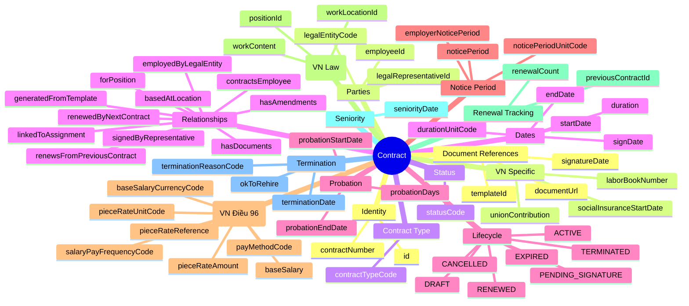
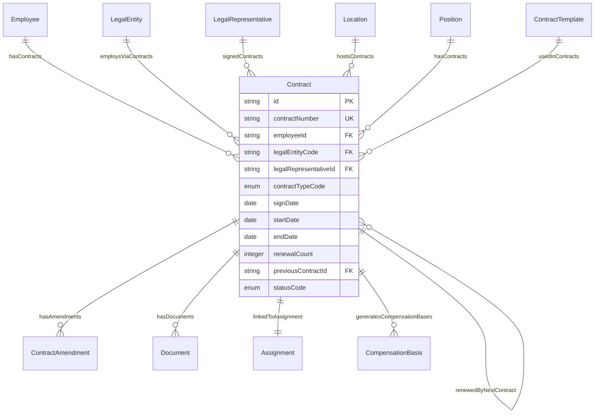
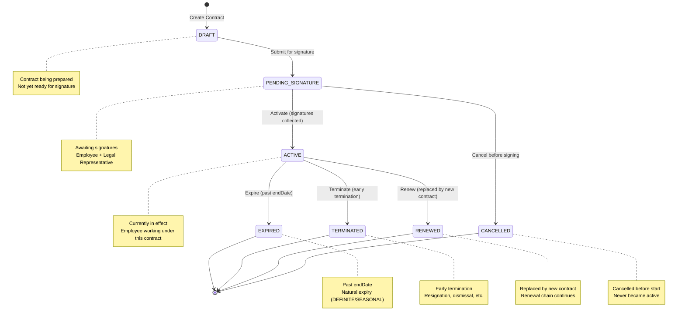

# Entity: Contract

## 1. Overview

The **Contract** (Labor Contract) entity represents the formal legal agreement between an employer (Legal Entity) and an employee. It is **critical for Vietnam compliance** where labor contracts have strict legal requirements under Bộ Luật Lao Động 2019.

**Key Concept**:
```
Contract = Legal document (terms, compliance, audit trail)
Assignment = Organizational placement (job, department, location)
Contract ≠ Assignment (separate but linked)
```



**Design Rationale**:
- **VN Labor Law Compliance**: Full support for VN Labor Code 2019 requirements
- **Renewal Tracking**: previousContract → nextContract chain for renewal history
- **Separation from Assignment**: Contract (legal) ≠ Assignment (organizational)
- **Document Management**: Links to signed PDF, amendments, appendices

---

## 2. Attributes

### 2.1 Identity Attributes

| Attribute | Type | Required | Description | DB Column |
|-----------|------|----------|-------------|----------|
| id | string | ✓ | Unique internal identifier (UUID) | employment.contract.id |
| contractNumber | string | ✓ | Business contract number (Số hợp đồng) | employment.contract.contract_number |

### 2.2 Parties

| Attribute | Type | Required | Description | DB Column |
|-----------|------|----------|-------------|----------|
| employeeId | string | ✓ | Contracted employee | employment.contract.employee_id → employment.employee.id |
| legalEntityCode | string | ✓ | Legal entity (employer) | employment.contract.legal_entity_code → org_legal.entity.code |
| legalRepresentativeId | string | | Legal representative who signed | <<employment.contract.legal_representative_id>> |

### 2.3 Contract Type

| Attribute | Type | Required | Description | DB Column |
|-----------|------|----------|-------------|----------|
| contractTypeCode | enum | ✓ | INDEFINITE, DEFINITE, SEASONAL, TRIAL | employment.contract.contract_type_code → common.code_list(CONTRACT_TYPE) |

### 2.4 Dates

| Attribute | Type | Required | Description | DB Column |
|-----------|------|----------|-------------|----------|
| signDate | date | ✓ | Date contract signed | employment.contract.signed_date |
| startDate | date | ✓ | Contract effective start | employment.contract.start_date |
| endDate | date | | Contract end (required for DEFINITE/SEASONAL) | employment.contract.end_date |
| duration | integer | | Duration (number of units) | (employment.contract.metadata.duration) |
| durationUnitCode | enum | | DAYS, MONTHS, YEARS | (employment.contract.metadata.duration_unit_code) |

### 2.5 Probation

| Attribute | Type | Required | Description | DB Column |
|-----------|------|----------|-------------|----------|
| probationStartDate | date | | Probation start | (employment.contract.metadata.probation_start_date) |
| probationEndDate | date | | Probation end | (employment.contract.metadata.probation_end_date) |
| probationDays | integer | | Probation length (max 180) | (employment.contract.metadata.probation_days) |

### 2.6 Notice Period

| Attribute | Type | Required | Description | DB Column |
|-----------|------|----------|-------------|----------|
| noticePeriod | integer | | Employee notice period | (employment.contract.metadata.notice_period) |
| noticePeriodUnitCode | enum | | DAYS, WEEKS, MONTHS | (employment.contract.metadata.notice_period_unit_code) |
| employerNoticePeriod | integer | | Employer notice (if different) | (employment.contract.metadata.employer_notice_period) |

### 2.7 Compensation Method (VN Labor Code Điều 96)

| Attribute | Type | Required | Description | DB Column |
|-----------|------|----------|-------------|----------|
| payMethodCode | enum | ✓ | TIME_BASED, PRODUCT_BASED, TASK_BASED, HYBRID | <<employment.contract.pay_method_code>> |
| baseSalary | decimal | ✓ | Mức lương căn cứ BHXH | employment.contract.salary_amount |
| baseSalaryCurrencyCode | string | ✓ | Currency (ISO 4217, default: VND) | employment.contract.salary_currency → common.currency.code |
| salaryPayFrequencyCode | enum | ✓ | MONTHLY, BI_WEEKLY, WEEKLY, DAILY, HOURLY | <<employment.contract.salary_pay_frequency_code>> |
| pieceRateAmount | decimal | | Đơn giá sản phẩm cố định | (employment.contract.metadata.piece_rate_amount) |
| pieceRateUnitCode | string | | Đơn vị tính (Cái, Kg, Mét, HĐ) | (employment.contract.metadata.piece_rate_unit_code) |
| pieceRateReference | string | | Dẫn chiếu bảng đơn giá | (employment.contract.metadata.piece_rate_reference) |

**Pay Method Types**:
| Code | VN Name | Description | Use Case |
|------|---------|-------------|----------|
| TIME_BASED | Lương thời gian | Trả theo tháng/ngày/giờ | Văn phòng, hành chính |
| PRODUCT_BASED | Lương sản phẩm | Trả 100% theo đơn giá | Công nhân may, sản xuất |
| TASK_BASED | Lương khoán | Trả theo công việc/dự án | Freelancer, contractor |
| HYBRID | Lương hỗn hợp | Lương cứng + Hoa hồng/Sản phẩm | Sales, ký thuật viên |

### 2.8 Work Details (VN Law Requirements)

| Attribute | Type | Required | Description | DB Column |
|-----------|------|----------|-------------|----------|
| workContent | string | | Work content/job description | (employment.contract.metadata.work_content) |
| workLocationId | string | | Primary work location | <<employment.contract.work_location_id>> → facility.work_location.id |
| positionId | string | | Contracted position | (employment.contract.metadata.position_id) → jobpos.position.id |

### 2.9 Renewal Tracking

| Attribute | Type | Required | Description | DB Column |
|-----------|------|----------|-------------|----------|
| renewalCount | integer | ✓ | Number of renewals (0 = original) | <<employment.contract.renewal_count>> |
| previousContractId | string | | Previous contract (renewal chain) | <<employment.contract.previous_contract_id>> → employment.contract.id |

### 2.10 Seniority

| Attribute | Type | Required | Description | DB Column |
|-----------|------|----------|-------------|----------|
| seniorityDate | date | | Date for seniority calculation | (employment.contract.metadata.seniority_date) |

### 2.11 Termination

| Attribute | Type | Required | Description | DB Column |
|-----------|------|----------|-------------|----------|
| terminationDate | date | | Actual last working day | <<employment.contract.termination_date>> |
| terminationReasonCode | string | | Termination reason | <<employment.contract.termination_reason_code>> |
| okToRehire | boolean | | Eligible for rehire? | (employment.contract.metadata.ok_to_rehire) |

### 2.12 Document References

| Attribute | Type | Required | Description | DB Column |
|-----------|------|----------|-------------|----------|
| templateId | string | | ContractTemplate used | employment.contract.template_id → employment.contract_template.id |
| documentUrl | string | | URL to signed PDF | (employment.contract.metadata.document_url) |
| signatureDate | date | | Employee signature date | (employment.contract.metadata.signature_date) |

### 2.13 VN Specific

| Attribute | Type | Required | Description | DB Column |
|-----------|------|----------|-------------|----------|
| laborBookNumber | string | | Số sổ lao động | (employment.contract.metadata.labor_book_number) |
| socialInsuranceStartDate | date | | BHXH start date | (employment.contract.metadata.social_insurance_start_date) |
| unionContribution | boolean | | Union fees? | (employment.contract.metadata.union_contribution) |

### 2.14 Status

| Attribute | Type | Required | Description | DB Column |
|-----------|------|----------|-------------|----------|
| statusCode | enum | ✓ | DRAFT, PENDING_SIGNATURE, ACTIVE, EXPIRED, TERMINATED, RENEWED, CANCELLED | employment.contract.status_code → common.code_list(CONTRACT_STATUS) |

### 2.15 Audit Attributes

| Attribute | Type | Required | Description | DB Column |
|-----------|------|----------|-------------|----------|
| createdAt | datetime | ✓ | Record creation timestamp | employment.contract.created_at |
| updatedAt | datetime | ✓ | Last modification timestamp | employment.contract.updated_at |
| createdBy | string | ✓ | User who created record | <<employment.contract.created_by>> |
| updatedBy | string | ✓ | User who last modified | <<employment.contract.updated_by>> |

---

## 3. Relationships



### Related Entities

| Entity | Relationship | Cardinality | Description |
|--------|--------------|-------------|-------------|
| [[Employee]] | contractsEmployee | N:1 | Contracted employee |
| [[LegalEntity]] | employedByLegalEntity | N:1 | Legal employer |
| [[LegalRepresentative]] | signedByRepresentative | N:1 | Signer on behalf of employer |
| [[Location]] | basedAtLocation | N:1 | Primary work location |
| [[Position]] | forPosition | N:1 | Contracted position |
| [[Contract]] | renewsFromPreviousContract | N:1 | Previous contract (self-ref) |
| [[Contract]] | renewedByNextContract | 1:1 | Next contract (self-ref) |
| [[ContractTemplate]] | generatedFromTemplate | N:1 | Template used |
| [[ContractAmendment]] | hasAmendments | 1:N | Contract amendments |
| [[Document]] | hasDocuments | 1:N | Attached documents |
| [[Assignment]] | linkedToAssignment | 1:1 | Linked assignment |
| [[CompensationBasis]] | generatesCompensationBases | 1:N | Generated salary basis records (LEGAL_BASE) |

---

## 4. Lifecycle



### State Descriptions

| State | Description | Allowed Operations |
|-------|-------------|-------------------|
| **DRAFT** | Contract being prepared | Can submit for signature |
| **PENDING_SIGNATURE** | Awaiting signatures | Can activate, can cancel |
| **ACTIVE** | Currently in effect | Can expire, terminate, renew |
| **EXPIRED** | Past endDate | Read-only, historical |
| **TERMINATED** | Early termination | Read-only, historical |
| **RENEWED** | Replaced by new contract | Read-only, historical |
| **CANCELLED** | Cancelled before start | Read-only, historical |

### Transition Rules

| From | To | Trigger | Guard Condition |
|------|-----|---------|--------------------|
| DRAFT | PENDING_SIGNATURE | submit_for_signature | Contract ready |
| PENDING_SIGNATURE | ACTIVE | activate | Signatures collected, startDate reached |
| PENDING_SIGNATURE | CANCELLED | cancel | Cancelled before signing |
| ACTIVE | EXPIRED | expire | Past endDate (DEFINITE/SEASONAL) |
| ACTIVE | TERMINATED | terminate | Early termination |
| ACTIVE | RENEWED | renew | Replaced by new contract |

---

## 5. Business Rules Reference

### Validation Rules
- **ContractNumberUniqueness**: contractNumber unique across all contracts
- **EndDateRequiredForDefinite**: DEFINITE/SEASONAL must have endDate
- **IndefiniteNoEndDate**: INDEFINITE should not have endDate (WARNING)
- **StartDateBeforeEndDate**: startDate < endDate (if set)
- **ProbationEndDateConsistency**: probationEndDate between startDate and endDate
- **SignDateBeforeStartDate**: signDate <= startDate (WARNING)
- **RenewalChainConsistency**: If previousContractId set, renewalCount > 0

### Business Constraints
- **VNProbationMaxDuration**: Max 180 days (managers), 60 (specialists), 30 (skilled), 6 (general) (WARNING)
- **VNDefiniteContractDuration**: DEFINITE should be 12-36 months (WARNING)
- **VNRenewalRule**: After 2nd renewal (renewalCount = 2), must become INDEFINITE
- **VNNoticePeriodRules**: Notice period depends on contract type (INFO)
- **ActiveContractRequirements**: ACTIVE must have signDate, legalRepresentativeId (WARNING)

### VN Labor Code 2019 Compliance

**Contract Types** (Loại Hợp Đồng):
| Type | VN Name | Duration | Description |
|------|---------|----------|-------------|
| INDEFINITE | Hợp đồng không xác định thời hạn | No end date | Permanent contract |
| DEFINITE | Hợp đồng xác định thời hạn | 12-36 months | Fixed-term contract |
| SEASONAL | Hợp đồng theo mùa vụ | < 12 months | Seasonal work (deprecated in 2019) |
| TRIAL | Hợp đồng thử việc | Max 180 days | Probation only |

**Probation Rules** (Thử Việc):
| Role Level | Max Probation | Min Salary % |
|------------|---------------|--------------|
| Enterprise Manager | 180 days | ≥ 85% |
| Manager/Specialist | 60 days | ≥ 85% |
| Technical/Skilled | 30 days | ≥ 85% |
| General Worker | 6 days | ≥ 85% |

**Notice Period Rules**:
| Contract Type | Employee Notice | Employer Notice |
|---------------|-----------------|-----------------|
| INDEFINITE | 45 days | 45 days |
| DEFINITE (12-36m) | 30 days | 30 days |
| DEFINITE (<12m) | 3 days | 3 days |
| SEASONAL | 3 days | 3 days |

**Renewal Rules**:
- After **1st renewal**: Still DEFINITE
- After **2nd renewal**: Must become INDEFINITE (automatic conversion by law)
- Example: DEFINITE (12m) → DEFINITE (12m) → INDEFINITE

### Contract vs Assignment

| Entity | Purpose | Example |
|--------|---------|---------|
| **Contract** | Legal document, terms, compliance | 12-month DEFINITE contract |
| **Assignment** | Organizational placement | Backend Engineer, Engineering Dept |

**Separation Rationale**:
- Contract can be renewed (new contract, same assignment)
- Assignment can change (promotion, transfer) without new contract
- Legal audit trail vs organizational structure

### Related Business Rules Documents
- See `[[contract-management.brs.md]]` for complete business rules catalog
- See `[[vn-labor-code-compliance.brs.md]]` for VN law requirements
- See `[[contract-renewal.brs.md]]` for renewal process rules
- See `[[probation-management.brs.md]]` for probation rules

---

## 6. Use Cases

### Use Case 1: New Hire - DEFINITE Contract (VN)

```yaml
Contract:
  id: "contract-001"
  contractNumber: "HĐLĐ-2024-001"
  employeeId: "emp-001"
  legalEntityCode: "VNG-HCM"
  legalRepresentativeId: "rep-001"
  contractTypeCode: "DEFINITE"
  signDate: "2024-01-15"
  startDate: "2024-02-01"
  endDate: "2025-01-31"  # 12 months
  duration: 12
  durationUnitCode: "MONTHS"
  probationEndDate: "2024-04-01"  # 60 days for specialist
  probationDays: 60
  noticePeriod: 30
  noticePeriodUnitCode: "DAYS"
  workContent: "Backend Engineer - Phát triển hệ thống backend"
  workLocationId: "loc-hcm"
  positionId: "pos-backend-eng"
  renewalCount: 0
  seniorityDate: "2024-02-01"
  socialInsuranceStartDate: "2024-02-01"
  statusCode: "ACTIVE"
```

### Use Case 2: Contract Renewal (1st Renewal)

```yaml
# Original Contract (DEFINITE, 12 months)
Contract_Original:
  id: "contract-001"
  contractNumber: "HĐLĐ-2024-001"
  contractTypeCode: "DEFINITE"
  startDate: "2024-02-01"
  endDate: "2025-01-31"
  renewalCount: 0
  statusCode: "RENEWED"  # Replaced by renewal

# 1st Renewal (DEFINITE, 12 months)
Contract_Renewal1:
  id: "contract-002"
  contractNumber: "HĐLĐ-2025-001"
  contractTypeCode: "DEFINITE"
  startDate: "2025-02-01"
  endDate: "2026-01-31"
  renewalCount: 1
  previousContractId: "contract-001"
  statusCode: "ACTIVE"
```

### Use Case 3: 2nd Renewal → Auto-Convert to INDEFINITE (VN Law)

```yaml
# 2nd Renewal (MUST become INDEFINITE by VN law)
Contract_Renewal2:
  id: "contract-003"
  contractNumber: "HĐLĐ-2026-001"
  contractTypeCode: "INDEFINITE"  # Auto-convert
  startDate: "2026-02-01"
  endDate: null  # No end date for INDEFINITE
  renewalCount: 2
  previousContractId: "contract-002"
  noticePeriod: 45  # INDEFINITE = 45 days
  statusCode: "ACTIVE"
```

### Use Case 4: Probation Contract (TRIAL)

```yaml
Contract:
  contractNumber: "HĐTV-2024-001"
  contractTypeCode: "TRIAL"
  startDate: "2024-01-15"
  endDate: "2024-04-14"  # 90 days
  probationDays: 90
  workContent: "Thử việc vị trí Backend Engineer"
  statusCode: "ACTIVE"
  
# Note: If successful, create new DEFINITE/INDEFINITE contract
```

### Use Case 5: Lương thời gian (TIME_BASED) - Văn phòng

```yaml
Contract:
  contractNumber: "HĐLĐ-2024-100"
  contractTypeCode: "INDEFINITE"
  # --- Compensation ---
  payMethodCode: "TIME_BASED"
  baseSalary: 20000000  # 20 triệu/tháng
  baseSalaryCurrencyCode: "VND"
  salaryPayFrequencyCode: "MONTHLY"
  pieceRateAmount: null
  pieceRateUnitCode: null
  pieceRateReference: null
  # ---
  workContent: "Nhân viên kế toán"
  statusCode: "ACTIVE"
```

### Use Case 6: Lương sản phẩm (PRODUCT_BASED) - Công nhân may

```yaml
Contract:
  contractNumber: "HĐLĐ-2024-200"
  contractTypeCode: "DEFINITE"
  duration: 12
  durationUnitCode: "MONTHS"
  # --- Compensation ---
  payMethodCode: "PRODUCT_BASED"
  baseSalary: 4680000  # Mức sàn BHXH (≥ lương tối thiểu vùng I)
  baseSalaryCurrencyCode: "VND"
  salaryPayFrequencyCode: "MONTHLY"
  pieceRateAmount: null  # Giá mỗi mã hàng khác nhau
  pieceRateUnitCode: null
  pieceRateReference: "Theo bảng đơn giá công đoạn may số 05/2024/QĐ-CTY"
  # ---
  workContent: "Công nhân may công đoạn hoàn thiện"
  statusCode: "ACTIVE"
  
# Note: Chi tiết đơn giá sản phẩm lưu tại PieceRateTable (TR module)
```

### Use Case 7: Lương hỗn hợp (HYBRID) - Sales

```yaml
Contract:
  contractNumber: "HĐLĐ-2024-300"
  contractTypeCode: "INDEFINITE"
  # --- Compensation ---
  payMethodCode: "HYBRID"
  baseSalary: 5000000  # Lương cứng hỗ trợ 5 triệu
  baseSalaryCurrencyCode: "VND"
  salaryPayFrequencyCode: "MONTHLY"
  pieceRateAmount: 500000  # 500k/hợp đồng ký được
  pieceRateUnitCode: "HĐ_SIGNED"  # Hợp đồng ký
  pieceRateReference: null  # Giá cố định trong HĐ
  # ---
  workContent: "Nhân viên kinh doanh - Khu vực miền Nam"
  statusCode: "ACTIVE"
  
# Note: Total income = baseSalary + (pieceRateAmount × số HĐ ký)
```

### Use Case 8: Lương khoán (TASK_BASED) - Contractor

```yaml
Contract:
  contractNumber: "HĐLĐ-2024-400"
  contractTypeCode: "SEASONAL"  # Hoặc hợp đồng dịch vụ
  duration: 3
  durationUnitCode: "MONTHS"
  # --- Compensation ---
  payMethodCode: "TASK_BASED"
  baseSalary: 50000000  # Tổng giá trị khoán cho dự án
  baseSalaryCurrencyCode: "VND"
  salaryPayFrequencyCode: "MONTHLY"  # Thanh toán theo tiến độ
  pieceRateAmount: null
  pieceRateUnitCode: null
  pieceRateReference: null
  # ---
  workContent: "Phát triển module báo cáo theo phạm vi TOR đính kèm"
  statusCode: "ACTIVE"
```

---

*Document Status: APPROVED - Based on Oracle HCM, SAP SuccessFactors, Workday + VN Labor Code 2019*  
*VN Compliance: Bộ Luật Lao Động 2019 (Điều 96 - Hình thức trả lương), Nghị định 145/2020/NĐ-CP*

