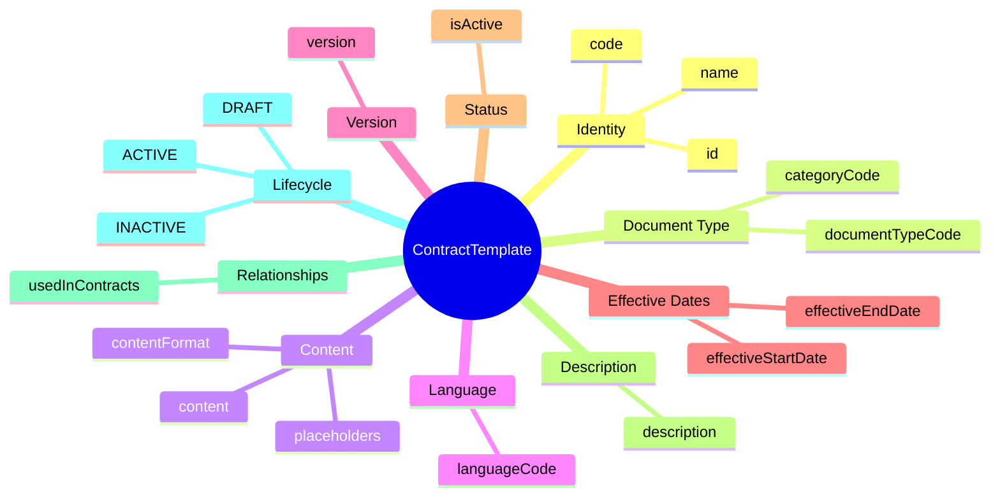
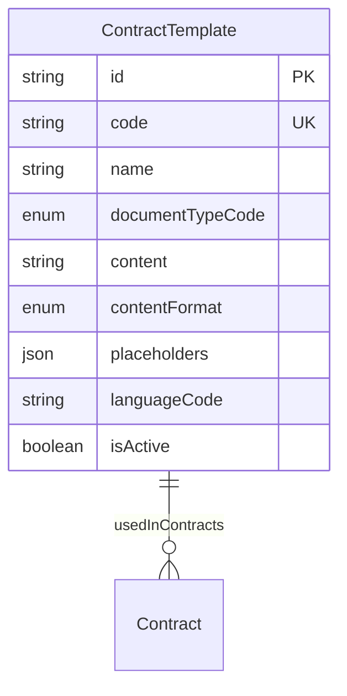
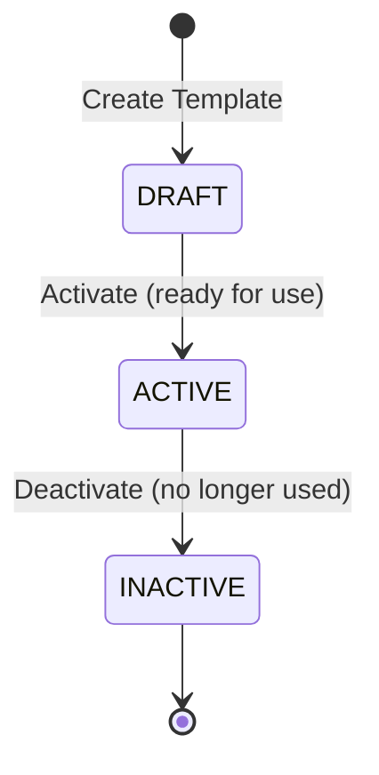

# Entity: ContractTemplate

## 1. Overview

The **ContractTemplate** entity manages blueprints for generating legal employment contracts. It defines layout, static text, and dynamic placeholders (tokens) replaced by employee data during generation.

**Key Concept**:
```
ContractTemplate + Employee Data → Generated Contract (PDF/HTML)
Placeholders: {{EMPLOYEE_NAME}}, {{START_DATE}}, {{SALARY_AMOUNT}}
```



**Design Rationale**:
- **Template Versioning**: Track template versions over time
- **Placeholder System**: Dynamic data binding ({{EMPLOYEE_NAME}})
- **Multi-Language**: Support vi-VN, en-US templates
- **Effective Dating**: Templates valid for specific periods

---

## 2. Attributes

### 2.1 Identity Attributes

| Attribute | Type | Required | Description |
|-----------|------|----------|-------------|
| id | string | ✓ | Unique internal identifier (UUID) |
| code | string | ✓ | Template code (unique) |
| name | string | ✓ | Template name |

### 2.2 Document Type

| Attribute | Type | Required | Description |
|-----------|------|----------|-------------|
| documentTypeCode | enum | ✓ | OFFER, CONTRACT, ADDENDUM, TERMINATION, AMENDMENT |
| categoryCode | enum | | PROBATION, OFFICIAL, INTERN, SEASONAL |

### 2.3 Content

| Attribute | Type | Required | Description |
|-----------|------|----------|-------------|
| content | string | ✓ | Template body (HTML/RTF with placeholders) |
| contentFormat | enum | ✓ | HTML, RTF, MARKDOWN |
| placeholders | json | | List of required placeholders |

### 2.4 Language

| Attribute | Type | Required | Description |
|-----------|------|----------|-------------|
| languageCode | string | ✓ | Language (vi, en) |

### 2.5 Version

| Attribute | Type | Required | Description |
|-----------|------|----------|-------------|
| version | string | ✓ | Template version number |

### 2.6 Effective Dates

| Attribute | Type | Required | Description |
|-----------|------|----------|-------------|
| effectiveStartDate | date | ✓ | Template becomes effective |
| effectiveEndDate | date | | Template expires |

### 2.7 Status

| Attribute | Type | Required | Description |
|-----------|------|----------|-------------|
| isActive | boolean | ✓ | Currently active? |

### 2.8 Audit Attributes

| Attribute | Type | Required | Description |
|-----------|------|----------|-------------|
| createdAt | datetime | ✓ | Record creation timestamp |
| updatedAt | datetime | ✓ | Last modification timestamp |
| createdBy | string | ✓ | User who created record |
| updatedBy | string | ✓ | User who last modified |

---

## 3. Relationships



### Related Entities

| Entity | Relationship | Cardinality | Description |
|--------|--------------|-------------|-------------|
| [[Contract]] | usedInContracts | 1:N | Contracts generated from template |

---

## 4. Lifecycle



---

## 5. Business Rules Reference

### Validation Rules
- **TemplateCodeUniqueness**: code unique across all templates
- **EffectiveDateConsistency**: effectiveStartDate < effectiveEndDate (if set)

### Business Constraints
- **OneActiveTemplatePerType**: Only one ACTIVE template per type+category+language (WARNING)
- **PlaceholderValidation**: All placeholders in content must be defined (WARNING)

### Placeholder Examples

```json
[
  {"key": "EMPLOYEE_NAME", "source": "employee.fullName"},
  {"key": "START_DATE", "source": "contract.startDate"},
  {"key": "SALARY_AMOUNT", "source": "compensation.baseSalary"},
  {"key": "LEGAL_ENTITY_NAME", "source": "legalEntity.name"},
  {"key": "LEGAL_REP_NAME", "source": "legalRepresentative.name"}
]
```

---

*Document Status: APPROVED - Based on Oracle HCM, SAP SuccessFactors, Workday patterns*
