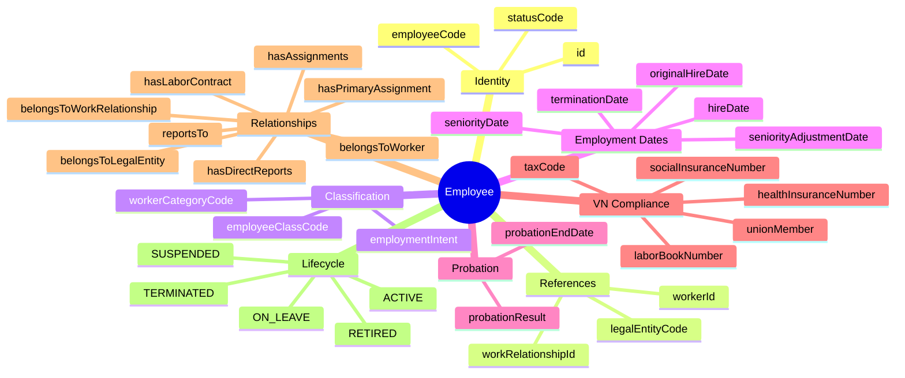
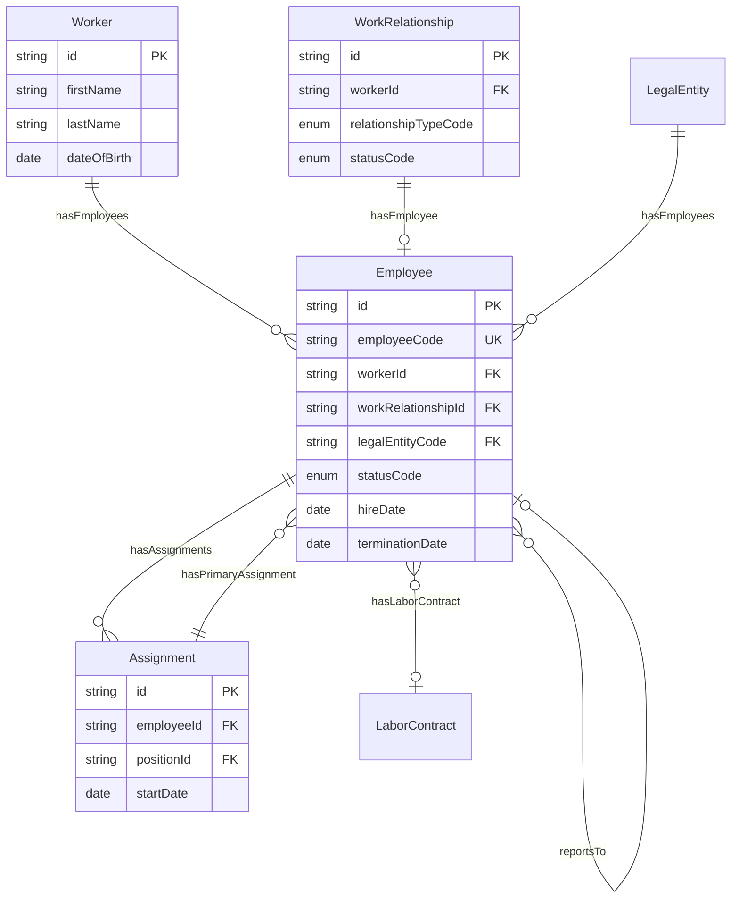
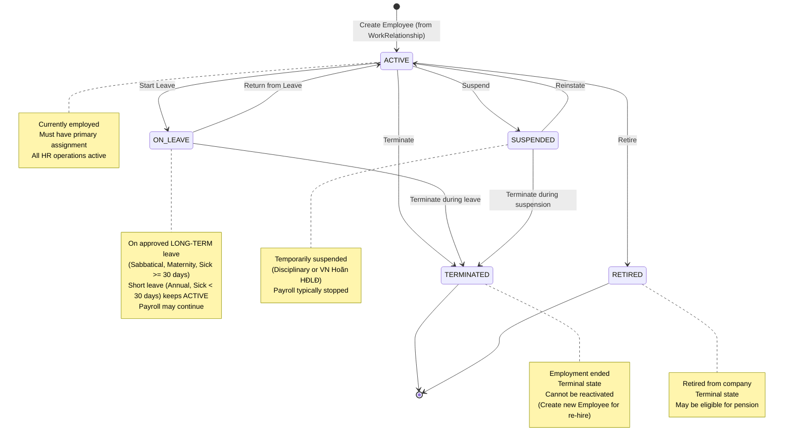

# Entity: Employee

## 1. Overview

The **Employee** entity represents an individual who has an **active employment relationship** with a Legal Entity. It is a **derived entity** created when a Worker establishes a WorkRelationship with `relationshipTypeCode = EMPLOYEE`. 

**Key Concept**: 
```
Worker (Person) + WorkRelationship (EMPLOYEE) → Employee (with employee_code)
```

Once an Employee record is created, **all HR operations** (payroll, benefits, performance, time tracking) interact through the Employee entity, not directly with Worker.



**Design Rationale**:
- **Separation of Concerns**: Worker = Person identity, Employee = Employment context
- **Multi-employment Support**: One Worker can be Employee at multiple Legal Entities (concurrently or sequentially)
- **HR Operations Boundary**: Employee is the entry point for all HR transactions
- **Compliance**: VN-specific fields (BHXH, tax code) live on Employee, not Worker

---

## 2. Attributes

### 2.1 Identity Attributes

| Attribute | Type | Required | Description |
|-----------|------|----------|-------------|
| id | string | ✓ | Unique internal identifier (UUID) |
| employeeCode | string | ✓ | Business identifier (unique within legal entity) |
| statusCode | enum | ✓ | ACTIVE, ON_LEAVE, SUSPENDED, TERMINATED, RETIRED |

### 2.2 Reference Attributes

| Attribute | Type | Required | Description |
|-----------|------|----------|-------------|
| workerId | string | ✓ | Reference to Worker (person) |
| workRelationshipId | string | ✓ | Reference to WorkRelationship |
| legalEntityCode | string | ✓ | Legal entity code (org_legal.entity.code) |

### 2.3 Classification Attributes

| Attribute | Type | Required | Description |
|-----------|------|----------|-------------|
| workerCategoryCode | string | | Workforce category (CORE, SUPPORT, LEADERSHIP) |
| employeeClassCode | string | | HR classification (REGULAR, PROBATION, INTERN) |
| employmentIntent | enum | | PERMANENT, FIXED_TERM, SEASONAL, PROJECT_BASED |

### 2.4 Employment Date Attributes

| Attribute | Type | Required | Description |
|-----------|------|----------|-------------|
| hireDate | date | ✓ | Start date with legal entity |
| originalHireDate | date | | First hire date (for re-hires) |
| seniorityDate | date | | Date for seniority calculation |
| seniorityAdjustmentDate | date | | Adjusted seniority (after unpaid leave) |
| terminationDate | date | | Employment end date |
| lastWorkingDate | date | | Last day actually worked |

### 2.5 Probation Attributes

| Attribute | Type | Required | Description |
|-----------|------|----------|-------------|
| probationEndDate | date | | Expected end of probation |
| probationResult | enum | | PASSED, FAILED, EXTENDED, IN_PROGRESS |

### 2.6 VN Labor Law Compliance Attributes

| Attribute | Type | Required | Description |
|-----------|------|----------|-------------|
| laborContractId | string | | Reference to active Labor Contract |
| socialInsuranceNumber | string | | Mã số BHXH (10 digits) |
| taxCode | string | | Mã số thuế cá nhân |
| laborBookNumber | string | | Số sổ lao động |
| healthInsuranceNumber | string | | Mã số BHYT |
| unionMember | boolean | | Đoàn viên công đoàn? |

### 2.7 Audit Attributes

| Attribute | Type | Required | Description |
|-----------|------|----------|-------------|
| createdAt | datetime | ✓ | Record creation timestamp |
| updatedAt | datetime | ✓ | Last modification timestamp |
| createdBy | string | ✓ | User who created record |
| updatedBy | string | ✓ | User who last modified |

---

## 3. Relationships



### Related Entities

| Entity | Relationship | Cardinality | Description |
|--------|--------------|-------------|-------------|
| [[Worker]] | belongsToWorker | N:1 | The person behind this employee |
| [[WorkRelationship]] | belongsToWorkRelationship | 1:1 | The work relationship that created this employee |
| [[LegalEntity]] | belongsToLegalEntity | N:1 | The employing legal entity |
| [[Assignment]] | hasAssignments | 1:N | Job assignments |
| [[Assignment]] | hasPrimaryAssignment | N:1 | Current primary assignment |
| [[LaborContract]] | hasLaborContract | N:1 | Current active contract |
| [[Employee]] | reportsTo | N:1 | Direct manager (self-ref) |
| [[Employee]] | hasDirectReports | 1:N | Direct reports (self-ref) |

---

## 4. Lifecycle



### State Descriptions

| State | Description | Allowed Operations |
|-------|-------------|-------------------|
| **ACTIVE** | Currently employed, working | All operations, can take leave/suspend/terminate |
| **ON_LEAVE** | On approved LONG-TERM leave (sabbatical, maternity, sick >= 30 days). Short leave (annual, sick < 30 days) keeps ACTIVE status. | Can return, can terminate |
| **SUSPENDED** | Temporarily suspended (disciplinary or VN Hoãn HĐLĐ) | Can reinstate, can terminate |
| **TERMINATED** | Employment ended | Read-only, cannot reactivate |
| **RETIRED** | Retired from company | Read-only, pension eligible |

### Transition Rules

| From | To | Trigger | Guard Condition |
|------|-----|---------|--------------------|
| ACTIVE | ON_LEAVE | startLeave | Approved LONG-TERM leave (sabbatical, maternity, sick >= 30 days) |
| ON_LEAVE | ACTIVE | returnFromLeave | Long-term leave period ended |
| ACTIVE | SUSPENDED | suspend | Suspension action triggered |
| SUSPENDED | ACTIVE | reinstate | Suspension lifted |
| ACTIVE | TERMINATED | terminate | Termination event (synced with WorkRelationship) |
| ON_LEAVE | TERMINATED | terminate | Termination during leave |
| SUSPENDED | TERMINATED | terminate | Termination during suspension |
| ACTIVE | RETIRED | retire | Retirement processed (age eligibility) |

---

## 5. Business Rules Reference

### Validation Rules
- **EmployeeCodeUniqueness**: employeeCode unique within legalEntityCode
- **WorkerToEmployeeMapping**: Employee only created when WorkRelationship.relationshipTypeCode = EMPLOYEE
- **OneEmployeePerWorkRelationship**: Each WorkRelationship has at most ONE Employee
- **PrimaryAssignmentRequired**: ACTIVE Employee must have primary assignment
- **ManagerMustBeActiveEmployee**: reportsTo must reference ACTIVE Employee in same LegalEntity (or cross-entity if allowed)
- **ProbationPeriodValidation**: Probation must be 6/30/60/180 days (VN Labor Law)

### Business Constraints
- **StatusSyncWithWorkRelationship**: Employee.statusCode syncs with WorkRelationship.statusCode
- **HireDateFromWorkRelationship**: Employee.hireDate = WorkRelationship.startDate
- **TerminationDateSync**: Employee TERMINATED → WorkRelationship TERMINATED
- **ManagerAggregationFromAssignment**: Employee.reportsTo can be auto-calculated from Assignment with highest FTE
- **SocialInsuranceRequired**: VN employees need socialInsuranceNumber (WARNING)
- **TaxCodeRequired**: VN employees need taxCode for payroll (WARNING)
- **SeniorityCalculation**: seniorityAdjustmentDate → seniorityDate → originalHireDate → hireDate

### Manager Relationship (Dual-Level)
- **Employee-Level**: Primary/Line Manager (reportsTo) - can be null if tenant uses Assignment-level only
- **Assignment-Level**: Assignment.reportsTo for matrix organization support
- **Aggregation Rule**: If tenant configurable, Employee.reportsTo = Assignment with highest FTE (or earliest if equal)
- **Cross-Entity Reporting**: Allowed if tenant.allowCrossEntityReporting = TRUE (for matrix orgs)

### VN Labor Law Compliance
- **Social Insurance**: Mã số BHXH required for BHXH contributions
- **Tax Code**: Mã số thuế required for personal income tax
- **Labor Book**: Sổ lao động tracking (laborBookNumber)
- **Health Insurance**: Mã số BHYT for healthcare coverage
- **Union Membership**: Track union member status for union dues

### Related Business Rules Documents
- See `[[employee-management.brs.md]]` for complete business rules catalog
- See `[[vn-labor-law-compliance.brs.md]]` for Vietnam-specific requirements
- See `[[probation-management.brs.md]]` for probation period rules
- See `[[seniority-calculation.brs.md]]` for seniority and service calculation

---

## 6. Creation Pattern

### How Employee is Created

```
1. Worker exists (person.worker table)
   ↓
2. WorkRelationship created with relationshipTypeCode = EMPLOYEE
   ↓
3. Employee record auto-created:
   - employeeCode generated (e.g., EMP-2026-001)
   - workerId copied from WorkRelationship
   - legalEntityCode copied from WorkRelationship
   - hireDate = WorkRelationship.startDate
   - statusCode = ACTIVE
   ↓
4. All HR operations now use Employee entity
```

### Example Scenario

```yaml
# Step 1: Worker exists
Worker:
  id: "550e8400-e29b-41d4-a716-446655440000"
  firstName: "Nguyen"
  lastName: "Van A"
  dateOfBirth: "1990-01-15"

# Step 2: WorkRelationship created
WorkRelationship:
  id: "660e8400-e29b-41d4-a716-446655440000"
  workerId: "550e8400-e29b-41d4-a716-446655440000"
  relationshipTypeCode: "EMPLOYEE"
  legalEntityCode: "VNG-HCM"
  startDate: "2026-01-15"
  statusCode: "ACTIVE"

# Step 3: Employee auto-created
Employee:
  id: "770e8400-e29b-41d4-a716-446655440000"
  employeeCode: "EMP-2026-001"
  workerId: "550e8400-e29b-41d4-a716-446655440000"
  workRelationshipId: "660e8400-e29b-41d4-a716-446655440000"
  legalEntityCode: "VNG-HCM"
  hireDate: "2026-01-15"
  statusCode: "ACTIVE"
```

---

*Document Status: APPROVED - Based on DBML design and Oracle HCM patterns*  
*VN Labor Law Compliance: Labor Code 2019, Decree 145/2020/NĐ-CP*
