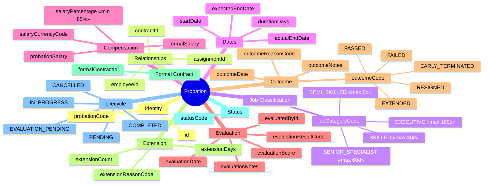
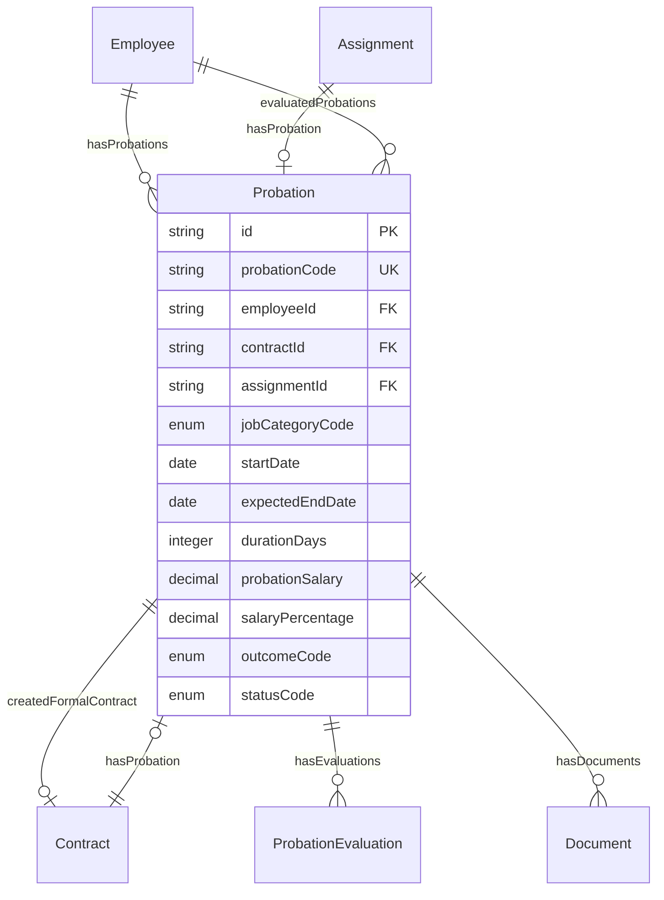
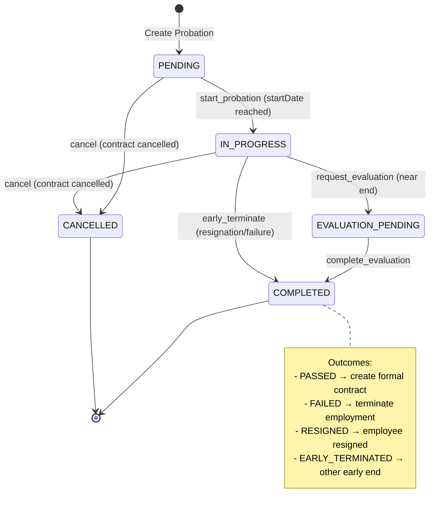

# Entity: Probation

## 1. Overview

**Probation** (Thử việc) entity quản lý thời gian thử việc của nhân viên theo quy định Bộ Luật Lao động Việt Nam 2019. Đây là entity quan trọng để đảm bảo tuân thủ pháp luật về:
- **Thời hạn thử việc** tối đa theo từng loại công việc (Điều 25)
- **Mức lương thử việc** tối thiểu 85% (Điều 26)
- **Quy trình đánh giá** và chuyển đổi sang hợp đồng chính thức

**Key Concept**:
```
Probation = Trial period with evaluation workflow
Contract = Legal agreement (may contain probation clause)
Probation ≠ Contract (separate entity for lifecycle tracking)
```



**Design Rationale**:
- **Separate from Contract**: Probation is a lifecycle entity, not just a contract attribute
- **VN Compliance**: Full support for Labor Code 2019 Điều 25-27
- **Evaluation Workflow**: Support multi-step evaluation process
- **Audit Trail**: Complete tracking of probation decisions

---

## 2. Attributes

### 2.1 Identity Attributes

| Attribute | Type | Required | Description | DB Column |
|-----------|------|----------|-------------|-----------|
| id | string | ✓ | Unique internal identifier (UUID) | employment.probation.id |
| probationCode | string | ✓ | Business identifier (PROB-YYYY-NNNNNN) | employment.probation.code |

### 2.2 Relationship References

| Attribute | Type | Required | Description | DB Column |
|-----------|------|----------|-------------|-----------|
| employeeId | string | ✓ | Employee on probation | employment.probation.employee_id → employment.employee.id |
| contractId | string | ✓ | Trial/main contract | employment.probation.contract_id → employment.contract.id |
| assignmentId | string | ✓ | Work assignment | employment.probation.assignment_id → employment.assignment.id |

### 2.3 Job Classification (VN Labor Code Điều 25)

| Attribute | Type | Required | Description | Max Days |
|-----------|------|----------|-------------|----------|
| jobCategoryCode | enum | ✓ | Job category for max duration | - |

**Job Category Reference**:

| Code | Vietnamese | Description | Max Duration |
|------|------------|-------------|--------------|
| EXECUTIVE | Quản lý DN | Managers per Enterprise Law | 180 days |
| SENIOR_SPECIALIST | Chuyên môn cao | College+, technical/professional | 60 days |
| SKILLED | Được đào tạo | Intermediate vocational | 30 days |
| SEMI_SKILLED | Công việc khác | Other work | 6 days |

### 2.4 Dates

| Attribute | Type | Required | Description |
|-----------|------|----------|-------------|
| startDate | date | ✓ | Probation start date |
| expectedEndDate | date | ✓ | Calculated end date (startDate + durationDays) |
| actualEndDate | date | | Actual end (if different) |
| durationDays | integer | ✓ | Duration in days (max by jobCategoryCode) |

### 2.5 Compensation (VN Labor Code Điều 26)

| Attribute | Type | Required | Description | VN Law |
|-----------|------|----------|-------------|--------|
| probationSalary | decimal | ✓ | Probation salary amount | ≥ 85% of formal |
| salaryCurrencyCode | string | ✓ | Currency (default VND) | |
| salaryPercentage | decimal | ✓ | % of formal salary | Min 85% |
| formalSalary | decimal | ✓ | Reference formal salary | |

### 2.6 Evaluation

| Attribute | Type | Required | Description |
|-----------|------|----------|-------------|
| evaluationDate | date | | Final evaluation date |
| evaluatedById | string | | Evaluator (manager) |
| evaluationScore | decimal | | Numeric score (0-100) |
| evaluationResultCode | enum | | EXCELLENT, GOOD, SATISFACTORY, NEEDS_IMPROVEMENT, UNSATISFACTORY |
| evaluationNotes | string | | Evaluation comments |

### 2.7 Outcome

| Attribute | Type | Required | Description |
|-----------|------|----------|-------------|
| outcomeCode | enum | | PASSED, FAILED, EXTENDED, EARLY_TERMINATED, RESIGNED |
| outcomeDate | date | | Outcome determination date |
| outcomeReasonCode | string | | Detailed reason code |
| outcomeNotes | string | | Outcome decision notes |

### 2.8 Extension

| Attribute | Type | Required | Description |
|-----------|------|----------|-------------|
| extensionCount | integer | ✓ | Number of extensions (default 0) |
| extensionDays | integer | | Additional days if extended |
| extensionReasonCode | string | | Reason for extension |

### 2.9 Formal Contract

| Attribute | Type | Required | Description |
|-----------|------|----------|-------------|
| formalContractId | string | | Formal contract created on PASSED |

### 2.10 Status & Audit

| Attribute | Type | Required | Description |
|-----------|------|----------|-------------|
| statusCode | enum | ✓ | PENDING, IN_PROGRESS, EVALUATION_PENDING, COMPLETED, CANCELLED |
| createdAt | datetime | ✓ | Record creation timestamp |
| updatedAt | datetime | ✓ | Last modification timestamp |
| createdBy | string | ✓ | Creator user ID |
| updatedBy | string | ✓ | Last modifier user ID |

---

## 3. Relationships



### Related Entities

| Entity | Relationship | Cardinality | Description |
|--------|--------------|-------------|-------------|
| [[Employee]] | forEmployee | N:1 | Employee on probation |
| [[Contract]] | underContract | N:1 | Trial or main contract |
| [[Assignment]] | duringAssignment | N:1 | Work assignment |
| [[Employee]] | evaluatedBy | N:1 | Evaluator (manager) |
| [[Contract]] | createdFormalContract | 1:1 | Formal contract on pass |
| [[ProbationEvaluation]] | hasEvaluations | 1:N | Mid-term/final evaluations |
| [[Document]] | hasDocuments | 1:N | Supporting documents |

---

## 4. Lifecycle



| State | Business Meaning | System Impact |
|-------|------------------|---------------|
| **PENDING** | Probation created, not yet started | No salary processing |
| **IN_PROGRESS** | Probation active, under evaluation | Probation salary payable |
| **EVALUATION_PENDING** | Near end, awaiting final evaluation | Reminder notifications |
| **COMPLETED** | Probation ended (any outcome) | Outcome-based actions |
| **CANCELLED** | Cancelled before completion | No further action |

---

## 5. Business Rules Reference

### VN Labor Code 2019 Compliance

| Rule | Reference | Description |
|------|-----------|-------------|
| Max duration | Điều 25 | 180/60/30/6 days by job type |
| Min salary | Điều 26 | ≥ 85% of position salary |
| Notice period | Điều 27 | 3 days for early termination |
| Single probation | Điều 25 | Only one probation per job |

### Related Business Rules

- [[Probation.brs.md]] - Probation duration and salary rules
- [[Contract.brs.md]] - Contract creation after probation pass
- [[Termination.brs.md]] - Termination on probation failure

---

## 6. Process Flows

> **Note**: Detailed flows are in `*.flow.md` files.

| Flow | Description |
|------|-------------|
| [[probation-start.flow.md]] | Start probation workflow |
| [[probation-evaluation.flow.md]] | Evaluation process flow |
| [[probation-completion.flow.md]] | Completion and outcome handling |

---

## 7. Vietnam Regulatory Notes

### Điều 25 - Thời gian thử việc

> Thời gian thử việc căn cứ vào tính chất và mức độ phức tạp của công việc nhưng chỉ được thử việc một lần đối với một công việc và bảo đảm điều kiện sau đây:
> - Không quá 180 ngày đối với công việc của người quản lý doanh nghiệp theo quy định của Luật Doanh nghiệp
> - Không quá 60 ngày đối với công việc có chức danh nghề nghiệp cần trình độ chuyên môn, kỹ thuật từ cao đẳng trở lên
> - Không quá 30 ngày đối với công việc có chức danh nghề nghiệp cần trình độ chuyên môn, kỹ thuật trung cấp nghề, trung cấp chuyên nghiệp, công nhân kỹ thuật, nhân viên nghiệp vụ
> - Không quá 6 ngày đối với công việc khác

### Điều 26 - Tiền lương thử việc

> Tiền lương của người lao động trong thời gian thử việc do hai bên thỏa thuận nhưng ít nhất phải bằng 85% mức lương của công việc đó.

### Điều 27 - Kết thúc thời gian thử việc

> - Khi việc làm thử đạt yêu cầu thì người sử dụng lao động phải giao kết hợp đồng lao động với người lao động.
> - Trong thời gian thử việc, mỗi bên có quyền hủy bỏ hợp đồng thử việc hoặc hợp đồng lao động đã giao kết mà không cần báo trước và không phải bồi thường.
