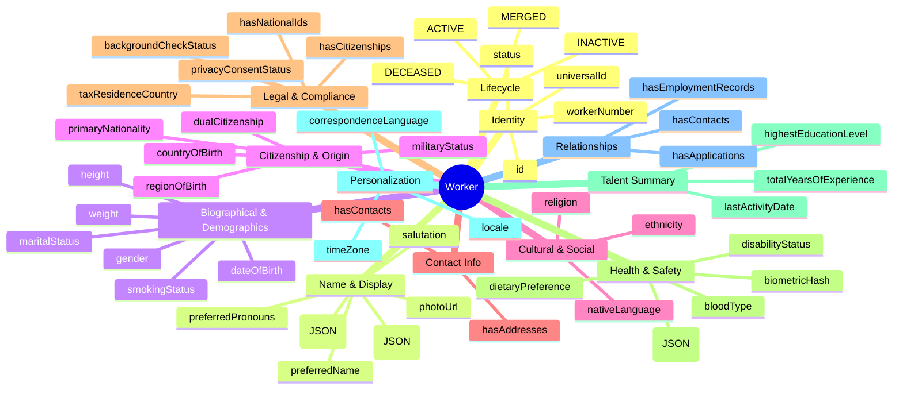
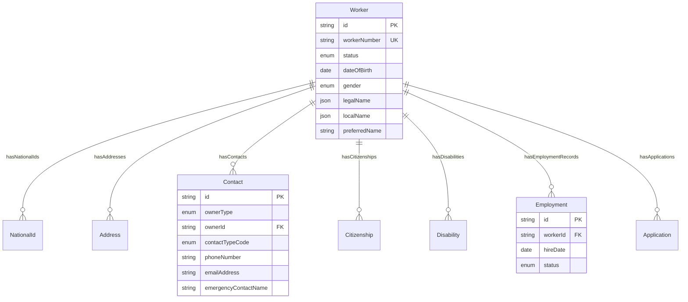
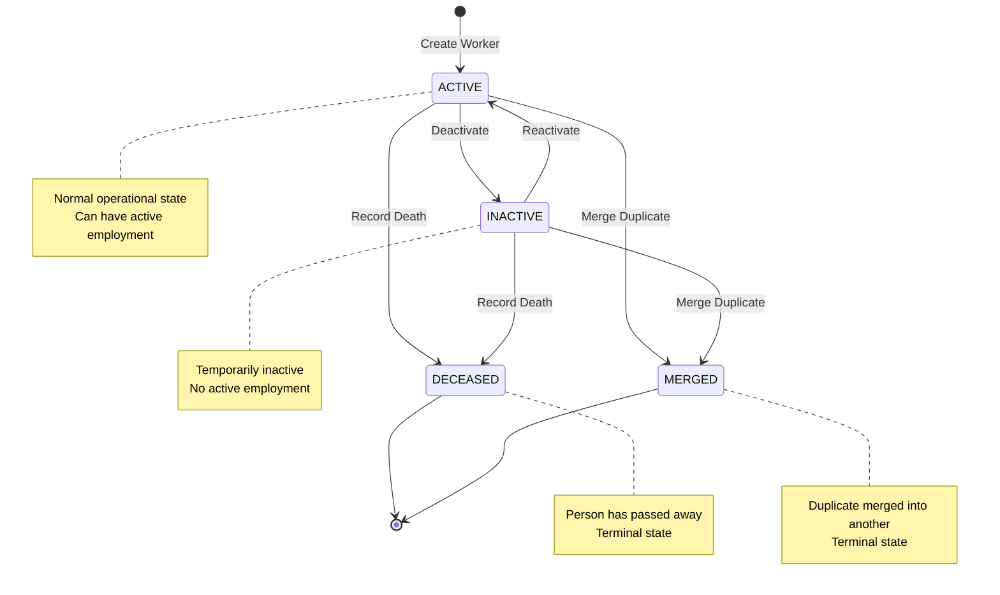

# Entity: Worker

## 1. Overview

The **Worker** entity represents an individual's fundamental identity and biographical data, independent of any employment relationship. It serves as the foundational layer upon which Employment, Application, and Contact entities are built. This separation follows the industry-standard pattern of decoupling personal identity from organizational relationships.

**Key Characteristics**:
- **Person-centric**: Contains only biographical/identity information
- **Reusable**: Same Worker can be an Employee, Applicant, or Contact
- **Date-independent**: Core identity attributes are not date-effective
- **Privacy-aware**: Sensitive fields (religion, ethnicity) are optional and protected

**Design Pattern**: Worker is separated from WorkerName to handle:
- Multiple name types (LEGAL, PREFERRED, LOCAL_SCRIPT)
- Date-effective name changes (marriage, legal changes)
- Cultural variations (Vietnamese vs Western naming conventions)

---

## 2. Attributes

### 2.1 Identity Attributes

| Attribute | Type | Required | Description |
|-----------|------|----------|-------------|
| id | string | ✓ | Unique internal identifier (UUID) |
| workerNumber | string | | Human-readable worker ID (e.g., W001234) |
| status | enum | ✓ | Record status: ACTIVE, INACTIVE, DECEASED, MERGED |

### 2.2 Biographical Attributes

| Attribute | Type | Required | Description |
|-----------|------|----------|-------------|
| dateOfBirth | date | | Date of birth (Ngày sinh) |
| gender | enum | | MALE, FEMALE, OTHER, UNDISCLOSED |
| maritalStatus | enum | | SINGLE, MARRIED, DIVORCED, WIDOWED, SEPARATED |
| maritalStatusDate | date | | When marital status last changed |
| primaryNationality | string | | Primary citizenship (Country reference) |
| additionalNationalities | array | | Secondary citizenships |
| countryOfBirth | string | | Birth country (Country reference) |
| regionOfBirth | string | | Birth region/province |
| cityOfBirth | string | | Birth city/town |
| dateOfDeath | date | | Date of death if applicable |
| correspondenceLanguage | string | | Preferred communication language |

### 2.3 Health & Diversity Attributes (Optional)

| Attribute | Type | Required | Description |
|-----------|------|----------|-------------|
| bloodType | enum | | A+, A-, B+, B-, O+, O-, AB+, AB- |
| religion | string | | Religious affiliation (voluntary) |
| ethnicity | string | | Ethnic group (VN: 54 official groups) |
| disabilityStatus | enum | | NONE, DISCLOSED, PREFER_NOT_TO_SAY |
| veteranStatus | enum | | Military veteran status |
| usesTobacco | boolean | | Tobacco use indicator |

### 2.4 Vietnam-Specific Attributes

| Attribute | Type | Required | Description |
|-----------|------|----------|-------------|
| hometownProvince | string | | Ancestral hometown (Quê quán) |

### 2.5 Identity & Display Attributes (Performance Optimization)

| Attribute | Type | Required | Description |
|-----------|------|----------|-------------|
| preferredName | string | | Informal name for UI ("Tony" vs "Anthony") |
| photoUrl | string | | Avatar URL (denormalized for performance) |
| salutation | enum | | MR, MS, MRS, DR, PROF, OTHER |
| preferredPronouns | enum | | HE_HIM, SHE_HER, THEY_THEM, OTHER |
| universalId | string | | External SSO ID (Azure AD, Okta) |

### 2.6 Legal & Compliance Attributes (Decree 13 & Global)

| Attribute | Type | Required | Description |
|-----------|------|----------|-------------|
| privacyConsentStatus | enum | ✓ | PENDING, GRANTED, PARTIAL, DENIED, REVOKED |
| privacyConsentDate | datetime | | When consent was granted/modified |
| taxResidenceCountry | string | | Tax residence (may differ from nationality) |
| backgroundCheckStatus | enum | | NOT_REQUIRED, PENDING, CLEARED, FAILED, EXPIRED |
| backgroundCheckDate | date | | Most recent background check date |

### 2.7 Health & Safety Attributes

| Attribute | Type | Required | Description |
|-----------|------|----------|-------------|
| biometricHash | string | | Hashed biometric for time attendance |
| uniformInfo | object | | Sizes: {shirt, shoes, hat, type} |
| dietaryPreference | enum | | VEGETARIAN, VEGAN, HALAL, KOSHER, etc. |

### 2.8 Talent Summary Attributes (Denormalized)

| Attribute | Type | Required | Description |
|-----------|------|----------|-------------|
| highestEducationLevel | enum | | PRIMARY to POST_DOCTORATE |
| totalYearsOfExperience | number | | Total professional experience (years) |
| lastActivityDate | datetime | | Last system interaction |

### 2.9 Personalization Attributes

| Attribute | Type | Required | Description |
|-----------|------|----------|-------------|
| timeZone | string | | IANA time zone (Asia/Ho_Chi_Minh) |
| locale | string | | UI locale (vi-VN, en-US) |

### 2.10 Audit Attributes

| Attribute | Type | Required | Description |
|-----------|------|----------|-------------|
| createdAt | datetime | ✓ | Record creation timestamp |
| updatedAt | datetime | ✓ | Last modification timestamp |
| createdBy | string | ✓ | User who created record |
| updatedBy | string | ✓ | User who last modified |

---

## 3. Relationships

### Related Entities

| Entity | Relationship | Cardinality | Description |
|--------|--------------|-------------|-------------|
| [[NationalId]] | hasNationalIds | 1:N | Government IDs (CCCD, CMND, Passport) |
| [[Address]] | hasAddresses | 1:N | Address records (permanent, current) |
| [[Contact]] | hasContacts | 1:N | All contact info (phone, email, emergency) via polymorphic pattern |
| [[Citizenship]] | hasCitizenships | 1:N | Citizenship/Passport records |
| [[Disability]] | hasDisabilities | 1:N | Disability records |
| [[Employment]] | hasEmploymentRecords | 1:N | Employment relationships |
| [[Application]] | hasApplications | 1:N | Job application records |

---

## 4. Lifecycle

### State Descriptions

| State | Description | Allowed Operations |
|-------|-------------|-------------------|
| **ACTIVE** | Valid, active worker record | All operations allowed |
| **INACTIVE** | Temporarily inactive, no active employment | Limited updates, can reactivate |
| **DECEASED** | Person has passed away | Read-only except by authorized personnel |
| **MERGED** | Duplicate record merged into another | Read-only, redirects to target worker |

### Transition Rules

| From | To | Trigger | Guard Condition |
|------|-----|---------|-----------------|
| ACTIVE | INACTIVE | deactivate | No active employment |
| INACTIVE | ACTIVE | reactivate | - |
| ACTIVE | DECEASED | recordDeath | - |
| INACTIVE | DECEASED | recordDeath | - |
| ACTIVE | MERGED | mergeDuplicate | Duplicate detected |
| INACTIVE | MERGED | mergeDuplicate | Duplicate detected |

---

## 5. Business Rules Reference

### Data Protection & Privacy
- **PersonalDataProtection**: Personal data access requires explicit consent and role-based permissions (GDPR/VN Personal Data Protection Law)
- **SensitiveDataHandling**: Religion, ethnicity, disability fields are voluntary and require special protection
- **DataRetention**: Worker records retained for 10 years after last employment termination (VN Labor Law Article 33)
- **PrivacyConsentRequired**: `privacyConsentStatus` must be GRANTED before processing sensitive personal data (Nghị định 13/2023)
- **PrivacyConsentAudit**: Any change to `privacyConsentStatus` must update `privacyConsentDate` and create audit log
- **PrivacyConsentRevocation**: When consent is REVOKED, system must anonymize/delete non-essential data within 30 days

### Security & Access Control
- **BiometricEncryption**: `biometricHash` must be encrypted at rest (AES-256) and only accessible by authorized time attendance systems
- **UniversalIdUniqueness**: `universalId` must be globally unique across all identity systems (Azure AD, Okta, Google Workspace)

### Validation Rules
- **UniqueIdentifier**: Worker ID must be globally unique across the system
- **DateOfBirthValidation**: Date of birth must be in the past and person must be at least 15 years old (VN minimum working age per Labor Code 2019)
- **MaritalStatusConsistency**: If maritalStatus changes, maritalStatusDate must be updated
- **ExperienceValidation**: `totalYearsOfExperience` must be between 0 and 60 years

### Business Constraints
- **DeceasedImmutability**: Once status is DECEASED, no biographical data can be modified except by authorized personnel
- **MergedRedirection**: MERGED workers must have a reference to the target worker record

### Denormalization Consistency (Performance Optimization)
- **PreferredNameSync**: When WorkerName with type=PREFERRED is updated, `preferredName` must be synchronized
- **PhotoUrlSync**: When primary Photo is updated, `photoUrl` must be synchronized
- **EducationLevelSync**: When new Qualification is added with higher level, `highestEducationLevel` must be updated

### Personalization & UX
- **LocaleInheritance**: If `locale` is not set, inherit from `correspondenceLanguage` or system default (vi-VN)
- **TimeZoneDefault**: For VN-based workers, default `timeZone` to Asia/Ho_Chi_Minh if not specified

### Vietnam-Specific Rules
- **National ID Format**: CCCD must be 12 digits, CMND (old format) must be 9 digits
- **Ethnicity Classification**: Must use official 54 ethnic groups classification from Vietnamese government
- **Permanent Address**: Required for labor contract registration (Hộ khẩu thường trú)
- **Privacy Consent Mandatory**: All workers must have `privacyConsentStatus` set (cannot be NULL) per Decree 13/2023

### Related Business Rules Documents
- See `worker-management.brs.md` for complete business rules catalog
- See `personal-data-protection.brs.md` for data privacy rules (Decree 13/2023 compliance)
- See `vn-labor-compliance.brs.md` for Vietnam-specific requirements
- See `biometric-security.brs.md` for biometric data handling policies
- See `denormalization-sync.brs.md` for cache consistency rules

---

*Document Status: APPROVED - Enhanced with SCAMPER analysis (Identity, Compliance, Health, Talent, Personalization)*
