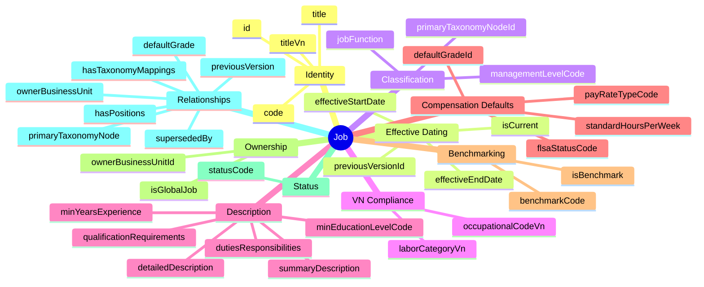
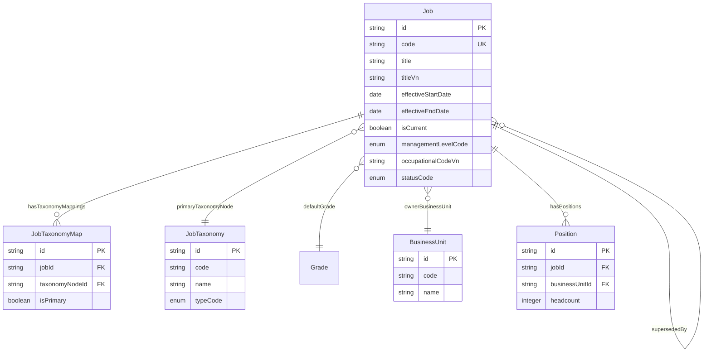
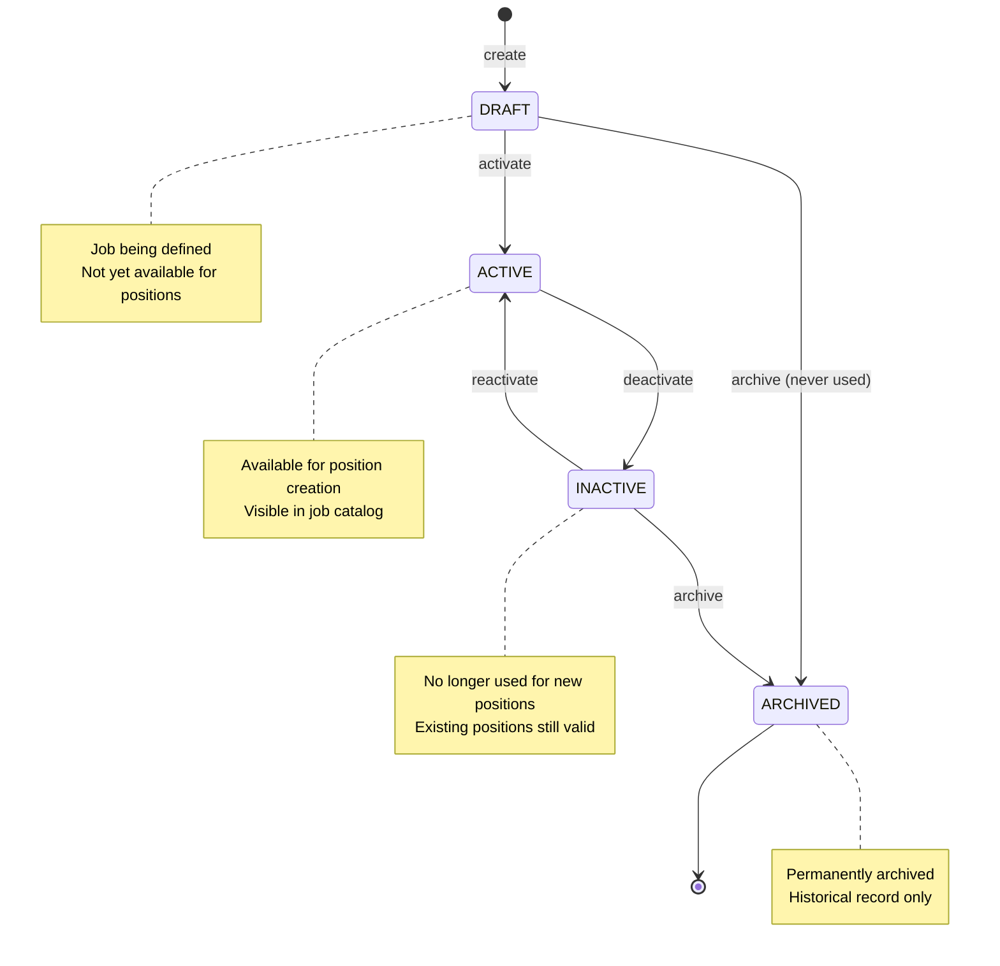

# Job

## 1. Overview

The **Job** (or **Job Profile**) entity defines the generic "WHAT" of a role - the responsibilities, qualifications, and standard attributes shared by everyone with that title. It serves as a **template** for creating specific Positions.



**Key Distinctions**:

| Concept | Description | Example |
|---------|-------------|---------|
| **Job** | Generic template - the role definition | "Senior Software Engineer" |
| **Position** | Specific instance in org structure | "SSE in Engineering Team - Slot #3" |
| **Assignment** | Employee-Position link | "Nguyễn Văn A is assigned to Slot #3" |

**Design Patterns Applied** (SCAMPER Analysis):
- **Substitute**: Multi-taxonomy via JobTaxonomyMap instead of single jobFamily
- **Adapt**: VN fields (titleVn, occupationalCodeVn, laborCategoryVn)
- **Modify**: SCD Type-2 versioning for job history tracking

---

## 2. Attributes

### 2.1 Identity

| Attribute | Type | Required | Description |
|-----------|------|----------|-------------|
| id | string | ✓ | Unique identifier (UUID) |
| code | string | ✓ | Unique Job Code (e.g., JOB-DEV-001) |
| title | string | ✓ | Job Title in English |
| titleVn | string | | Official Vietnamese title for labor contracts |

### 2.2 Effective Dating (SCD Type-2)

| Attribute | Type | Required | Description |
|-----------|------|----------|-------------|
| effectiveStartDate | date | ✓ | When this job version becomes effective |
| effectiveEndDate | date | | When this job version ends |
| isCurrent | boolean | ✓ | Is this the current version |
| previousVersionId | string | | Link to previous version |

### 2.3 Classification

| Attribute | Type | Required | Description |
|-----------|------|----------|-------------|
| primaryTaxonomyNodeId | string | | Primary taxonomy node pointer |
| managementLevelCode | enum | | IC / LEAD / MANAGER / DIRECTOR / VP / C_LEVEL |
| jobFunction | string | | Functional area (legacy) |

**Management Level Codes**:
| Code | Name | Description |
|------|------|-------------|
| IC | Individual Contributor | No direct reports |
| LEAD | Team Lead | Informal leadership |
| MANAGER | Manager | First-line manager |
| SENIOR_MANAGER | Senior Manager | Multiple teams |
| DIRECTOR | Director | Function/department head |
| VP | Vice President | Business unit leader |
| SVP | Senior VP | Multiple business units |
| C_LEVEL | C-Suite | CEO, CFO, CTO, etc. |

### 2.4 VN Compliance

| Attribute | Type | Required | Description |
|-----------|------|----------|-------------|
| occupationalCodeVn | string | | VN Occupational Classification (Thông tư 17/2018/TT-BLĐTBXH) |
| laborCategoryVn | enum | | MANAGEMENT / TECHNICAL / CLERICAL / SERVICE / PRODUCTION |

### 2.5 Description

| Attribute | Type | Required | Description |
|-----------|------|----------|-------------|
| summaryDescription | string | | Short summary (≤500 chars) |
| detailedDescription | string | | Full job description |
| dutiesResponsibilities | string | | Key duties |
| qualificationRequirements | string | | Education/Experience requirements |
| minEducationLevelCode | enum | | HIGH_SCHOOL / BACHELOR / MASTER / DOCTORATE |
| minYearsExperience | integer | | Minimum years required |

### 2.6 Compensation Defaults

| Attribute | Type | Required | Description |
|-----------|------|----------|-------------|
| payRateTypeCode | enum | | SALARY / HOURLY / DAILY |
| defaultGradeId | string | | Default pay grade reference |
| standardHoursPerWeek | number | | Standard working hours |
| flsaStatusCode | enum | | EXEMPT / NON_EXEMPT (US only) |

### 2.7 Benchmarking

| Attribute | Type | Required | Description |
|-----------|------|----------|-------------|
| isBenchmark | boolean | | Market pricing benchmark job |
| benchmarkCode | string | | External benchmark reference |

### 2.8 Ownership

| Attribute | Type | Required | Description |
|-----------|------|----------|-------------|
| ownerBusinessUnitId | string | | Business unit owner |
| isGlobalJob | boolean | | Global vs local job definition |

### 2.9 Status & Audit

| Attribute | Type | Required | Description |
|-----------|------|----------|-------------|
| statusCode | enum | ✓ | DRAFT / ACTIVE / INACTIVE / ARCHIVED |
| createdAt | datetime | ✓ | Creation timestamp |
| updatedAt | datetime | ✓ | Last modification |
| createdBy | string | ✓ | Creator |
| updatedBy | string | ✓ | Last modifier |

---

## 3. Relationships



### Related Entities

| Entity | Relationship | Cardinality | Description |
|--------|--------------|-------------|-------------|
| [[JobTaxonomyMap]] | hasTaxonomyMappings | 1:N | Taxonomy classifications |
| [[JobTaxonomy]] | primaryTaxonomyNode | N:1 | Primary classification |
| [[Grade]] | defaultGrade | N:1 | Default pay grade (TR module) |
| [[BusinessUnit]] | ownerBusinessUnit | N:1 | Owner business unit |
| [[Position]] | hasPositions | 1:N | Position instances |
| [[Job]] | previousVersion | N:1 | SCD chain (self-ref) |
| [[Job]] | supersededBy | 1:N | SCD inverse |

---

## 4. Lifecycle



### State Descriptions

| State | Description | Allowed Actions |
|-------|-------------|-----------------|
| DRAFT | Job being defined | Edit, Activate, Archive |
| ACTIVE | In use, available for positions | Edit, Deactivate |
| INACTIVE | Deprecated, no new positions | Reactivate, Archive |
| ARCHIVED | Permanently archived | View only |

### Transition Guards

| Transition | Guard Condition |
|------------|-----------------|
| DRAFT → ACTIVE | All required fields populated, at least one taxonomy |
| ACTIVE → INACTIVE | No active positions OR positions migrated |
| INACTIVE → ARCHIVED | All dependent positions migrated/archived |

---

## 5. Business Rules Reference

### Validation Rules

| Rule | Description | Severity |
|------|-------------|----------|
| CodeUniqueness | code must be unique per tenant | ERROR |
| TitleRequired | title is mandatory | ERROR |
| EffectiveDateRequired | effectiveStartDate is mandatory | ERROR |
| VnOccupationalCodeFormat | occupationalCodeVn = 4 digits | WARNING |

### Business Rules

| Rule | Description | Severity |
|------|-------------|----------|
| ActiveJobShouldHaveTaxonomy | Active jobs need taxonomy classification | WARNING |
| NoActivePositionsOnDeactivate | Cannot deactivate if positions active | ERROR |
| SingleCurrentVersion | Only one isCurrent per code | INFO |

### Related Documents
- See `[[job-management.brs.md]]` for complete job business rules
- See `[[job-catalog.flow.md]]` for job catalog workflow
- See `[[position-management.flow.md]]` for position creation workflow

---

## 6. Use Cases

### Use Case 1: Create New Job (Simple)

```yaml
Job:
  id: "job-001"
  code: "JOB-SSE-001"
  title: "Senior Software Engineer"
  titleVn: "Kỹ sư Phần mềm Cao cấp"
  effectiveStartDate: "2024-01-01"
  isCurrent: true
  managementLevelCode: IC
  occupationalCodeVn: "2512"
  laborCategoryVn: TECHNICAL
  summaryDescription: "Designs and implements complex software systems"
  payRateTypeCode: SALARY
  standardHoursPerWeek: 40
  isGlobalJob: true
  statusCode: ACTIVE
```

### Use Case 2: Job with Taxonomy Mapping

```yaml
Job:
  id: "job-002"
  code: "JOB-EM-001"
  title: "Engineering Manager"
  titleVn: "Quản lý Kỹ thuật"
  effectiveStartDate: "2024-01-01"
  isCurrent: true
  managementLevelCode: MANAGER
  primaryTaxonomyNodeId: "tax-tech-mgmt-001"
  occupationalCodeVn: "1330"
  laborCategoryVn: MANAGEMENT
  minEducationLevelCode: BACHELOR
  minYearsExperience: 5
  payRateTypeCode: SALARY
  statusCode: ACTIVE

# Taxonomy Mappings via JobTaxonomyMap
JobTaxonomyMap:
  - jobId: "job-002"
    taxonomyNodeId: "tax-family-engineering"  # Job Family
    isPrimary: true
  - jobId: "job-002"
    taxonomyNodeId: "tax-track-management"    # Career Track
    isPrimary: false
  - jobId: "job-002"
    taxonomyNodeId: "tax-level-m1"            # Level: Manager 1
    isPrimary: false
```

### Use Case 3: Job Version Update (SCD Type-2)

```yaml
# Original job (now superseded)
Job:
  id: "job-001-v1"
  code: "JOB-SSE-001"
  title: "Senior Software Engineer"
  effectiveStartDate: "2024-01-01"
  effectiveEndDate: "2024-12-31"
  isCurrent: false
  statusCode: INACTIVE

# New version
Job:
  id: "job-001-v2"
  code: "JOB-SSE-001"
  title: "Senior Software Engineer"
  effectiveStartDate: "2025-01-01"
  isCurrent: true
  previousVersionId: "job-001-v1"
  minYearsExperience: 4  # Updated requirement
  statusCode: ACTIVE
```

---

## 7. Architecture Position

```
┌─────────────────────────────────────────────────────────────────┐
│  TaxonomyTree (Registry)                                        │
│  └── Multiple trees: Job Family, Career Track, Job Level        │
└────────────────────────┬────────────────────────────────────────┘
                         │
                         ▼
┌─────────────────────────────────────────────────────────────────┐
│  JobTaxonomy (N-level hierarchy)                                │
│  └── FAMILY_GROUP / FAMILY / TRACK / GROUP / LEVEL nodes       │
└────────────────────────┬────────────────────────────────────────┘
                         │ (via JobTaxonomyMap)
                         ▼
┌─────────────────────────────────────────────────────────────────┐
│  Job (Template)                                                 │
│  ├── title, code, description                                  │
│  ├── managementLevelCode                                       │
│  ├── VN: titleVn, occupationalCodeVn, laborCategoryVn          │
│  └── defaultGradeId → Grade (TR module)                        │
│      │                                                         │
│      └── [1:N] → Position (Instances)                          │
│                   └── [1:N] → Assignment (Employee link)        │
│                                └── → WorkRelationship           │
└─────────────────────────────────────────────────────────────────┘
```

---

*Document Status: APPROVED - Based on Oracle HCM, SAP SuccessFactors, Workday + VN Labor Law*  
*SCAMPER Analysis applied for enhanced design*
