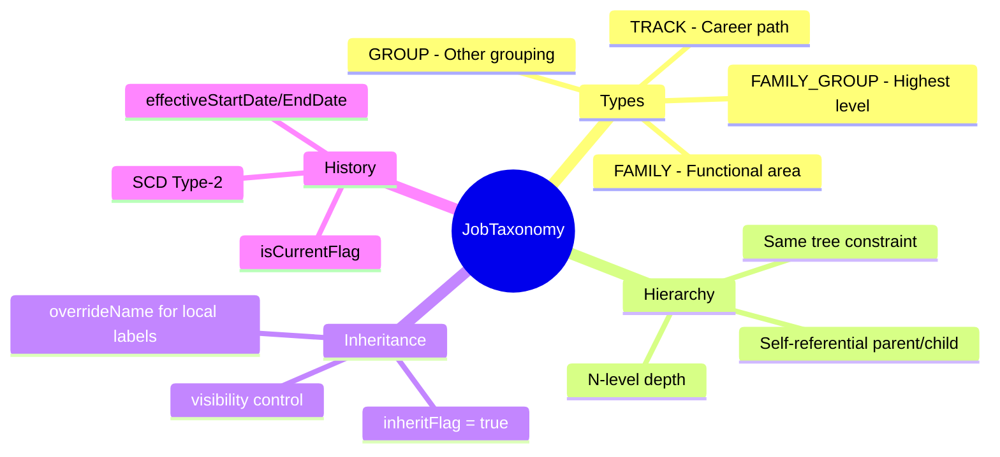
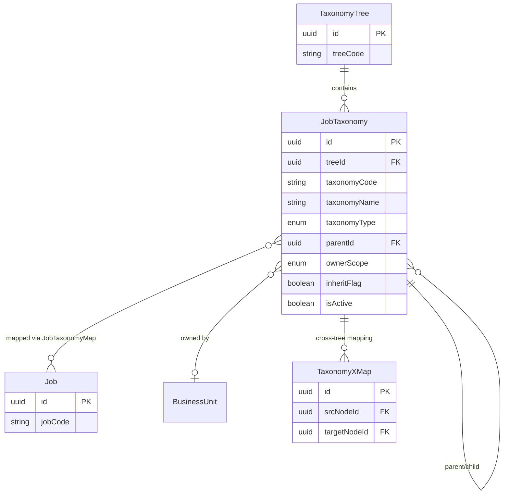
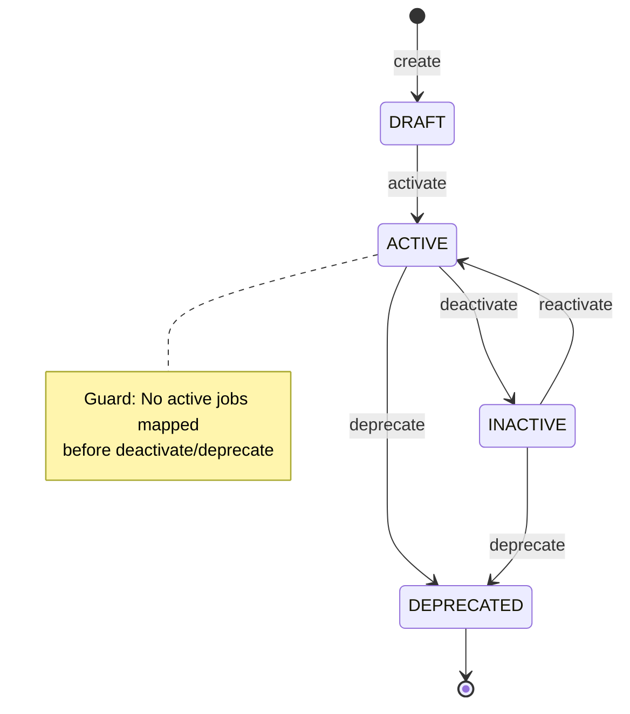

# Entity: JobTaxonomy

## 1. Overview

**JobTaxonomy** is a unified, N-level, self-referential entity for classifying jobs. It consolidates concepts like Job Family, Job Family Group, Job Group, and Job Track into a flexible hierarchy within a [[TaxonomyTree]].



### Taxonomy Type Examples

| Type | Description | Examples |
|------|-------------|----------|
| **FAMILY_GROUP** | Highest grouping | Technology, Operations, Corporate |
| **FAMILY** | Functional area | Software Engineering, Data Science, QA |
| **TRACK** | Career progression | IC Track, Management Track, Technical Expert |
| **GROUP** | Other grouping | Revenue-generating, Support, Compliance |

---

## 2. Attributes

### Identifiers

| Attribute | Type | Req | Description | DB Column |
|-----------|------|-----|-------------|----------|
| `id` | uuid | Y | Primary key | jobpos.taxonomy_node.id |
| `treeId` | uuid | Y | FK → [[TaxonomyTree]] | jobpos.taxonomy_node.tree_id → jobpos.taxonomy_tree.id |
| `taxonomyCode` | string(50) | Y | Unique code within tree+type | jobpos.taxonomy_node.node_code |
| `taxonomyName` | string(255) | Y | Display name | jobpos.taxonomy_node.node_name |

### Classification

| Attribute | Type | Req | Values | Description | DB Column |
|-----------|------|-----|--------|-------------|----------|
| `taxonomyType` | enum | Y | FAMILY_GROUP, FAMILY, TRACK, GROUP | Node type | jobpos.taxonomy_node.node_type → common.code_list(TAX_NODE_TYPE) |
| `parentId` | uuid | N | - | FK → self for hierarchy | jobpos.taxonomy_node.parent_id → jobpos.taxonomy_node.id |

### Ownership & Inheritance

| Attribute | Type | Req | Description | DB Column |
|-----------|------|-----|-------------|----------|
| `ownerScope` | enum | Y | CORP \| LE \| BU | (jobpos.taxonomy_node.metadata.owner_scope) |
| `ownerUnitId` | uuid | N | FK → [[BusinessUnit]] | (jobpos.taxonomy_node.metadata.owner_unit_id) → org_bu.unit.id |
| `inheritFlag` | boolean | Y | true = inherit from parent tree | (jobpos.taxonomy_node.metadata.inherit_flag) |
| `overrideName` | string | N | Local name override | (jobpos.taxonomy_node.metadata.override_name) |
| `visibility` | enum | N | PUBLIC \| PRIVATE \| RESTRICTED | (jobpos.taxonomy_node.metadata.visibility) |

### Status

| Attribute | Type | Req | Description | DB Column |
|-----------|------|-----|-------------|----------|
| `isActive` | boolean | Y | Active status | (jobpos.taxonomy_node.metadata.is_active) |

### Metadata

| Attribute | Type | Req | Description | DB Column |
|-----------|------|-----|-------------|----------|
| `description` | text | N | Node description | jobpos.taxonomy_node.description |
| `metadata` | jsonb | N | Extended attributes (competencies, skills) | jobpos.taxonomy_node.metadata |

### SCD Type-2 (History)

| Attribute | Type | Req | Description | DB Column |
|-----------|------|-----|-------------|----------|
| `effectiveStartDate` | date | Y | Start of validity | jobpos.taxonomy_node.effective_start_date |
| `effectiveEndDate` | date | N | End of validity (null = current) | jobpos.taxonomy_node.effective_end_date |
| `isCurrentFlag` | boolean | Y | Current version indicator | jobpos.taxonomy_node.is_current_flag |

### Audit

| Attribute | Type | Req | Description | DB Column |
|-----------|------|-----|-------------|----------|
| `createdAt` | datetime | Y | Creation timestamp | jobpos.taxonomy_node.created_at |
| `updatedAt` | datetime | N | Last update | jobpos.taxonomy_node.updated_at |

---

## 3. Relationships



### Relationship Details

| Relationship | Target | Cardinality | Description |
|--------------|--------|-------------|-------------|
| `belongsToTree` | [[TaxonomyTree]] | N:1 | Parent tree |
| `parent` | self | N:1 | Parent node in hierarchy |
| `children` | self | 1:N | Child nodes |
| `ownerUnit` | [[BusinessUnit]] | N:1 | Owner for LE/BU scope |
| `mappedJobs` | [[Job]] | N:M | Jobs via JobTaxonomyMap |
| `crossTreeMappings` | [[TaxonomyXMap]] | 1:N | Cross-tree links |

---

## 4. Lifecycle



### State Definitions

| State | Description |
|-------|-------------|
| `DRAFT` | Node created but not yet available for use |
| `ACTIVE` | Available for job mapping and reporting |
| `INACTIVE` | Temporarily disabled (no new mappings) |
| `DEPRECATED` | Permanently retired, read-only |

---

## 5. Business Rules Reference

| Rule | Type | Description |
|------|------|-------------|
| BR-JT-001 | Validation | taxonomyCode unique within tree+type |
| BR-JT-002 | Validation | ownerUnitId required for LE/BU scope |
| BR-JT-003 | Validation | Parent must be in same tree |
| BR-JT-004 | Business | Max recommended depth = 5 levels |
| BR-JT-005 | Validation | Only one current version (isCurrentFlag) per code |

### Inheritance Pattern

| inheritFlag | overrideName | Behavior |
|-------------|--------------|----------|
| `true` | `null` | Full inheritance from parent tree |
| `true` | `"Local Name"` | Inherit structure, override name |
| `false` | `"Custom"` | Complete override (no inheritance) |

### Example Hierarchy

```
CORP_TREE
├── Technology (FAMILY_GROUP)
│   ├── Software Engineering (FAMILY)
│   │   ├── Backend Development (FAMILY)
│   │   └── Frontend Development (FAMILY)
│   ├── Data Science (FAMILY)
│   └── DevOps (FAMILY)
├── IC Track (TRACK)
│   ├── Junior
│   ├── Mid-level
│   └── Senior
└── Management Track (TRACK)
    ├── Team Lead
    ├── Manager
    └── Director
```

---

*References*: [[TaxonomyTree]], [[Job]], [[TaxonomyXMap]], [[BusinessUnit]]
