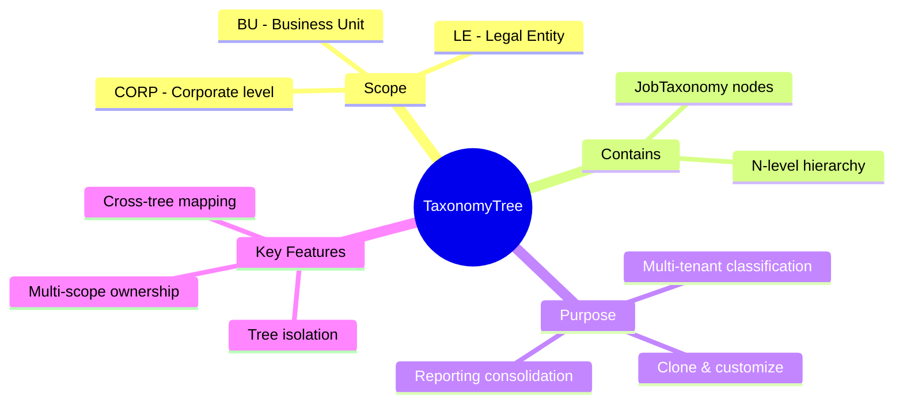
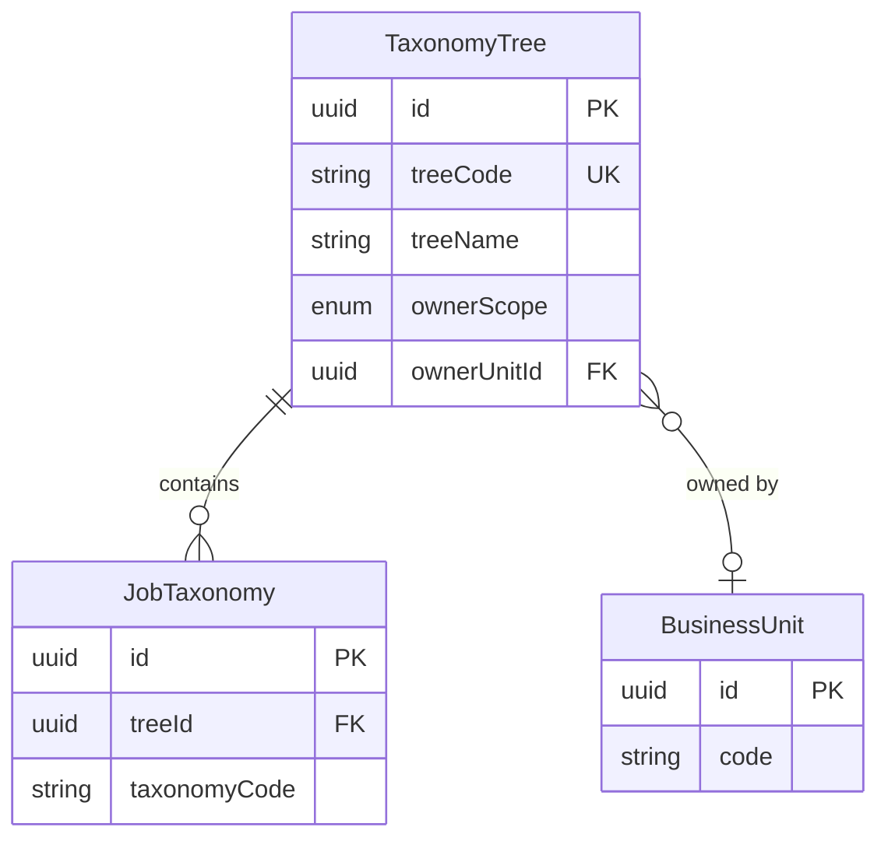
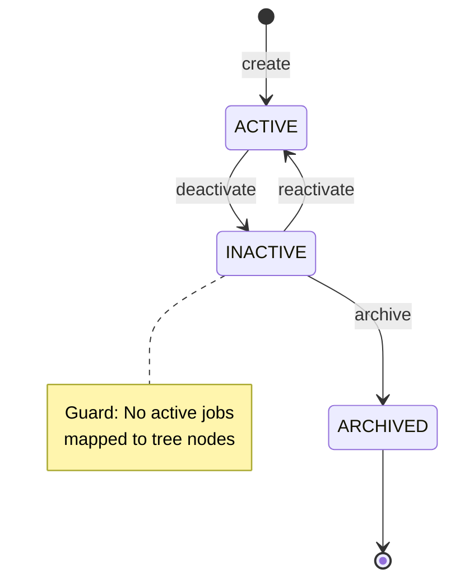

# Entity: TaxonomyTree

## 1. Overview

**TaxonomyTree** is a registry entity that manages independent taxonomy trees within an organization. Each tree can be owned at different organizational scopes (Corporate, Legal Entity, or Business Unit) to support multi-tenant job classifications.



### Use Cases

| Scenario | Pattern |
|----------|---------|
| **Single Corp Tree** | All entities share one taxonomy (ownerScope = CORP) |
| **BU Customization** | BU clones Corp tree, adds specific nodes |
| **Regional Variation** | Different LE trees for different countries |

---

## 2. Attributes

### Identifiers

| Attribute | Type | Req | Description |
|-----------|------|-----|-------------|
| `id` | uuid | Y | Primary key |
| `treeCode` | string(50) | Y | Unique tree code (UPPER_SNAKE_CASE) |
| `treeName` | string(255) | Y | Display name |

### Ownership

| Attribute | Type | Req | Description |
|-----------|------|-----|-------------|
| `ownerScope` | enum | Y | CORP \| LE \| BU |
| `ownerUnitId` | uuid | N | FK → [[BusinessUnit]] (required for LE/BU) |

### Metadata

| Attribute | Type | Req | Description |
|-----------|------|-----|-------------|
| `description` | text | N | Tree purpose description |
| `createdAt` | datetime | Y | Creation timestamp |
| `updatedAt` | datetime | N | Last update |

---

## 3. Relationships



### Relationship Details

| Relationship | Target | Cardinality | Description |
|--------------|--------|-------------|-------------|
| `ownerUnit` | [[BusinessUnit]] | N:1 | Owner (for LE/BU scope) |
| `taxonomyNodes` | [[JobTaxonomy]] | 1:N | All nodes in tree |

---

## 4. Lifecycle



### State Definitions

| State | Description |
|-------|-------------|
| `ACTIVE` | Tree is in use, nodes can be modified |
| `INACTIVE` | Tree is disabled, no new mappings allowed |
| `ARCHIVED` | Permanent archive, read-only |

---

## 5. Business Rules Reference

| Rule | Type | Description |
|------|------|-------------|
| BR-TT-001 | Validation | Only one CORP-scope tree can exist |
| BR-TT-002 | Validation | ownerUnitId required for LE/BU scope |
| BR-TT-003 | Business | treeCode immutable after creation |
| BR-TT-004 | Business | Cannot archive tree with active mappings |

### Scope Priority (for resolution)

```
1. BU-specific (ownerScope = BU, matching ownerUnitId)
2. LE-specific (ownerScope = LE, matching Legal Entity)
3. CORP-level (ownerScope = CORP)
```

---

*References*: [[JobTaxonomy]], [[BusinessUnit]], [[TaxonomyXMap]]
