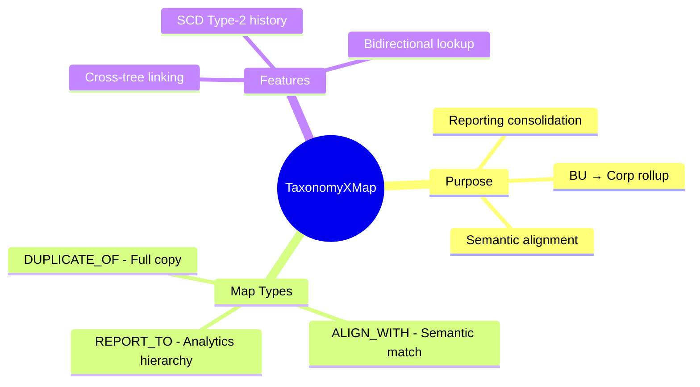
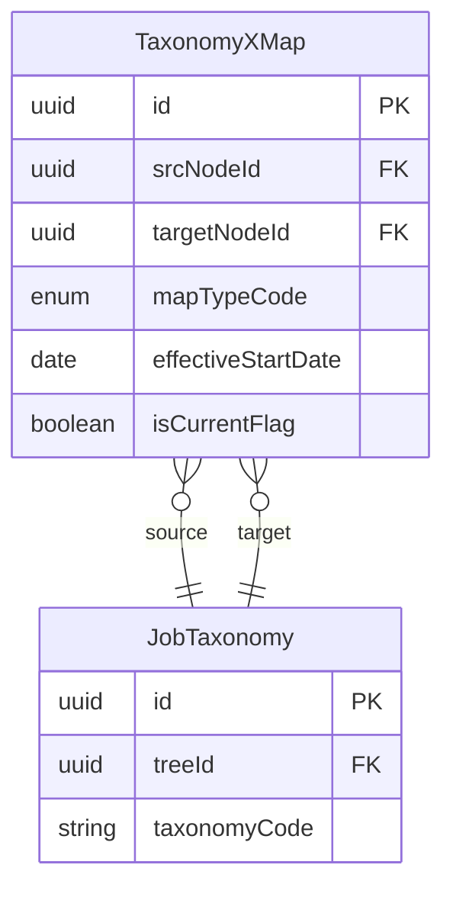
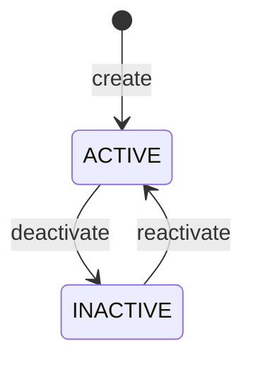

# Entity: TaxonomyXMap

## 1. Overview

**TaxonomyXMap** (Cross-Tree Mapping) enables linking taxonomy nodes between different [[TaxonomyTree]]s for reporting consolidation. This is essential when Business Units have custom taxonomies but need to roll up to corporate standards.



### Use Cases

| Scenario | Map Type | Description |
|----------|----------|-------------|
| **Analytics Rollup** | REPORT_TO | BU node rolls up to Corp for reports |
| **Semantic Match** | ALIGN_WITH | BU uses different name but same meaning |
| **Cloned Node** | DUPLICATE_OF | BU copies Corp node exactly |

---

## 2. Attributes

### Identifiers & Links

| Attribute | Type | Req | Description | DB Column |
|-----------|------|-----|-------------|----------|
| `id` | uuid | Y | Primary key | jobpos.taxonomy_xmap.id |
| `srcNodeId` | uuid | Y | FK → [[JobTaxonomy]] (source, typically BU) | jobpos.taxonomy_xmap.src_node_id → jobpos.job_taxonomy.id |
| `targetNodeId` | uuid | Y | FK → [[JobTaxonomy]] (target, typically Corp) | jobpos.taxonomy_xmap.target_node_id → jobpos.job_taxonomy.id |

### Mapping Type

| Attribute | Type | Req | Values | Description | DB Column |
|-----------|------|-----|--------|-------------|----------|
| `mapTypeCode` | enum | Y | REPORT_TO, ALIGN_WITH, DUPLICATE_OF | Relationship type | jobpos.taxonomy_xmap.map_type_code → common.code_list(XMAP_TYPE) |

### Metadata

| Attribute | Type | Req | Description | DB Column |
|-----------|------|-----|-------------|----------|
| `comment` | text | N | Mapping rationale | jobpos.taxonomy_xmap.comment |

### SCD Type-2

| Attribute | Type | Req | Description | DB Column |
|-----------|------|-----|-------------|----------|
| `effectiveStartDate` | date | Y | Start of validity | jobpos.taxonomy_xmap.effective_start_date |
| `effectiveEndDate` | date | N | End of validity | jobpos.taxonomy_xmap.effective_end_date |
| `isCurrentFlag` | boolean | Y | Current version | jobpos.taxonomy_xmap.is_current_flag |

### Audit

| Attribute | Type | Req | Description | DB Column |
|-----------|------|-----|-------------|----------|
| `createdAt` | datetime | Y | Creation timestamp | jobpos.taxonomy_xmap.created_at |
| `updatedAt` | datetime | N | Last update | jobpos.taxonomy_xmap.updated_at |

---

## 3. Relationships



### Relationship Details

| Relationship | Target | Cardinality | Description |
|--------------|--------|-------------|-------------|
| `sourceNode` | [[JobTaxonomy]] | N:1 | Source node (from BU/LE tree) |
| `targetNode` | [[JobTaxonomy]] | N:1 | Target node (typically CORP tree) |

---

## 4. Lifecycle



### State Definitions

| State | Description |
|-------|-------------|
| `ACTIVE` | Mapping is in effect for reporting |
| `INACTIVE` | Mapping suspended but preserved |

---

## 5. Business Rules Reference

| Rule | Type | Description |
|------|------|-------------|
| BR-XM-001 | Validation | Source and target must be in different trees |
| BR-XM-002 | Validation | Cannot map a node to itself |
| BR-XM-003 | Validation | Only one active mapping per src-target-type |

### Map Type Semantics

| Type | Behavior |
|------|----------|
| **REPORT_TO** | Source node values aggregate to target in reports |
| **ALIGN_WITH** | Source semantically matches target (for lookups) |
| **DUPLICATE_OF** | Source is exact copy, inherits all target changes |

### Example: BU to Corp Mapping

```
CORP_TREE                     BU_GAME_TREE
├── Technology ◄──────────── ├── Technology (DUPLICATE_OF)
│   ├── Software Eng ◄───── │   ├── Software Eng (ALIGN_WITH)
│   └── (no match)           │   ├── Game Development (REPORT_TO → Technology)
                             │   └── Game Art (REPORT_TO → Technology)
```

In this example:
- "BU.Technology" is a `DUPLICATE_OF` "CORP.Technology" (full copy)
- "BU.Software Eng" `ALIGN_WITH` "CORP.Software Eng" (same meaning)
- "BU.Game Development" `REPORT_TO` "CORP.Technology" (rolls up for reporting)

---

*References*: [[JobTaxonomy]], [[TaxonomyTree]]
