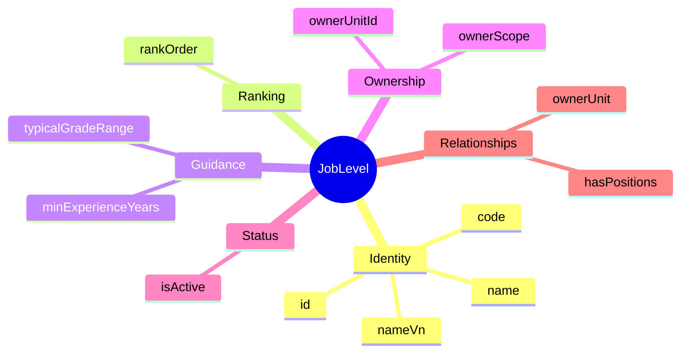
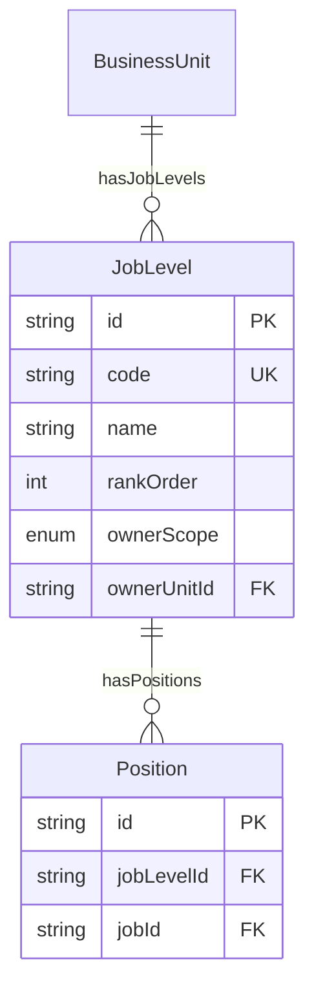
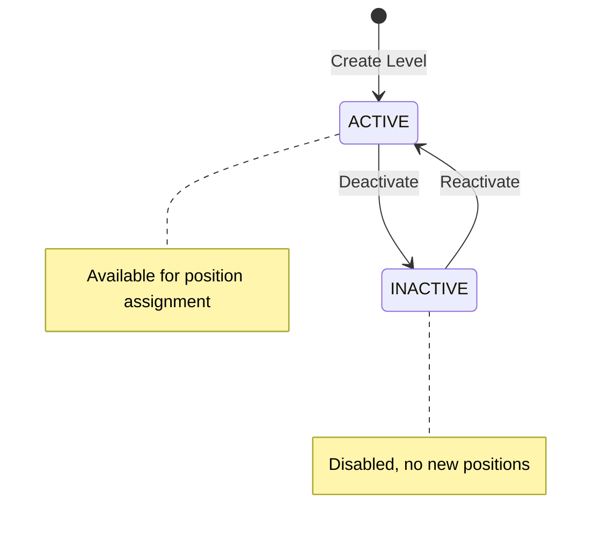

# Entity: JobLevel

## 1. Overview

**JobLevel** represents the **seniority/expertise level** within a career progression. It is a master data entity that Position references to indicate the level of the role holder.

**Key Concept**:
```
Job (Template) + JobLevel (Seniority) = Position (Instance)

Example:
Job: "Software Developer"
Level: "Senior" (L3)
= Position: "Senior Software Developer - Team A"
```



### Why Level on Position (Not Job)?

| Approach | Jobs Needed | Positions Created |
|----------|-------------|-------------------|
| ❌ Level in Job | 4 Jobs × 5 Levels = **20 Jobs** | 20 Positions |
| ✅ Level in Position | **4 Jobs** | 20 Positions (flexible) |

**Industry Pattern**: Workday, Oracle HCM, SAP SF all put Level on Position/Assignment, not on Job Profile.

### Standard Levels

| Code | Name | Rank | Typical Experience |
|------|------|------|-------------------|
| L1 | Junior | 1 | 0-2 years |
| L2 | Mid-Level | 2 | 2-4 years |
| L3 | Senior | 3 | 4-7 years |
| L4 | Principal | 4 | 7-10 years |
| L5 | Staff | 5 | 10-15 years |
| L6 | Distinguished | 6 | 15+ years |

---

## 2. Attributes

### 2.1 Identity

| Attribute | Type | Required | Description |
|-----------|------|----------|-------------|
| id | string | ✓ | Unique identifier (UUID) |
| code | string | ✓ | Level code (L1, JUNIOR, etc.) |
| name | string | ✓ | Display name |
| nameVn | string | | Vietnamese name |

### 2.2 Ranking

| Attribute | Type | Required | Description |
|-----------|------|----------|-------------|
| rankOrder | integer | ✓ | Numeric order for sorting (1=lowest) |

### 2.3 Guidance

| Attribute | Type | Required | Description |
|-----------|------|----------|-------------|
| minExperienceYears | integer | | Suggested min experience |
| typicalGradeRange | string | | Pay grade hint (e.g., "G8-G10") |

### 2.4 Ownership

| Attribute | Type | Required | Description |
|-----------|------|----------|-------------|
| ownerScope | enum | ✓ | CORP (global), LE (legal entity), BU (business unit) |
| ownerUnitId | string | | FK → [[BusinessUnit]] if scope is LE/BU |

---

## 3. Relationships



### Related Entities

| Entity | Relationship | Cardinality | Description |
|--------|--------------|-------------|-------------|
| [[BusinessUnit]] | ownerUnit | N:1 | Owner (for LE/BU scope) |
| [[Position]] | hasPositions | 1:N | Positions at this level |

---

## 4. Lifecycle



---

## 5. Business Rules Reference

### Validation Rules
- **UniqueCodeGlobally**: Code unique across all levels
- **RankOrderUnique**: Rank unique per scope (WARNING)
- **OwnerUnitRequiredForScope**: ownerUnitId required for LE/BU

### Business Constraints
- **NoDeleteWithActivePositions**: Cannot delete level with active positions

### Use Cases

#### 1. Corporate Level Definition

```yaml
JobLevel:
  code: "L3"
  name: "Senior"
  nameVn: "Cao cấp"
  rankOrder: 3
  ownerScope: "CORP"
  minExperienceYears: 4
  typicalGradeRange: "G10-G12"
  isActive: true
```

#### 2. BU-Specific Level

```yaml
JobLevel:
  code: "TECH_LEAD"
  name: "Tech Lead"
  nameVn: "Trưởng nhóm Kỹ thuật"
  rankOrder: 4
  ownerScope: "BU"
  ownerUnitId: "bu-engineering"
  minExperienceYears: 5
  typicalGradeRange: "G11-G13"
```

---

*Document Status: APPROVED*  
*This entity enables Position-based leveling, avoiding Job explosion while maintaining flexibility.*
