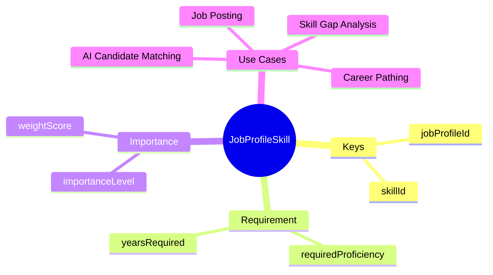
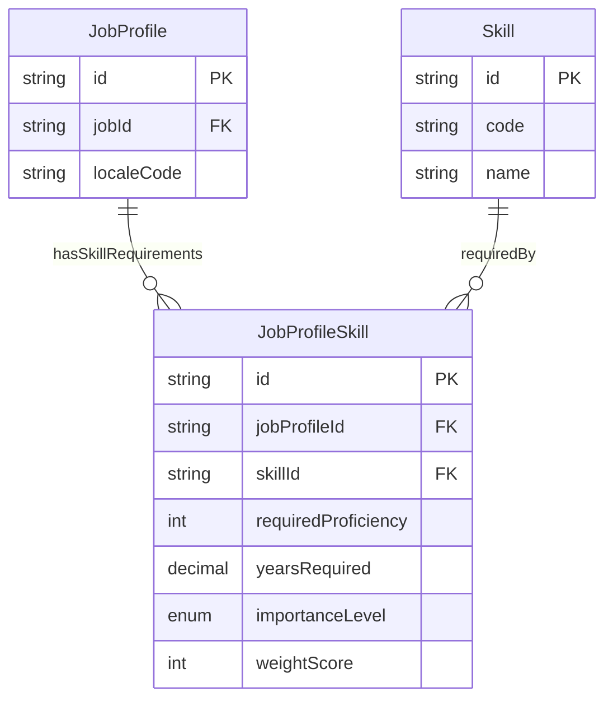

# Entity: JobProfileSkill

## 1. Overview

**JobProfileSkill** is a junction/link entity connecting [[JobProfile]] to [[Skill]], representing the skills required for a job. It enables skill-based matching for recruiting, gap analysis, and career planning.



### Importance Levels

| Level | Description | Matching Impact |
|-------|-------------|-----------------|
| **MUST_HAVE** | Required, deal-breaker | Eliminates if missing |
| **PREFERRED** | Strongly preferred | High score bonus |
| **NICE_TO_HAVE** | Good to have | Small score bonus |

---

## 2. Attributes

### Primary Key

| Attribute | Type | Required | Description |
|-----------|------|----------|-------------|
| id | string | ✓ | Unique identifier |
| jobProfileId | string | ✓ | FK → [[JobProfile]] |
| skillId | string | ✓ | FK → [[Skill]] |

### Requirement Level

| Attribute | Type | Required | Description |
|-----------|------|----------|-------------|
| requiredProficiency | integer | | Min proficiency (1-5) |
| yearsRequired | decimal | | Min years experience |

### Importance

| Attribute | Type | Required | Description |
|-----------|------|----------|-------------|
| importanceLevel | enum | | MUST_HAVE, PREFERRED, NICE_TO_HAVE |
| weightScore | integer | | AI matching weight (1-100) |

---

## 3. Relationships



---

## 4. Use Cases

### Must-Have Skill

```yaml
JobProfileSkill:
  jobProfileId: "profile-senior-dev-en"
  skillId: "skill-java"
  requiredProficiency: 4
  yearsRequired: 3.0
  importanceLevel: "MUST_HAVE"
  weightScore: 90
  notes: "Core backend language for our platform"
```

### Preferred Skill

```yaml
JobProfileSkill:
  jobProfileId: "profile-senior-dev-en"
  skillId: "skill-kubernetes"
  requiredProficiency: 3
  yearsRequired: 1.0
  importanceLevel: "PREFERRED"
  weightScore: 70
  notes: "We're migrating to K8s, experience is a plus"
```

### Nice-to-Have Skill

```yaml
JobProfileSkill:
  jobProfileId: "profile-senior-dev-en"
  skillId: "skill-go"
  requiredProficiency: 2
  importanceLevel: "NICE_TO_HAVE"
  weightScore: 30
  notes: "Some microservices use Go"
```

---

## 5. AI Matching Example

```
JobProfile: Senior Software Developer

Required Skills:
├── JAVA (MUST_HAVE, proficiency >= 4, weight: 90)
├── SPRING_BOOT (MUST_HAVE, proficiency >= 3, weight: 85)
├── AWS (PREFERRED, proficiency >= 2, weight: 70)
├── KUBERNETES (PREFERRED, proficiency >= 2, weight: 65)
└── GO (NICE_TO_HAVE, proficiency >= 2, weight: 30)

Candidate A Skills:
├── JAVA (proficiency: 5) ✓ +90
├── SPRING_BOOT (proficiency: 4) ✓ +85
├── AWS (proficiency: 3) ✓ +70
├── KUBERNETES (proficiency: 0) ✗ +0
└── GO (proficiency: 0) ✗ +0

Total Score: 245 / 340 = 72%
Status: QUALIFIED (all MUST_HAVE met)

Candidate B Skills:
├── JAVA (proficiency: 3) ✗ Fails MUST_HAVE
├── SPRING_BOOT (proficiency: 4) ✓
├── AWS (proficiency: 4) ✓
├── KUBERNETES (proficiency: 5) ✓
└── GO (proficiency: 3) ✓

Status: DISQUALIFIED (JAVA below required)
```

---

*Document Status: APPROVED*  
*References: [[JobProfile]], [[Skill]], [[Worker]], [[WorkerSkill]]*
