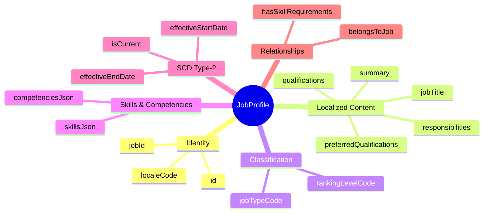
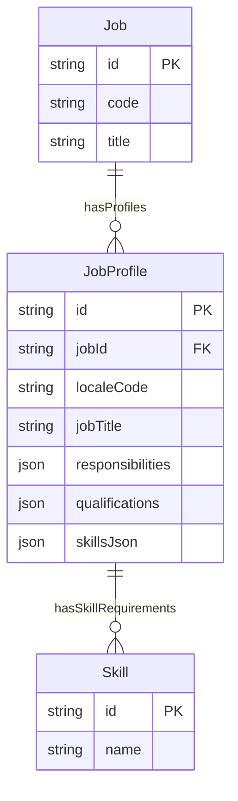
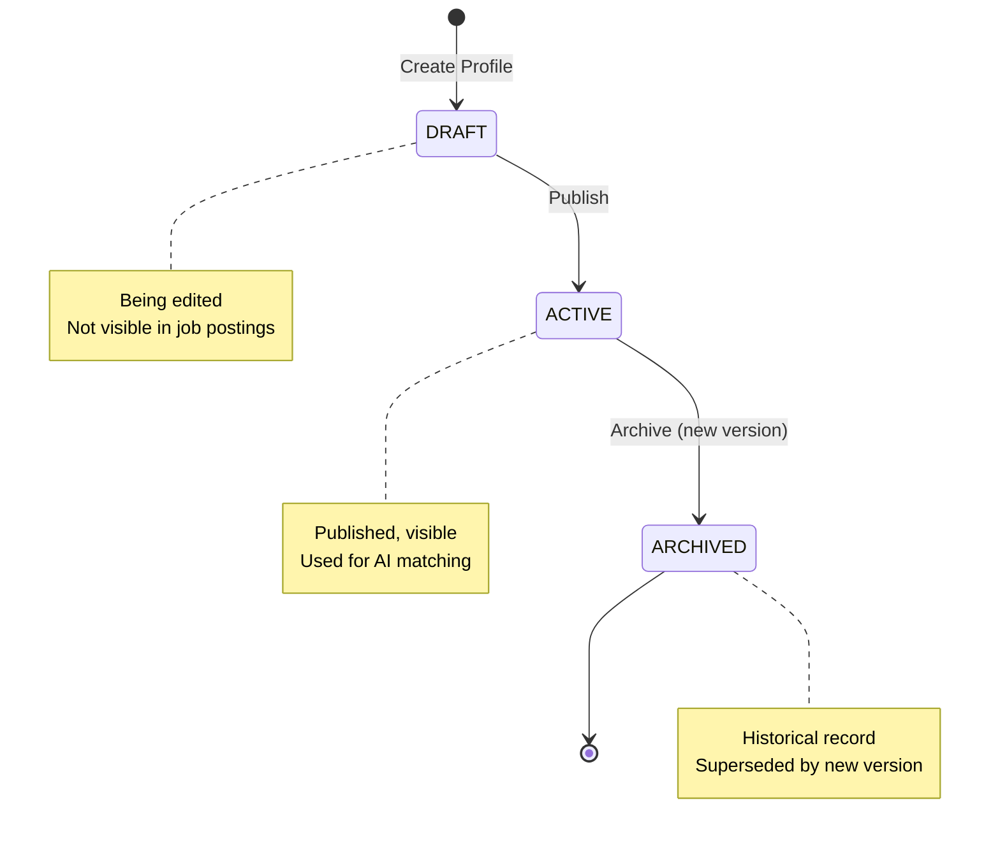

# Entity: JobProfile

## 1. Overview

**JobProfile** is the **content layer** of a Job, containing localized job descriptions, responsibilities, qualifications, and skills. While Job defines WHAT the role is, JobProfile describes HOW it should be filled.

**Key Concept**:
```
Job (Identity/Classification)
├── JobProfile (en-US) - English description
├── JobProfile (vi-VN) - Vietnamese description
└── JobProfile (ja-JP) - Japanese description
```



### Why JobProfile?

| Aspect | Job | JobProfile |
|--------|-----|------------|
| **Purpose** | WHAT (Identity) | HOW (Description) |
| **Locale** | Single | Multi-language |
| **Content** | Code, Title, Grade | Description, Skills |
| **Change** | Rare | Frequent |
| **AI Use** | Classification | Matching/Generation |

### Industry Pattern

| Vendor | Approach |
|--------|----------|
| Workday | Job Profile (locale-variant) |
| Oracle HCM | Job (with locale fields) |
| SAP SF | JobRequisition (mixed) |
| **xTalent** | Job + JobProfile (clean separation) |

---

## 2. Attributes

### 2.1 Identity

| Attribute | Type | Required | Description | DB Column |
|-----------|------|----------|-------------|----------|
| id | string | ✓ | Unique identifier (UUID) | jobpos.job_profile.id |
| jobId | string | ✓ | FK → [[Job]] | jobpos.job_profile.job_id → jobpos.job.id |
| localeCode | string | ✓ | Locale code (en-US, vi-VN) | jobpos.job_profile.locale_code |

### 2.2 Localized Content

| Attribute | Type | Required | Description | DB Column |
|-----------|------|----------|-------------|----------|
| jobTitle | string | ✓ | Localized job title | jobpos.job_profile.job_title |
| summary | string | | Brief overview | jobpos.job_profile.summary |
| responsibilities | json | | Array of duties (AI-ready) | (jobpos.job_profile.metadata.responsibilities) |
| qualifications | json | | Array of requirements (AI-ready) | (jobpos.job_profile.metadata.qualifications) |
| preferredQualifications | json | | Nice-to-have skills | (jobpos.job_profile.metadata.preferred_qualifications) |

### 2.3 Skills & Competencies

| Attribute | Type | Required | Description | DB Column |
|-----------|------|----------|-------------|----------|
| skillsJson | json | | Structured skills with proficiency | (jobpos.job_profile.metadata.skills_json) |
| competenciesJson | json | | Behavioral competencies | (jobpos.job_profile.metadata.competencies_json) |

**Skills Format**:
```json
[
  {"skillId": "skill-java", "name": "Java", "proficiency": 4, "yearsRequired": 3},
  {"skillId": "skill-sql", "name": "SQL", "proficiency": 3}
]
```

---

## 3. Relationships



### Related Entities

| Entity | Relationship | Cardinality | Description |
|--------|--------------|-------------|-------------|
| [[Job]] | belongsToJob | N:1 | Parent job |
| [[Skill]] | hasSkillRequirements | N:N | Required skills |

---

## 4. Lifecycle



---

## 5. Business Rules Reference

### Validation Rules
- **UniqueJobLocale**: One current profile per job-locale
- **JobRequired**: Must reference a Job
- **LocaleFormat**: BCP-47 format (WARNING)

### Use Cases

#### 1. English Job Profile

```yaml
JobProfile:
  jobId: "job-software-dev"
  localeCode: "en-US"
  jobTitle: "Software Developer"
  summary: "Design and implement software solutions"
  responsibilities:
    - "Design and develop software applications"
    - "Review code and ensure quality standards"
    - "Collaborate with cross-functional teams"
  qualifications:
    - "Bachelor's degree in Computer Science"
    - "3+ years of professional experience"
    - "Strong knowledge of Java or Python"
  skillsJson:
    - skillId: "skill-java"
      name: "Java"
      proficiency: 4
      yearsRequired: 3
    - skillId: "skill-agile"
      name: "Agile Methodology"
      proficiency: 3
  isCurrent: true
```

#### 2. Vietnamese Job Profile (same Job)

```yaml
JobProfile:
  jobId: "job-software-dev"
  localeCode: "vi-VN"
  jobTitle: "Lập trình viên Phần mềm"
  summary: "Thiết kế và phát triển các giải pháp phần mềm"
  responsibilities:
    - "Thiết kế và phát triển ứng dụng phần mềm"
    - "Review code và đảm bảo chất lượng"
    - "Phối hợp với các team đa chức năng"
  qualifications:
    - "Bằng Cử nhân Khoa học Máy tính"
    - "3+ năm kinh nghiệm làm việc"
    - "Thành thạo Java hoặc Python"
  isCurrent: true
```

---

*Document Status: APPROVED*  
*This entity enables multi-language job descriptions and AI-ready skill matching.*
