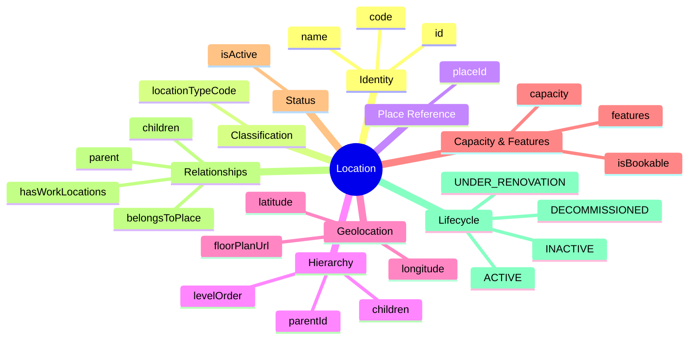
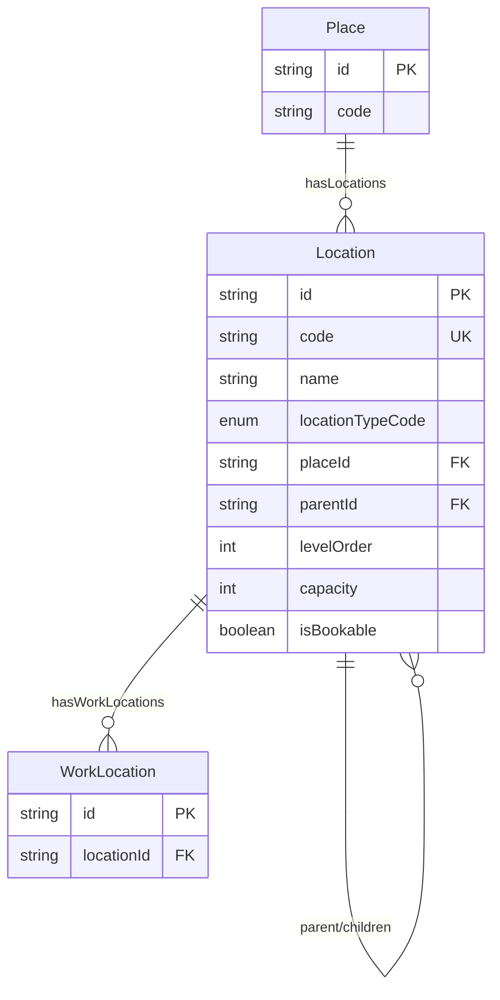
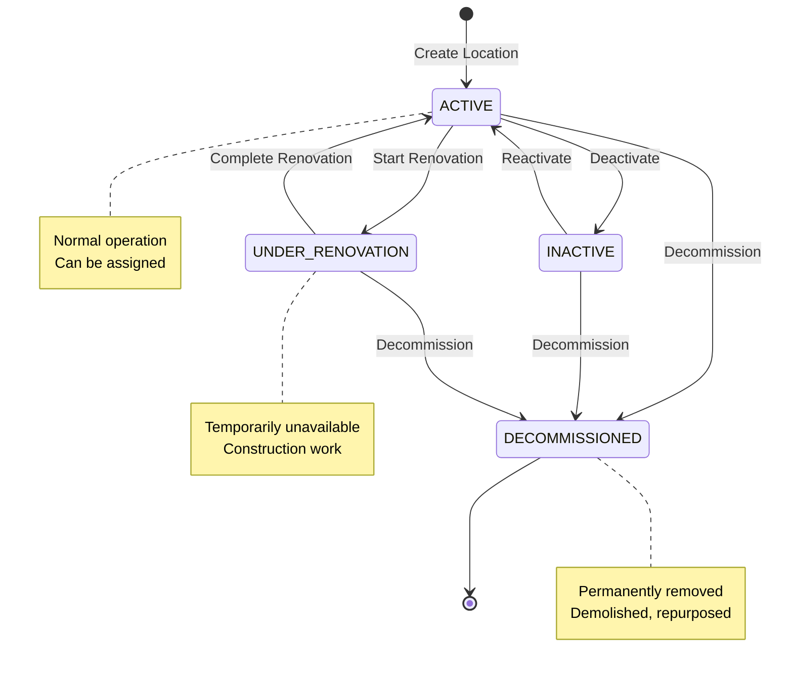

# Entity: Location

## 1. Overview

**Location** represents a **physical subdivision within a Place** - an internal location on a "small map" (floor plan level). This is Tier 2 in the 3-tier location hierarchy, supporting up to 20 levels of self-referential hierarchy.

```
Place (Big Map - Google Maps)
└── Location (Internal Map - Floor Plan) ← YOU ARE HERE
    ├── Floor → Wing → Room → Desk
    └── WorkLocation (HR Assignment)
```

**Key Concept**:
```
Location = Internal subdivision of a Place (has floor plan, not street address)
Examples: Floor 5, Wing A, Room 501, Desk 501-A
```



### Industry Alignment

| Vendor | Equivalent Concept |
|--------|-------------------|
| Workday | Work Space (up to 10 levels) |
| Google | Floor + Room (Calendar Resources) |
| Oracle HCM | Site sub-locations |
| SAP | Location sub-elements |

---

## 2. Attributes

### 2.1 Identity

| Attribute | Type | Required | Description |
|-----------|------|----------|-------------|
| id | string | ✓ | Unique identifier (UUID) |
| code | string | ✓ | Business code (e.g., ETOWN_F5_R501) |
| name | string | ✓ | Display name |

### 2.2 Classification

| Attribute | Type | Required | Description |
|-----------|------|----------|-------------|
| locationTypeCode | enum | ✓ | FLOOR, WING, ZONE, ROOM, OFFICE, MEETING_ROOM, LAB, DESK, WORKSTATION, PARKING, CAFETERIA, etc. |

### 2.3 Place Reference

| Attribute | Type | Required | Description |
|-----------|------|----------|-------------|
| **placeId** | string | ✓ | FK → [[Place]]. Required - every location belongs to a place |

### 2.4 Hierarchy

| Attribute | Type | Required | Description |
|-----------|------|----------|-------------|
| parentId | string | | FK → Location. Parent location (self-ref) |
| levelOrder | integer | | Level in hierarchy (1 = highest) |

### 2.5 Geolocation (Internal)

| Attribute | Type | Required | Description |
|-----------|------|----------|-------------|
| latitude | decimal | | Precise latitude (indoor GPS) |
| longitude | decimal | | Precise longitude (indoor GPS) |
| floorPlanUrl | string | | Link to floor plan document |

### 2.6 Capacity & Features

| Attribute | Type | Required | Description |
|-----------|------|----------|-------------|
| capacity | integer | | Maximum occupancy |
| features | json | | Room features (VIDEO_CONF, WHITEBOARD, etc.) |
| isBookable | boolean | ✓ | Can be booked (meeting rooms)? |

---

## 3. Relationships



### Related Entities

| Entity | Relationship | Cardinality | Description |
|--------|--------------|-------------|-------------|
| [[Place]] | belongsToPlace | N:1 | Geographic place (required) |
| [[Location]] | parent / children | N:1 / 1:N | Self-referential hierarchy |
| [[WorkLocation]] | hasWorkLocations | 1:N | HR work locations |

---

## 4. Lifecycle



---

## 5. Business Rules Reference

### Validation Rules
- **UniqueCodeGlobally**: Code unique across all locations
- **PlaceRequired**: Must belong to a Place
- **ParentSamePlace**: Parent must be in same Place
- **ParentHigherLevel**: Parent must have lower levelOrder (WARNING)
- **CapacityNonNegative**: Capacity >= 0

### Business Constraints
- **BookableRequiresCapacity**: Bookable locations should have capacity (WARNING)

### Location Types (Hierarchy Example)

```
FLOOR (Level 1)
├── WING (Level 2)
│   ├── OFFICE (Level 3)
│   │   └── DESK (Level 4)
│   └── MEETING_ROOM (Level 3)
└── CAFETERIA (Level 2)
```

### Room Features (examples)

| Feature Code | Description |
|--------------|-------------|
| VIDEO_CONF | Video conferencing |
| WHITEBOARD | Whiteboard |
| PROJECTOR | Projector |
| PHONE | Conference phone |
| ACCESSIBILITY | Wheelchair accessible |
| NATURAL_LIGHT | Windows/natural light |

---

*Document Status: APPROVED*  
*Based on: Workday Work Space (10 levels), Google Floor/Room, industry patterns*
