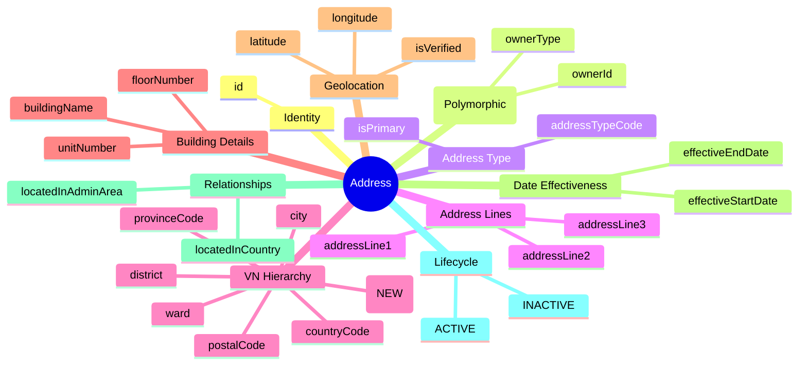
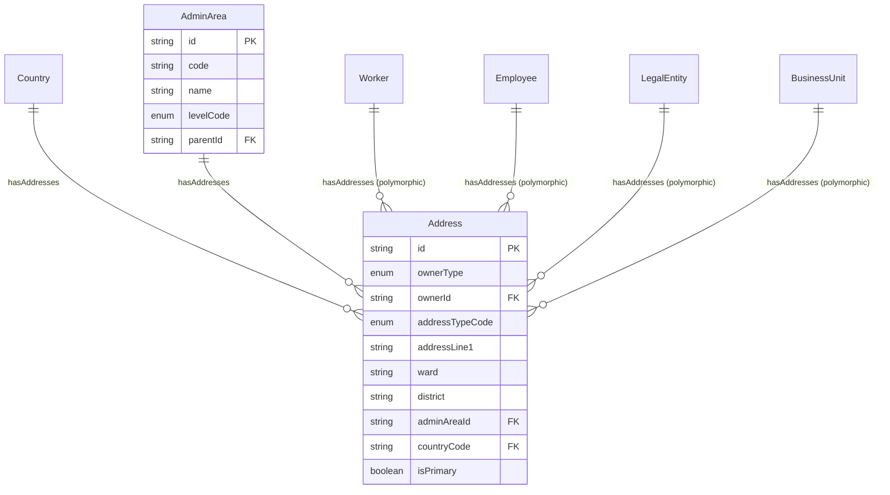
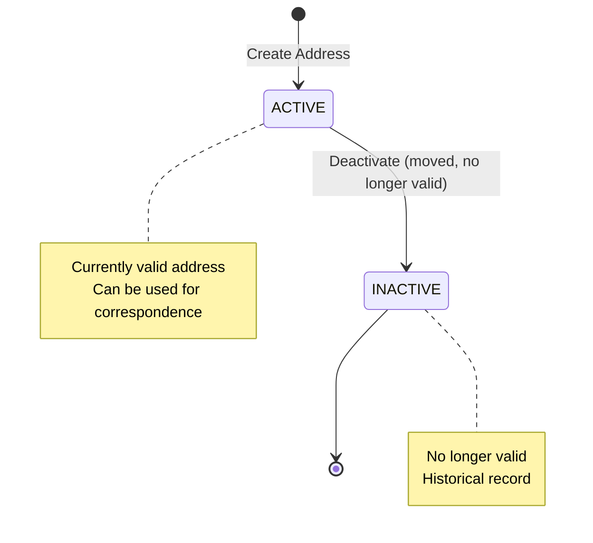

# Entity: Address

## 1. Overview

The **Address** entity stores physical and mailing addresses for persons and organizations. It is a **polymorphic entity** that can be owned by Worker, Employee, LegalEntity, or BusinessUnit. Vietnam has specific requirements for permanent residence (hộ khẩu thường trú) vs temporary residence (địa chỉ tạm trú).

**Key Concept**:
```
Address = Polymorphic (Worker/Employee/LegalEntity/BusinessUnit)
VN Requirement: PERMANENT address (hộ khẩu thường trú) for labor contract
```



**Design Rationale**:
- **Polymorphic Owner**: Same entity for Worker, Employee, LegalEntity, BusinessUnit addresses
- **VN Compliance**: PERMANENT (hộ khẩu thường trú) + TEMPORARY (địa chỉ tạm trú) support
- **Administrative Hierarchy**: adminAreaId → AdminArea (N-level). Flat fields (ward, district) for convenience.
- **Geolocation**: Optional lat/long for mapping services

---

## 2. Attributes

### 2.1 Identity Attributes

| Attribute | Type | Required | Description | DB Column |
|-----------|------|----------|-------------|----------|
| id | string | ✓ | Unique internal identifier (UUID) | person.address.id |

### 2.2 Owner Reference (Polymorphic)

| Attribute | Type | Required | Description | DB Column |
|-----------|------|----------|-------------|----------|
| ownerType | enum | ✓ | WORKER, EMPLOYEE, LEGAL_ENTITY, BUSINESS_UNIT | (person.address.metadata.owner_type) |
| ownerId | string | ✓ | Reference to owner entity | person.address.worker_id → person.worker.id |

### 2.3 Address Type

| Attribute | Type | Required | Description | DB Column |
|-----------|------|----------|-------------|----------|
| addressTypeCode | enum | ✓ | PERMANENT, TEMPORARY, HOME, WORK, MAILING, EMERGENCY | person.address.address_type_code → common.code_list(ADDRESS_TYPE) |
| isPrimary | boolean | ✓ | Primary address flag | person.address.is_primary |

### 2.4 Address Lines

| Attribute | Type | Required | Description | DB Column |
|-----------|------|----------|-------------|----------|
| addressLine1 | string | ✓ | Street address line 1 (Số nhà, Đường) | person.address.street_line |
| addressLine2 | string | | Address line 2 | (person.address.metadata.address_line2) |
| addressLine3 | string | | Address line 3 | (person.address.metadata.address_line3) |

### 2.5 Administrative Hierarchy (VN & Generic)

| Attribute | Type | Required | Description | DB Column |
|-----------|------|----------|-------------|----------|
| ward | string | | Phường/Xã/Thị trấn (VN) - flat field for search | (person.address.metadata.ward) |
| district | string | | Quận/Huyện (VN) - flat field for search | (person.address.metadata.district) |
| city | string | | Thành phố/Thị xã | (person.address.metadata.city) |
| provinceCode | string | | Tỉnh/Thành phố code (legacy - prefer adminAreaId) | (person.address.metadata.province_code) |
| postalCode | string | | Postal/ZIP code | person.address.postal_code |
| countryCode | string | ✓ | Country code (ISO 3166-1) | (person.address.metadata.country_code) |
| **adminAreaId** | string | | **FK → [[AdminArea]]** (preferred). Links to lowest-level admin area (e.g., Ward). Enables hierarchy traversal. | person.address.admin_area_id → geo.admin_area.id |

### 2.6 Building Details

| Attribute | Type | Required | Description | DB Column |
|-----------|------|----------|-------------|----------|
| buildingName | string | | Building/complex name | (person.address.metadata.building_name) |
| floorNumber | string | | Floor number | (person.address.metadata.floor_number) |
| unitNumber | string | | Unit/apartment number | (person.address.metadata.unit_number) |

### 2.7 Geolocation

| Attribute | Type | Required | Description | DB Column |
|-----------|------|----------|-------------|----------|
| latitude | decimal | | Latitude (-90 to 90) | (person.address.metadata.latitude) |
| longitude | decimal | | Longitude (-180 to 180) | (person.address.metadata.longitude) |
| isVerified | boolean | ✓ | Address verified? | (person.address.metadata.is_verified) |

### 2.8 Date Effectiveness

| Attribute | Type | Required | Description | DB Column |
|-----------|------|----------|-------------|----------|
| effectiveStartDate | date | | Address becomes effective | person.address.effective_start_date |
| effectiveEndDate | date | | Address expires | person.address.effective_end_date |

### 2.9 Audit Attributes

| Attribute | Type | Required | Description | DB Column |
|-----------|------|----------|-------------|----------|
| createdAt | datetime | ✓ | Record creation timestamp | person.address.created_at |
| updatedAt | datetime | ✓ | Last modification timestamp | person.address.updated_at |
| createdBy | string | ✓ | User who created record | <<person.address.created_by>> |
| updatedBy | string | ✓ | User who last modified | <<person.address.updated_by>> |

---

## 3. Relationships



### Related Entities

| Entity | Relationship | Cardinality | Description |
|--------|--------------|-------------|-------------|
| [[Country]] | locatedInCountry | N:1 | Country where address is located |
| [[AdminArea]] | locatedInAdminArea | N:1 | Administrative area (Ward → District → Province hierarchy) |

---

## 4. Lifecycle



### State Descriptions

| State | Description | Allowed Operations |
|-------|-------------|-------------------|
| **ACTIVE** | Currently valid address | Can deactivate |
| **INACTIVE** | No longer valid | Read-only, historical |

### Transition Rules

| From | To | Trigger | Guard Condition |
|------|-----|---------|--------------------|
| ACTIVE | INACTIVE | deactivate | Address no longer valid (moved, etc.) |

---

## 5. Business Rules Reference

### Validation Rules
- **OnePrimaryAddressPerTypePerOwner**: At most ONE primary address of each type per owner (WARNING)
- **EffectiveDateConsistency**: effectiveStartDate < effectiveEndDate (if set)
- **GeolocationValidation**: Latitude (-90 to 90), Longitude (-180 to 180)
- **AdminAreaConsistency**: If adminAreaId is set, flat fields (ward, district, city) should match hierarchy path (WARNING)

### Business Constraints
- **VNPermanentAddressRequired**: VN Workers need PERMANENT address for labor contract (WARNING)
- **VNAdministrativeHierarchy**: VN addresses should follow ward → district → city → province structure

### VN Labor Law Compliance
- **Hộ khẩu thường trú** (PERMANENT): Required for labor contract
- **Địa chỉ tạm trú** (TEMPORARY): If different from permanent
- **Administrative Hierarchy**: Phường/Xã → Quận/Huyện → Tỉnh/Thành phố

### Address Types

| Type | VN Name | Description | Use Case |
|------|---------|-------------|----------|
| PERMANENT | Hộ khẩu thường trú | Permanent residence | Labor contract (required) |
| TEMPORARY | Địa chỉ tạm trú | Temporary residence | If different from permanent |
| HOME | Địa chỉ nhà | Home address | Personal correspondence |
| WORK | Địa chỉ công ty | Work address | Office location |
| MAILING | Địa chỉ nhận thư | Mailing address | Mail delivery |
| EMERGENCY | Địa chỉ liên hệ khẩn | Emergency contact address | Emergency situations |

### VN Address Format

```
[Số nhà], [Đường/Phố]
[Phường/Xã], [Quận/Huyện]
[Tỉnh/Thành phố], Việt Nam

Example:
123 Nguyễn Huệ
Phường Bến Nghé, Quận 1
TP. Hồ Chí Minh, Việt Nam
```

### Related Business Rules Documents
- See `[[address-management.brs.md]]` for complete business rules catalog
- See `[[vn-address-validation.brs.md]]` for VN address validation rules
- See `[[geolocation-services.brs.md]]` for geolocation integration

---

## 6. Use Cases

### Use Case 1: Worker Permanent Address (VN Labor Contract)

```yaml
Address:
  id: "addr-001"
  ownerType: "WORKER"
  ownerId: "worker-001"
  addressTypeCode: "PERMANENT"
  isPrimary: true
  addressLine1: "123 Nguyễn Huệ"
  ward: "Phường Bến Nghé"           # Flat field (for search)
  district: "Quận 1"                # Flat field (for search)
  city: "TP. Hồ Chí Minh"
  adminAreaId: "26734"              # NEW: FK → AdminArea (Ward level)
  countryCode: "VN"
  
# Hierarchy traversal from adminAreaId:
# Ward(26734) → District(760) → Province(VN-SG) → Country(VN)

# Labor Contract Text:
# "Hộ khẩu thường trú: 123 Nguyễn Huệ, Phường Bến Nghé, Quận 1, TP.HCM"
```

### Use Case 2: Legal Entity Office Address

```yaml
Address:
  id: "addr-002"
  ownerType: "LEGAL_ENTITY"
  ownerId: "le-001"
  addressTypeCode: "WORK"
  isPrimary: true
  addressLine1: "Tầng 5, Tòa nhà E-Town Central"
  addressLine2: "11 Đoàn Văn Bơ"
  ward: "Phường 12"
  district: "Quận 4"
  city: "TP. Hồ Chí Minh"
  provinceCode: "VN-SG"
  countryCode: "VN"
  buildingName: "E-Town Central"
  floorNumber: "5"
```

### Use Case 3: Employee Temporary Address

```yaml
# Permanent Address (hộ khẩu)
Address_Permanent:
  ownerType: "WORKER"
  addressTypeCode: "PERMANENT"
  addressLine1: "456 Lê Lợi"
  city: "Huế"
  provinceCode: "VN-26"  # Thừa Thiên Huế

# Temporary Address (tạm trú)
Address_Temporary:
  ownerType: "WORKER"
  addressTypeCode: "TEMPORARY"
  addressLine1: "789 Võ Văn Tần"
  city: "TP. Hồ Chí Minh"
  provinceCode: "VN-SG"
```

---

*Document Status: APPROVED - Based on Oracle HCM, SAP SuccessFactors, Workday patterns*  
*VN Compliance: Labor Code 2019 (permanent residence requirement)*
