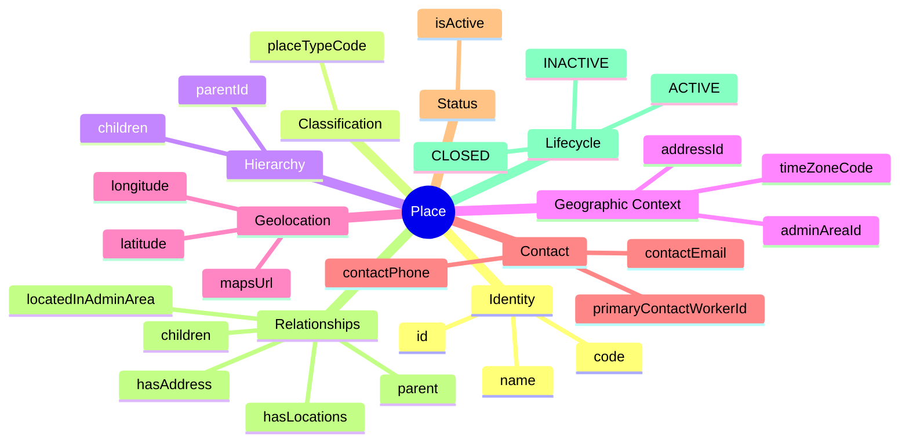
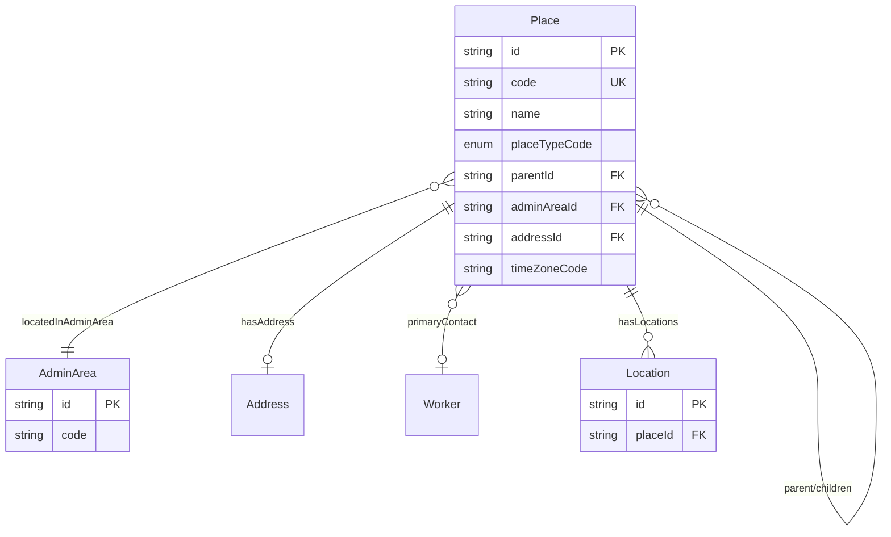
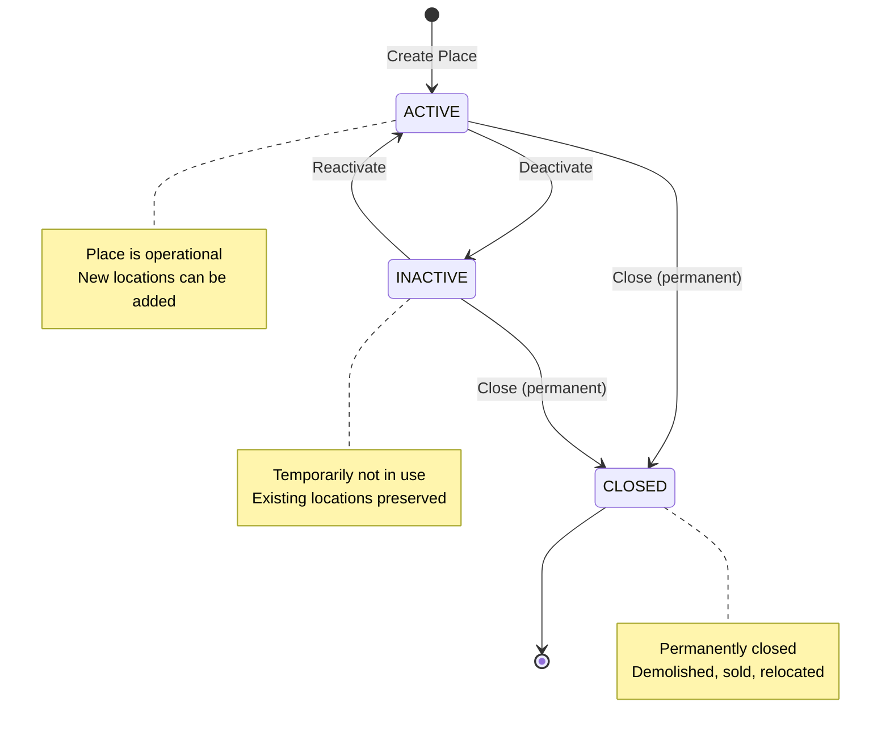

# Entity: Place

## 1. Overview

**Place** represents a **geographic point on the world map** - a large physical location with a recognizable street address (e.g., campus, office park, building, factory). This is the entry point in the 3-tier location hierarchy:

```
Place (Big Map - Google Maps level)
└── Location (Internal Map - Floor/Room level)
    └── WorkLocation (HR Assignment - Employee placement)
```

**Key Concept**:
```
Place = Geographic presence on world map (has street address)
Examples: Quang Trung Software City, E-Town Central, VNG Campus
```



### Industry Alignment

| Vendor | Equivalent Concept |
|--------|-------------------|
| Workday | Location (Business Site) |
| Google | Building |
| Oracle HCM | HR_LOCATIONS_ALL |
| SAP | Location (Foundation Object) |

---

## 2. Attributes

### 2.1 Identity

| Attribute | Type | Required | Description | DB Column |
|-----------|------|----------|-------------|----------|
| id | string | ✓ | Unique identifier (UUID) | facility.place.id |
| code | string | ✓ | Business code (e.g., QT_SOFTWARE_CITY) | facility.place.code |
| name | string | ✓ | Display name | facility.place.name |

### 2.2 Classification

| Attribute | Type | Required | Description | DB Column |
|-----------|------|----------|-------------|----------|
| placeTypeCode | enum | ✓ | CAMPUS, OFFICE_PARK, BUILDING, INDUSTRIAL_ZONE, FACTORY, WAREHOUSE, DATA_CENTER, RETAIL_COMPLEX, etc. | facility.place.place_type_code → common.code_list(PLACE_TYPE) |

### 2.3 Hierarchy

| Attribute | Type | Required | Description | DB Column |
|-----------|------|----------|-------------|----------|
| parentId | string | | FK → Place. Parent place (Campus contains Buildings) | facility.place.parent_id → facility.place.id |

### 2.4 Geographic Context

| Attribute | Type | Required | Description | DB Column |
|-----------|------|----------|-------------|----------|
| adminAreaId | string | | FK → [[AdminArea]]. Administrative area | facility.place.admin_area_id → geo.admin_area.id |
| addressId | string | | FK → [[Address]]. Street address | (facility.place.metadata.address_id) |
| timeZoneCode | string | | IANA timezone (Asia/Ho_Chi_Minh) | (facility.place.metadata.time_zone_code) |

### 2.5 Geolocation

| Attribute | Type | Required | Description | DB Column |
|-----------|------|----------|-------------|----------|
| latitude | decimal | | Latitude (-90 to 90) | (facility.place.metadata.latitude) |
| longitude | decimal | | Longitude (-180 to 180) | (facility.place.metadata.longitude) |
| mapsUrl | string | | Google Maps link | (facility.place.metadata.maps_url) |

### 2.6 Contact

| Attribute | Type | Required | Description | DB Column |
|-----------|------|----------|-------------|----------|
| primaryContactWorkerId | string | | FK → [[Worker]]. Site manager | (facility.place.metadata.primary_contact_worker_id) |
| contactPhone | string | | Main phone | (facility.place.metadata.contact_phone) |
| contactEmail | string | | Main email | (facility.place.metadata.contact_email) |

---

## 3. Relationships



### Related Entities

| Entity | Relationship | Cardinality | Description |
|--------|--------------|-------------|-------------|
| [[Place]] | parent / children | N:1 / 1:N | Self-referential hierarchy |
| [[AdminArea]] | locatedInAdminArea | N:1 | Administrative area |
| [[Address]] | hasAddress | 1:1 | Street address |
| [[Worker]] | primaryContact | N:1 | Site manager |
| [[Location]] | hasLocations | 1:N | Physical locations within |

---

## 4. Lifecycle



---

## 5. Business Rules Reference

### Validation Rules
- **UniqueCodeGlobally**: Code unique across all places
- **ParentMustBeActive**: Parent place must be active (WARNING)
- **GeolocationValidation**: Valid lat/long ranges

### Business Constraints
- **AddressRecommended**: Places should have addresses (WARNING)

### Place Types

| Type | VN Example | Description |
|------|------------|-------------|
| CAMPUS | Quang Trung Software City | Multi-building complex |
| OFFICE_PARK | E-Town Central | Office building cluster |
| BUILDING | Bitexco Tower | Single building |
| INDUSTRIAL_ZONE | Tân Thuận EPZ | Industrial/export zone |
| FACTORY | Nhà máy Samsung | Manufacturing facility |
| WAREHOUSE | Kho Lazada | Storage facility |
| DATA_CENTER | FPT Data Center | IT infrastructure |

---

*Document Status: APPROVED*  
*Based on: Workday Location (Business Site), Google Building, Oracle HR_LOCATIONS*
