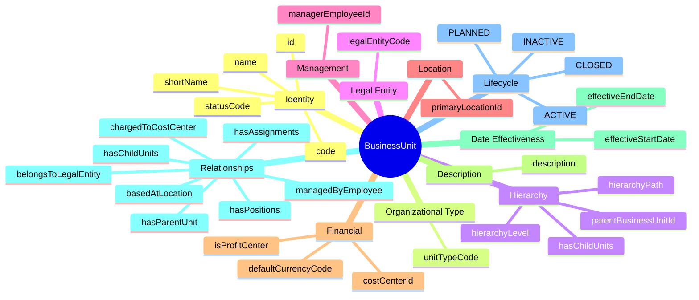
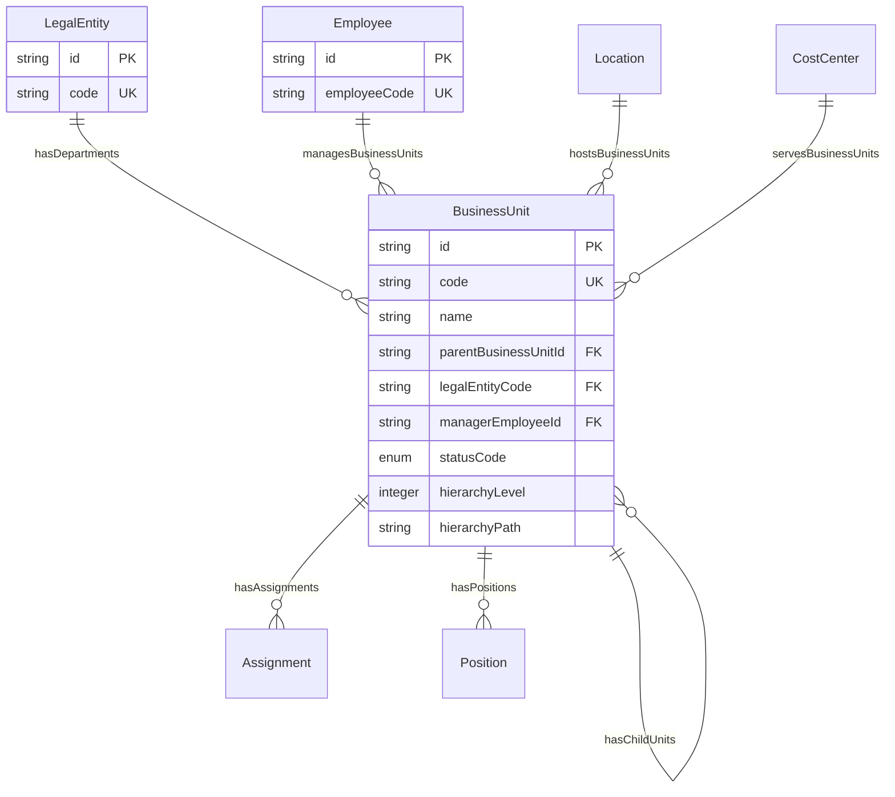
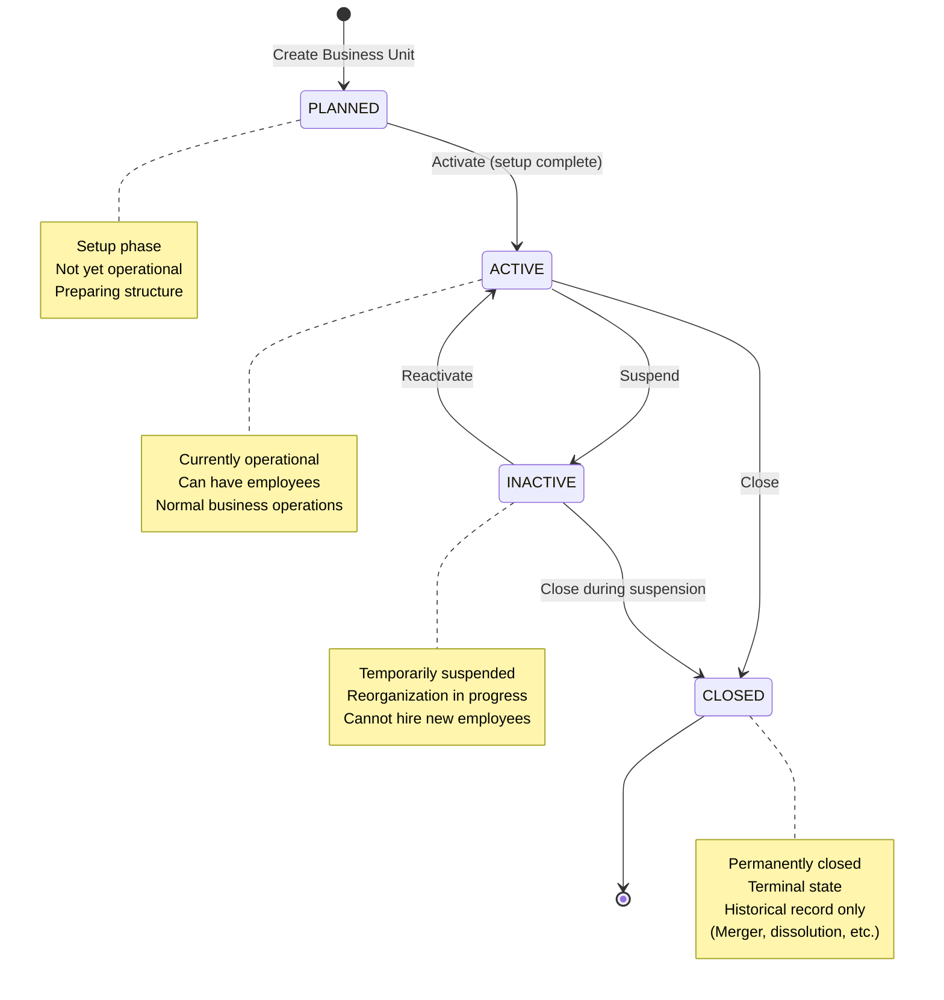

# Entity: BusinessUnit

## 1. Overview

The **BusinessUnit** entity represents an organizational structure used to partition data and manage business functions. It is a **flexible, self-referential hierarchy** that can represent Business Units, Divisions, Departments, Teams, or any other organizational level.

**Key Concept**:
```
LegalEntity (legal/tax) ≠ BusinessUnit (management hierarchy)
BusinessUnit = Organizational structure for reporting, P&L, management
```

This is a **dynamic hierarchy** - the same entity type can represent different levels (BU → Division → Department → Team).



**Design Rationale**:
- **Separation from Legal Entity**: Management hierarchy ≠ Legal structure
- **Self-Referential**: Same entity for all levels (flexible, dynamic)
- **Hierarchy Path**: Efficient queries for "all descendants" or "all ancestors"
- **P&L Responsibility**: isProfitCenter flag for business units with P&L

---

## 2. Attributes

### 2.1 Identity Attributes

| Attribute | Type | Required | Description |
|-----------|------|----------|-------------|
| id | string | ✓ | Unique internal identifier (UUID) |
| code | string | ✓ | Business code (unique) |
| name | string | ✓ | Full name |
| shortName | string | | Abbreviated name |
| statusCode | enum | ✓ | PLANNED, ACTIVE, INACTIVE, CLOSED |

### 2.2 Organizational Type

| Attribute | Type | Required | Description |
|-----------|------|----------|-------------|
| unitTypeCode | string | | BUSINESS_UNIT, DIVISION, DEPARTMENT, TEAM, etc. |

### 2.3 Hierarchy Attributes

| Attribute | Type | Required | Description |
|-----------|------|----------|-------------|
| parentBusinessUnitId | string | | Parent unit (self-referential) |
| hierarchyLevel | integer | | Level in hierarchy (1 = top) |
| hierarchyPath | string | | Full path (e.g., /BU1/DIV1/DEPT1) |

### 2.4 Legal Entity Reference

| Attribute | Type | Required | Description |
|-----------|------|----------|-------------|
| legalEntityCode | string | ✓ | Default legal entity |

### 2.5 Management Attributes

| Attribute | Type | Required | Description |
|-----------|------|----------|-------------|
| managerEmployeeId | string | | Head of business unit |

### 2.6 Location Attributes

| Attribute | Type | Required | Description |
|-----------|------|----------|-------------|
| primaryLocationId | string | | Primary location |

### 2.7 Financial Attributes

| Attribute | Type | Required | Description |
|-----------|------|----------|-------------|
| costCenterId | string | | Default cost center |
| defaultCurrencyCode | string | | Functional currency (ISO 4217) |
| isProfitCenter | boolean | ✓ | P&L responsibility? |

### 2.8 Description

| Attribute | Type | Required | Description |
|-----------|------|----------|-------------|
| description | string | | Function and purpose |

### 2.9 Date Effectiveness

| Attribute | Type | Required | Description |
|-----------|------|----------|-------------|
| effectiveStartDate | date | ✓ | Unit becomes effective |
| effectiveEndDate | date | | Unit becomes inactive |

### 2.10 Audit Attributes

| Attribute | Type | Required | Description |
|-----------|------|----------|-------------|
| createdAt | datetime | ✓ | Record creation timestamp |
| updatedAt | datetime | ✓ | Last modification timestamp |
| createdBy | string | ✓ | User who created record |
| updatedBy | string | ✓ | User who last modified |

---

## 3. Relationships



### Related Entities

| Entity | Relationship | Cardinality | Description |
|--------|--------------|-------------|-------------|
| [[LegalEntity]] | belongsToLegalEntity | N:1 | Default legal entity |
| [[BusinessUnit]] | hasParentUnit | N:1 | Parent unit (self-ref) |
| [[BusinessUnit]] | hasChildUnits | 1:N | Child units (self-ref) |
| [[Employee]] | managedByEmployee | N:1 | Head of business unit |
| [[Location]] | basedAtLocation | N:1 | Primary location |
| [[CostCenter]] | chargedToCostCenter | N:1 | Default cost center |
| [[Assignment]] | hasAssignments | 1:N | Employee assignments |
| [[Position]] | hasPositions | 1:N | Positions in this unit |

---

## 4. Lifecycle



### State Descriptions

| State | Description | Allowed Operations |
|-------|-------------|-------------------|
| **PLANNED** | Setup phase, not yet operational | Can activate when ready |
| **ACTIVE** | Currently operational | Can suspend, close, manage employees |
| **INACTIVE** | Temporarily suspended | Can reactivate, close |
| **CLOSED** | Permanently closed | Read-only, historical record |

### Transition Rules

| From | To | Trigger | Guard Condition |
|------|-----|---------|--------------------|
| PLANNED | ACTIVE | activate | Setup completed, ready to operate |
| ACTIVE | INACTIVE | suspend | Temporary suspension (reorganization) |
| INACTIVE | ACTIVE | reactivate | Suspension lifted |
| ACTIVE | CLOSED | close | Permanently closed (merger, dissolution) |
| INACTIVE | CLOSED | close | Close during suspension |

---

## 5. Business Rules Reference

### Validation Rules
- **BusinessUnitCodeUniqueness**: code unique across all business units
- **EffectiveDateConsistency**: effectiveStartDate < effectiveEndDate (if set)
- **ParentChildConsistency**: Unit cannot be its own parent (prevent circular)
- **ManagerMustBeActive**: Manager must be ACTIVE employee (WARNING)

### Business Constraints
- **HierarchyLevelConsistency**: Child level = parent level + 1 (WARNING)
- **LegalEntityMatch**: Child should belong to same legal entity as parent (WARNING)
- **ActiveUnitRequirements**: ACTIVE unit should have manager (WARNING)
- **ClosedUnitRestrictions**: CLOSED units cannot have new assignments/positions
- **HierarchyPathUpdate**: Recalculate path when parent changes

### Organizational Hierarchy Pattern
- **Self-Referential**: Same entity for all levels (BU, Division, Department, Team)
- **Hierarchy Levels**: 1 = top level, 2 = second level, etc.
- **Hierarchy Path**: `/BU1/DIV1/DEPT1` for efficient "all descendants" queries
- **Unit Types**: BUSINESS_UNIT, DIVISION, DEPARTMENT, TEAM (configurable)

### Separation from Legal Entity
- **Legal Entity**: Legal/tax boundary (who signs contracts, pays taxes)
- **Business Unit**: Management hierarchy (who reports to whom, P&L)
- **Example**: VNG Corporation (Legal Entity) → Cloud Services BU → Engineering Dept

### P&L Responsibility
- **Profit Center**: isProfitCenter = true for units with P&L responsibility
- **Cost Center**: isProfitCenter = false for support/shared services units
- **Example**: Sales BU (profit center) vs HR Dept (cost center)

### Related Business Rules Documents
- See `[[business-unit-management.brs.md]]` for complete business rules catalog
- See `[[organizational-hierarchy.brs.md]]` for hierarchy management rules
- See `[[reorganization.brs.md]]` for reorganization process rules

---

## 6. Hierarchy Examples

### Example 1: Simple Hierarchy

```yaml
# Top Level - Business Unit
BU_Cloud:
  code: "BU-CLOUD"
  name: "Cloud Services Business Unit"
  unitTypeCode: "BUSINESS_UNIT"
  parentBusinessUnitId: null
  hierarchyLevel: 1
  hierarchyPath: "/BU-CLOUD"
  legalEntityCode: "VNG-HCM"
  isProfitCenter: true

# Second Level - Division
DIV_Engineering:
  code: "DIV-ENG"
  name: "Engineering Division"
  unitTypeCode: "DIVISION"
  parentBusinessUnitId: "bu-cloud-id"
  hierarchyLevel: 2
  hierarchyPath: "/BU-CLOUD/DIV-ENG"
  legalEntityCode: "VNG-HCM"
  isProfitCenter: false

# Third Level - Department
DEPT_Backend:
  code: "DEPT-BE"
  name: "Backend Engineering Department"
  unitTypeCode: "DEPARTMENT"
  parentBusinessUnitId: "div-eng-id"
  hierarchyLevel: 3
  hierarchyPath: "/BU-CLOUD/DIV-ENG/DEPT-BE"
  legalEntityCode: "VNG-HCM"
  isProfitCenter: false
```

### Example 2: Flat Structure (No Divisions)

```yaml
# Legal Entity → Department (skip BU/Division)
DEPT_HR:
  code: "DEPT-HR"
  name: "Human Resources Department"
  unitTypeCode: "DEPARTMENT"
  parentBusinessUnitId: null
  hierarchyLevel: 1
  hierarchyPath: "/DEPT-HR"
  legalEntityCode: "VNG-HCM"
  isProfitCenter: false
```

### Example 3: Matrix Organization

```yaml
# Employee can be in multiple business units via Assignments
Assignment_1:
  employeeId: "emp-001"
  departmentId: "dept-be-id"  # Primary: Backend Dept
  isPrimary: true
  fte: 0.6

Assignment_2:
  employeeId: "emp-001"
  departmentId: "dept-ai-id"  # Secondary: AI Research Dept
  isPrimary: false
  fte: 0.4
```

---

*Document Status: APPROVED - Based on Oracle HCM, SAP SuccessFactors, Workday patterns*  
*Organizational Design: Flexible self-referential hierarchy for dynamic structures*
