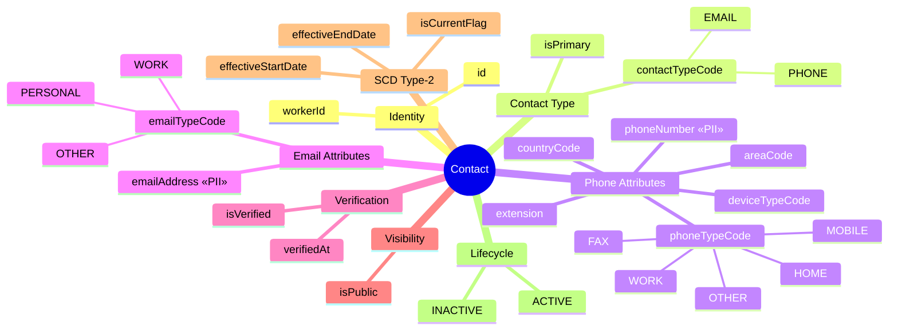
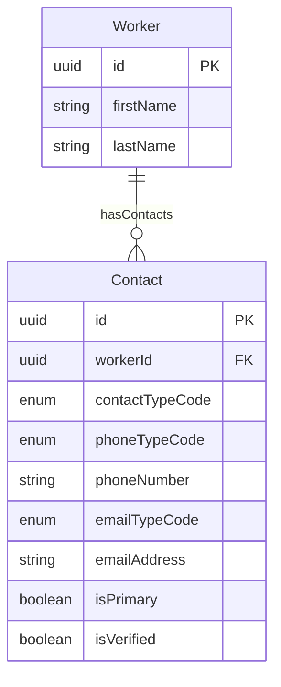
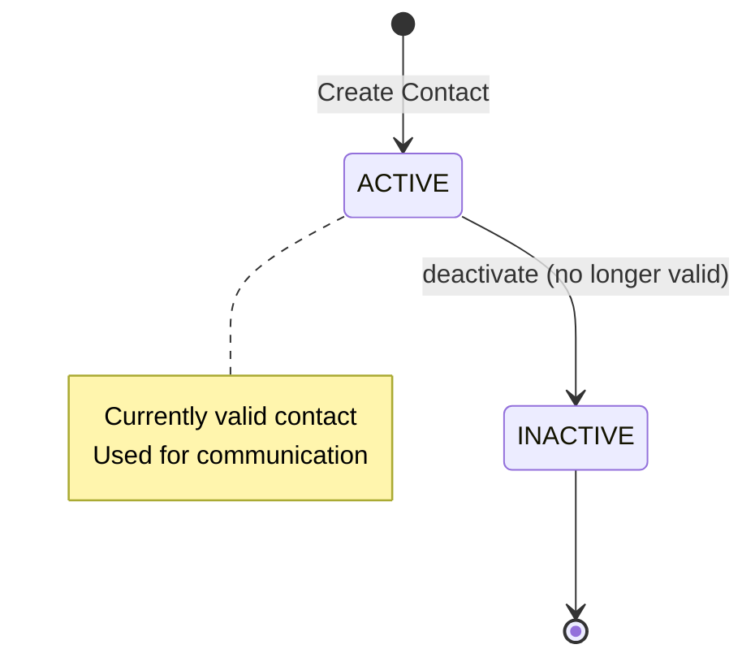

# Entity: Contact

## 1. Overview

**Contact** entity stores communication methods for a Worker. It supports two contact types: **PHONE** and **EMAIL**.

**Design Principle**:
```
Contact = Communication method for a Worker

Contact Types:
- PHONE: Phone numbers (mobile, home, work, fax)
- EMAIL: Email addresses (personal, work)

NOT a contact type (handled elsewhere):
- EMERGENCY_CONTACT → This is a FLAG on WorkerRelationship
  Emergency info is fetched from related Worker's Contact records
```



**Key Design Decision**:
> Emergency Contact is NOT a contact type.
> Emergency contact is a FLAG (`isEmergency`) on `WorkerRelationship`.
> When you need emergency contact phone → Find relationship → Get related Worker → Get their Contact.

---

## 2. Attributes

### 2.1 Identity

| Attribute | Type | Required | Description | DB Column |
|-----------|------|----------|-------------|-----------|
| id | UUID | ✓ | Unique identifier | person.contact.id |
| workerId | UUID | ✓ | Owner worker | person.contact.worker_id |

### 2.2 Contact Type

| Attribute | Type | Required | Description |
|-----------|------|----------|-------------|
| contactTypeCode | enum | ✓ | PHONE or EMAIL |
| isPrimary | boolean | ✓ | Is primary for this type? |

### 2.3 Phone Attributes (when contactTypeCode = PHONE)

| Attribute | Type | Required | Description | PII |
|-----------|------|----------|-------------|-----|
| phoneTypeCode | enum | ✓* | MOBILE, HOME, WORK, FAX, OTHER | |
| phoneNumber | string | ✓* | Complete phone number | ✓ |
| countryCode | string | | Country code (+84) | |
| areaCode | string | | Area code | |
| extension | string | | Extension | |
| deviceTypeCode | enum | | MOBILE, LANDLINE | |

*Required if contactTypeCode = PHONE

**VN Phone Formats**:

| Type | Format | Example |
|------|--------|---------|
| Mobile | 10 digits: 09x, 03x, 07x, 08x | 0901234567 |
| Landline | Area code + number | 028-1234-5678 (HCM) |
| Country code | +84 | +84901234567 |

### 2.4 Email Attributes (when contactTypeCode = EMAIL)

| Attribute | Type | Required | Description | PII |
|-----------|------|----------|-------------|-----|
| emailTypeCode | enum | ✓* | PERSONAL, WORK, OTHER | |
| emailAddress | string | ✓* | Email address | ✓ |

*Required if contactTypeCode = EMAIL

### 2.5 Verification

| Attribute | Type | Required | Description |
|-----------|------|----------|-------------|
| isVerified | boolean | ✓ | Has been verified? |
| verifiedAt | datetime | | Verification timestamp |

### 2.6 Visibility

| Attribute | Type | Required | Description |
|-----------|------|----------|-------------|
| isPublic | boolean | ✓ | Visible in company directory? |

### 2.7 SCD Type-2

| Attribute | Type | Required | Description |
|-----------|------|----------|-------------|
| effectiveStartDate | date | ✓ | When contact becomes effective |
| effectiveEndDate | date | | When contact ends |
| isCurrentFlag | boolean | ✓ | Is current version? |

---

## 3. Relationships



### Related Entities

| Entity | Relationship | Cardinality | Description |
|--------|--------------|-------------|-------------|
| [[Worker]] | belongsToWorker | N:1 | Contact owner |

---

## 4. Lifecycle



| State | Description | Allowed Operations |
|-------|-------------|-------------------|
| **ACTIVE** | Currently valid | Can deactivate |
| **INACTIVE** | No longer valid | Read-only, historical |

---

## 5. Use Cases

### Use Case 1: Worker Mobile Phone

```yaml
Contact:
  id: "contact-001"
  workerId: "worker-001"
  contactTypeCode: "PHONE"
  isPrimary: true
  phoneTypeCode: "MOBILE"
  phoneNumber: "0901234567"
  countryCode: "+84"
  deviceTypeCode: "MOBILE"
  isVerified: true
  isPublic: false
  effectiveStartDate: "2024-01-01"
  isCurrentFlag: true
```

### Use Case 2: Work Email

```yaml
Contact:
  id: "contact-002"
  workerId: "worker-001"
  contactTypeCode: "EMAIL"
  isPrimary: true
  emailTypeCode: "WORK"
  emailAddress: "nguyen.van.a@company.com"
  isVerified: true
  isPublic: true  # Visible in directory
  effectiveStartDate: "2024-01-01"
  isCurrentFlag: true
```

### Use Case 3: Home Landline

```yaml
Contact:
  id: "contact-003"
  workerId: "worker-001"
  contactTypeCode: "PHONE"
  isPrimary: false
  phoneTypeCode: "HOME"
  phoneNumber: "028-1234-5678"
  countryCode: "+84"
  areaCode: "028"
  deviceTypeCode: "LANDLINE"
  isVerified: false
  isPublic: false
  effectiveStartDate: "2024-01-01"
  isCurrentFlag: true
```

---

## 6. Emergency Contact Pattern

**Important**: Emergency contact is NOT a contact type. See [[WorkerRelationship.onto.md]].

### How to Get Emergency Contact Phone

```sql
-- Get emergency contact phone for Worker A
SELECT 
    w_related.first_name || ' ' || w_related.last_name AS emergency_contact_name,
    wr.relation_code,
    c.phone_number AS emergency_phone,
    wr.emergency_priority
FROM person.worker_relationship wr
JOIN person.worker w_related ON w_related.id = wr.related_worker_id
LEFT JOIN person.contact c ON c.worker_id = w_related.id 
    AND c.contact_type_code = 'PHONE'
    AND c.phone_type_code = 'MOBILE'
    AND c.is_primary = true
    AND c.is_current_flag = true
WHERE wr.worker_id = :worker_a_id
  AND wr.is_emergency = true
  AND wr.is_current_flag = true
ORDER BY wr.emergency_priority;
```

---

## 7. Business Rules Reference

| Rule | Description |
|------|-------------|
| **OnePrimaryPerType** | Max 1 primary contact per type |
| **PhoneAttributesRequired** | Phone type and number required for PHONE |
| **EmailAttributesRequired** | Email type and address required for EMAIL |
| **EmailFormatValidation** | Valid email format |
| **VNMobileFormat** | VN mobile: 09x, 03x, 07x, 08x (10 digits) |
| **EmployeeShouldHavePrimaryMobile** | Employee should have mobile |
| **EmployeeShouldHaveWorkEmail** | Employee should have work email |

### Related Documents

- [[Worker.onto.md]] - Person information
- [[WorkerRelationship.onto.md]] - Emergency contact flag

---

*Document Status: DRAFT v2.0.0*  
*Refactored: Removed EMERGENCY_CONTACT type. Emergency is flag on WorkerRelationship.*  
*References: DBML 1.Core.V4 lines 582-594*
